# 个人网站搭建

## 1. 前言

接触编程也不久，阅读了无数大佬的博客文章，但是从来没有自己写过。这其中最重要的原因当然是懒惰，觉得写博客太费时间了，对自己的帮助也不大。可是如今发现自己的记性越来越捉急了，某样技术在一段时间不接触之后，就几乎完全忘记了。对此我很是苦恼，于是萌生了写博客的想法，毕竟好记性不如烂笔头嘛。曾经听说过GitHub上可以搭建博客，也看到很多人是这样做的，正好借这个机会好好研究下。

## 2. MkDocs介绍

根据[MkDocs](https://www.mkdocs.org/)官网介绍：

MkDocs是一个**快速**、**简单**、**华丽**的静态站点生成器，适用于构建项目文档。文档源文件使用Markdown编写，并使用单个YAML配置文件进行配置。

MkDocs的特点有：

- 多个漂亮主题
- 易于个性化
- 实时预览
- 随处托管

## 3. 快速搭建

### 3.1. 安装 MkDocs

安装 MkDocs 需要 Python 和 Python package manager pip，如果你已经安装了 Python 和 Python package manager pip，可以打开命令提示符执行以下命令安装 MkDocs:

```bash
pip install mkdocs
```

如果没有安装的话，可以点此安装相应版本：[Python](https://www.python.org/) 以及 [Python package manager pip](https://pip.readthedocs.io/en/latest/installing/)。

安装成功后，可以在命令提示符里执行`mkdocs -V`（注意大小写），查看安装版本，若能显示出版本，则说明安装成功。

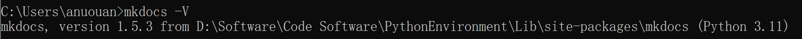

### 3.2. 新建项目

首先选择好将项目文件储存在哪个磁盘，然后在该磁盘路径下执行命令。比如，想要把项目文件都放在 E 盘的话，就在 E 盘路径下执行以下命令：

```bash
mkdocs new my-project
```

这里的`my-project`即为你的项目名称，如果你的项目名称为`my-blog`，就可以执行`mkdocs new my-blog`命令。

结果如下：

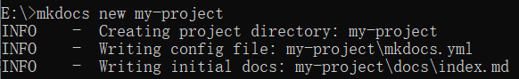

最后生成了一个名为`my-project`的文件夹，如下图所示：

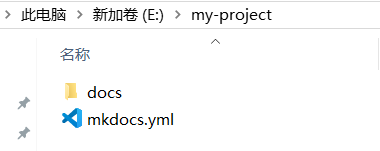

下面解释下`my-project`文件夹中每个文件的作用：

- `mkdocs.yml`：此为配置文件，文档的结构、主题都可以在此设置。
- `docs`文件夹：撰写的 Markdown 文档都放在这个文件夹内。
- `index.md`：默认首页。

到此，一个新项目就创建好了~

### 3.3. 启动服务

MkDocs 包含了一个内建的服务器，可以在本地预览当前文档。在项目文件夹下打开命令提示符，执行`mkdocs serve`命令就可以启动内建服务器，比如，之前在 E 盘新建了项目`my-project`，则在`my-project`路径下执行`mkdocs serve`就行，如下图：

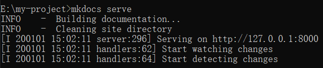

执行成功后，在浏览器打开 http://127.0.0.1:8000/，就可以看到页面的样子啦！如下图：

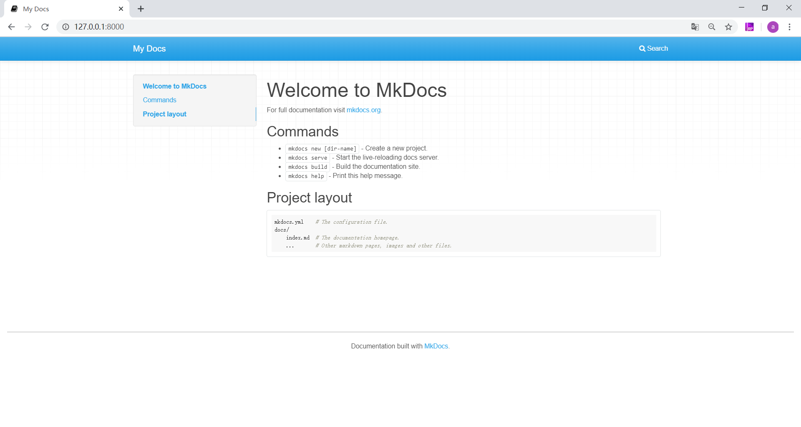

此时页面上所展示的内容就是`index.md`里默认的首页内容，可以自行更改~我们来修改一下看看效果。首先在`index.md`里添加一些内容并保存，如下图：

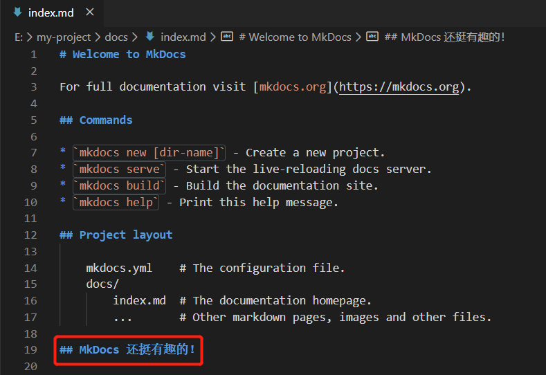

然后 http://127.0.0.1:8000/ 会自动刷新，就可以看到修改后的结果啦！

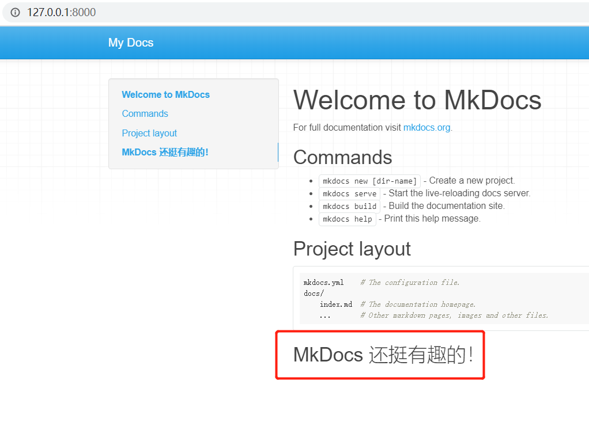

### 3.4. 添加页面

现在添加第二个页面。这一步其实非常简单，只需要将你撰写好的 Markdown 文档，放到`docs`文件夹下即可。这里，我用了一个`test.md`文件作为测试，把它放在了`docs`文件夹下。

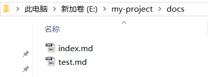

这时 http://127.0.0.1:8000/ 已经自动刷新可以看见效果了：

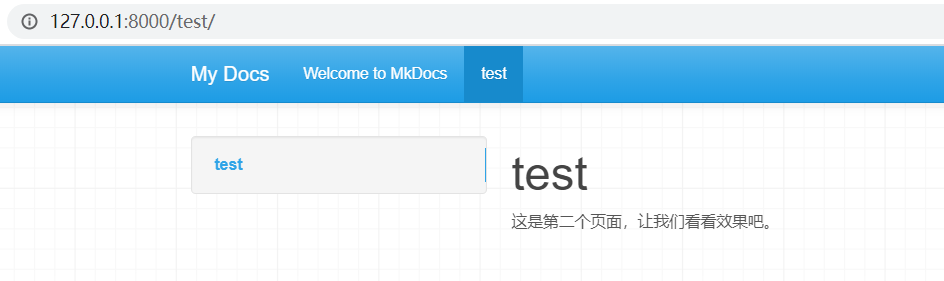

但是这个页面还比较潦草，我们可以简单配置一下。打开`mkdocs.yml`配置文件，更改如下：

```
site_name: 我的第一个站点

nav:
  - 首页: index.md  
  - 测试页: test.md
```

`site_name`为站点名称，`nav`用来设置导航栏，一行代表一个导航，其语法格式为`- 导航名称: 对应的 Markdown 文件`。

将更改保存后，再来看一下效果吧~

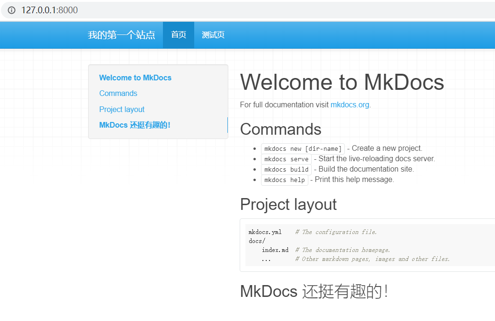

可以看到站点名称和导航栏名称都已经按照我们的设置更改了。你可以按照上述方法，将自己撰写的 Markdown 文件依次添加到站点里，这样，一个网站就初步搭建好了。

### 3.5. 本地预览

在`my-project`路径下，打开命令提示符执行`mkdocs build`命令，如下图：

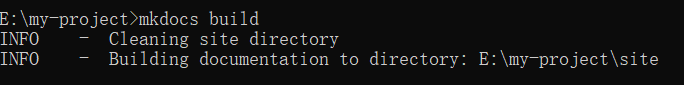

完成后，`my-project`下会多一个`site`文件夹，生成的`html`文件就全在里面啦。但是注意，`site`里面的文件在本地是不能正常跳转的，需要部署上线才能正常运行。

## 4. 将网站部署在github

### 4.1. 新建GitHub仓库

打开[GitHub](https://github.com/)官网并登录，新建一个仓库，名称必须为 `<username>.github.io`

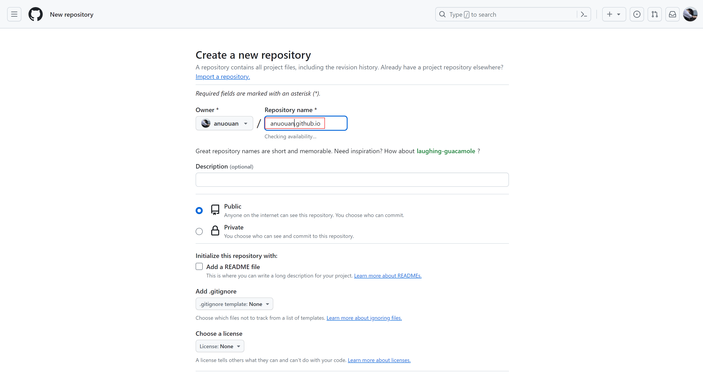

将这个仓库克隆到本地

```bash
git clone https://github.com/<username>/<username>.github.io.git
```

### 4.2. 创建MkDocs工程

-  进入拷贝项目文件( `<username>.github.io` )

```bash
cd <username>.github.io
```

- 在当前目录( `<username>.github.io` )下新建工程

```bash
mkdocs new .
```

- 然后编译MkDos文档

```bash
mkdocs build
```

这时会在当前目录下生成 `site` 文件夹，里面保存着网站的静态文件

### 4.3. 预览和部署

- MkDocs支持在部署之前，实时预览网页内容

```bash
mkdocs serve
```

执行成功后，在浏览器打开 http://127.0.0.1:8000/，就可以看到页面的样子啦！

- 预览如果没有发现问题，接下来就可以部署到GitHub了

```bash
mkdocs gh-deploy --clean
```

执行结束后，查看GitHub仓库，发现多了一个 `gh-pages` 分支，这个分支里存放的就是 `site` 文件夹中的内容

最后一步，配置GitHub Pages的构建和部署分支，将 `Settings` -> `Pages` -> `Build and deployment` -> `Branch` 设置为 `gh-pages/(root)`，点击 `Save` 保存设置

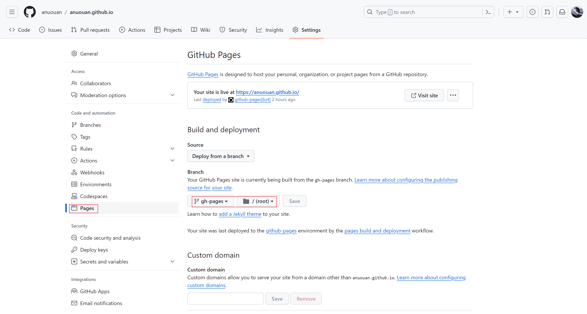

这时理论上就可以正常访问自己刚刚搭建的博客了，在浏览器地址栏中输入 `https://<username>.github.io/` ，若出现MkDocs的欢迎页则说明部署成功

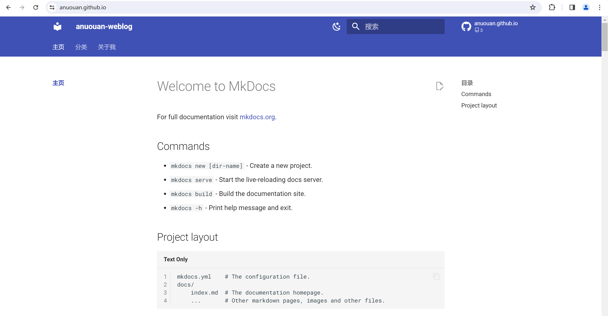

### 4.4. 配置网页

MkDocs工程的所有配置都集成在 `mkdocs.yml` 文件中

#### 4.4.1. 修改网页名称

网页名称就是显示在浏览器标签以及网页左上位置的内容，默认为 `My Docs`，可以在 `mkdocs.yml` 文件中的设置 `site_name` 来改变

```yaml
site_name: <网页名称>
```

#### 4.4.2. 修改主题

MkDocs支持多个主题，内置主题有 `mkdocs` 和 `readthedocs` ，第三方主题可以在[MkDocs Wiki](https://github.com/mkdocs/mkdocs/wiki/MkDocs-Themes)找到，也可以自定义主题

这里我是用的是比较受欢迎的 `material` 主题

```bash
pip install mkdocs-material
```

`material` 主题的详细配置说明可以参阅[Material for MkDocs](https://squidfunk.github.io/mkdocs-material/)，这里我的配置如下

```yaml
theme:
  name: material
  # [切换日间模式和夜间模式]
  # https://squidfunk.github.io/mkdocs-material/setup/changing-the-colors/#color-palette-toggle
  palette:
    # 日间模式
    - scheme: default
      # 主颜色
      # https://squidfunk.github.io/mkdocs-material/setup/changing-the-colors/#primary-color
      primary: white
      # 链接等可交互元件的高亮色
      # https://squidfunk.github.io/mkdocs-material/setup/changing-the-colors/#accent-color
      accent: green
      toggle:
        # 图标
        icon: material/weather-night
        # 鼠标悬浮提示
        name: 切换至夜间模式
    # 夜间模式
    - scheme: slate
      primary: black
      accent: green
      toggle:
        icon: material/weather-sunny
        name: 切换至日间模式
```

最终效果如下:

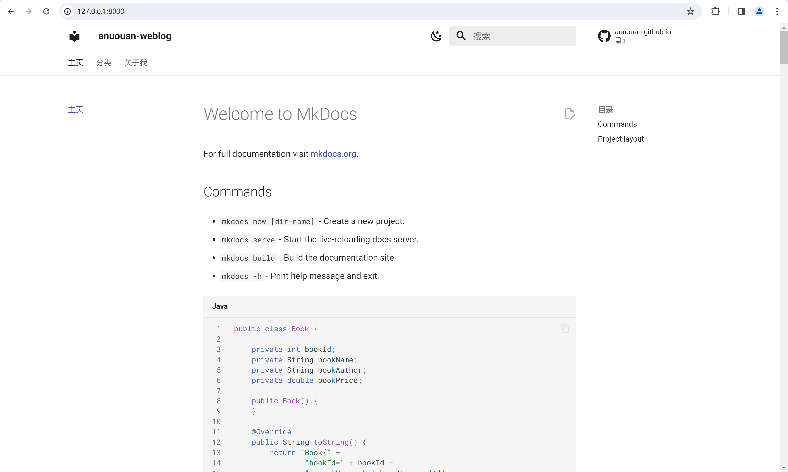

### 4.5. 发布文章

MkDocs的文章以markdown文件的形式存储在docs文件夹下，其中 `index.md` 为主页

发布新文章时，在docs目录下新建 `<article>.md` 文件并编辑

然后修改 `mkdocs.yml` 文件，将新文章加到导航栏中

```yaml
nav:
  - 主页: index.md
  - <标题>: <article>.md
```

标题可以不设置，MkDocs按照 nav配置的标题 > 文章中定义的标题(h1) > 文件名 的顺序进行推断

如果要使用多级导航，则可以这样配置

```yaml
nav:
  - 主页: index.md
  - <分类>:
    - <标题>: <aritle>.md
```

然后执行 `mkdocs gh-deploy` 命令部署到GitHub

### 4.6. 自动部署

一般会将MkDocs源文件也推送到GitHub以防止丢失，这里我就直接推送到 `main` 分支

新建 `.gitignore` 文件，忽略掉除 `docs` 、 `mkdocs.yml` 以及 `git` 相关文件之外的文件

```title='.gitignore'
/*
!/docs
!/mkdocs.yml
!/.gitignore
!/.github
```

然后我们在编写完文章后，一般至少都要执行这些命令

```bash
git add .
git commit -m 'new article'
git push    # 第一次push时执行git push -u origin main
mkdocs gh-deploy
```

本着省一点是一点的原则，前面几个 `git` 相关的命令无法省略，但 `mkdocs gh-deploy` 可以通过GitHub Actions来帮助我们自动完成

在仓库根目录下新建 `.github/workflows` 文件夹

```bash
mkdir -p .github/workflows
```

在 `.github/workflows` 文件夹下新建 `gh-deploy.yml` 文件，其他文件名也可以，内容如下，具体含义可以参考[Deploy MkDocs](https://github.com/marketplace/actions/deploy-mkdocs)

```yaml
name: Publish docs via GitHub Pages
on:
  push:
    branches:
      - main
jobs:
  build:
    name: Deploy docs
    runs-on: ubuntu-latest
    steps:
      - name: Checkout main
        uses: actions/checkout@v2
      - name: Deploy docs
        uses: mhausenblas/mkdocs-deploy-gh-pages@master
        env:
          GITHUB_TOKEN: ${{ secrets.GITHUB_TOKEN }}
          EXTRA_PACKAGES: build-base
```

在GitHub仓库页面中，将 `Settings` -> `Actions` -> `General` -> `Workflow Permissions` 设置为 `Read an write permissions`，点击 `Save` 保存设置

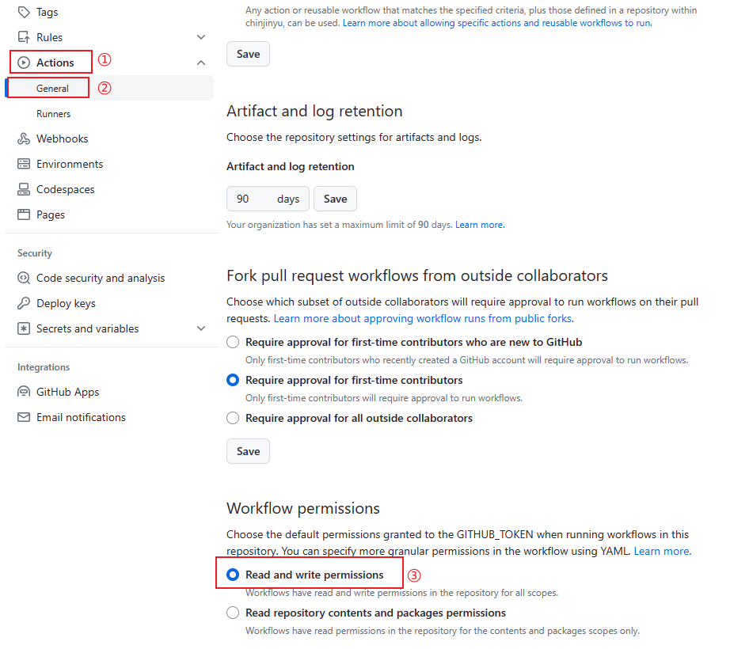

这样每次编写完文章，只需成功执行 `git push` ，GitHub就会自动帮助我们部署

## 5. 参考资料

1. [MkDocs官网](https://www.mkdocs.org/)
2. [MkDocs中文文档](https://hellowac.github.io/mkdocs-docs-zh/)
3. [Material for MkDocs](https://squidfunk.github.io/mkdocs-material/)
4. [Mkdocs 配置和使用](https://zhuanlan.zhihu.com/p/383582472)
5. [Deploy MkDocs](https://github.com/marketplace/actions/deploy-mkdocs)

