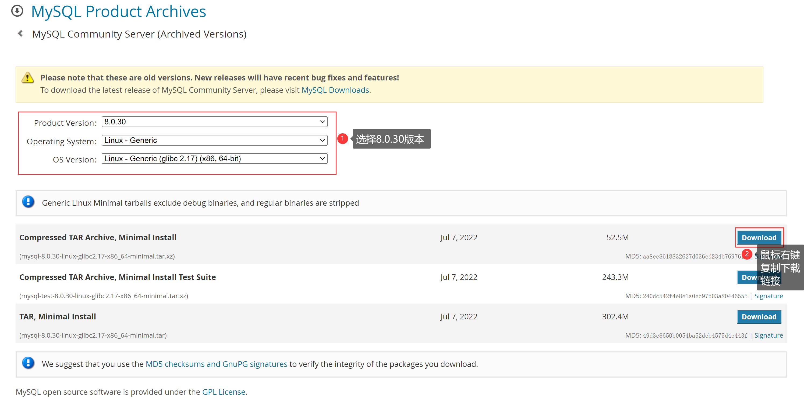
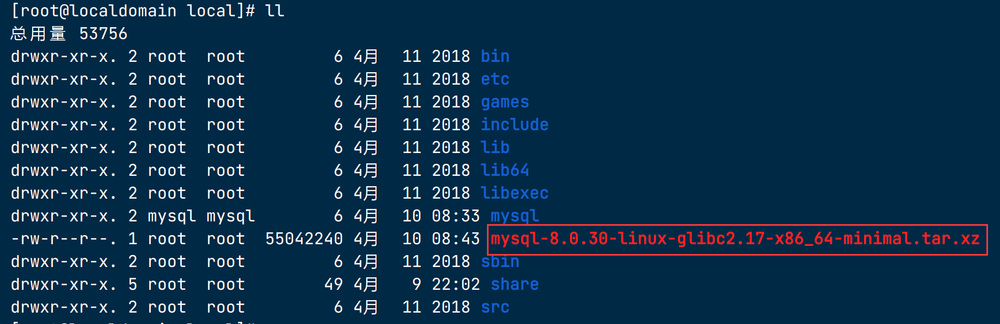
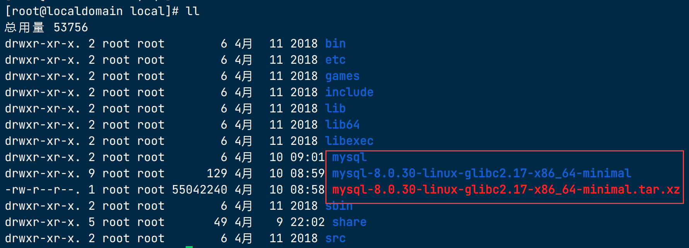
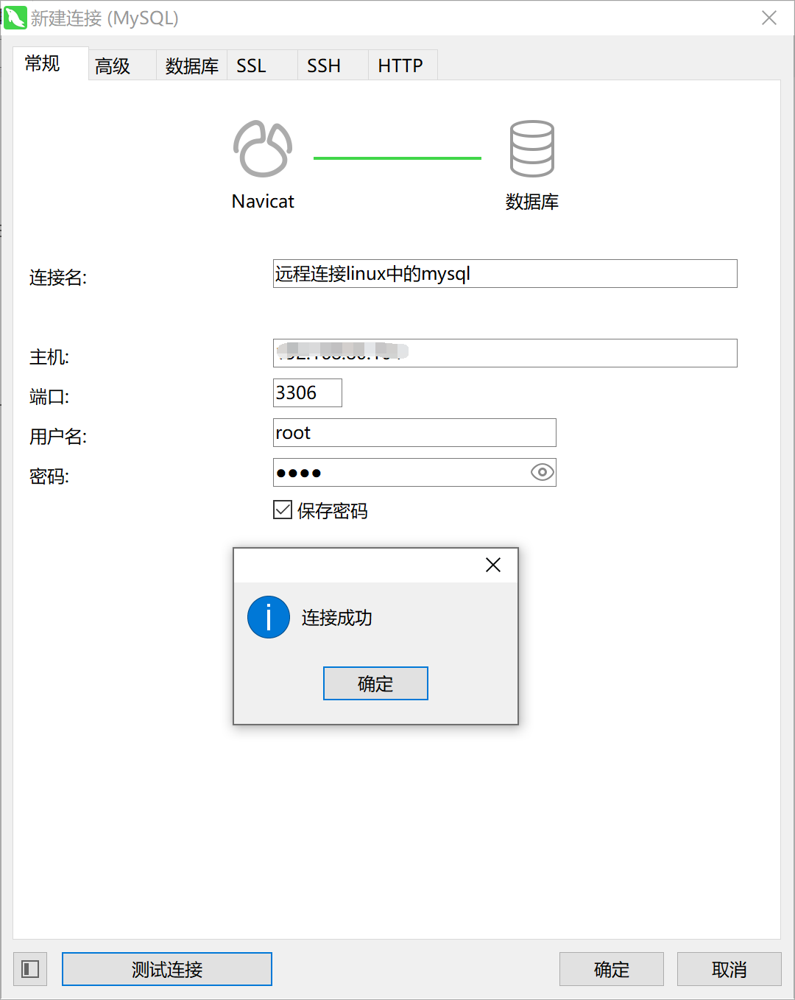

# ContOS7安装MySQL8.0

在CentOS 7中手动下载MySQL 8或以上版本，并进行安装、配置以及设置开机自启动的详细步骤如下：

## 1. 检查系统中是否已安装MySQL

```bash
rpm -qa | grep mysql
```

如果输出了一列MySQL相关的包，则表明系统中已经安装了MySQL。

### 1.1 卸载已存在的MySQL

- 首先停用并关闭MySQL服务（如果正在运行）

```bash
sudo systemctl stop mysqld
sudo systemctl disable mysqld
```

- 使用yum卸载MySQL及其相关组件

```bash
sudo yum remove mysql-server mysql-libs mariadb-libs MariaDB-serverMariaDB-client -y
```

- 清理残留文件（如配置文件和数据目录）

```bash
sudo rm -rf /etc/my.cnf
sudo rm -rf /var/lib/mysql
sudo rm -rf /var/log/mysqld.log
```

- 有些系统可能还需要清理/etc/sysconfig/mysql或/etc/my.cnf.d目录下的文件

```bash
sudo rm -rf /etc/sysconfig/mysql
sudo rm -rf /etc/my.cnf.d/*.cnf
```

## 2. 下载MySQL

1. **访问MySQL官网**：首先访问MySQL官方网站（https://dev.mysql.com/downloads/mysql/），找到MySQL Community Server的最新版本下载链接。

2. **选择版本**：根据你的CPU架构选择合适的MySQL版本下载，通常会选择tarball (.tar.gz) 归档文件。



3. 进入到`/usr/local/`目录下，下载压缩包放在此处

```
cd /usr/local
```

4. **下载至服务器**：通过`wget`命令下载到CentOS服务器上，例如：

```bash
wget https://downloads.mysql.com/archives/get/p/23/file/mysql-8.0.30-linux-glibc2.17-x86_64-minimal.tar.xz
```

注意：请确保URL是实际的MySQL下载链接，这里提供的只是一个示例。



## 3. 安装前的准备工作

在CentOS 7中，将`mysql-8.0.30-linux-glibc2.17-x86_64-minimal.tar.xz`压缩包解压`/usr/local/mysql`目录

### 3.1 解压到`/usr/local/mysql`目录

- **确保目标目录存在**（如果尚未创建）：

```bash
mkdir -p /usr/local/mysql
```

- **移动压缩包到目标目录**（如果尚未在目标目录）：

```bash
cd /usr/local/
mv mysql-8.0.30-linux-glibc2.17-x86_64-minimal.tar.xz /usr/local/
```

- **在目标目录解压压缩包**：

```bash
tar -xJf mysql-8.0.30-linux-glibc2.17-x86_64-minimal.tar.xz
# 将解压的压缩包里面的内容移动到mysql目录中
mv mysql-8.0.30-linux-glibc2.17-x86_64-minimal/* mysql/
```



`-x`表示解压，`-J`表示使用xz压缩算法，`-f`指定要解压的文件。

## 4. 环境资源准备

### 4.1 新建用户组

```bash
groupadd mysql
useradd -r -g mysql -s /bin/false mysql
```

> 1. `groupadd mysql` 是用于创建名为 "mysql" 的用户组。`groupadd` 命令用于在 Linux 系统中创建新的用户组。在这里，我们创建了一个名为 "mysql" 的用户组，该用户组将用于将 MySQL 相关的用户归类到同一组中。
>
> 2. `useradd -r -g mysql -s /bin/false mysql` 是用于创建名为 "mysql" 的系统用户，并将其分配到 "mysql" 用户组中。`useradd` 命令用于在 Linux 系统中创建新的用户。在这里，我们创建了一个名为 "mysql" 的系统用户，并使用 `-r` 参数指定该用户为系统级别的用户，`-g mysql` 参数将其分配到 "mysql" 用户组中，`-s /bin/false` 参数指定该用户的登录 shell 为 `/bin/false`，即禁止其登录系统。

这样，通过创建 "mysql" 用户和用户组，可以提供更安全的权限管理和隔离，使得 MySQL 进程以及相关文件仅限于 "mysql" 用户和用户组的权限。这是一种常见的做法，可以帮助保护系统的安全性和稳定性。

### 4.2 创建目录和设置文件权限

```bash
mkdir -p /usr/local/mysql /data/mysql/
chown -R mysql.mysql /usr/local/mysql/
chown -R mysql.mysql /data/mysql/
chmod -R 755 /data/mysql/
chmod -R 755 /usr/local/mysql/
```

> 1. `mkdir -p /usr/local/mysql /data/mysql/`：使用 `mkdir` 命令创建目录。`-p` 参数表示递归创建目录，即如果父目录不存在，也会一同创建。在这里，我们创建了 `/usr/local/mysql` 和 `/data/mysql/` 这两个目录。
> 2. `chown -R mysql.mysql /usr/local/mysql/`：使用 `chown` 命令更改文件（或目录）的所有者和所属组。`-R` 参数表示递归更改，即对目录及其子目录中的所有文件都进行更改。在这里，我们将 `/usr/local/mysql/` 目录及其子文件（如果有）的所有者设置为 "mysql" 用户，所属组也设置为 "mysql" 组。
> 3. `chown -R mysql.mysql /data/mysql/`：同样使用 `chown` 命令，将 `/data/mysql/` 目录及其子文件的所有者和所属组设置为 "mysql" 用户和 "mysql" 组。
> 4. `chmod -R 755 /data/mysql/`：使用 `chmod` 命令更改文件（或目录）的权限。`-R` 参数表示递归更改，即对目录及其子目录中的所有文件都进行更改。在这里，我们将 `/data/mysql/` 目录及其子文件的权限设置为 755，其中所有者具有读、写和执行权限，组和其他用户具有读和执行权限。
> 5. `chmod -R 755 /usr/local/mysql/`：同样使用 `chmod` 命令，将 `/usr/local/mysql/` 目录及其子文件的权限设置为 755，其中所有者具有读、写和执行权限，组和其他用户具有读和执行权限。

这些命令的执行将为 MySQL 相关的目录设置了适当的所有者和权限，以确保 MySQL 进程和文件可以正常访问和操作。

### 4.3 安装MySQL8必要的依赖

```bash
yum -y install wget gcc gcc-c++ ncurses ncurses-devel libaio-devel openssl openssl-devel git bison
yum install -y centos-release-scl-rh 
yum install -y centos-release-scl
yum install -y devtoolset-10-gcc 
yum install -y devtoolset-10-gcc-c++
```

### 4.4 初始化 MySQL 数据目录

```bash
/usr/local/mysql/bin/mysqld --initialize-insecure --user=mysql --basedir=/usr/local/mysql --datadir=/data/mysql
```

> - `/usr/local/mysql/bin/mysqld`：指定了 MySQL 服务器的二进制文件路径，用于启动和管理 MySQL 服务器。
> - `--initialize-insecure`：这是一个选项，告诉 MySQL 初始化过程中不使用密码。这将生成一个随机的 root 用户密码，但不要求使用该密码进行访问。
> - `--user=mysql`：这是指定 MySQL 服务器以 "mysql" 用户身份运行的选项。这确保了 MySQL 进程以指定的用户身份运行，以提高安全性。
> - `--basedir=/usr/local/mysql`：指定 MySQL 安装的基础目录路径。这是 MySQL 安装的根目录，包含二进制文件和其他相关文件。
> - `--datadir=/data/mysql`：指定 MySQL 数据目录的路径。这是 MySQL 存储数据库文件的位置，包括表数据、日志和其他数据文件。

通过执行此命令，MySQL 将初始化数据目录 `/data/mysql`，创建必要的目录和文件，并生成一个随机的 root 用户密码。请注意，`--initialize-insecure` 选项意味着没有密码保护，因此请谨慎使用，并在实际生产环境中考虑使用更安全的初始化方法。

#### 4.4.1 初始化完毕，会打印如下日志信息

```bash
[root@localdomain local]# /usr/local/mysql/bin/mysqld --initialize-insecure --user=mysql --basedir=/usr/local/mysql --datadir=/data/mysql
2024-04-10T01:06:31.435553Z 0 [Warning] [MY-011070] [Server] 'Disabling symbolic links using --skip-symbolic-links (or equivalent) is the default. Consider not using this option as it' is deprecated and will be removed in a future release.
2024-04-10T01:06:31.435760Z 0 [System] [MY-013169] [Server] /usr/local/mysql/bin/mysqld (mysqld 8.0.30) initializing of server in progress as process 46508
2024-04-10T01:06:31.450997Z 1 [System] [MY-013576] [InnoDB] InnoDB initialization has started.
2024-04-10T01:06:32.040513Z 1 [System] [MY-013577] [InnoDB] InnoDB initialization has ended.
2024-04-10T01:06:34.057792Z 6 [Warning] [MY-010453] [Server] root@localhost is created with an empty password ! Please consider switching off the --initialize-insecure option.
```

### 4.5 修改 MySQL 配置

#### 4.5.1 在 `/etc` 目录下创建 `my.cnf` 的备份文件

```bash
cd /etc
cp my.cnf my.cnf.back
```

> - `cd /etc`：使用 `cd` 命令进入 `/etc` 目录，这是存放系统配置文件的目录。
> - `cp my.cnf my.cnf.back`：使用 `cp` 命令进行文件拷贝。`my.cnf` 是 MySQL 的配置文件，`my.cnf.back` 是备份文件名。这个命令会将 `my.cnf` 复制为 `my.cnf.back`，以创建一个 `my.cnf` 的备份文件。

通过执行该命令，将在 `/etc` 目录下创建一个 `my.cnf.back` 的备份文件，以防止在修改 `my.cnf` 时意外丢失或损坏原始文件。备份文件可以用于恢复原始配置或进行对比，以了解所做的更改。

#### 4.5.2 修改mysql配置信息

- 通过vi编辑器编辑`my.cnf`

```bash
vi my.cnf
```

- 将`/etc/my.cnf`内容替换

```bash
[client]
# 客户端连接的端口号
port=3306  
# 客户端连接的套接字路径
socket=/tmp/mysql.sock 
# 客户端连接的默认字符集
default-character-set=utf8         
#user=root                        # 用户名
#password=123                     # 密码

[mysqld]
# MySQL服务器的唯一ID
server-id=1                        
#skip-grant-tables                 # 跳过权限表，慎用
# 默认的认证插件
default_authentication_plugin=mysql_native_password   
# MySQL服务器监听的端口号
port=3306                          
# 运行MySQL服务器的用户
user=mysql                         
# 二进制日志文件名前缀
log_bin=mysql-bin                  
# 二进制日志格式
binlog_format=mixed               
# 最大同时连接数
max_connections=200                
# MySQL服务器的套接字路径
socket=/tmp/mysql.sock             
# MySQL安装路径
basedir=/usr/local/mysql           
# 数据文件存储路径
datadir=/data/mysql                
# 进程ID文件路径
pid-file=/data/mysql/mysql.pid     
# 连接建立后执行的初始化语句
init-connect='SET NAMES utf8'      
# 服务器默认字符集
character-set-server=utf8          
# 默认存储引擎
default-storage-engine=INNODB      
# 错误日志文件路径
log_error=/data/mysql/mysql-error.log              
# 慢查询日志文件路径
slow_query_log_file=/data/mysql/mysql-slow.log     

[mysqldump]
# 使用快速导出模式
quick                              
# 最大允许的导出数据包大小
max_allowed_packet=16M             
```

### 4.6 将 MySQL 的二进制文件路径添加到系统的环境变量中

```bash
echo "export PATH=/usr/local/mysql/bin:$PATH" >> /etc/profile
source /etc/profile
```

> - `echo "export PATH=/usr/local/mysql/bin:$PATH" >> /etc/profile`：使用 `echo` 命令将字符串 `"export PATH=/usr/local/mysql/bin:$PATH"` 追加到 `/etc/profile` 文件的末尾。这个命令将 MySQL 的二进制文件路径 `/usr/local/mysql/bin` 添加到系统环境变量 `$PATH` 中，以便在终端使用时可以直接调用 MySQL 的命令。
> - `source /etc/profile`：使用 `source` 命令重新加载 `/etc/profile` 文件，使所做的更改立即生效。这样，系统环境变量中新增的 MySQL 的二进制文件路径将立即生效，而不需要注销或重新登录。

通过执行这两个命令，将 MySQL 的二进制文件路径添加到系统的环境变量中，以便可以直接在终端中调用 MySQL 的命令。这样，无论您在哪个目录，都可以直接运行 MySQL 的命令。

### 4.7 配置启动脚本

1. **复制启动脚本文件**

```bash
cp /usr/local/mysql/support-files/mysql.server /etc/init.d/mysqld
```

> `cp /usr/local/mysql/support-files/mysql.server /etc/init.d/mysqld`：使用 `cp` 命令进行文件复制。`/usr/local/mysql/support-files/mysql.server` 是 MySQL 的启动脚本文件，`/etc/init.d/mysqld` 是目标复制的位置。

通过执行这条命令，将 MySQL 的启动脚本复制到 `/etc/init.d/mysqld` 的位置。这样，可以将 MySQL 添加为系统服务，并使用 `/etc/init.d/mysqld` 来启动、停止、重启和管理 MySQL 服务。这是一种常见的方式，使得 MySQL 可以像其他系统服务一样进行管理。

2. **给启动脚本文件赋予执行权限**

```bash
chmod +x /etc/init.d/mysqld
```

> `chmod +x /etc/init.d/mysqld`：`chmod` 是一个用于修改文件权限的命令，`+x` 参数表示添加可执行权限。通过执行这条命令，我们将 `/etc/init.d/mysqld` 文件设置为可执行，即允许该文件作为脚本被执行。

这个命令的执行将使 `/etc/init.d/mysqld` 文件具有可执行权限，这意味着我们可以通过执行该文件来启动、停止或重启 MySQL 服务。在 Linux 系统中，可执行权限是管理和执行脚本、程序和服务的重要权限之一。

3. **重启 MySQL 服务的命令**

```bash
service mysqld restart
```

这是一条用于重启 MySQL 服务的命令。下面是对该命令的解释：

> `service mysqld restart`：这条命令用于重新启动 MySQL 服务器的服务。`service` 是用于管理系统服务的命令，`mysqld` 是 MySQL 服务器的服务名称，`restart` 是指定重新启动服务的操作。

通过执行这条命令，将会停止当前运行的 MySQL 服务，并重新启动它。这样，可以使任何针对 MySQL 服务器的配置更改或重要操作生效。在服务重新启动后，MySQL 服务器将以新的配置或更改的设置重新启动，并开始接受来自客户端的连接和请求。

## 5. 配置 MySQL 开机启动

```bash
chkconfig --level 345 mysqld on
```

> - `chkconfig --level 345 mysqld on`：这条命令用于配置 MySQL 服务在运行级别 3、4 和 5 下启用（开机自启动）。`chkconfig` 命令用于管理系统服务的运行级别配置。
> - `--level 345`：这是一个选项，指定要配置的运行级别。在这里，我们指定了运行级别 3、4 和 5，这些运行级别通常是多用户模式下的默认级别，包括网络服务。
> - `mysqld`：这是指定要进行配置的服务名称，即 MySQL 服务器的服务名称。

通过执行这条命令，将会设置 MySQL 服务在运行级别 3、4 和 5 下启用（开机自启动）。这样，当系统启动到指定的运行级别时，MySQL 服务将自动启动并可供使用。这对于确保 MySQL 服务器在系统启动时可用非常有用。

## 6. 登录MySQL修改密码

安装完毕后，`root`用户默认没有密码，可以通过如下命令登录并修改`root`用户密码

```bash
mysql -u root -p
```

按回车，即可无密码登录，可以通过如下命令创建用户

创建一个用户名为 `root` 的用户，密码初始化为 `root`（可根据自定义需求修改）

```bash
create user 'root'@'%' identified by 'root';
```

> `CREATE USER 'root'@'%' IDENTIFIED BY 'root';`：这条命令用于创建一个名为 'root' 的用户，并将其与 '%' 主机关联。`'root'@'%'` 表示用户名为 'root'，可从任意主机连接到 MySQL 服务器。`IDENTIFIED BY 'root'` 指定了用户的密码，这里将密码设置为 'root'。

通过执行这条命令，将创建一个名为 'root' 的用户，并赋予它在 MySQL 服务器上进行连接和操作的权限。这个用户可以从任意主机连接到 MySQL，并使用指定的密码进行身份验证。请注意，创建 'root' 用户并将其与 '%' 主机关联是一种不太安全的做法，因为允许来自任意主机的连接。在生产环境中，建议限制 'root' 用户的访问权限并使用更复杂的密码

## 7. MySQL 授权远程访问

- **赋予权限，并配置可访问的 ip**

```bash
grant all privileges on *.* to 'root'@'%';
flush privileges;
```

> - `GRANT ALL PRIVILEGES ON *.* TO 'root'@'%';`：这条命令授予 'root' 用户在所有数据库和所有表上执行所有操作的权限。`ALL PRIVILEGES` 表示授予所有权限，`*.*` 表示适用于所有数据库和所有表，`'root'@'%'` 表示将授权应用于用户名为 'root'，且可以从任意主机连接到 MySQL 服务器的用户。
>
> 通过执行这条命令，'root' 用户将具有对 MySQL 中所有数据库和所有表的完全权限。
>
> - `FLUSH PRIVILEGES;`：这条命令用于刷新权限，使新的授权立即生效。在 MySQL 中，当对权限进行更改后，需要执行该命令以使更改生效。

通过执行这两条命令，将授予 'root' 用户在所有数据库和所有表上执行所有操作的权限，并确保新的授权立即生效。

请注意，授予 'root' 用户全部权限并允许 '%' 主机的连接是一种不太安全的做法，因为它允许来自任意主机的连接。在生产环境中，建议限制 'root' 用户的访问权限，并仅允许受信任的主机连接。此外，为 'root' 用户设置更复杂和安全的密码也是很重要的。

- **配置防火墙规则**

如果要远程访问 MySQL，操作系统需要打开 MySQL 的默认 3306 端口的访问权限

```bash
firewall-cmd --zone=public --add-port=3306/tcp --permanent  
firewall-cmd --reload
```

> 1. `firewall-cmd --zone=public --add-port=3306/tcp --permanent`：这条命令用于向防火墙配置中添加一个允许传入的 TCP 端口规则。`--zone=public` 指定将规则应用于 "public" 区域，`--add-port=3306/tcp` 指定要添加的端口为 3306，`--permanent` 表示将更改永久保存。这意味着该端口将被打开并允许传入的 TCP 连接，以便在该端口上提供服务（在这里是 MySQL 的默认端口）。
> 2. `firewall-cmd --reload`：这条命令用于重新加载防火墙配置，以使最新的更改生效。通过执行此命令，防火墙将重新加载配置文件，并应用任何新的添加或修改的规则。

通过执行这两个命令，将防火墙配置中添加一个允许传入的 TCP 端口规则，并重新加载防火墙以使更改生效。这样，就可以允许在该端口上的传入连接，例如允许 MySQL 服务器监听和响应来自其他主机的连接。这对于确保服务的可访问性非常重要。

## 8. 测试远程连接



## 9. （备用）修改 MySQL 的密码

1. 使用以下命令以 root 用户身份登录到 MySQL 服务器：
   ```
   mysql -u root -p
   ```

2. 提示您输入密码，请输入当前的 MySQL root 用户密码。

3. 成功登录后，执行以下命令来修改密码，将 `密码` 替换为您想要设置的新密码：
   ```sql
   ALTER USER 'root'@'localhost' IDENTIFIED BY '密码';
   ```

4. 如果您还想修改远程访问的 root 用户的密码，请使用以下命令：
   ```sql
   ALTER USER 'root'@'%' IDENTIFIED BY '密码';
   ```

5. 最后，刷新权限以使更改生效：
   ```sql
   FLUSH PRIVILEGES;
   ```

现在，您已成功修改了 MySQL 的密码。请确保将 `密码` 替换为您自己的新密码，并牢记它以供将来使用。
