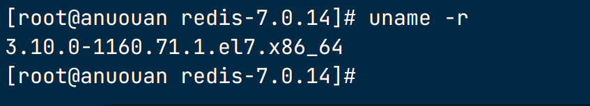
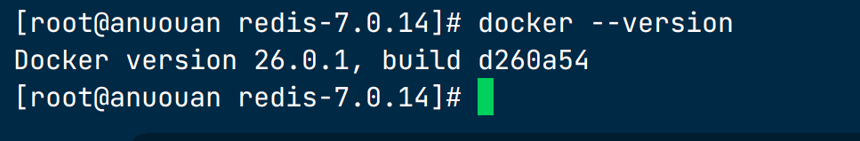

# linux安装docker

## 一、docker安装

在CentOS 7中安装Docker的详细步骤和命令如下：

**查看当前的内核版本**：
在安装Docker之前，需要确认CentOS 7的内核版本是否满足Docker的要求。通常，官方建议的Linux内核版本为3.10以上。可以使用以下命令来查看当前的内核版本：

```bash
uname -r
```



如果返回的内核版本满足要求，则可以继续安装过程。

**安装必要依赖**

安装所需的依赖包（如 `yum-utils` 和 `device-mapper-persistent-data`）：

```bash
sudo yum install -y yum-utils device-mapper-persistent-data lvm2
```

**添加 Docker 官方仓库**

使用 `yum-config-manager` 命令添加 Docker 官方仓库：

```bash
sudo yum-config-manager --add-repo https://download.docker.com/linux/centos/docker-ce.repo
```

**安装 Docker**

现在可以从官方仓库安装 Docker：

```bash
sudo yum install -y docker-ce docker-ce-cli containerd.io
```

**启动 Docker 服务**

安装完成后，启动 Docker 服务并设置为开机自启动：

```bash
sudo systemctl start docker
sudo systemctl enable docker
```

**验证安装**

运行 `docker` 命令验证 Docker 是否已成功安装并运行：

```bash
docker --version
```

如果一切正常，将显示类似以下输出，显示出 Docker 的版本信息：



**可选步骤：添加当前用户到 `docker` 组**

为了让非 `root` 用户无需使用 `sudo` 即可执行 Docker 命令，可以将当前用户添加到 `docker` 组：

```bash
sudo usermod -aG docker $(whoami)
```

之后需要注销并重新登录，使得组成员变更生效。之后，当前用户就能直接运行 Docker 命令了。

至此，Docker 已在 CentOS 7 系统上成功安装并配置完毕。您可以开始使用 Docker 运行容器了。如有需要，可以访问 Docker 官方文档获取更多使用和管理 Docker 的信息。