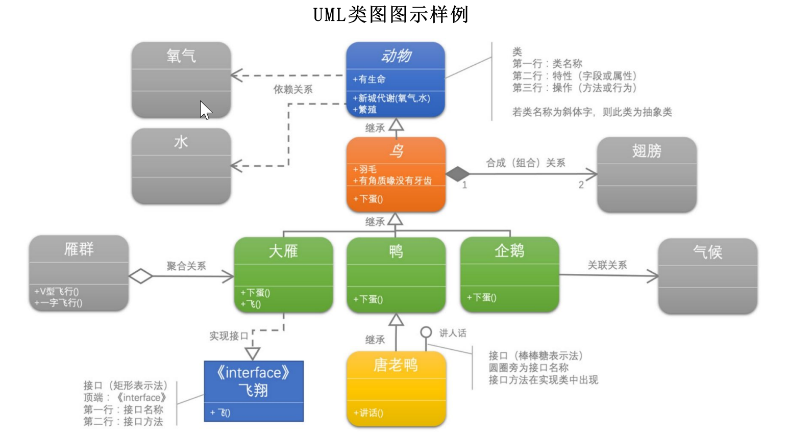
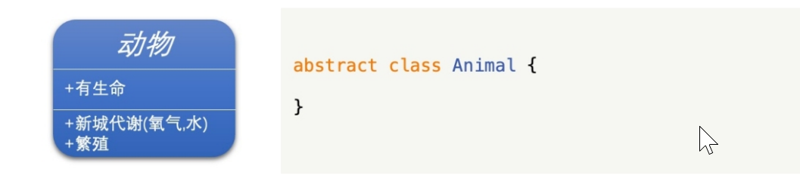
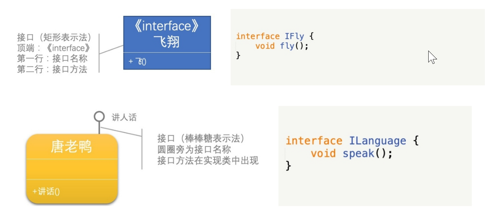
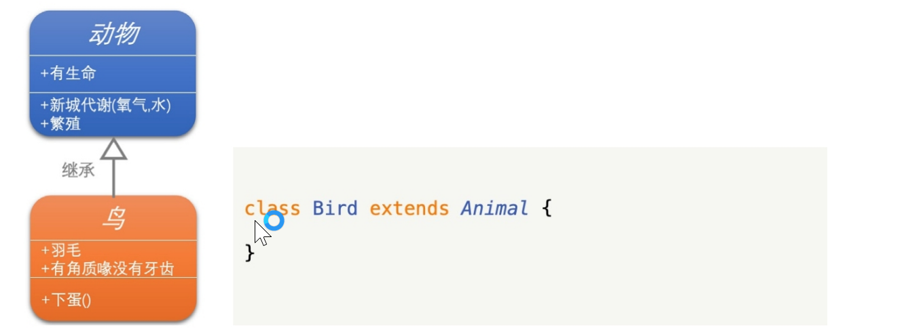
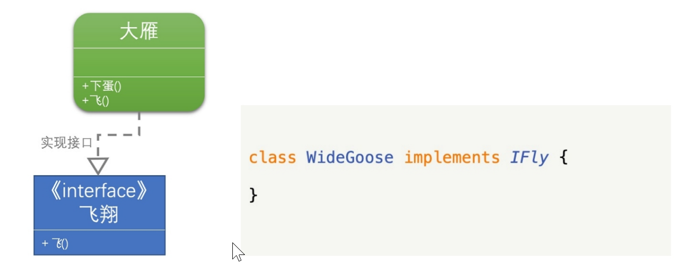
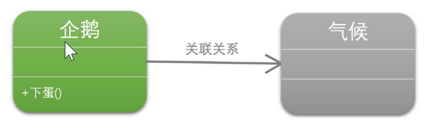
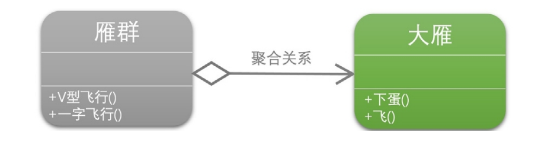
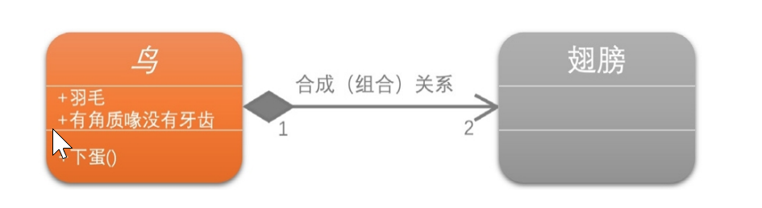
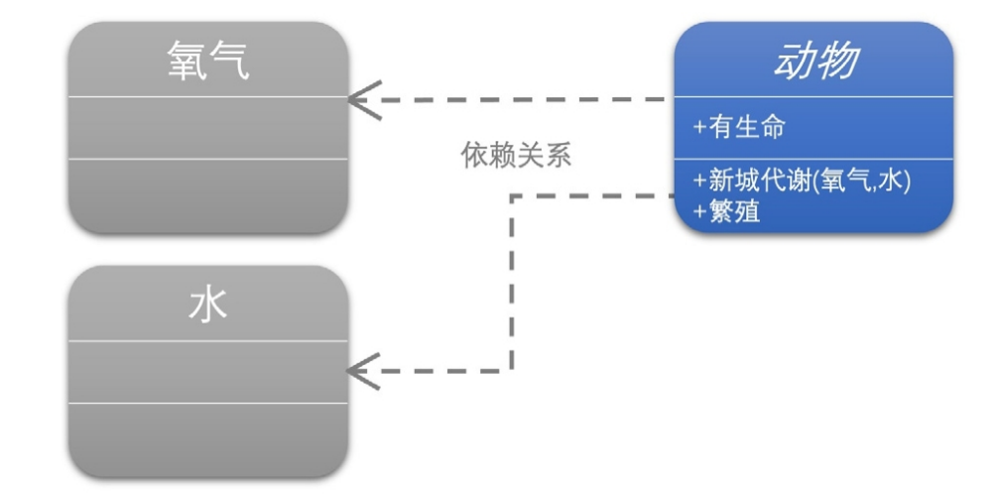

# UML类图



首先你看那个'动物'矩形框，它就代表一个类（Class）。类图分为三层：

- 第一层显示类的名称，如果是抽象类，则就用斜体显示；
- 第二层是类的特性，通常就是字段和属性；
- 第三层是类的操作，通常是方法或行为 。 

注意前面的符号 ， '+' 表 示 public ， '-' 表 示 private ， '#' 表 示 protected。




然后注意左下角的'飞翔'，它表示一个接口图，与类图的区别主要是顶端有<< interface >>显示。

- 第一行是接口名称
- 第二行是接口方法

接口还有另一种表示方法，俗称棒棒糖表示法，比如图中的唐老鸭类就是实现了'讲人话'的接口。



接下来就可以讲类与类，类与接口之间的关系了。你可首先注意 动物、鸟、鸭、唐老鸭之间的关系符号。

它们都是继承的关系，继承关系用空心三角形+实线来表示。



示例中举的几种鸟中，大雁是最能飞的，我让它实现了飞翔接口。实现接口用空心三角形+虚线来表示。



你看企鹅和气候两个类，企鹅是很特别的鸟，会游不会飞。更重要的是，它与气候有很大的关联。我们不去讨论为什么北极没有企鹅，为 么它们要每年长途跋涉。总之，企鹅需要'知道'气候的变化，需要'了解'气候规律。当一个类'知道'另一个类时，可以用关联（association）。关联关系用实线箭头来表示。



```java
class Penguin extends Bird{
    //在企鹅Penguin中，引用了气候Climate对象
    private Climate climate;
}
```

我们再来看大雁与雁群这两个类，大雁是群居动物，每只大雁都属于一个雁群，一个雁群可以有多只大雁。所以它们之间就满足聚合 （Aggregation）关系。聚合表示一种弱的'拥有'关系，体现的是A对象可以包含B对象，但B对象不是A对象的一部分。聚合关系用空心的菱形+实线箭头来表示。



```java
class WideGooseAggregate{
    //在雁群WideGooseAggregate类中大雁数组对象arrayWideGoose
    private WideGoose[] arrayWideGoose;
}
```

合成（Composition，也有翻译成'组合'的）是一种强的'拥有'关系，体现了严格的部分和整体的关系，部分和整体的生命周期一样 ［DPE］。在这里鸟和其翅膀就是合成（组合）关系，因为它们是部分和整体的 关系，并且翅膀和鸟的生命周期是相同的。

- 合成关系用实心的菱形+实线箭头来表示。

另外，你会注意到合成关系的连线两端还有一个数字'1'和数 字'2'，这被称为基数。表明这一端的类可以有几个实例，很显然，一个鸟应 该有两只翅膀。如果一个类可能有无数个实例，则就用'n'来表示。关联关系、聚合关系也可以有基数。



```java
class Bird {
    //在鸟Bird类中声明一个翅膀Wing对象Wing
    private Wing wing;
    public Bird() {
        //初始化时，实例化翅膀Wing，他们之间同时生成
        Wing = new Wing();
    }
}
```

动物几大特征，比如有新陈代谢，能繁殖。而动物要有生命力， 需要氧气、水以及食物等。也就是说，动物依赖于氧气和水。它们之间是依赖关系（Dependency），用虚线箭头来表示。



```java
abstract class Animal{
    public Metabolism (Oxygen oxygen, Water water){

    }
}
```

编程是一门技术，更是一门艺术，不能只满足于写完代码运行结果正确就完事，时常考虑如何让代码更加简练，更加容易维护，容易扩展和复用，只有这样才可以真正得到提高。写出优雅的代码真的 是一种很爽的事情。

UML类图也不是一学就会的，需要有一个慢慢熟练的过程。所谓学无止境，其实这才是理解面向对象的开始呢。