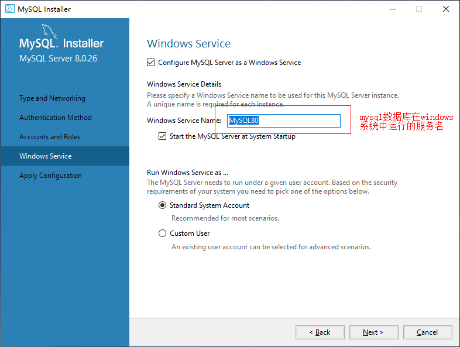
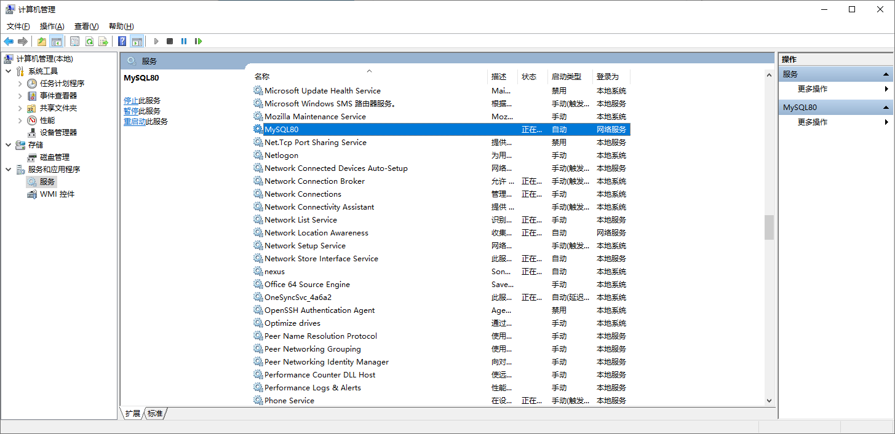
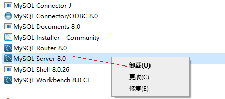
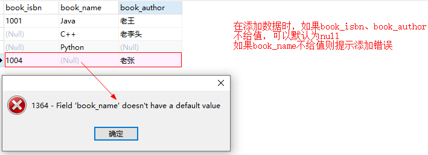
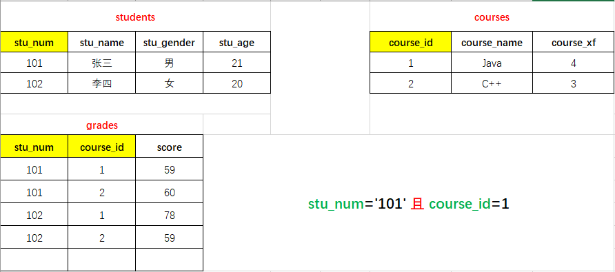
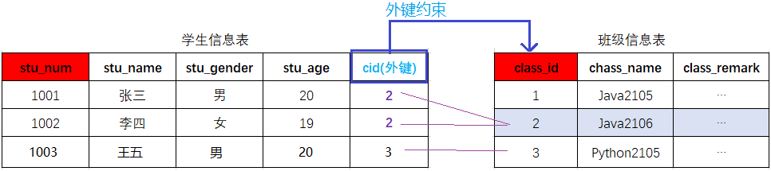
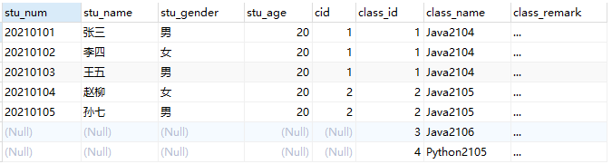
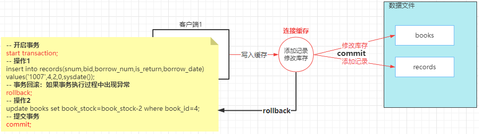
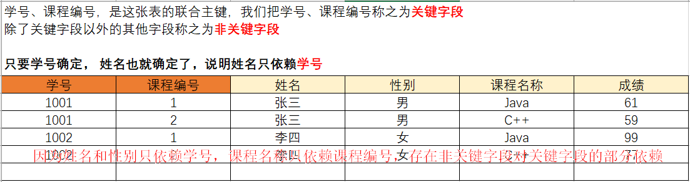
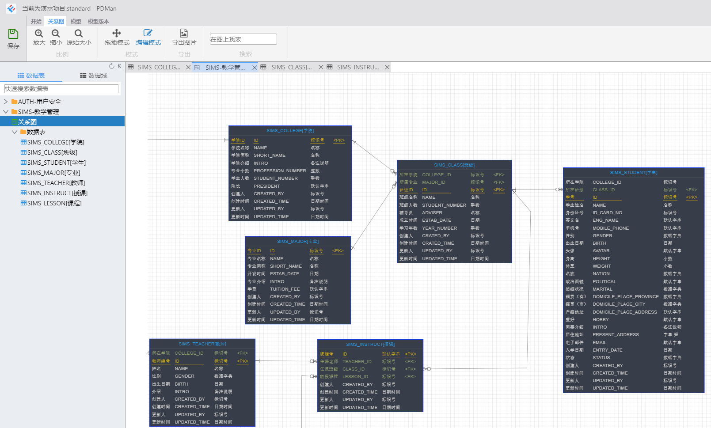

## 一、MySQL课程内容

#### 1.1 数据库介绍

- 数据库概念
- 术语介绍

#### 1.2 MySQL数据库

- 下载、安装、配置、卸载
- MySQL客户端工具的安装及使用

#### 1.3 SQL 结构化查询语言

- 什么是SQL
- SQL操作数据（CRUD操作：添加、查询、修改、删除）

#### 1.4 SQL 高级

- 存储过程
- 索引
- 触发器、视图

#### 1.5 数据库设计

- 数据库设计步骤
- 数据库设计范式
- E-R图
- PowerDesigner建模工具、PDMan

#### 1.6 数据库事务

- 什么是事务
- 事务特性ACID
- 事务隔离级别
- 事务管理

## 二、数据库介绍

#### 2.1 数据库概念

> 数据库，就是存放数据的仓库
>
> 数据库（DataBase，简称DB）是长期存储在计算机内部有结构的、大量的、共享的数据集合。

- 长期存储：持久存储
- 有结构：
  - 类型：数据库不仅可以存放数据，而且存放的数据还是有类型的
  - 关系：存储数据与数据之间的关系

- 大量：大多数数据库都是文件系统的，也就是说存储在数据库中的数据实际上就是存储在磁盘的文件中
- 共享：多个应用程序可以通过数据库实现数据的共享

#### 2.2 关系型数据库与非关系型数据库

- 关系型数据库

  > 关系型数据库，采用了关系模型来组织数据的存储，以行和列的形式存储数据并记录数据与数据之间的关系 —— 将数据存储在表格中，可以通过建立表格与表格之间的关联来维护数据与数据之间的关系。
  >
  > 学生信息----  学生表
  >
  > 班级信息----  班级表

- 非关系型数据库

  > 非关系型数据库，采用键值对的模型来存储数据，只完成数据的记录，不会记录数据与数据之间的关系。
  >
  > 在非关系型数据库中基于其特定的存储结构来解决一些大数据应用的难题。
  >
  > NoSQL(Not only SQL)数据库来指代非关系型数据库。

#### 2.3 常见的数据库产品

**关系型数据库产品**

- `MySQL` 免费
  - MariaDB 
  - Percona Server

- PostgreSQL

- `Oracle` 收费
- SQL Server
- Access
- Sybase
- 达梦数据库

 **非关系型数据库产品**

- 面向检索的列式存储   Column-Oriented
  - HaBase （Hadoop子系统）
  - BigTable （Google）
- 面向高并发的缓存存储Key-Value
  - `Redis`
  - MemcacheDB

- 面向海量数据访问的文档存储 Document--Oriented
  - `MongoDB`
  - CouchDB

#### 2.4 数据库术语


- `数据库（Database）`：存储的数据的集合，提供数据存储的服务

- `数据（Data）`：实际上指的是描述事物的符号记录

- `数据库管理系统（Database Management System，DBMS ）`： 数据库管理系统，是位于用户与操作系统之间的一层数据管理软件

- `数据库系统管理员（Database Anministrator，简称为DBA）`:  负责数据库创建、使用及维护的专门人员

- `数据库系统（Database System，DBS）`：数据库系统管理员、数据库管理系统及数据库组成整个单元

## 三、MySQL数据库环境准备

> MySQL下载、安装、配置、卸载，安装DBMS、使用DBMS

#### 3.1 MySQL版本及下载

###### 3.1.1 版本

- MySQL 是Oracle的免费的关系型数据库 ， 官网 https://www.mysql.com/
- MySQL 目前的最新版本为`8.0.26` ，在企业项目中主流版本： 5.0 ---  5.5 --- 5.6 --- `5.7` --- `8.0.26` 
  - 5.x   ---   2020年 5.7.32 
  - 8.x   ---   2018年8.0.11  ---   2019年 8.0.16 --- 2021年 8.0.26

- MySQL 8.x新特性
  - 性能：官方8.x比5.7速度要快2倍
  - 支持NoSQL存储：5.7开始提供了对NoSQL的支持，8.0.x做了更进一步的改进
  - 窗口函数
  - 索引：隐藏索引、降序索引
  - 可用性、可靠性

###### 3.1.2 下载

- 官网下载：https://dev.mysql.com/downloads/installer/  
  - 需要注册oracle
  - 服务器在国外，下载速度....

- 镜像下载：https://www.filehorse.com/download-mysql-64/download/


#### 3.2 MySQL 安装

> 傻瓜式（直接点击下一步）


**选择`Developer Default`模式安装**

此模式会安装开发人员需要的常用组件；在安装这些组件时需要对应的环境依赖，我们要暂停，先去安装依赖的环境：

例如：`Microsoft Visual C++ 2019 Redistributable Package (x64) is not installed. Latest binary compatible version will be installed if agreed to resolve this requirement.`

安装：


**选择自定义`Custom`安装**


#### 3.3 MySQL配置

###### 3.3.1 端口配置


###### 3.3.2 账号密码设置


###### 3.3.3 服务名称




#### 3.4 MySQL 服务的启动与停止

> MySQL是以服务的形式运行在系统中

###### 3.4.1 计算机管理窗口

`此电脑`---`右键`---`管理`



###### 3.4.2 windows命令行

打开命令行 ： `win + R`  --- 输入`cmd`回车

以管理员身份打开命令行：`win+s`---- 输入`cmd`----选择`以管理员身份运行`


#### 3.5 MySQL卸载

- 关闭服务

  ```
  ## 管理员身份启动 cmd 命令行
  net stop mysql80
  ```

- 卸载软件

  - 打开控制面板

    

  - 点击“程序和功能”

    

  - 卸载MySQL

    

- 删除目录

  - MySQL的安装目录：`C:\Program Files (x86)\MySQL`
  - MySQL的数据文件目录(默认隐藏)：`C:\ProgramData\MySQL`  (如果不允许删除，强制删除)

- 删除注册表

  - 打开注册表：` win+r` --- 输入`regedit`---回车

  - 删除 `HKEY_LOCAL_MACHINE\SYSTEM\ControlSet001\Services\MySQL80`

  - 删除搜索`mysql`的相关项（非必须）

## 四、MySQL的管理工具

> 当完成数据库的安装之后，mysql是以服务的形式运行在windows/linux系统，用户是通过DBMS工具来对MySQL进行操作的，当我们安装完成MySQL之后默认安装了`mysql Commcand line Client`，此工具是一个命令行形式的工具，通常我们会单独安装可视化的DBMS工具：
>
> - SQLyog
> - Navicat for MySQL

#### 4.1 MySQL Command line Client使用

- 打开`MySQL Command line Client`: 开始菜单 --- MySQL --- MySQL 8.0 Command line Client

- 连接MySQL : `输入密码`即可   （如果密码错误或者mysql服务没有启动，窗口会闪退）

  

- 关闭MySQL Command line Client：输入`exit`指令回车即可退出

#### 4.2 可视化工具Navicat使用

###### 4.2.1 Navicat工具下载及安装

> 傻瓜式安装

###### 4.2.2 创建连接

- 打开navicat工具

- 创建连接：

  


## 五、MySQL逻辑结构

> MySQL可以存储数据，但是存储在MySQL中的数据需要按照特定的结果进行存储
>
> 学生 ------  学校
>
> 数据 ------  数据库

#### 5.1 逻辑结构


#### 5.2 记录/元组

****


## 六、SQL 结构化查询语言

#### 6.1 SQL概述

> SQL（Structured Query Language）结构化查询语言，用于存取、查询、更新数据以及管理关系型数据库系统

###### 6.1.1 SQL发展

- SQL是在1981年由IBM公司推出，一经推出基于其简洁的语法在数据库中得到了广泛的应用，成为主流数据库的通用规范
- SQL由ANSI组织确定规范
- 在不同的数据库产品中遵守SQL的通用规范，但是也对SQL有一些不同的改进，形成了一些数据库的专有指令
  - MySQL:  limit
  - SQLServer ： top
  - Oracle：rownum

###### 6.1.2 SQL分类

> 根据SQL指令完成的数据库操作的不同，可以将SQL指令分为四类：

- **DDL Data Definition Language  数据定义语言 **
  - 用于完成对数据库对象（数据库、数据表、视图、索引等）的创建、删除、修改
- **DML Data Manipulation Language  数据操作/操纵语言** 
  - 用于完成对数据表中的数据的添加、删除、修改操作
  - 添加：将数据存储到数据表
  - 删除：将数据从数据表移除
  - 修改：对数据表中的数据进行修改
- **DQL Data Query Language  数据查询语言**
  - 用于将数据表中的数据查询出来
- **DCL Data Control Language  数据控制语言**
  - 用于完成事务管理等控制性操作


#### 6.2 SQL基本语法

> 在MySQL Command Line Client 或者navicat等工具中都可以编写SQL指令

- SQL指令不区分大小写
- 每条SQL表达式结束之后都以`;`结束
- SQL关键字之间以`空格`进行分隔
- SQL之间可以不限制换行（可以有空格的地方就可以有换行）


#### 6.3 DDL 数据定义语言

###### 6.3.1 DDL-数据库操作

> 使用DDL语句可以创建数据库、查询数据库、修改数据库、删除数据库

**查询数据库**

```sql
## 显示当前mysql中的数据库列表
show databases;

## 显示指定名称的数据的创建的SQL指令
show create database <dbName>;
```

**创建数据库**

```sql
## 创建数据库  dbName表示创建的数据库名称，可以自定义
create database <dbName>;

## 创建数据库，当指定名称的数据库不存在时执行创建
create database if not exists <dbName>;

## 在创建数据库的同时指定数据库的字符集（字符集：数据存储在数据库中采用的编码格式 utf8  gbk）
create database <dbName> character set utf8;
```

**修改数据库** 修改数据库字符集

```sql
## 修改数据库的字符集
alter database <dbName> character set utf8;  # utf8  gbk
```

**删除数据库** 删除数据库时会删除当前数据库中所有的数据表以及数据表中的数据

```sql
## 删除数据库
drop database <dbName>;

## 如果数据库存在则删除数据库
drop database if exists <dbName>;
```

**使用/切换数据库**

```sql
use <dbName>
```


###### 6.3.2 DDL-数据表操作

**创建数据表**

> 数据表实际就是一个二维的表格，一个表格是由多列组成，表格中的每一类称之为表格的一个字段


```sql
create table students(
   stu_num char(8) not null unique,
   stu_name varchar(20) not null,
   stu_gender char(2) not null,
   stu_age int not null,
   stu_tel char(11) not null unique,
   stu_qq varchar(11) unique
);
```

**查询数据表**

```sql
show tables;
```

**查询表结构**

```sql
desc <tableName>;
```

**删除数据表**

```sql
## 删除数据表
drop table <tableName>;

## 当数据表存在时删除数据表
drop table if  exists <tableName>;
```

**修改数据表**

```sql
## 修改表名
alter table <tableName> rename to <newTableName>;

## 数据表也是有字符集的，默认字符集和数据库一致
alter table <tableName> character set utf8;

## 添加列（字段）
alter table <tableName> add <columnName> varchar(200);

## 修改列（字段）的列表和类型
alter table <tableName> change <oldColumnName> <newCloumnName> <type>;

## 只修改列（字段）类型
alter table <tableName> modify <columnName> <newType>;

## 删除列（字段）
alter table stus drop <columnName>;
```

#### 6.4 MySQL数据类型

> 数据类型，指的是数据表中的列中支持存放的数据的类型

###### 6.4.1 数值类型

在mysql中有多种数据类型可以存放数值，不同的类型存放的数值的范围或者形式是不同的

| 类型              | 内存空间大小     | 范围                                           | 说明                                                |
| ----------------- | ---------------- | ---------------------------------------------- | --------------------------------------------------- |
| tinyint           | 1byte            | 有符号   -128~127<br>无符号  0~255             | 特小型整数（年龄）                                  |
| smallint          | 2byte  （16bit） | 有符号   -32768 ~ 32767<br/>无符号  0~65535    | 小型整数                                            |
| mediumint         | 3byte            | 有符号   -2^31 ~ 2^31 - 1<br/>无符号  0~2^32-1 | 中型整数                                            |
| **`int/integer`** | 4byte            |                                                | 整数                                                |
| **bigint**        | 8byte            |                                                | 大型整数                                            |
| float             | 4byte            |                                                | 单精度                                              |
| **double**        | 8byte            |                                                | 双精度                                              |
| decimal           | 第一参数+2       |                                                | decimal(10,2)<br/>表示数值一共有10位<br>小数位有2位 |

###### 6.4.2 字符串类型

> 存储字符序列的类型

| 类型       | 字符长度     | 说明                                                         |
| ---------- | ------------ | ------------------------------------------------------------ |
| `char`     | 0~255 字节   | 定长字符串，最多可以存储255个字符 ;当我们指定数据表字段为char(n)<br>此列中的数据最长为n个字符，如果添加的数据少于n，则补'\u0000'至n长度 |
| `varchar`  | 0~65536 字节 | 可变长度字符串，此类型的类最大长度为65535                    |
| tinyblob   | 0~255 字节   | 存储二进制字符串                                             |
| blob       | 0~65535      | 存储二进制字符串                                             |
| mediumblob | 0~1677215    | 存储二进制字符串                                             |
| longblob   | 0~4294967295 | 存储二进制字符串                                             |
| tinytext   | 0~255        | 文本数据（字符串）                                           |
| text       | 0~65535      | 文本数据（字符串）                                           |
| mediumtext | 0~1677215    | 文本数据（字符串）                                           |
| `longtext` | 0~4294967295 | 文本数据（字符串）                                           |

###### 6.4.3 日期类型

> 在MySQL数据库中，我们可以使用字符串来存储时间，但是如果我们需要基于时间字段进行查询操作（查询在某个时间段内的数据）就不便于查询实现

| 类型       | 格式                | 说明                        |
| ---------- | ------------------- | --------------------------- |
| `date`     | 2021-09-13          | 日期，只存储年月日          |
| time       | 11:12:13            | 时间，只存储时分秒          |
| year       | 2021                | 年份                        |
| `datetime` | 2021-09-13 11:12:13 | 日期+时间，存储年月日时分秒 |
| timestamp  | 20210913 111213     | 日期+时间 （时间戳）        |

#### 6.5 字段约束

###### 6.5.1 约束介绍

> 在创建数据表的时候，指定的对数据表的列的数据限制性的要求（对表的列中的数据进行限制）

为什么要给表中的列添加约束呢？

- 保证数据的有效性
- 保证数据的完整性
- 保证数据的正确性

字段常见的约束有哪些呢？

- 非空约束（not null）：限制此列的值必须提供，不能为null 
- 唯一约束（unique）：在表中的多条数据，此列的值不能重复
- 主键约束（primary key）：非空+唯一，能够唯一标识数据表中的一条数据

- 外键约束（foreign key）：建立不同表之间的关联关系

###### 6.5.2 非空约束

> 限制数据表中此列的值必须提供

- 创建表：设置图书表的 book_name  not null

  ```sql
  create table books(
    book_isbn char(4),
    book_name varchar(10) not null,
    book_author varchar(6)
  );
  ```

- 添加数据：

  

###### 6.5.3 唯一约束

> 在表中的多条数据，此列的值不能重复

- 创建表：设置图书表的book_isbn为 unique

  ```sql
  create table books(
    book_isbn char(4) unique,
    book_name varchar(10) not null,
    book_author varchar(6)
  );
  ```

- 添加数据：

  

###### 6.5.4 主键约束

> 主键——就是数据表中记录的唯一标识，在一张表中只能有一个主键（主键可以是一个列，也可以是多个列的组合）
>
> 当一个字段声明为主键之后，添加数据时：
>
> - 此字段数据不能为null
> - 此字段数据不能重复

**创建表时添加主键约束**

```sql
create table books(
  book_isbn char(4) primary key,
  book_name varchar(10) not null,
  book_author varchar(6)
);
```

或者

```sql
create table books(
  book_isbn char(4),
  book_name varchar(10) not null,
  book_author varchar(6),
  primary key(book_isbn)
);
```

**删除数据表主键约束**

```sql
alter table books drop primary key;
```

**创建表之后添加主键约束**

```sql
## 创建表时没有添加主键约束
create table books(
  book_isbn char(4),
  book_name varchar(10) not null,
  book_author varchar(6)
);

## 创建表之后添加主键约束
 alter table books modify book_isbn char(4) primary key;
```


###### 6.5.5 主键自动增长

> 在我们创建一张数据表时，如果数据表中有列可以作为主键（例如：学生表的学号、图书表的isbn）我们可以直接这是这个列为主键；
>
> 当有些数据表中没有合适的列作为主键时，我们可以额外定义一个与记录本身无关的列（ID）作为主键，此列数据无具体的含义主要用于标识一条记录，在mysql中我们可以将此列定义为int，同时设置为`自动增长`，当我们向数据表中新增一条记录时，无需提供ID列的值，它会自动生成。

**定义主键自动增长**

- 定义int类型字段自动增长：`auto_increment`

```sql
create table types(
   type_id int primary key auto_increment,
   type_name varchar(20) not null,
   type_remark varchar(100)
);
```

注意：自动增长从1开始，每添加一条记录，自动的增长的列会自定+1，当我们把某条记录删除之后再添加数据，自动增长的数据也不会重复生成（自动增长只保证唯一性、不保证连续性）


###### 6.5.6 联合主键

> 联合组件——将数据表中的多列组合在一起设置为表的主键



**定义联合主键**

```sql
create table grades(
    stu_num char(8),
    course_id int,
    score int,
    primary key(stu_num,course_id)
);
```

注意：在实际企业项目的数据库设计中，联合主键使用频率并不高；当一个张数据表中没有明确的字段可以作为主键时，我们可以额外添加一个ID字段作为主键。


###### 6.5.7 外键约束

在多表关联部分讲解


#### 6.6 DML 数据操纵语言

> 用于完成对数据表中数据的插入、删除、修改操作

```sql
create table students(
   stu_num char(8) primary key,
   stu_name varchar(20) not null,
   stu_gender char(2) not null,
   stu_age int not null,
   stu_tel char(11) not null unique,
   stu_qq varchar(11) unique
);
```


###### 6.6.1 插入数据

**语法**

```sql
insert into <tableName>(columnName,columnName....) values(value1,value2....);
```

**示例**

```sql
## 向数据表中指定的列添加数据（不允许为空的列必须提供数据）
insert into stus(stu_num,stu_name,stu_gender,stu_age,stu_tel) 
values('20210101','张三','男',21,'13030303300');

## 数据表名后的字段名列表顺序可以不与表中一致，但是values中值的顺序必须与表名后字段名顺序对应
insert into stus(stu_num,stu_name,stu_age,stu_tel,stu_gender)
values('20210103','王五',20,'13030303302','女');

## 当要向表中的所有列添加数据时，数据表名后面的字段列表可以省略，但是values中的值的顺序要与数据表定义的字段保持一致; 
insert into stus values('20210105','孙琦','男',21,'13030303304','666666');
## 不过在项目开发中，即使要向所有列添加数据,也建议将列名的列表显式写出来(增强SQL的稳定性)
insert into stus(stu_num,stu_name,stu_gender,stu_age,stu_tel,stu_qq) 
values('20210105','孙琦','男',21,'13030303304','666666');
```


###### 6.6.2 删除数据

> 从数据表中删除满足特定条件（所有）的记录

**语法**

```sql
delete from <tableName> [where conditions];
```

**实例**

```sql
## 删除学号为20210102的学生信息
delete from stus where stu_num='20210102';

## 删除年龄大于20岁的学生信息(如果满足where子句的记录有多条，则删除多条记录)
delete from stus where stu_age>20;

## 如果删除语句没有where子句，则表示删除当前数据表中的所有记录(敏感操作)
delete from stus;
```


###### 6.6.3 修改数据

> 对数据表中已经添加的记录进行修改

**语法**

```sql
update <tableName> set columnName=value [where conditions]
```

**示例**

```sql
## 将学号为20210105的学生姓名修改为“孙七”（只修改一列）
update stus set stu_name='孙七' where stu_num='20210105';

## 将学号为20210103的学生  性别修改为“男”,同时将QQ修改为 777777（修改多列）
update stus set stu_gender='男',stu_qq='777777' where stu_num='20210103';

## 根据主键修改其他所有列
 update stus set stu_name='韩梅梅',stu_gender='女',stu_age=18,stu_tel='13131313311' ,stu_qq='999999' where stu_num='20210102';
 
## 如果update语句没有where子句，则表示修改当前表中所有行（记录）
update stus set stu_name='Tom';
```


#### 6.7 DQL 数据查询语言

> 从数据表中提取满足特定条件的记录
>
> - 单表查询
> - 多表联合查询

###### 6.7.1 查询基础语法

```sql
## select 关键字后指定要显示查询到的记录的哪些列
select colnumName1[,colnumName2,colnumName3...] from <tableName> [where conditions];

## 如果要显示查询到的记录的所有列，则可以使用 * 替代字段名列表  （在项目开发中不建议使用*）
select * from stus;
```

###### 6.7.2 where 子句

> 在删除、修改及查询的语句后都可以添加where子句（条件），用于筛选满足特定的添加的数据进行删除、修改和查询操作。

```sql
delete from tableName where conditions;
update tabeName set ... where conditions;
select .... from tableName where conditions;
```

**条件关系运算符**

```sql
##   =  等于
select * from stus where stu_num = '20210101';

##   !=  <>  不等于
select * from stus where stu_num != '20210101';
select * from stus where stu_num <> '20210101';

## >  大于
select * from stus where stu_age>18;

## <  小于
select * from stus where stu_age<20;

## >= 大于等于
select * from stus where stu_age>=20;

## <= 小于等于
select * from stus where stu_age<=20;

## between and 区间查询      between v1 and v2     [v1,v2]
select * from stus where stu_age between 18 and 20;
```

**条件逻辑运算符**

> 在where子句中，可以将多个条件通过逻辑预算(and  or   not )进行连接，通过多个条件来筛选要操作的数据。

```sql
## and 并且  筛选多个条件同时满足的记录
select * from stus where stu_gender='女' and stu_age<21;

## or 或者  筛选多个条件中至少满足一个条件的记录
select * from stus where stu_gender='女' or stu_age<21;

## not 取反
select * from stus where stu_age not between 18 and 20;
```


###### 6.7.3 LIKE 子句

> 在where子句的条件中，我们可以使用like关键字来实现模糊查询

**语法**

```sql
select * from tableName where columnName like 'reg';
```

- 在like关键字后的reg表达式中
  -  `%`表示任意多个字符  【`%o%` 包含字母o】
  - `_`表示任意一个字符  【`_o%` 第二个字母为o】

**示例**

```sql
# 查询学生姓名包含字母o的学生信息
select * from stus where stu_name like '%o%';

# 查询学生姓名第一个字为`张`的学生信息
select * from stus where stu_name like '张%';

# 查询学生姓名最后一个字母为o的学生信息
select * from stus where stu_name like '%o';

# 查询学生姓名中第二个字母为o的学生信息
select * from stus where stu_name like '_o%';
```


###### 6.7.4 对查询结果的处理

**设置查询的列**

> 声明显示查询结果的指定列

```sql
select colnumName1,columnName2,... from stus where stu_age>20;
```

**计算列**

> 对从数据表中查询的记录的列进行一定的运算之后显示出来

```sql
## 出生年份 = 当前年份 - 年龄
select stu_name,2021-stu_age from stus;

+-----------+--------------+
| stu_name  | 2021-stu_age |
+-----------+--------------+
| omg       |         2000 |
| 韩梅梅    |         2003 |
| Tom       |         2001 |
| Lucy      |         2000 |
| Polly     |         2000 |
| Theo      |         2004 |
+-----------+--------------+
```

**as 字段取别名**

> 我们可以为查询结果的列名 去一个语义性更强的别名   (如下案例中`as`关键字也可以省略)

```sql
select stu_name,2021-stu_age as stu_birth_year from stus;
+-----------+----------------+
| stu_name  | stu_birth_year |
+-----------+----------------+
| omg       |           2000 |
| 韩梅梅    |           2003 |
| Tom       |           2001 |
| Lucy      |           2000 |
| Polly     |           2000 |
| Theo      |           2004 |
+-----------+----------------+

 select stu_name as 姓名,2021-stu_age as 出生年份 from stus;
+-----------+--------------+
| 姓名      | 出生年份     |
+-----------+--------------+
| omg       |         2000 |
| 韩梅梅    |         2003 |
| Tom       |         2001 |
| Lucy      |         2000 |
| Polly     |         2000 |
| Theo      |         2004 |
+-----------+--------------+
```

**distinct 消除重复行**

> 从查询的结果中将重复的记录消除 `distinct`

```sql
select stu_age from stus;
+---------+
| stu_age |
+---------+
|      21 |
|      18 |
|      20 |
|      21 |
|      21 |
|      17 |
+---------+

select distinct stu_age from stus;
+---------+
| stu_age |
+---------+
|      21 |
|      18 |
|      20 |
|      17 |
+---------+
```


###### 6.7.5 排序 -  order by 

> 将查询到的满足条件的记录按照指定的列的值升序/降序排列

**语法**

```sql
select * from tableName where conditions order by columnName asc|desc;
```

- order by columnName 表示将查询结果按照指定的列排序
  - asc 按照指定的列升序（默认）
  - desc 按照指定的列降序

**实例**

```sql
# 单字段排序
select * from stus where stu_age>15 order by stu_gender desc;
+----------+-----------+------------+---------+-------------+--------+
| stu_num  | stu_name  | stu_gender | stu_age | stu_tel     | stu_qq |
+----------+-----------+------------+---------+-------------+--------+
| 20210101 | omg       | 男         |      21 | 13030303300 | NULL   |
| 20210103 | Tom       | 男         |      20 | 13030303302 | 777777 |
| 20210105 | Polly     | 男         |      21 | 13030303304 | 666666 |
| 20210106 | Theo      | 男         |      17 | 13232323322 | NULL   |
| 20210102 | 韩梅梅    | 女         |      18 | 13131313311 | 999999 |
| 20210104 | Lucy      | 女         |      21 | 13131323334 | NULL   |
+----------+-----------+------------+---------+-------------+--------+

# 多字段排序 ： 先满足第一个排序规则，当第一个排序的列的值相同时再按照第二个列的规则排序
select * from stus where stu_age>15 order by stu_gender asc,stu_age desc;
+----------+-----------+------------+---------+-------------+--------+
| stu_num  | stu_name  | stu_gender | stu_age | stu_tel     | stu_qq |
+----------+-----------+------------+---------+-------------+--------+
| 20210104 | Lucy      | 女         |      21 | 13131323334 | NULL   |
| 20210102 | 韩梅梅    | 女         |      18 | 13131313311 | 999999 |
| 20210101 | omg       | 男         |      21 | 13030303300 | NULL   |
| 20210105 | Polly     | 男         |      21 | 13030303304 | 666666 |
| 20210103 | Tom       | 男         |      20 | 13030303302 | 777777 |
| 20210106 | Theo      | 男         |      17 | 13232323322 | NULL   |
+----------+-----------+------------+---------+-------------+--------+
```

###### 6.7.6 聚合函数

> SQL中提供了一些可以对查询的记录的列进行计算的函数——聚合函数
>
> - count
> - max
> - min
> - sum
> - avg

- `count()` 统计函数，统计满足条件的指定字段值的个数（记录数）

  ```sql
  # 统计学生表中学生总数
  select count(stu_num) from stus;
  +----------------+
  | count(stu_num) |
  +----------------+
  |              7 |
  +----------------+
  
  # 统计学生表中性别为男的学生总数
  select count(stu_num) from stus where stu_gender='男';
  +----------------+
  | count(stu_num) |
  +----------------+
  |              5 |
  +----------------+
  ```

- `max()` 计算最大值，查询满足条件的记录中指定列的最大值

  ```sql
  select max(stu_age) from stus;
  +--------------+
  | max(stu_age) |
  +--------------+
  |           21 |
  +--------------+
  
  select max(stu_age) from stus where stu_gender='女';
  +--------------+
  | max(stu_age) |
  +--------------+
  |           21 |
  +--------------+
  ```

- `min()`  计算最小值，查询满足条件的记录中指定列的最小值

  ```sql
  select min(stu_age) from stus;
  +--------------+
  | min(stu_age) |
  +--------------+
  |           14 |
  +--------------+
  
  select min(stu_age) from stus  where stu_gender='女';
  +--------------+
  | min(stu_age) |
  +--------------+
  |           18 |
  +--------------+
  ```

- `sum()` 计算和，查询满足条件的记录中  指定的列的值的总和

  ```sql
  # 计算所有学生年龄的综合
  select sum(stu_age) from stus;
  +--------------+
  | sum(stu_age) |
  +--------------+
  |          133 |
  +--------------+
  
  # 计算所有性别为男的学生的年龄的综合
  select sum(stu_age) from stus  where stu_gender='男';
  +--------------+
  | sum(stu_age) |
  +--------------+
  |           94 |
  +--------------+
  ```

- `avg()` 求平均值，查询满足条件的记录中 计算指定列的平均值

  ```sql
  select avg(stu_age) from stus;
  +--------------+
  | avg(stu_age) |
  +--------------+
  |      19.0000 |
  +--------------+
  
  select avg(stu_age) from stus where stu_gender='男';
  +--------------+
  | avg(stu_age) |
  +--------------+
  |      18.8000 |
  +--------------+
  ```


###### 6.7.7 日期函数 和 字符串函数

**日期函数** 

> 当我们向日期类型的列添加数据时，可以通过字符串类型赋值（字符串的格式必须为 yyyy-MM-dd hh:mm:ss）
>
> 如果我们想要获取当前系统时间添加到日期类型的列，可以使用`now()` 或者 `sysdate()`

示例：

```sql
desc stus;
+---------------+-------------+------+-----+---------+-------+
| Field         | Type        | Null | Key | Default | Extra |
+---------------+-------------+------+-----+---------+-------+
| stu_num       | char(8)     | NO   | PRI | NULL    |       |
| stu_name      | varchar(20) | NO   |     | NULL    |       |
| stu_gender    | char(2)     | YES  |     | NULL    |       |
| stu_age       | int         | NO   |     | NULL    |       |
| stu_tel       | char(11)    | NO   | UNI | NULL    |       |
| stu_qq        | varchar(11) | YES  | UNI | NULL    |       |
| stu_enterence | datetime    | YES  |     | NULL    |       |
+---------------+-------------+------+-----+---------+-------+

# 通过字符串类型 给日期类型的列赋值
insert into stus(stu_num,stu_name,stu_gender,stu_age,stu_tel,stu_qq,stu_enterence)
values('20200108','张小三','女',20,'13434343344','123111','2021-09-01 09:00:00');

# 通过now()获取当前时间
insert into stus(stu_num,stu_name,stu_gender,stu_age,stu_tel,stu_qq,stu_enterence)
values('20210109','张小四','女',20,'13434343355','1233333',now());

# 通过sysdate()获取当前时间
insert into stus(stu_num,stu_name,stu_gender,stu_age,stu_tel,stu_qq,stu_enterence)
values('20210110','李雷','男',16,'13434343366','123333344',sysdate());

# 通过now和sysdate获取当前系统时间
mysql> select now();
+---------------------+
| now()               |
+---------------------+
| 2021-09-10 16:22:19 |
+---------------------+

mysql> select sysdate();
+---------------------+
| sysdate()           |
+---------------------+
| 2021-09-10 16:22:26 |
+---------------------+
```

**字符串函数**

> 就是通过SQL指令对字符串进行处理

示例：

```sql
# concat(colnum1,colunm2,...) 拼接多列
select concat(stu_name,'-',stu_gender) from stus;
+---------------------------------+
| concat(stu_name,'-',stu_gender) |
+---------------------------------+
| 韩梅梅-女                       |
| Tom-男                          |
| Lucy-女                         |
| 林涛-男                         |
+---------------------------------+

# upper(column) 将字段的值转换成大写
mysql> select upper(stu_name) from stus;
+-----------------+
| upper(stu_name) |
+-----------------+
| 韩梅梅          |
| TOM             |
| LUCY            |
| POLLY           |
| THEO            |
| 林涛            |
+-----------------+

# lower(column) 将指定列的值转换成小写
mysql> select lower(stu_name) from stus;
+-----------------+
| lower(stu_name) |
+-----------------+
| 韩梅梅          |
| tom             |
| lucy            |
| polly           |
| theo            |
+-----------------+

# substring(column,start,len) 从指定列中截取部分显示 start从1开始
mysql> select stu_name,substring(stu_tel,8,4) from stus;
+-----------+------------------------+
| stu_name  | substring(stu_tel,8,4) |
+-----------+------------------------+
| 韩梅梅    | 3311                   |
| Tom       | 3302                   |
| Lucy      | 3334                   |
+-----------+------------------------+
```


###### 6.7.8 分组查询 - group by

> 分组——就是将数据表中的记录按照指定的类进行分组

**语法**

```sql
select 分组字段/聚合函数 
from 表名 
[where 条件] 
group by 分组列名 [having 条件]
[order by 排序字段]
```

- `select` 后使用`* `显示对查询的结果进行分组之后，显示每组的第一条记录（这种显示通常是无意义的）
- `select`后通常显示分组字段和聚合函数(对分组后的数据进行统计、求和、平均值等)
- 语句执行属性： 1️⃣先根据where条件从数据库查询记录 2️⃣group by对查询记录进行分组 3️⃣执行having对分组后的数据进行筛选

**示例**

```sql
# 先对查询的学生信息按性别进行分组（分成了男、女两组），然后再分别统计每组学生的个数
select stu_gender,count(stu_num) from stus group by stu_gender;
+------------+----------------+
| stu_gender | count(stu_num) |
+------------+----------------+
| 女         |              4 |
| 男         |              5 |
+------------+----------------+

# 先对查询的学生信息按性别进行分组（分成了男、女两组），然后再计算每组的平均年龄
select stu_gender,avg(stu_age) from stus group by stu_gender;
+------------+--------------+
| stu_gender | avg(stu_age) |
+------------+--------------+
| 女         |      19.7500 |
| 男         |      18.2000 |
+------------+--------------+


# 先对学生按年龄进行分组（分了16、17、18、20、21、22六组），然后统计各组的学生数量，还可以对最终的结果排序
select stu_age,count(stu_num) from stus group by stu_age order by stu_age;
+---------+----------------+
| stu_age | count(stu_num) |
+---------+----------------+
|      16 |              2 |
|      17 |              1 |
|      18 |              1 |
|      20 |              3 |
|      21 |              1 |
|      22 |              1 |
+---------+----------------+

# 查询所有学生，按年龄进行分组，然后分别统计每组的人数，再筛选当前组人数>1的组，再按年龄升序显示出来
select stu_age,count(stu_num) 
from stus 
group by stu_age 
having count(stu_num)>1 
order by stu_age;
+---------+----------------+
| stu_age | count(stu_num) |
+---------+----------------+
|      16 |              2 |
|      20 |              3 |
+---------+----------------+

# 查询性别为'男'的学生，按年龄进行分组，然后分别统计每组的人数，再筛选当前组人数>1的组，再按年龄升序显示出来
mysql> select stu_age,count(stu_num)
    -> from stus
    -> where stu_gender='男'
    -> group by stu_age
    -> having count(stu_num)>1
    -> order by stu_age;
+---------+----------------+
| stu_age | count(stu_num) |
+---------+----------------+
|      16 |              2 |
|      20 |              2 |
+---------+----------------+
```


###### 6.7.9 分页查询 - limit

> 当数据表中的记录比较多的时候，如果一次性全部查询出来显示给用户，用户的可读性/体验性就不太好，因此我们可以将这些数据分页进行展示。

**语法**

```sql
select ... 
from ...  
where ...
limit param1,param2
```

- param1  int , 表示获取查询语句的结果中的第一条数据的索引（索引从0开始）
- param2  int, 表示获取的查询记录的条数（如果剩下的数据条数<param2，则返回剩下的所有记录）

**案例**

对数据表中的学生信息进行分页显示，总共有10条数据，我们每页显示3条

> 总记录数  count  10
>
> 每页显示  pageSize   3
>
> 总页数： pageCount = count%pageSize==0 ? count/pageSize :  count/pageSize +1; 

```sql
# 查询第一页：
select * from stus [where ...] limit 0,3;         (1-1)*3

# 查询第二页：
select * from stus [where ...] limit 3,3;         (2-1)*3

# 查询第三页：
select * from stus [where ...] limit 6,3;         (3-1)*3

# 查询第四页：
select * from stus [where ...] limit 9,3;         (4-1)*3

# 如果在一张数据表中：
# pageNum表示查询的页码
# pageSize表示每页显示的条数
# 通用分页语句如下：
select * from <tableName> [where ...] limit (pageNum-1)*pageSize,pageSize;
```

## 七、数据表的关联关系

#### 7.1 关联关系介绍

> MySQL是一个关系型数据库，不仅可以存储数据，还可以维护数据与数据之间的关系——通过在数据表中添加字段建立外键约束


数据与数据之间的`关联关系`分为四种：

- 一对一关联
- 一对多关联
- 多对一关联
- 多对多关联

#### 7.2 一对一关联

> 人 --- 身份证     一个人只有一个身份证、一个身份证只对应一个人
>
> 学生 ---  学籍      一个学生只有一个学籍、一个学籍也对应唯一的一个学生
>
> 用户 --- 用户详情   一个用户只有一个详情、一个详情也只对应一个用户

**方案1：** 主键关联——两张数据表中主键相同的数据为相互对应的数据


**方案2：**唯一外键 —— 在任意一张表中添加一个字段添加外键约束与另一张表主键关联，并且将外键列添加唯一约束


#### 7.3 一对多与多对一

> 班级 --- 学生    （一对多）   一个班级包含多个学生
>
> 学生 --- 班级    （多对一）  多个学生可以属于同一个班级
>
>  
>
> 图书 --- 分类              商品 ---- 商品类别

**方案：**在多的一端添加外键 ，与一的一端主键进行关联




#### 7.4 多对多关联

> 学生 ---  课程    一个学生可以选择多门课、一门课程也可以由多个学生选择
>
> 会员 --- 社团     一个会员可以参加多个社团、一个社团也可以招纳多个会员

**方法**：额外创建一张关系表来维护多对多关联——在关系表中定义两个外键，分别与两个数据表的主键进行关联


#### 7.5 外键约束

> 外键约束——将一个列添加外键约束与另一张表的主键(唯一列)进行关联之后，这个外键约束的列添加的数据必须要在关联的主键字段中存在

案例：学生表  与  班级表   

1. 先创建班级表

   ```sql
   create table classes(
       class_id int primary key auto_increment,
       class_name varchar(40) not null unique,
       class_remark varchar(200)
   );
   ```

2.  创建学生表（在学生表中添加外键与班级表的主键进行关联）

   ```sql
   # 【方式一】在创建表的时候，定义cid字段，并添加外键约束
   # 由于cid 列 要与classes表的class_id进行关联，因此cid字段类型和长度要与 class_id一致
   create table students(
   	stu_num char(8) primary key,
       stu_name varchar(20) not null,
       stu_gender char(2) not null,
       stu_age int not null,
       cid int,
       constraint FK_STUDENTS_CLASSES foreign key(cid) references classes(class_id)
   );
   
   #【方式二】先创建表，再添加外键约束
   create table students(
   	stu_num char(8) primary key,
       stu_name varchar(20) not null,
       stu_gender char(2) not null,
       stu_age int not null,
       cid int
   );
   # 在创建表之后，为cid添加外键约束
   alter table students add constraint FK_STUDENTS_CLASSES foreign key(cid) references classes(class_id);
   
   # 删除外键约束
   alter table students drop foreign key FK_STUDENTS_CLASSES;
   ```

3. 向班级表添加班级信息

   ```sql
   insert into classes(class_name,class_remark) values('Java2104','...');
   insert into classes(class_name,class_remark) values('Java2105','...');
   insert into classes(class_name,class_remark) values('Java2106','...');
   insert into classes(class_name,class_remark) values('Python2106','...');
   
   select * from classes;
   +----------+------------+--------------+
   | class_id | class_name | class_remark |
   +----------+------------+--------------+
   |        1 | Java2104   | ...          |
   |        2 | Java2105   | ...          |
   |        3 | Java2106   | ...          |
   |        4 | Python2106 | ...          |
   +----------+------------+--------------+
   ```

 4. 向学生表中添加学生信息

    ```sql
    insert into students(stu_num,stu_name,stu_gender,stu_age,cid)
    values('20210102','李斯','女',20, 4 );
    
    # 添加学生时，设置给cid外键列的值必须在其关联的主表classes的classs_id列存在
    insert into students(stu_num,stu_name,stu_gender,stu_age,cid)
    values('20210103','王五','男',20, 6 );  
    ```


#### 7.6 外键约束-级联

> 当学生表中存在学生信息关联班级表的某条记录时，就不能对班级表的这条记录进行修改ID和删除操作，如下：

```sql
mysql> select * from classes;
+----------+------------+--------------+
| class_id | class_name | class_remark |
+----------+------------+--------------+
|        1 | Java2104   | ...          |    # 班级表中class_id=1的班级信息 被学生表中的记录关联了
|        2 | Java2105   | ...          |    # 我们就不能修改Java2104的class_id,并且不能删除   
|        3 | Java2106   | ...          |
|        4 | Python2106 | ...          |
+----------+------------+--------------+

mysql> select * from students;
+----------+----------+------------+---------+------+
| stu_num  | stu_name | stu_gender | stu_age | cid  |
+----------+----------+------------+---------+------+
| 20210101 | 张三     | 男         |      18 |    1 |
| 20210102 | 李四     | 男         |      18 |    1 |
| 20210103 | 王五     | 男         |      18 |    1 |
| 20210104 | 赵柳     | 女         |      18 |    2 |
+----------+----------+------------+---------+------+

mysql> update classes set class_id=5 where class_name='Java2104';

ERROR 1451 (23000): Cannot delete or update a parent row: a foreign key constraint fails (`db_test2`.`students`, CONSTRAINT `FK_STUDENTS_CLASSES` FOREIGN KEY (`cid`) REFERENCES `classes` (`class_id`))

mysql> delete from classes where class_id=1;

ERROR 1451 (23000): Cannot delete or update a parent row: a foreign key constraint fails (`db_test2`.`students`, CONSTRAINT `FK_STUDENTS_CLASSES` FOREIGN KEY (`cid`) REFERENCES `classes` (`class_id`))
```

> 如果一定要修改Java2104 的班级ID，该如何实现呢 ？
>
> - 将引用Java2104班级id的学生记录中的cid修改为 NULL
> - 在修改班级信息表中Java2104记录的 class_id
> - 将学生表中cid设置为NULL的记录的cid重新修改为 Java2104这个班级的新的id

```sql
1️⃣update students set cid=NULL where cid=1;  # 结果如下：
+----------+----------+------------+---------+------+
| stu_num  | stu_name | stu_gender | stu_age | cid  |
+----------+----------+------------+---------+------+
| 20210101 | 张三     | 男         |      18 | NULL |
| 20210102 | 李四     | 男         |      18 | NULL |
| 20210103 | 王五     | 男         |      18 | NULL |
| 20210104 | 赵柳     | 女         |      18 |    2 |
+----------+----------+------------+---------+------+

2️⃣update classes set class_id=5 where class_name='Java2104'; # 结果如下
+----------+------------+--------------+
| class_id | class_name | class_remark |
+----------+------------+--------------+
|        2 | Java2105   | ...          |
|        3 | Java2106   | ...          |
|        4 | Python2106 | ...          |
|        5 | Java2104   | ...          |
+----------+------------+--------------+

3️⃣update students set cid=5 where cid IS NULL;  # 结果如下
+----------+----------+------------+---------+------+
| stu_num  | stu_name | stu_gender | stu_age | cid  |
+----------+----------+------------+---------+------+
| 20210101 | 张三     | 男         |      18 |    5 |
| 20210102 | 李四     | 男         |      18 |    5 |
| 20210103 | 王五     | 男         |      18 |    5 |
| 20210104 | 赵柳     | 女         |      18 |    2 |
+----------+----------+------------+---------+------+
```

**`我们可以使用级联操作来实现：`**

1. 在添加外键时，设置**级联修改** 和 **级联删除**

   ```sql
   # 删除原有的外键
   alter table students drop foreign key FK_STUDENTS_CLASSES;
   
   # 重新添加外键，并设置级联修改和级联删除
   alter table students add constraint FK_STUDENTS_CLASSES foreign key(cid) references classes(class_id) ON UPDATE CASCADE ON DELETE CASCADE;
   ```

2. 测试级联修改：

   ```sql
   # 班级信息
   +----------+------------+--------------+
   | class_id | class_name | class_remark |
   +----------+------------+--------------+
   |        2 | Java2105   | ...          |
   |        3 | Java2106   | ...          |
   |        4 | Python2106 | ...          |
   |        5 | Java2104   | ...          |
   +----------+------------+--------------+
   # 学生信息
   +----------+----------+------------+---------+------+
   | stu_num  | stu_name | stu_gender | stu_age | cid  |
   +----------+----------+------------+---------+------+
   | 20210101 | 张三     | 男         |      18 |    5 |
   | 20210102 | 李四     | 男         |      18 |    5 |
   | 20210103 | 王五     | 男         |      18 |    5 |
   | 20210104 | 赵柳     | 女         |      18 |    2 |
   +----------+----------+------------+---------+------+
   
   # 直接修改Java2104的class_id,关联Java2104这个班级的学生记录的cid也会同步修改
   update classes set class_id=1 where class_name='Java2104';
   
   # 班级信息
   +----------+------------+--------------+
   | class_id | class_name | class_remark |
   +----------+------------+--------------+
   |        2 | Java2105   | ...          |
   |        3 | Java2106   | ...          |
   |        4 | Python2106 | ...          |
   |        1 | Java2104   | ...          |
   +----------+------------+--------------+
   # 学生信息
   +----------+----------+------------+---------+------+
   | stu_num  | stu_name | stu_gender | stu_age | cid  |
   +----------+----------+------------+---------+------+
   | 20210101 | 张三     | 男         |      18 |    1 |
   | 20210102 | 李四     | 男         |      18 |    1 |
   | 20210103 | 王五     | 男         |      18 |    1 |
   | 20210104 | 赵柳     | 女         |      18 |    2 |
   +----------+----------+------------+---------+------+
   ```

3. 测试级联删除

   ```sql
   # 删除class_id=1的班级信息，学生表引用此班级信息的记录也会被同步删除
   delete from classes where class_id=1;
   +----------+------------+--------------+
   | class_id | class_name | class_remark |
   +----------+------------+--------------+
   |        2 | Java2105   | ...          |
   |        3 | Java2106   | ...          |
   |        4 | Python2106 | ...          |
   +----------+------------+--------------+
   
   +----------+----------+------------+---------+------+
   | stu_num  | stu_name | stu_gender | stu_age | cid  |
   +----------+----------+------------+---------+------+
   | 20210104 | 赵柳     | 女         |      18 |    2 |
   +----------+----------+------------+---------+------+
   ```


## 八、连接查询

> 通过对DQL的学习，我们可以很轻松的从一张数据表中查询出需要的数据；在企业的应用开发中，我们经常需要从多张表中查询数据（例如：我们查询学生信息的时候需要同时查询学生的班级信息），可以通过连接查询从多张数据表提取数据:
>
> 在MySQL中可以使用join实现多表的联合查询——连接查询，join按照其功能不同分为三个操作：
>
> - inner join 内连接
> - left join 左连接
>
> - right join 右连接

#### 8.1 数据准备

###### 8.1.1 创建数据表

创建班级信息表 和 学生信息表

```sql
create table classes(
    class_id int primary key auto_increment,
    class_name varchar(40) not null unique,
    class_remark varchar(200)
);
create table students(
    stu_num char(8) primary key,
    stu_name varchar(20) not null,
    stu_gender char(2) not null,
    stu_age int not null,
    cid int,
    constraint FK_STUDENTS_CLASSES foreign key(cid) references classes(class_id) ON UPDATE CASCADE ON DELETE CASCADE
);
```

###### 8.1.2 添加数据

添加班级信息

```sql
# Java2104 包含三个学生信息
insert into classes(class_name,class_remark) values('Java2104','...');

# Java2105 包含两个学生信息
insert into classes(class_name,class_remark) values('Java2105','...');

# 以下两个班级在学生表中没有对应的学生信息
insert into classes(class_name,class_remark) values('Java2106','...');
insert into classes(class_name,class_remark) values('Python2105','...');
```

添加学生信息

```sql
# 以下三个学生信息 属于 class_id=1 的班级 （Java2104）
insert into students(stu_num,stu_name,stu_gender,stu_age,cid) 
values('20210101','张三','男',20,1);
insert into students(stu_num,stu_name,stu_gender,stu_age,cid) 
values('20210102','李四','女',20,1);
insert into students(stu_num,stu_name,stu_gender,stu_age,cid) 
values('20210103','王五','男',20,1);

# 以下三个学生信息 属于 class_id=2 的班级 （Java2105）
insert into students(stu_num,stu_name,stu_gender,stu_age,cid) 
values('20210104','赵柳','女',20,2);
insert into students(stu_num,stu_name,stu_gender,stu_age,cid) 
values('20210105','孙七','男',20,2);

# 小红和小明没有设置班级信息
insert into students(stu_num,stu_name,stu_gender,stu_age) values('20210106','小红','女',20);
insert into students(stu_num,stu_name,stu_gender,stu_age) values('20210107','小明','男',20);
```


#### 8.2 内连接 INNER JOIN

**语法**

```sql
select ... from tableName1 inner join tableName2 ON 匹配条件 [where 条件];
```

###### 8.2.1 笛卡尔积

- 笛卡尔积（A集合&B集合）：使用A中的每个记录一次关联B中每个记录，笛卡尔积的总数=A总数*B总数

- 如果直接执行`select ... from tableName1 inner join tableName2;`会获取两种数据表中的数据集合的笛卡尔积（依次使用tableName1 表中的每一条记录 去 匹配 tableName2的每条数据）

###### 8.2.2 内连接条件

> 两张表时用inner join连接查询之后生产的笛卡尔积数据中很多数据都是无意义的，我们如何消除无意义的数据呢？ —— 添加两张进行连接查询时的条件

- 使用 `on`设置两张表连接查询的匹配条件

```sql
-- 使用where设置过滤条件：先生成笛卡尔积再从笛卡尔积中过滤数据（效率很低）
select * from students INNER JOIN classes where students.cid = classes.class_id;

-- 使用ON设置连接查询条件：先判断连接条件是否成立，如果成立两张表的数据进行组合生成一条结果记录
select * from students INNER JOIN classes ON students.cid = classes.class_id;
```

- 结果：只获取两种表中匹配条件成立的数据，任何一张表在另一种表如果没有找到对应匹配则不会出现在查询结果中（例如：小红和小明没有对应的班级信息，Java2106和Python2106没有对应的学生）。


#### 8.2 左连接 LEFT JOIN

> 需求：请查询出所有的学生信息，如果学生有对应的班级信息，则将对应的班级信息也查询出来

左连接：显示左表中的所有数据，如果在有右表中存在与左表记录满足匹配条件的数据，则进行匹配；如果右表中不存在匹配数据，则显示为Null

```sql
# 语法
select * from leftTabel LEFT JOIN rightTable ON 匹配条件 [where 条件];

-- 左连接 : 显示左表中的所有记录
select * from students LEFT JOIN classes ON students.cid = classes.class_id;
```


#### 8.3 右连接 RIGHT JOIN

```sql
-- 右连接 ：显示右表中的所有记录
select * from students RIGHT JOIN classes ON students.cid = classes.class_id;
```




#### 8.4 数据表别名

> 如果在连接查询的多张表中存在相同名字的字段，我们可以使用`表名.字段名`来进行区分，如果表名太长则不便于SQL语句的编写，我们可以使用数据表别名

使用示例：

```sql
select s.*,c.class_name
from students s
INNER JOIN classes c
ON s.cid = c.class_id;
```


#### 8.5 子查询/嵌套查询

> 子查询 — 先进行一次查询，第一次查询的结果作为第二次查询的源/条件（第二次查询是基于第一次的查询结果来进行的）

###### 8.5.1 子查询返回单个值-单行单列

**案例1：**`查询班级名称为'Java2104'班级中的学生信息`(只知道班级名称，而不知道班级ID)

- 传统的方式：

```sql
-- a.查询Java2104班的班级编号
select class_id from classes where class_name='Java2104';

-- b.查询此班级编号下的学生信息
select * from students where cid = 1;
```

- 子查询：

```sql
-- 如果子查询返回的结果是一个值（单列单行），条件可以直接使用关系运算符（=  != ....）
select * from students where cid = (select class_id from classes where class_name='Java2105');
```

###### 8.5.2 子查询返回多个值-多行单列

**案例2：**`查询所有Java班级中的学生信息`

- 传统的方式：

```sql
-- a.查询所有Java班的班级编号
select class_id from classes where class_name LIKE 'Java%';
+--------------+
|  class_id    |
+--------------+
|        1     |
|        2     |
|        3     |
+--------------+

-- b.查询这些班级编号中的学生信息(union 将多个查询语句的结果整合在一起)
select * from students where cid=1
UNION
select * from students where cid=2
UNION
select * from students where cid=3;
```

- 子查询

```sql
-- 如果子查询返回的结果是多个值（单列多行），条件使用IN / NOT IN
select * from students where cid IN (select class_id from classes where class_name LIKE 'Java%');
```

###### 8.5.3 子查询返回多个值-多行多列

**案例3：**`查询cid=1的班级中性别为男的学生信息`

```sql
-- 多条件查询：
select * from students where cid=1 and stu_gender='男';

-- 子查询:先查询cid=1班级中的所有学生信息，将这些信息作为一个整体虚拟表(多行多列)
--        再基于这个虚拟表查询性别为男的学生信息（‘虚拟表’需要别名）
select * from (select * from students where cid=1) t where t.stu_gender='男';
```


## 九、存储过程

#### 9.1 存储过程介绍

###### 9.1.1 SQL指令执行过程


从SQL执行执行的流程中我们分析存在的问题：

1. 如果我们需要重复多次执行相同的SQL，SQL执行都需要通过连接传递到MySQL，并且需要经过编译和执行的步骤；

2. 如果我们需要连续执行多个SQL指令，并且第二个SQL指令需要使用第一个SQL指令执行的结果作为参数； 

###### 9.1.2 存储过程的介绍

> 存储过程：
>
> 将能够完成特定功能的SQL指令进行封装（SQL指令集），编译之后存储在数据库服务器上，并且为之取一个名字，客户端可以通过名字直接调用这个SQL指令集，获取执行结果。

###### 9.1.3 存储过程优缺点分析

**存储过程优点：**

1. SQL指令无需客户端编写，通过网络传送，可以节省网络开销，同时避免SQL指令在网络传输过程中被恶意篡改保证安全性；

2. 存储过程经过编译创建并保存在数据库中的，执行过程无需重复的进行编译操作，对SQL指令的执行过程进行了性能提升；

3. 存储过程中多个SQL指令之间存在逻辑关系，支持流程控制语句（分支、循环），可以实现更为复杂的业务;

**存储过程的缺点：**

1. 存储过程是根据不同的数据库进行编译、创建并存储在数据库中；当我们需要切换到其他的数据库产品时，需要重写编写针对于新数据库的存储过程；

2. 存储过程受限于数据库产品，如果需要高性能的优化会成为一个问题；

3. 在互联网项目中，如果需要数据库的高（连接）并发访问，使用存储过程会增加数据库的连接执行时间（因为我们将复杂的业务交给了数据库进行处理）


#### 9.2 创建存储过程

###### 9.2.1 存储过程创建语法

```sql
-- 语法:
create procedure <proc_name>([IN/OUT args])
begin
	  -- SQL
end;
```

###### 9.2.2 示例

```sql
-- 创建一个存储过程实现加法运算:  Java语法中，方法是有参数和返回值的
--                                存储过程中，是有输入参数 和 输出参数的
create procedure proc_test1(IN a int,IN b int,OUT c int)
begin
   SET c = a+b;
end;
```


#### 9.3 调用存储过程

```sql
-- 调用存储过程
-- 定义变量@m
set @m = 0;
-- 调用存储过程，将3传递给a，将2传递给b，将@m传递给c
call proc_test1(3,2,@m);
-- 显示变量值
select @m from dual;
```


#### 9.4 存储过程中变量的使用

> 存储过程中的变量分为两种：局部变量 和 用户变量

###### 9.4.1 定义局部变量

局部变量：定义在存储过程中的变量，只能在存储过程内部使用

- 局部变量定义语法

```sql
-- 局部变量要定义在存储过程中，而且必须定义在存储过程开始
declare <attr_name> <type> [default value];
```

- 局部变量定义示例：

```sql
create procedure proc_test2(IN a int,OUT r int)
begin
 declare x int default 0;  -- 定义x  int类型，默认值为0
 declare y int default 1;  -- 定义y
 set x = a*a;
 set y = a/2; 
 set r = x+y;
end;
```

###### 9.4.2 定义用户变量

用户变量：相当于全局变量，定义的用户变量可以通过`select @attrName from dual`进行查询

```sql
-- 用户变量会存储在mysql数据库的数据字典中（dual）
-- 用户变量定义使用set关键字直接定义，变量名要以@开头
set @n=1;
```

###### 9.4.3 给变量设置值

- 无论是局部变量还是用户变量，都是使用`set`关键字修改值

```sql
set @n=1;
call proc_test2(6,@n);
select @n from dual;
```

###### 9.4.4 将查询结果赋值给变量

在存储过程中使用select..into..给变量赋值

```sql
-- 查询学生数量
create procedure proc_test3(OUT c int)
begin
   select count(stu_num) INTO c from students; -- 将查询到学生数量赋值给c
end;

-- 调用存储过程
call proc_test3(@n);
select @n from dual;
```

###### 9.4.5 用户变量使用注意事项

> 因为用户变量相当于全局变量，可以在SQL指令以及多个存储过程中共享，在开发中建议尽量少使用用户变量，用户变量过多会导致程序不易理解、难以维护。


#### 9.5 存储过程的参数

> MySQL存储过程的参数一共有三种：IN  \  OUT  \  INOUT

###### 9.5.1 IN 输入参数

输入参数——在调用存储过程中传递数据给存储过程的参数（在调用的过程必须为具有实际值的变量 或者  字面值）

```sql
-- 创建存储过程：添加学生信息
create procedure proc_test4(IN snum char(8),IN sname varchar(20), IN gender char(2), IN age int, IN cid int, IN remark varchar(255))
begin
  insert into students(stu_num,stu_name,stu_gender,stu_age,cid,remark)
	values(snum,sname,gender,age,cid,remark);
end;

call proc_test4('20210108','小丽','女',20,1,'aaa');
```

###### 9.5.2 OUT 输出参数

输出参数——将存储过程中产生的数据返回给过程调用者，相当于Java方法的返回值，但不同的是一个存储过程可以有多个输出参数

```sql
-- 创建存储过程，根据学生学号，查询学生姓名
create procedure proc_test5(IN snum char(8),OUT sname varchar(20))
begin
   select stu_name INTO sname from students where stu_num=snum;
end;

set @name='';
call proc_test5('20210108',@name);
select @name from dual;
```

###### 9.5.3 INOUT 输入输出参数

```sql
create procedure proc_test6(INOUT str varchar(20))
begin
   select stu_name INTO str from students where stu_num=str;
end;

set @name='20210108';
call proc_test6(@name);
select @name from dual;
```


#### 9.6 存储过程中流程控制

> 在存储过程中支持流程控制语句用于实现逻辑的控制

###### 9.6.1 分支语句

- if-then-else

```sql
-- 单分支：如果条件成立，则执行SQL
if conditions then
	-- SQL
end if;
-- 如果参数a的值为1，则添加一条班级信息
create procedure proc_test7(IN a int)
begin
	 if a=1 then
			insert into classes(class_name,remark) values('Java2109','test');
	 end if;
end;
```

```sql
-- 双分支：如果条件成立则执行SQL1，否则执行SQL2
if conditions then
	-- SQL1
else
	-- SQL2
end if;

-- 如果参数a的值为1，则添加一条班级信息；否则添加一条学生信息
create procedure proc_test7(IN a int)
begin
	 if a=1 then
			insert into classes(class_name,remark) values('Java2109','test');
	 else
	    insert into students(stu_num,stu_name,stu_gender,stu_age,cid,remark) values('20210110','小花','女',19,1,'...');
	 end if;
end;
```

- case

```sql
-- case
create procedure proc_test8(IN a int)
begin
  case a
	when 1 then  
		-- SQL1   如果a的值为1  则执行SQL1
		insert into classes(class_name,remark) values('Java2110','wahaha');
	when 2 then
		-- SQL2   如果a的值为2  则执行SQL2
		insert into students(stu_num,stu_name,stu_gender,stu_age,cid,remark) 
		values('20210111','小刚','男',21,2,'...');
	else
	  	-- SQL (如果变量的值和所有when的值都不匹配，则执行else中的这个SQL)
		update students set stu_age=18 where stu_num='20210110';
  end case;
end;
```


###### 9.6.2 循环语句

- while

```sql
-- while
create procedure proc_test9(IN num int)
begin
  declare i int;
	set i = 0;
	while i<num do
			-- SQL
			insert into classes(class_name,remark) values( CONCAT('Java',i) ,'....');
			set i = i+1;
	end while;
end;

call proc_test9(4);
```

- repeat

```sql
-- repeat
create procedure proc_test10(IN num int)
begin
	declare i int;
	set i = 1;
	repeat
		-- SQL
		insert into classes(class_name,remark) values( CONCAT('Python',i) ,'....');
		set i = i+1;
	until i > num end repeat;
end;

call proc_test10(4);
```

- loop

```sql
-- loop
create procedure proc_test11(IN num int)
begin
   declare i int ;
	 set i =0;
	 myloop:loop
			-- SQL
			insert into classes(class_name,remark) values( CONCAT('HTML',i) ,'....');
			set i = i+1;
			if i=num then
			   leave myloop;
			end if;
	 end loop;
end;

call proc_test11(5);
```

#### 9.7 存储过程管理

###### 9.7.1 查询存储过程

> 存储过程是属于某个数据库的，也就是说当我们将存储过程创建在某个数据库之后，只能在当前数据库中调用此存储过程。
>
> 查询存储过程：查询某个数据库中有哪些存储过程

```sql
-- 根据数据库名，查询当前数据库中的存储过程
show procedure status where db='db_test2';

-- 查询存储过程的创建细节
show create procedure db_test2.proc_test1;
```

###### 9.7.2 修改存储过程

> 修改存储过程指的是修改存储过程的特征/特性

```sql
alter procedure <proc_name> 特征1 [特征2 特征3 ....]
```

存储过程的特征参数：

- `CONTAINS SQL` 表示子程序包含 SQL 语句，但不包含读或写数据的语句
- `NO SQL` 表示子程序中不包含 SQL 语句
- `READS SQL DATA` 表示子程序中包含读数据的语句
- `MODIFIES SQL DATA` 表示子程序中包含写数据的语句
- `SQL SECURITY` { DEFINER |INVOKER } 指明谁有权限来执行
  - DEFINER 表示只有定义者自己才能够执行
  - INVOKER 表示调用者可以执行
- `COMMENT 'string'` 表示注释信息

```sql
alter procedure proc_test1 READS SQL DATA;
```

###### 9.7.3 删除存储过程

```sql
-- 删除存储过程
-- drop 删除数据库中的对象 数据库、数据表、列、存储过程、视图、触发器、索引....
-- delete 删除数据表中的数据
drop procedure proc_test1;
```

#### 9.8 存储过程练习案例

> 使用存储过程解决企业项目开发过程中的问题
>
> 案例：使用存储过程完成借书操作

###### 9.8.1 数据准备

```sql
-- 创建数据库
create database db_test3;

-- 使用数据库
use db_test3;

-- 创建图书信息表：
create table books(
   book_id int primary key auto_increment,
	 book_name varchar(50) not null,
	 book_author varchar(20) not null,
	 book_price decimal(10,2) not null,
	 book_stock int not null,
	 book_desc varchar(200)
);

-- 添加图书信息
insert into books(book_name,book_author,book_price,book_stock,book_desc)
values('Java程序设计','亮亮',38.80,12,'亮亮老师带你学Java');
insert into books(book_name,book_author,book_price,book_stock,book_desc)
values('Java王者之路','威哥',44.40,9,'千锋威哥，Java王者领路人');

-- 创建学生信息表
create table students(
	stu_num char(4) primary key,
	stu_name varchar(20) not null,
	stu_gender char(2) not null,
	stu_age int not null
);

-- 添加学生信息
insert into students(stu_num,stu_name,stu_gender,stu_age) values('1001','张三','男',20);
insert into students(stu_num,stu_name,stu_gender,stu_age) values('1002','李四','女',20);
insert into students(stu_num,stu_name,stu_gender,stu_age) values('1003','王五','男',20);
```

**业务分析**

> 哪个学生借哪本书，借了多少本？
>
> 操作：
>
> - 保存借书记录
> - 修改图书库存
>
> 条件：
>
> - 判断学生是否存在？
> - 判断图书是否存在、库存是否充足？

**创建借书记录表**

```sql
-- 借书记录表：
create table records(
   rid int primary key auto_increment,
	 snum char(4) not null,
	 bid int not null,
	 borrow_num int not null,
	 is_return int not null, -- 0表示为归还   1 表示已经归还
	 borrow_date date not null,
	 constraint FK_RECORDS_STUDENTS foreign key(snum) references students(stu_num),
	 constraint FK_RECORDS_BOOKS foreign key(bid) REFERENCES books(book_id)
);
```

###### 9.8.2 创建存储过程实现借书业务

```sql
-- 实现借书业务：
-- 参数1： a 输入参数  学号
-- 参数2： b 输入参数  图书编号
-- 参数3： m 输入参数  借书的数量
-- 参数4： state 输出参数  借书的状态（1 借书成功，2 学号不存在，3 图书不存在， 4 库存不足）
create procedure proc_borrow_book(IN a char(4),IN b int, IN m int,OUT state int)
begin
	declare stu_count int default 0;
	declare book_count int default 0;
	declare stock int default 0;
	-- 判断学号是否存在：根据参数 a 到学生信息表查询是否有stu_num=a的记录
	select count(stu_num) INTO stu_count from students where stu_num=a;
	if stu_count>0 then
		 -- 学号存在
		 -- 判断图书ID是否存在：根据参数b 查询图书记录总数
		 select count(book_id) INTO book_count from books where book_id=b;
		 if book_count >0 then
		      -- 图书存在
			  -- 判断图书库存是否充足：查询当前图书库存，然后和参数m进行比较
				select book_stock INTO stock from books where book_id=b;
				if stock >= m then
					-- 执行借书
					-- 操作1：在借书记录表中添加记录
					insert into records(snum,bid,borrow_num,is_return,borrow_date) 
					values(a,b,m,0,sysdate());
					-- 操作2：修改图书库存
					update books set book_stock=stock-m where book_id=b;
					-- 借书成功
					set state=1;
				else
				  -- 库存不足
					set state=4;
				end if;				
		 else
				-- 图书不存在
				set state = 3;
		 end if;
	else
	   -- 不存在
		 set state = 2;
	end if;
end;

-- 调用存储过程借书
set @state=0;
call proc_borrow_book('1001',1,2,@state);
select @state from dual;
```

###### 9.8.3 创建存储过程实现还书业务

期待...


#### 9.9 游标

> 问题：如果我们要创建一个存储 过程，需要返回查询语句查询到的多条数据，该如何实现呢？

###### 9.1.1 游标的概念

游标可以用来依次取出查询结果集中的每一条数据——逐条读取查询结果集中的记录

###### 9.1.2 游标的使用步骤

**1、声明游标**

- 声明游标语法：

```sql
DECLARE cursor_nanme CURSOR FOR select_statement;
```

- 实例

```sql
declare mycursor cursor for select book_name,book_author,book_price from books;
```

**2、打开游标**

- 语法

```sql
open mycursor;
```

**3、使用游标**

- 使用游标：提取游标当前指向的记录（提取之后，游标自动下移）

```sql
FETCH mycursor INTO bname,bauthor,bprice;
```

**4、关闭游标**

```sql
CLOSE mycursor; 
```

###### 9.1.3 游标使用案例

```sql
-- 游标使用案例
create procedure proc_test2(OUT result varchar(200))
begin
   declare bname varchar(20);
	 declare bauthor varchar(20);
	 declare bprice decimal(10,2);
	 declare num int; 
	 declare i int;
	 declare str varchar(50);
	 -- 此查询语句执行之后返回的是一个结果集（多条记录），使用游标可以来遍历查询结果集
	 declare mycursor cursor for select book_name,book_author,book_price from books;
	 select count(1) INTO num from books;
	 -- 打开游标
	 open mycursor;
	 -- 使用游标要结合循环语句
	 set i=0;
	 while i<num do
		  -- 使用游标：提取游标当前指向的记录（提取之后，游标自动下移）
			FETCH mycursor INTO bname,bauthor,bprice;
			set i=i+1;
			-- set str=concat_ws('~',bname,bauthor,bprice);
			select concat_ws('~',bname,bauthor,bprice) INTO str;
			set result = concat_ws(',',result,str);
	 end while;

	 -- 关闭游标
	 close mycursor;
end;

-- 案例测试
set @r = '';
call proc_test2(@r);
select @r from dual;
```


## 十、触发器

#### 10.1 触发器的介绍

触发器，就是一种特殊的存储过程。触发器和存储过程一样是一个能够完成特定功能、存储在数据库服务器上的SQL片段，但是触发器无需调用，当对数据表中的数据执行DML操作时自动触发这个SQL片段的执行，无需手动调用。

在MySQL,只有执行insert\delete\update操作才能触发触发器的执行。

#### 10.2 触发器的使用

###### 10.2.1 案例说明

```sql
-- 学生信息表
create table students(
	stu_num char(4) primary key,
	stu_name varchar(20) not null,
	stu_gender char(2) not null,
	stu_age int not null
);

-- 学生信息操作日志表
create table stulogs(
	id int primary key auto_increment,
	time TIMESTAMP,
	log_text varchar(200)
);
```

```sql
-- 当向students表中添加学生信息时，同时要在 stulogs表中添加一条操作日志
insert into students(stu_num,stu_name,stu_gender,stu_age) values('1004','夏利','女',20);
-- 手动进行记录日志
insert into stulogs(time,log_text) values(now(),'添加1004学生信息');
```

案例：当向学生信息表添加、删除、修改学生信息时，使用触发器自定进行日志记录

###### 10.2.2 创建触发器

语法

```sql
create trigger tri_name
<before|after>                     -- 定义触发时机
<insert|delete|update>             -- 定义DML类型
ON <table_name>
for each row					   -- 声明为行级触发器（只要操作一条记录就触发触发器执行一次）
sql_statement 	                   -- 触发器操作
```

```sql
-- 创建触发器：当学生信息表发生添加操作时，则向日志信息表中记录一条日志
create trigger tri_test1
after insert on students
for each row
insert into stulogs(time,log_text) values(now(), concat('添加',NEW.stu_num,'学生信息'));
```

###### 10.2.3 查看触发器

```sql
show triggers;
```

###### 10.2.3 测试触发器

- 我们创建的触发器是在students表发生insert操作时触发，我们只需执行学生信息的添加操作

```sql
-- 测试1：添加一个学生信息，触发器执行了一次
insert into students(stu_num,stu_name,stu_gender,stu_age) values('1005','小明','男',20);


-- 测试2：一条SQL指令添加了2条学生信息，触发器就执行了2次
insert into students(stu_num,stu_name,stu_gender,stu_age) values('1006','小刚','男',20),('1007','李磊','男',20);
```

###### 10.2.4 删除触发器

```sql
drop trigger tri_test1;
```

#### 10.3 NEW与OLD

> 触发器用于监听对数据表中数据的insert、delete、update操作，在触发器中通常处理一些DML的关联操作；我们可以使用`NEW`和`OLD`关键字在触发器中获取触发这个触发器的DML操作的数据
>
> - NEW : 在触发器中用于获取insert操作添加的数据、update操作修改后的记录
> - OLD：在触发器中用于获取delete操作删除前的数据、update操作修改前的数据

###### 10.3.1 NEW

- insert操作中：NEW表示添加的新记录

```sql
create trigger tri_test1
after insert on students
for each row
insert into stulogs(time,log_text) values(now(), concat('添加',NEW.stu_num,'学生信息'));
```

- update操作中：NEW 表示修改后的数据

```sql
-- 创建触发器 : 在监听update操作的触发器中，可以使用NEW获取修改后的数据
create trigger tri_test2
after update on students for each row
insert into stulogs(time,log_text) values(now(), concat('修改学生信息为：',NEW.stu_num,NEW.stu_name));
```

###### 10.3.2 OLD

- delete操作中：OLD表示删除的记录

```sql
create trigger tri_test3
after delete on students for each row
insert into stulogs(time,log_text) values(now(), concat('删除',OLD.stu_num,'学生信息'));
```

- update操作中：OLD表示修改前的记录

```sql
create trigger tri_test2
after update on students for each row
insert into stulogs(time,log_text) values(now(), concat('将学生姓名从【',OLD.stu_name,'】修改为【',NEW.stu_name,'】'));
```

#### 10.4 触发器使用总结

###### 10.4.1 优点

- 触发器是自动执行的，当对触发器相关的表执行响应的DML操作时立即执行；
- 触发器可以实现表中的数据的级联操作（关联操作），有利于保证数据的完整性；
- 触发器可以对DML操作的数据进行更为复杂的合法性校验

###### 10.4.2 缺点

- 使用触发器实现的业务逻辑如果出现问题将难以定位，后期维护困难；
- 大量使用触发器容易导致代码结构杂乱，增加了程序的复杂性；
- 当触发器操作的数据量比较大时，执行效率会大大降低。

###### 10.4.3 使用建议

- 在互联网项目中，应避免适应触发器；
- 对于并发量不大的项目可以选择使用存储过程，但是在互联网引用中不提倡使用存储过程（原因：存储过程时将实现业务的逻辑交给数据库处理，一则增减了数据库的负载，二则不利于数据库的迁移）


## 十一、视图

#### 11.1 视图的概念

视图，就是`由数据库中一张表或者多张表根据特定的条件查询出得数据构造成得`虚拟表

#### 11.2 视图的作用

- **安全性**：如果我们直接将数据表授权给用户操作，那么用户可以CRUD数据表中所有数据，加入我们想要对数据表中的部分数据进行保护，可以将公开的数据生成视图，授权用户访问视图；用户通过查询视图可以获取数据表中公开的数据，从而达到将数据表中的部分数据对用户隐藏。
- **简单性**：如果我们需要查询的数据来源于多张数据表，可以使用多表连接查询来实现；我们通过视图将这些连表查询的结果对用户开放，用户则可以直接通过查询视图获取多表数据，操作更便捷。

#### 11.3 创建视图

###### 11.3.1 语法

```sql
create view <view_name>
AS
select_statement
```

###### 11.3.2 实例

- 实例1：

```sql
-- 创建视图实例1：将学生表中性别为男的学生生成一个视图
create view view_test1
AS
select * from students where stu_gender='男';

-- 查询视图
select * from view_test1;
```

- 示例2：

```sql
-- 创建视图示例2：查询学生借书的信息（学生名、图书名、借书数量）
create view view_test2
AS
select s.stu_name,b.book_name,borrow_num
from books b inner join records r inner join students s
on b.book_id=r.bid and r.snum=s.stu_num;

-- 查询视图
select * from view_test2;
```

#### 11.4 视图数据的特性

> 视图是虚拟表，查询视图的数据是来源于数据表的。当对视图进行操作时，对原数据表中的数据是否由影响呢？

**查询操作**：如果在数据表中添加了新的数据，而且这个数据满足创建视图时查询语句的条件，通过查询视图也可以查询出新增的数据；当删除原表中满足查询条件的数据时，也会从视图中删除。

**新增数据：**如果在视图中添加数据，数据会被添加到原数据表

**删除数据：**如果从视图删除数据，数据也将从原表中删除

**修改操作：**如果通过修改数据，则也将修改原数据表中的数据

`视图的使用建议`: 对复杂查询简化操作，并且不会对数据进行修改的情况下可以使用视图。

#### 11.5 查询视图结构

```sql
-- 查询视图结构
desc view_test2;
```

#### 11.6 修改视图

```sql
-- 方式1
create OR REPLACE view view_test1
AS
select * from students where stu_gender='女';

-- 方式2
alter view view_test1
AS
select * from students where stu_gender='男';
```

#### 11.7 删除视图

- 删除数据表时会同时删除数据表中的数据，删除视图时不会影响原数据表中的数据

```sql
-- 删除视图
drop view view_test1;
```


## 十二、索引

> 数据库是用来存储数据，在互联网应用中数据库中存储的数据可能会很多(大数据)，`数据表中数据的查询速度会随着数据量的增长逐渐变慢`，从而导致响应用户请求的速度变慢——用户体验差，我们如何提高数据库的查询效率呢？

#### 12.1 索引的介绍

索引，就是用来提高数据表中数据的查询效率的。

> 索引，就是将数据表中某一列/某几列的值取出来构造成便于查找的结构进行存储，生成数据表的`目录`
>
> 当我们进行数据查询的时候，则先在`目录`中进行查找得到对应的数据的地址，然后再到数据表中根据地址快速的获取数据记录，避免全表扫描。


#### 12.2 索引的分类

MySQL中的索引，根据创建索引的列的不同，可以分为：

- 主键索引：在数据表的主键字段创建的索引，这个字段必须被primary key修饰，每张表只能有一个主键
- 唯一索引：在数据表中的唯一列创建的索引(unique)，此列的所有值只能出现一次，可以为NULL
- 普通索引：在普通字段上创建的索引，没有唯一性的限制
- 组合索引：两个及以上字段联合起来创建的索引

`说明`:

1. 在创建数据表时，将字段声明为主键（添加主键约束），会自动在主键字段创建主键索引；
2. 在创建数据表时，将字段声明为唯一键（添加唯一约束），会自动在唯一字段创建唯一索引；


#### 12.3 创建索引

###### 12.3.1 唯一索引

```sql
-- 创建唯一索引: 创建唯一索引的列的值不能重复
-- create unique index <index_name> on 表名(列名);
create unique index index_test1 on tb_testindex(tid);
```

###### 12.3.2 普通索引

```sql
-- 创建普通索引: 不要求创建索引的列的值的唯一性
-- create index <index_name> on 表名(列名);
create index index_test2 on tb_testindex(name);
```

###### 12.3.3 组合索引

```sql
-- 创建组合索引
-- create index <index_name> on 表名(列名1,列名2...);
create index index_test3 on tb_testindex(tid,name);
```

###### 12.3.4 全文索引

> MySQL 5.6 版本新增的索引，可以通过此索引进行全文检索操作，因为MySQL全文检索不支持中文，因此这个全文索引不被开发者关注，在应用开发中通常是通过搜索引擎（数据库中间件）实现全文检索

```sql
create fulltext index <index_name> on 表名(字段名);
```


#### 12.4 索引使用

> 索引创建完成之后无需调用，当根据创建索引的列进行数据查询的时候，会自动使用索引；
>
> 组合索引需要根据创建索引的所有字段进行查询时触发。

- 在 命令行窗口中可以查看查询语句的查询规划：

```sql
explain select * from tb_testindex where tid=250000\G;
```


#### 12.5 查看索引

```sql
-- 命令行
show create table tb_testindex\G;
```


```sql
-- 查询数据表的索引
show indexes from tb_testindex;

-- 查询索引
show keys from tb_testindex;
```

#### 12.6 删除索引

```sql
-- 删除索引：索引是建立在表的字段上的，不同的表中可能会出现相同名称的索引
--           因此删除索引时需要指定表名
drop index index_test3 on tb_testindex;
```


#### 12.7 索引的使用总结

###### 12.7.1 优点

- 索引大大降低了数据库服务器在执行查询操作时扫描的数据，提高查询效率
- 索引可以避免服务器排序、将随机IO编程顺序IO

###### 12.7.2 缺点

- 索引是根据数据表列的创建的，当数据表中数据发生DML操作时，索引页需要更新；
- 索引文件也会占用磁盘空间；

###### 12.7.3 注意事项

- 数据表中数据不多时，全表扫面可能更快吗，不要使用索引；
- 数据量大但是DML操作很频繁时，不建议使用索引；
- 不要在数据重复读高的列上创建索引（性别）；
- 创建索引之后，要注意查询SQL语句的编写，避免索引失效。

## 十三、数据库事务

#### 13.1 数据库事务介绍

- 我们把完成特定的业务的多个数据库DML操作步骤称之为一个事务
- 事务，就是完成同一个业务的多个DML操作

```sql
-- 借书业务
-- 操作1：在借书记录表中添加记录
insert into records(snum,bid,borrow_num,is_return,borrow_date) values('1001',1,1,0,sysdate());
-- 操作2：修改图书库存
update books set book_stock=book_stock-1 where book_id=1;

-- 转账业务：张三给李四转账1000
-- 操作1：李四的帐号+1000
-- 操作2：张三的账户-1000
```

#### 13.2 数据库事务特性

> ACID特性，高频面试题

**原子性**（Atomicity）：一个事务中的多个DML操作，要么同时执行成功，要么同时执行失败

**一致性**（Consistency）：事务执行之前和事务执行之后，数据库中的数据是一致的，完整性和一致性不能被破坏

**隔离性**（Isolation）：数据库允许多个事务同时执行（张三借Java书的同时允许李四借Java书），多个必行的事务之间不能相互影响

**持久性**（Durability）：事务完整之后，对数据库的操作是永久的


#### 13.3 MySQL事务管理

###### 13.3.1 自动提交

- 在MySQL中，默认DML指令的执行时自动提交的，当我们执行一个DML指令之后，自动同步到数据库中


###### 13.3.2 事务管理

> 开启事务，就是关闭自动提交

- 在开始事务第一个操作之前，执行`start transaction`开启事务
- 依次执行事务中的每个DML操作
- 如果在执行的过程中的任何位置出现异常，则执行`rollback`回滚事务
- 如果事务中所有的DML操作都执行成功，则在最后执行`commit`提交事务



```sql
-- 借书业务

-- 【开启事务】（关闭自动提交---手动提交）
start transaction;

-- 操作1：在借书记录表中添加记录
insert into records(snum,bid,borrow_num,is_return,borrow_date) values('1007',4,2,0,sysdate());

-- select aaa;
-- 【事务回滚】（清除连接缓存中的操作,撤销当前事务已经执行的操作）
-- rollback;

-- 操作2：修改图书库存
update books set book_stock=book_stock-2 where book_id=4;

-- 【提交事务】（将连接缓存中的操作写入数据文件）
commit;
```

#### 13.4 事务隔离级别

> 数据库允许多个事务并行，多个事务之间是隔离的、相互独立的；如果事务之间不相互隔离并且操作同一数据时，可能会导致数据的一致性被破坏。

MySQL数据库事务隔离级别：

###### 13.4.1 **读未提交**（read uncommitted）

T2可以读取T1执行但未提交的数据；可能会导致出现脏读

> 脏读，一个事务读取到了另一个事务中未提交的数据


###### 13.4.2 **读已提交**（read committed）

T2只能读取T1已经提交的数据；避免了脏读，但可能会导致不可重复度（虚读）

> 不可重复度（虚读）: 在同一个事务中，两次查询操作读取到数据不一致
>
> 例如：T2进行第一次查询之后在第二次查询之前，T1修改并提交了数据，T2进行第二次查询时读取到的数据和第一次查询读取到数据不一致。


###### 13.4.3 **可重复读**（repeatable read）

T2执行第一次查询之后，在事务结束之前其他事务不能修改对应的数据；避免了不可重复读(虚读)，但可能会导致幻读

> 幻读，T2对数据表中的数据进行修改然后查询，在查询之前T1向数据表中新增了一条数据，就导致T2以为修改了所有数据，但却查询出了与修改不一致的数据（T1事务新增的数据）


###### 13.4.4 **串行化**(serializable)

同时只允许一个事务对数据表进行操作；避免了脏读、虚读、幻读问题

| 隔离级别         | 脏读 | 不可重复读(虚读) | 幻读 |
| ---------------- | ---- | ---------------- | ---- |
| read uncommitted | √    | √                | √    |
| read committed   | ×    | √                | √    |
| repeatable read  | ×    | ×                | √    |
| serializable     | ×    | ×                | ×    |

###### 13.4.5 设置数据库事务隔离级别

> 我们可以通过设置数据库默认的事务隔离级别来控制事务之间的隔离性；
>
> 也可以通过客户端与数据库连接设置来设置事务间的隔离性（在应用程序中设置--Spring）；
>
> MySQL数据库默认的隔离级别为`可重复读`

- 查看MySQL数据库默认的隔离级别

```sql
-- 在MySQL8.0.3 之前
select @@tx_isolation;

-- 在MySQL8.0.3 之后
select @@transaction_isolation;

```

- 设置MySQL默认隔离级别

```sql
set session transaction isolation level <read committed>;
```

## 十四、数据库设计

> MySQL数据库作为数据存储的介质为应用系统提供数据存储的服务，我们如何设计出合理的数据库、数据表以满足应用系统的数据存储需求呢？

- 车库：是用来存放车辆的，车库都需要划分车位，如果不划分车位，车子杂乱无章的存放可能会导致车辆堵塞，同时也可能造成场地的浪费——有限的场地能够停放最多的车辆，同时方便每一辆车的出入
- 数据库，是用来存放数据的，我们需要设计合理的数据表——能够完成数据的存储，同时能够方便的提取应用系统所需的数据

#### 14.1 数据库设计流程

> 数据库是为应用系统服务的，数据库存储什么样的数据也是由应用系统来决定的。
>
> 当我们进行应用系统开发时，我们首先要明确应用系统的功能需求——软件系统的需求分析

1. **根据应用系统的功能，分析数据实体**(实体，就是要存储的数据对象)

   电商系统：商品、用户、订单....

   教务管理系统：学生、课程、成绩...

2. **提取实体的数据项**（数据项，就是实体的属性）

   商品(商品名称、商品图片、商品描述...)

   用户(姓名、登录名、登录密码...)

3. **根据数据库设计三范式规范视图的数据项** 检查实体的数据项是否满足数据库设计三范式

   `如果实体的数据项不满足三范式，可能会导致数据的冗余，从而引起数据维护困难、破坏数据一致性等问题`

4. **绘制E-R图** （实体关系图，直观的展示实体与实体之间的关系）

5. **数据库建模**

   - 三线图进行数据表设计
   - PowerDesigner
   - PDMan

6. **建库建表**  编写SQL指令创建数据库、数据表

7. **添加测试数据，SQL测试**


#### 14.2 数据库设计案例

> 学校图书馆图书管理系统（借书）

###### 14.2.1 数据实体

- 学生
- 类别
- 图书
- 借书记录
- 管理员

###### 14.2.2 提取数据项

- 学生（学号、姓名、性别、年龄、院系编号）

- 院系（院系编号、院系名称、院系说明...）

- 类别（类别ID，类别名称，类别描述）

- 图书（图书ID，图书名称，图书作者，图书封面，图书价格，图书库存...）

- 借书记录（记录ID，学号，图书编号，数量，是否归还，借书日期，还书日期）

- 管理员（管理员ID，登录名，登录密码，员工编号）

- 员工（员工编号，员工姓名，手机，qq，邮箱）

  

###### 14.2.3 数据库设计三范式

**`第一范式`：要求数据表中的字段（列）不可再分**

以下表不满足第一范式（在数据库中创建不出不满足第一范式的表）


将细分的列作为单独的一列：


**`第二范式`：不存在非关键字段对关键字段的部分依赖**

以下表不满足第二范式



将每个关键字段列出来\关键字段的组合也列出来，依次检查每个非关键字段


**`第三范式`：不存在非关键字段之间的传递依赖**

以下数据表不满足第三范式


将关键字段和被依赖的非关键字段分别作为主键，依次检查所有的非关键字段的依赖关系


###### 14.2.4 数据库建模（E-R图）

> E-R  (Entity-Relationship) 实体关系图，用于直观的体现实体与实体之间的关联关系（一对一、一对多、多对一、多对多）

**E-R图**基本图例


**E-R图**示例


**三线图** 统一数据实体的表结构

> 每个实体创建一张数据表
>
> 多对多关联：需额外常见一个数据表维护关系，关系表分别创建外键与两张表关联
>
> 一对多、多对一关联：在多的一端添加外键与一的一端的主键建立主外键约束
>
> 一对一关联：在任意一端创建外键与另一端建立主外键关联，并且将外键设置为unique


###### 14.2.5 数据库建模（PD）

> E-R图实际上就是数据模建模的一部分：
>
> - E-R 图   数据表设计  建库建表
> - PowerDesigner建模工具   导出数据表
> - PDMan建模工具

1. `下载并安装PowerDesigner建模工具`

2. `PowerDesigner使用`

   - *概念数据模型*（选择workspace--右键new--Conceptual Data Model），相当于E-R

     

   - *逻辑数据模型*（打开概念数据模型--tools--Generate Logical Data Model）,体现了实体的主外键关联

     

   - *物理数据模型*（打开逻辑数据模型--tools--Generate Physical Data Mode---选择数据库类型及版本）

     - 可以对物理数据模型进行微调
     - 可以通过物理数据模型生成建库建表的SQL语句（在物理数据模型的窗口中----Database工具条---Generate Database--生成SQL文件）
     - 通过数据库的管理工具执行SQL文件就可以完成数据表的创建

     

   - *面向对象模型*（打开概念数据模型/逻辑数据模型/物理数据模型---tools--Generate Object-Orentited Model）

     - 可以根据语言设置，生成实体类（Java）
     - 如果想要借助于PD建模工具生成Java代码，创建概念的模型时实体名、属性名都要符合Java程序的命名规范。

     

   > 在企业项目开发，我们通常是不会使用建模工具来生成数据表、实体类的，因为生成的代码规范不合乎我们的代码需求

###### 14.2.6 数据库建模（PDMan）

- 下载安装PDMan

- 创建项目——在项目中创建数据表

- 在项目中生成`关系图`

  

