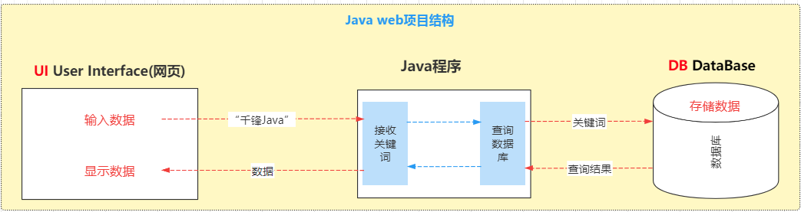
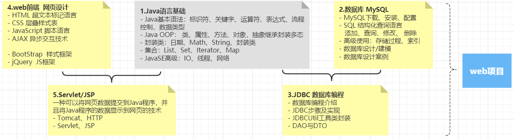

## 一、Java web是什么？

#### 1.1 Java web概念

> `Java web`指的是使用Java语言进行web互联网领域项目开发的技术栈——进行web项目开发所需的技术的集合：
>
> - web前端——在浏览器中用户可以看到的网页
> - web后端——为前端提供数据的程序

#### 1.2 Web项目

> Java语言是可以进行多种类型的项目的开发
>
> - Java ME  嵌入式应用程序 （功能手机系统内置应用——俄罗斯方块、贪吃蛇）
> - Java SE   窗体应用程序（下载---安装---双击打开）
> - Android SDK 移动应用开发
> - HarmonyOS SDK 移动应用开发
> - Java EE  企业级项目开发（web项目）

**web项目 - 使用浏览器访问的软件系统**

## 二、Java web学什么？

#### 2.1 web项目的结构-

#### 2.2 Java web技术体系

**1.Java语言基础**

- Java基本语法：标识符、关键字、运算符、表达式、流程控制、数据类型

- Java OOP： 类、属性、方法、对象，抽象继承封装多态

- 封装类：日期、Math、String、封装类

- 集合：List、Set、Iterator、Map

- JavaSE高级：IO、线程、网络

**2.数据库 MySQL**

- MySQL下载、安装、配置

- SQL 结构化查询语言
  - 添加、查询、修改、 删除

- 高级使用：存储过程、索引

- 数据库设计/建模
- 数据库设计案例

**3.数据库编程 JDBC**

- 数据库编程介绍

- JDBC步骤及实现

- JDBCUtil工具类封装

- DAO与DTO

**4.web前端 网页设计**

- HTML 超文本标记语言

- CSS 层叠样式表

- JavaScript 脚本语言

- AJAX 异步交互

- BootStrap 样式框架

- jQuery JS框架

**5.Servlet/JSP**

>  一种可以将网页数据提交到Java程序，并且将Java程序的数据显示到网页的技术

- Tomcat、HTTP

- Servlet、JSP

