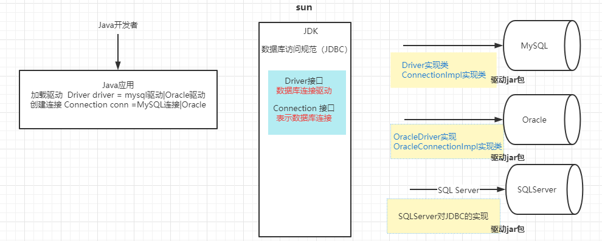
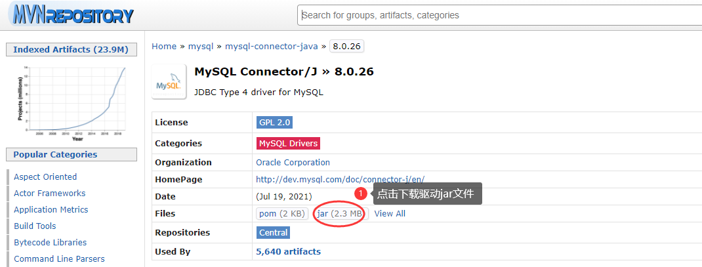
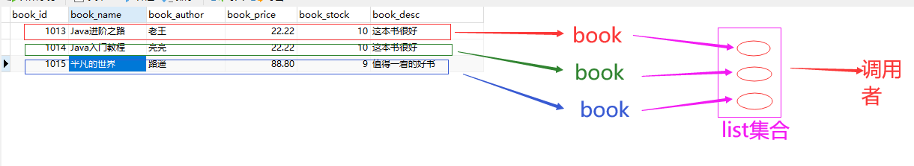
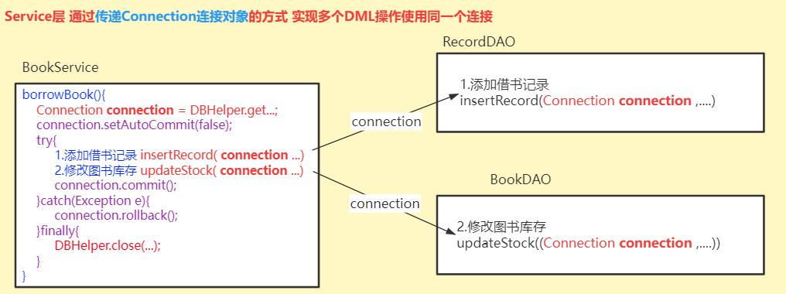
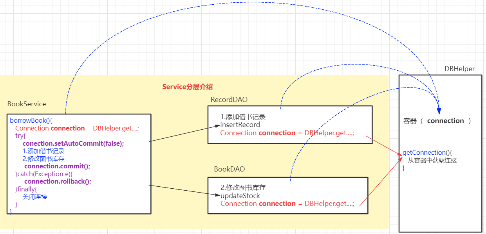
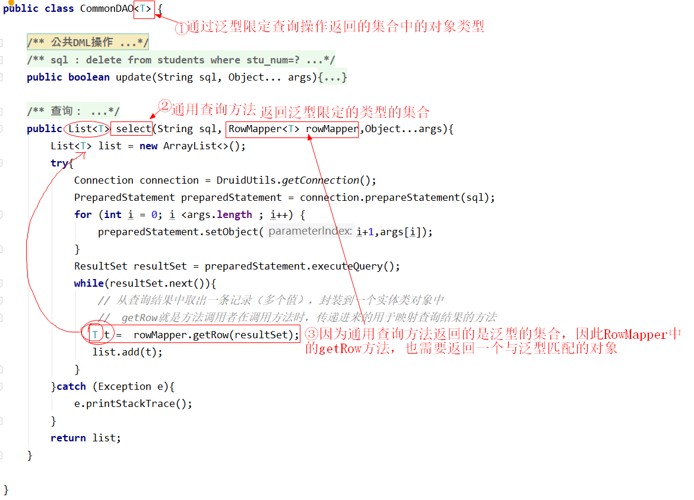

>Course：JDBC 数据库编程

## 一、JDBC介绍

> JDBC (Java DataBase Contectivity) Java与数据库的连接——数据库编程
>
> JDBC 是Java语言（JDK）为完成数据库的访问操作提供的一套统一的标准。



## 二、JDBC步骤


## 三、JDBC入门案例

> JDBC 是用Java代码完成数据访问的规范


#### 3.1 加载驱动

###### 3.1.1 下载驱动jar包

> 对应数据库匹配版本的驱动jar包

- 地址https://mvnrepository.com/

- 搜索`mysql`

  

- 选择版本下载

  MySQL数据库版本为5.x,驱动jar包建议使用`5.1.47`

  MySQL数据库版本为8.x,驱动jar包建议使用`8.0.x`

  

###### 3.1.2 将驱动jar文件添加到Java应用

- 在java应用中创建lib文件夹
- 将下载好的jar文件拷贝—粘贴到lin目录
- 将驱动jar文件设置为java库：选择lib/驱动jar---右键---Add as Library.. ---OK

###### 3.1.3 注册驱动

> 通过反射机制，将驱动jar文件中提供的驱动类载入到JVM中

```java
//1.注册驱动（驱动jar包中的驱动类（Driver）的路径：com.mysql.cj.jdbc.Driver）
Class.forName("com.mysql.cj.jdbc.Driver");
```

#### 3.2 创建连接

```java
//2.创建连接：通过数据库驱动管理器 DriverManager（java.sql.Driver）获取连接
//  JDBC JDK提供的数据库连接的规范 --- java.sql
//  java.sql.Connection接口  一个对象就表示一个数据库连接
//  url 数据库的统一资源定位器（定位数据库连接资源）
//  url参数
//      characterEncoding 设置编码
//      useSSL=true  使用SSL通信
//      useTimezone=true  设置客户端和服务端时区转换
String url = "jdbc:mysql://localhost:3306/db_test3";
Connection connection = DriverManager.getConnection(url,"root","@QFedu123");
```

#### 3.3 编写SQL指令

```java
//3.编写要执行的SQL指令:SQL指令中需要的参数可以通过字符串拼接的形式（会导致SQL注入）
String sql = "insert into books(book_id,book_name,book_author,book_price,book_stock,book_desc) values('"+id+"','"+name+"','"+author+"',"+price+","+stock+",'"+desc+"')";
```

#### 3.4 加载SQL指令

```java
//4.加载SQL指令:获取SQL指令的加载器
//  java.sql.Statement 对象 可以理解为 SQL指令的“加载器”
//  java.sql.PreparedStatement 对象   SQL指令的“预编译加载器”
Statement statement = connection.createStatement();
```

#### 3.5 执行SQL、获取结果

```java
//5.执行SQL获取执行结果
// a. 如果SQL指令为DQL,则  ResultSet rs = statement.executeQuery(sql);  rs中就是查询结果
// b. 如果SQL指令为DML，则  int i = statement.executeUpdate(sql);   i就表示DML操作影响的数据行数

// 如果i>0，表示DML操作是成功的；如果i=0表示DML操作对数据表中的数据没有影响
int i = statement.executeUpdate(sql);  
```

#### 3.6 处理结果

```java
//6.处理结果（业务）
// 添加操作：返回值i>0表示添加成功，否则表示添加失败
// 修改操作：返回值i>0表示修改对数据有影响，如果i=0 表示对数据库没有影响
// 删除操作：返回值i>0表示删除对数据有影响，如果i=0 表示对数据库没有影响
// 查询操作：从ResultSet rs中取出查询结果，封装到Java对象中
System.out.println(i>0?"添加成功":"添加失败");
```

#### 3.7 关闭连接

```java
//7.关闭连接
// 如果执行DML操作：需要关闭Statement和Connection
// 如果执行DQL操作：需要关闭ResultSet、Statement和Connection
// 关闭之前先判空、由大到大关闭
if(statement != null && !statement.isClosed()){
    statement.close();
}
if(connection !=null && !connection.isClosed()){
    connection.close();
}
```

## 四、JDBC增删查改操作实例

> 使用JDBC完成数据库的CRUD访问

#### 4.1 insert操作

```java
/**
 * @Author Java涛哥  @ 千锋教育
 * @千锋Java微信公众号 Java架构栈
 */
public class TestInsertBook {

    public static void main(String[] args) throws ClassNotFoundException, SQLException {

        String name = "Java进阶之路";
        String author = "老王";
        double price = 22.22;
        int stock = 10;
        String desc = "这本书很好";

        //1.注册驱动（驱动jar包中的驱动类（Driver）的路径：com.mysql.cj.jdbc.Driver）
        Class.forName("com.mysql.cj.jdbc.Driver");

        //2.创建连接：通过数据库驱动管理器 DriverManager（java.sql.Driver）获取连接
        String url = "jdbc:mysql://localhost:3306/db_test3";
        Connection connection = DriverManager.getConnection(url,"root","@QFedu123");

        //3.编写要执行的SQL指令
        String sql = "insert into books(book_name,book_author,book_price,book_stock,book_desc) values('"+name+"','"+author+"',"+price+","+stock+",'"+desc+"')";

        //4.加载SQL指令:获取SQL指令的加载器
        Statement statement = connection.createStatement();

        //5.执行SQL获取执行结果
        int i = statement.executeUpdate(sql);  
        
        //6.处理结果（业务）
        System.out.println(i>0?"添加成功":"添加失败");

        //7.关闭连接
        if(statement != null && !statement.isClosed()){
            statement.close();
        }
        if(connection !=null && !connection.isClosed()){
            connection.close();
        }

    }

}
```

#### 4.2 delete操作

```java
/**
 * @Author Java涛哥  @ 千锋教育
 * @千锋Java微信公众号 Java架构栈
 */
public class TestDeleteBook {

    public static void main(String[] args) throws ClassNotFoundException, SQLException {
        int bid = 1012;
        //使用JDBC，根据图书编号删除图书信息
        //1.注册驱动
        Class.forName("com.mysql.cj.jdbc.Driver");
        //2.创建连接
        String url = "jdbc:mysql://localhost:3306/db_test3?characterEncoding=utf8";
        Connection connection = DriverManager.getConnection(url, "root", "@QFedu123");
        //3.编写SQL
        String sql = "delete from books where book_id="+bid;
        //4.获取SQL加载器
        Statement statement = connection.createStatement();
        //5.执行SQL
        int i = statement.executeUpdate(sql);
        //6.处理结果
        System.out.println(i>0?"删除成功":"删除失败");
        //7.关闭连接
        if(statement!=null && !statement.isClosed()){
            statement.close();
        }
        if(connection!=null && !connection.isClosed()){
            connection.close();
        }
    }

}
```

#### 4.3 update操作

```java
package com.qfedu.jdbc.les1;

import java.sql.Connection;
import java.sql.DriverManager;
import java.sql.SQLException;
import java.sql.Statement;

/**
 * @Author Java涛哥  @ 千锋教育
 * @千锋Java微信公众号 Java架构栈
 */
public class TestUpdateBook {

    public static void main(String[] args) throws ClassNotFoundException, SQLException {
        // 根据数据记录的主键 修改其他的字段
        // 根据图书ID，修改图书名称、作者、价格、库存、描述
        int id = 1011;
        String name = "Java进阶之路";
        String author = "亮亮";
        double price = 36.80;
        int stock = 8;
        String desc = "这本书非常好";

        Class.forName("com.mysql.cj.jdbc.Driver");
        String url = "jdbc:mysql://localhost:3306/db_test3?characterEncoding=utf8";
        Connection connection = DriverManager.getConnection(url, "root", "@QFedu123");
        String sql = "update books set book_name='"+name+"',book_author='"+author+"',book_price="+price+",book_stock="+stock
                +",book_desc='"+desc+"' where book_id="+id;
        Statement statement = connection.createStatement();
        int i = statement.executeUpdate(sql);
        System.out.println(i>0?"修改成功":"修改失败");
        if(statement!=null && !statement.isClosed()){
            statement.close();
        }
        if(connection!=null && !connection.isClosed()){
            connection.close();
        }
    }
}
```

#### 4.4 select操作（一条结果）

| 结果集处理                                                   |
| ------------------------------------------------------------ |
|  |

```java
package com.qfedu.jdbc.les1;

import java.sql.*;

/**
 * @Author Java涛哥  @ 千锋教育
 * @千锋Java微信公众号 Java架构栈
 */
public class TestSelectBook {

    public static void main(String[] args) throws ClassNotFoundException, SQLException {
        //根据图书ID，查询一本图书信息
        int bid = 1011;
        Class.forName("com.mysql.cj.jdbc.Driver");
        String url = "jdbc:mysql://localhost:3306/db_test3?characterEncoding=utf8";
        Connection connection = DriverManager.getConnection(url, "root", "@QFedu123");
        String sql = "select book_id,book_name,book_author,book_price,book_stock,book_desc from books where book_id="+bid;
        Statement statement = connection.createStatement();
        //通过executeQuery方法执行查询语句，并且将查询的结果存放到一个ResultSet对象中（结果集）
        ResultSet rs = statement.executeQuery(sql);
        //处理结果：从rs中获取查询结果
        if(rs.next()){
            int bookId = rs.getInt("book_id");
            String bookName = rs.getString("book_name");
            String bookAuthor = rs.getString("book_author");
            double bookPrice = rs.getDouble("book_price");
            int bookStock = rs.getInt("book_stock");
            String bookDesc = rs.getString("book_desc");
            System.out.println(bookId+"\t"+bookName+"\t"+bookAuthor+"\t"+bookPrice+"\t"+bookStock+"\t"+bookDesc);
        }
        //关闭连接  结果集也需要关闭
        if(rs!=null && !rs.isClosed()){
            rs.close();
        }
        if(statement!=null && !statement.isClosed()){
            statement.close();
        }
        if(connection!=null && !connection.isClosed()){
            connection.close();
        }

    }
}
```

#### 4.5 select操作（多条结果）

```java
package com.qfedu.jdbc.les1;

import java.sql.*;

/**
 * @Author Java涛哥  @ 千锋教育
 * @千锋Java微信公众号 Java架构栈
 */
public class TestSelectBooks {

    public static void main(String[] args) throws ClassNotFoundException, SQLException {

        //查询所有图书信息
        Class.forName("com.mysql.cj.jdbc.Driver");
        String url = "jdbc:mysql://localhost:3306/db_test3?characterEncoding=utf8";
        Connection connection = DriverManager.getConnection(url, "root", "@QFedu123");
        String sql = "select book_id,book_name,book_author,book_price,book_stock,book_desc from books";
        Statement statement = connection.createStatement();
        ResultSet rs = statement.executeQuery(sql);
        while(rs.next()){
            int bookId = rs.getInt("book_id");
            String bookName = rs.getString("book_name");
            String bookAuthor = rs.getString("book_author");
            double bookPrice = rs.getDouble("book_price");
            int bookStock = rs.getInt("book_stock");
            String bookDesc = rs.getString("book_desc");
            System.out.println(bookId+"\t"+bookName+"\t"+bookAuthor+"\t"+bookPrice+"\t"+bookStock+"\t"+bookDesc);
        }
        if(rs!=null && !rs.isClosed()){
            rs.close();
        }
        if(statement!=null && !statement.isClosed()){
            statement.close();
        }
        if(connection!=null && !connection.isClosed()){
            connection.close();
        }
    }
}
```

## 五、JDBC的核心类与接口

> java.sql.DriverManager类  驱动管理器
>
> java.sql.Connection接口 数据库连接
>
> java.sql.Statement接口 SQL指令的“加载/执行器”
>
> java.sql.ResultSet接口   结果集

#### 5.1 DriverManager类

> - 注册驱动
> - 创建数据库连接

- 注册驱动

  ```java
  // 在Driver类中的静态初始化块中，注册驱动：DriverManager.registerDriver(new Driver());
  Class.forName("com.mysql.cj.jdbc.Driver");
  
  // 在我们的应用程序中手动注册驱动的代码也可以省略 【Class.forName("com.mysql.cj.jdbc.Driver");】
  // 如果我们没有手动注册驱动，驱动管理器在获取连接的时候发现没有注册驱动则读取 驱动jar/META-INF/servicesjava.sql.Driver文件中配置的驱动类路径进行注册
  ```

- 获取连接

  ```java
  // url  数据库服务器的地址
  // username  数据库连接用户名
  // password  数据库连接密码
  Connection connection = DriverManager.getConnection(url, "root", "@QFedu123");
  ```

#### 5.2 Connection接口

> Connection对象表示Java应用程序与数据库之间的连接
>
> - 通过Connection接口对象，获取执行SQL语句的Statement对象
> - 完成数据的事务管理

###### 5.2.1 获取Statement对象

- Statement接口: 编译执行静态SQL指令

  ```java
  Statement statement = connection.createStatement();
  ```

- PreparedStatement接口：继承了Statement接口，预编译动态SQL指令（解决SQL注入问题）

  ```java
  PreparedStatement preparedStatement = connection.prepareStatement(sql);
  ```

- CallableStatement接口：继承了PreparedStatement接口，可以调用存储过程

  ```java
   CallableStatement callableStatement = connection.prepareCall(sql);
  ```

###### 5.2.2 事务管理

```java
//开启事务（关闭事务自动提交）
connection.setAutoCommit(false);

//事务回滚
connection.rollback();

//提交事务
connection.commit();
```

#### 5.3 Statement接口

> 用于编译、执行SQL指令的


```java
// 执行DML操作的SQL指令
int i = statement.executeUpdate(sql);

// 执行DQL操作的SQL指令
ResultSet rs = statement.executeQuery(sql);
```

#### 5.4 ResultSet接口

> ResultSet接口对象，表示查询操作返回的结果集，提供了便利的方法用于获取结果集中的数据

- 判断结果集中是否还有数据未取出

  ```java
  ResultSet rs = statement.executeQuery(select_statement);
  
  // 判断rs中是否还有数据
  rs.next();
  ```

- 获取rs指向的结果集中某行的数据

  ```java
  int id = rs.getInt(String columnLable);  //获取rs指向的行的  列 数据（字段名）
  int id = rs.getInt(int columnIndex);
  
  rs.getString(""); //获取String类型数据
  rs.getDouble(""); //获取Double类型数据
  ....
  rs.getDate(""); //获取日期类型数据
  ```

  

## 六、SQL注入问题

#### 6.1 什么是SQL注入问题？

> 在JDBC操作SQL指令编写过程中，如果SQL指令中需要数据，我们可以通过字符串拼接的形式将参数拼接到SQL指令中，如`String sql = "delete from books where book_id="+s;`(s就是拼接到SQL中的变量)
>
> 使用字符串拼接变量的形式来设置SQL语句中的数据，可能会导致`因变量值的改变引起SQL指令的原意发生改变`，这就被称为SQL注入。SQL注入问题是需要避免的。
>
> 例如：
>
> - 如果s的值为`1`，SQL指令 ： delete from books where book_id=1
> - 如果s的值为`1 or 1=1`，SQL指令：delete from books where book_id=1 or 1=1

#### 6.2 如何解决SQL注入问题？ 

> 使用PreparedStatement进行SQL预编译解决SQL注入问题：
>
> - 在编写SQL指令时，如果SQL指令中需要参数，一律使用`?`参数占位符
> - 如果SQL指令中有`?`，在JDBC操作步骤中不再使用Statement，而是从Conection对象获取PreparedStatement对SQL指令进行预编译 `PreparedStatement preparedStatement = connection.prepareStatement(sql);`
> - 预编译完成之后，通过PreparedStatement对象给预编译后的SQL指令的`?`复制
>   - prepareadStatement.setInt(参数占位符序号,值);
>   - prepareadStatement.setString(参数占位符序号,值);
>
> - SQL指令中的所有`?`完成赋值之后，通过PreparedStatement执行SQL**执行SQL时不再加载SQL**
>   - int i = prepareadStatement.executeUpdate();
>   - ResultSet rs = preparedStatement.executeQuery();

#### 6.3 使用PreparedStatement预编译案例

- 删除操作

```java
package com.qfedu.jdbc.les1;

import com.mysql.cj.jdbc.Driver;

import java.sql.*;
import java.util.Scanner;

/**
 * @Author Java涛哥  @ 千锋教育
 * @千锋Java微信公众号 Java架构栈
 */
public class TestDeleteBook {

    public static void main(String[] args) throws ClassNotFoundException, SQLException {
        Scanner scanner = new Scanner(System.in);
        System.out.println("请输入你要删除的图书的ID：");
        String s = scanner.nextLine();
        int bid = Integer.parseInt(s);

        //1.注册驱动
        Class.forName("com.mysql.cj.jdbc.Driver");
        //2.创建连接
        String url = "jdbc:mysql://localhost:3306/db_test3?characterEncoding=utf8";
        Connection connection = DriverManager.getConnection(url, "root", "@QFedu123");
        //3.编写SQL:SQL指令中的参数使用?表示
        String sql = "delete from books where book_id=?";
        //4.如果SQL指令有参数占位符?,则从Connection获取PreparedStatement预编译SQL指令
        //  预编译：在SQL指令中的参数赋值之前对SQL执行的语法结构进行编译
        PreparedStatement preparedStatement = connection.prepareStatement(sql);
        //  SQL指令预编译之后，给SQL中的?赋值
        preparedStatement.setInt(1,bid);
        //5.执行SQL
        int i = preparedStatement.executeUpdate();
        //6.处理结果
        System.out.println(i>0?"删除成功":"删除失败");
        //7.关闭连接
        if(preparedStatement!=null && !preparedStatement.isClosed()){
            preparedStatement.close();
        }
        if(connection!=null && !connection.isClosed()){
            connection.close();
        }
    }

}
```

- 修改操作

```java
package com.qfedu.jdbc.les1;

import java.sql.*;

/**
 * @Author Java涛哥  @ 千锋教育
 * @千锋Java微信公众号 Java架构栈
 */
public class TestInsertBook {

    public static void main(String[] args) throws ClassNotFoundException, SQLException {

        String name = "Java进阶之路";
        String author = "老王";
        double price = 22.22;
        int stock = 10;
        String desc = "这本书很好";


        //1.注册驱动
        Class.forName("com.mysql.cj.jdbc.Driver");

        //2.创建连接
        String url = "jdbc:mysql://localhost:3306/db_test3";
        Connection connection = DriverManager.getConnection(url,"root","@QFedu123");

        //3.编写要执行的SQL指令:SQL指令中所需的参数一律使用?
        String sql = "insert into books(book_name,book_author,book_price,book_stock,book_desc) values(?,?,?,?,?)";

        //4.SQL中有? 使用PreparedStatement预编译SQL
        PreparedStatement preparedStatement = connection.prepareStatement(sql);
        
        // 给SQL指令中的?复制
        preparedStatement.setString(1,name);
        preparedStatement.setString(2,author);
        preparedStatement.setDouble(3,price);
        preparedStatement.setInt(4,stock);
        preparedStatement.setString(5,desc);

        //5.执行SQL获取执行结果
        int i = preparedStatement.executeUpdate(); 

        //6.处理结果（业务）
        System.out.println(i>0?"添加成功":"添加失败");

        //7.关闭连接
        if(preparedStatement != null && !preparedStatement.isClosed()){
            preparedStatement.close();
        }
        if(connection !=null && !connection.isClosed()){
            connection.close();
        }

    }

}
```

- 练习1：修改操作

```java
package com.qfedu.jdbc.les1;

import java.sql.*;

/**
 * @Author Java涛哥  @ 千锋教育
 * @千锋Java微信公众号 Java架构栈
 */
public class TestUpdateBook {

    public static void main(String[] args) throws ClassNotFoundException, SQLException {
        // 根据数据记录的主键 修改其他的字段
        // 根据图书ID，修改图书名称、作者、价格、库存、描述
        int id = 1011;
        String name = "Java进阶之路";
        String author = "亮亮";
        double price = 36.80;
        int stock = 8;
        String desc = "这本书非常好";

        Class.forName("com.mysql.cj.jdbc.Driver");
        String url = "jdbc:mysql://localhost:3306/db_test3?characterEncoding=utf8";
        Connection connection = DriverManager.getConnection(url, "root", "@QFedu123");
        //1.
        String sql = "update books set book_name=?,book_author=?,book_price=?,book_stock=?,book_desc=? where book_id=?";
        //2.
        PreparedStatement preparedStatement = connection.prepareStatement(sql);
        //3.
        preparedStatement.setString(1,name);
        preparedStatement.setString(2,author);
        preparedStatement.setDouble(3,price);
        preparedStatement.setInt(4,stock);
        preparedStatement.setString(5,desc);
        //4.
        int i = preparedStatement.executeUpdate();
        System.out.println(i>0?"修改成功":"修改失败");
        //5.
        if(preparedStatement!=null && !preparedStatement.isClosed()){
            preparedStatement.close();
        }
        if(connection!=null && !connection.isClosed()){
            connection.close();
        }
    }
}
```

- 练习2：根据ID查询图书信息

```sql
package com.qfedu.jdbc.les1;

import java.sql.*;

/**
 * @Author Java涛哥  @ 千锋教育
 * @千锋Java微信公众号 Java架构栈
 */
public class TestSelectBook {

    public static void main(String[] args) throws ClassNotFoundException, SQLException {
        //根据图书ID，查询一本图书信息
        int bid = 1013;
        Class.forName("com.mysql.cj.jdbc.Driver");
        String url = "jdbc:mysql://localhost:3306/db_test3?characterEncoding=utf8";
        Connection connection = DriverManager.getConnection(url, "root", "@QFedu123");
        String sql = "select book_id,book_name,book_author,book_price,book_stock,book_desc from books where book_id=?";
        PreparedStatement preparedStatement = connection.prepareStatement(sql);
        preparedStatement.setInt(1,bid);
        //通过executeQuery方法执行查询语句，并且将查询的结果存放到一个ResultSet对象中（结果集）
        ResultSet rs = preparedStatement.executeQuery();
        //处理结果：从rs中获取查询结果
        if(rs.next()){
            int bookId = rs.getInt("book_id");
            String bookName = rs.getString("book_name");
            String bookAuthor = rs.getString("book_author");
            double bookPrice = rs.getDouble("book_price");
            int bookStock = rs.getInt("book_stock");
            String bookDesc = rs.getString("book_desc");
            System.out.println(bookId+"\t"+bookName+"\t"+bookAuthor+"\t"+bookPrice+"\t"+bookStock+"\t"+bookDesc);
        }
        //关闭连接  结果集也需要关闭
        if(rs!=null && !rs.isClosed()){
            rs.close();
        }
        if(preparedStatement!=null && !preparedStatement.isClosed()){
            preparedStatement.close();
        }
        if(connection!=null && !connection.isClosed()){
            connection.close();
        }

    }
}
```

**`备注`** 如果SQL指令中需要参数，则使用PreparedStatement进行SQL预编译，如果SQL指令中没有参数建议使用Statement（Statement执行效率要高于PreparedStatement）。


## 七、工具类封装

#### 7.1 代码的复用性

在我们的应用程序中，如果需要完成相同的操作，相同的代码无需重复编写，我们只需一次编写多次调用即可！

> JDBC数据库编程是由一个固定的步骤：
>
> 1. 注册驱动
> 2. 创建连接
> 3. 编写SQL
> 4. 获取Statement对象
> 5. 执行SQL
> 6. 处理结果
> 7. 关闭连接

#### 7.2 工具类封装

> DBManager
>
> DBUtil
>
> JDBCUtil
>
> DBHelper

```java
package com.qfedu.jdbc.utils;

import java.sql.*;

/**
 * @Descript  JDBC数据库连接帮助类
 * @Author 千锋涛哥
 * 公众号： Java架构栈
 */
public class DBHelper {

    /*将创建数据库连接所需的字符串定义为常量，集中管理*/
    private static final String DRIVER = "com.mysql.cj.jdbc.Driver";
    private static final String URL = "jdbc:mysql://localhost:3306/db_test3?characterEncoding=utf8";
    private static final String USERNAME = "root";
    private static final String PASSWORD = "@QFedu123";

    /**
     * 注册驱动只需执行一次，因此我们放在帮助类的静态初始化块中完成
     */
    static{
        try {
            Class.forName(DRIVER);
        } catch (ClassNotFoundException e) {
            System.out.println("-----------注册驱动失败");
        }
    }

    /**
     * 创建数据库连接对象
     */
    public static Connection getConnection(){
        Connection connection = null;
        try {
            connection = DriverManager.getConnection(URL, USERNAME, PASSWORD);
        } catch (SQLException e) {
            System.out.println("-----------创建连接失败");
        }
        return connection;
    }

    /**
     * 关闭连接
     * 多态的应用：使用Statement接口做参数，既可以传递Statement接口对象，
     * 也可以传递PreparedStatement接口对象
     */
    public static void close(Statement statement, Connection connection){
        close(null,statement,connection);
    }

    /**
     * 关闭连接
     */
    public static void close(ResultSet resultSet,Statement statement, Connection connection){
        try {
            if(resultSet!=null && !resultSet.isClosed()){
                resultSet.close();
            }
            if(statement!=null && !statement.isClosed()){
                statement.close();
            }
            if(connection!=null && !connection.isClosed()){
                connection.close();
            }
        }catch (Exception e){
            System.out.println("~~~~~关闭数据库连接失败");
        }
    }

}
```


## 八、DAO与DTO的封装

> DAO  Data Access Object 数据访问对象
>
> DTO Data Transfer Object 数据传输对象（实体类）  用于传输DML操作参数及DQL的查询结果

#### 8.1 CRUD方法的封装

> 面向对象的特征之一——封装
>
> 我们将能够完成某个CRUD操作的代码单独定义成一个方法，当需要完成此CRUD操作时调用这个方法即可;

- insert操作封装
- delete操作封装
- update操作封装

#### 8.2 DTO实体类封装

> 问题：在封装CRUD方法时，对于查询操作而言，需要将查询到的数据库记录返回给调用者，但是一个查询方法只能返回一个值，而一条数据库记录有多个值，如何将一条数据库记录的多个值返回呢？

> 处理：在Java程序中创建一个属性与数据库表匹配的类，通过此类的对象封装查询到的数据，我们把用于传递JDBC增删查改操作的数据的对象称之为`数据传输对象`——DTO(实体类：带有属性，其对象可以存放数据的类)

实体类创建规则：

```
 * 1.类中属性的个数和类型，与对应的数据表保持一致
 * 2.提供所有属性的get和set方法：Alt+Insert --- Getter And Setter --- 选择所有属性 --- OK
 * 3.提供全参构造器：Alt+Insert --- Constructor --- 选择所有属性 --- OK
 * 4.提供无参构造器：Alt+Insert --- Constructor --- SelectNone
 * 5.重写toString方法：Alt+Insert --- toString --- OK
 * 6.[暂略] 重写hashcode和equals
 * 7.[暂略]实现序列化Serializable接口
```

实体类实例：

```java
package com.qfedu.jdbc.dto;

import java.io.Serializable;

/**
 * @Descript 存放图书信息的类
 * @Author 千锋涛哥
 * 公众号： Java架构栈
 */
public class Book implements Serializable {

    private int bookId;
    private String bookName;
    private String bookAuthor;
    private double bookPrice;
    private int bookStock;
    private String bookDesc;

    @Override
    public String toString() {
        return "Book{" +
                "bookId=" + bookId +
                ", bookName='" + bookName + '\'' +
                ", bookAuthor='" + bookAuthor + '\'' +
                ", bookPrice=" + bookPrice +
                ", bookStock=" + bookStock +
                ", bookDesc='" + bookDesc + '\'' +
                '}';
    }

    public Book() {
    }

    public Book(int bookId, String bookName, String bookAuthor, double bookPrice, int bookStock, String bookDesc) {
        this.bookId = bookId;
        this.bookName = bookName;
        this.bookAuthor = bookAuthor;
        this.bookPrice = bookPrice;
        this.bookStock = bookStock;
        this.bookDesc = bookDesc;
    }

    //get和set方法
}
```

使用实体类封装查询操作返回的结果：

```java
/**
* 根据图书ID查询一条图书记录
*/
public Book queryBook(int bid) throws SQLException{
    Book book = null;
    Connection connection = DBHelper.getConnection();
    String sql = "select book_id,book_name,book_author,book_price,book_stock,book_desc from books where book_id=?";
    PreparedStatement preparedStatement = connection.prepareStatement(sql);
    preparedStatement.setInt(1,bid);
    //通过executeQuery方法执行查询语句，并且将查询的结果存放到一个ResultSet对象中（结果集）
    ResultSet rs = preparedStatement.executeQuery();
    //处理结果：从rs中获取查询结果
    if(rs.next()){
        int id = rs.getInt("book_id");
        String name = rs.getString("book_name");
        String author = rs.getString("book_author");
        double price = rs.getDouble("book_price");
        int stock = rs.getInt("book_stock");
        String desc = rs.getString("book_desc");
        //我们需要将查询到的一条数据库图书记录的6个值返回
        book = new Book(id,name,author,price,stock,desc);
    }
    //关闭连接  结果集也需要关闭
    DBHelper.close(rs,preparedStatement,connection);
    return book;
}
```

#### 8.3 实体类封装查询结果

> 查询的每条结果分别存放到一个DTO对象中，再将多个DTO对象存放到一个List集合中，返回这个List集合



```java
package com.qfedu.jdbc.les1;

import com.qfedu.jdbc.dto.Book;
import com.qfedu.jdbc.utils.DBHelper;

import java.sql.*;
import java.util.ArrayList;
import java.util.List;

/**
 * @Description
 * @Author Java涛哥  @ 千锋教育
 * @千锋Java微信公众号 Java架构栈
 */
public class TestSelectBooks {

    public static void main(String[] args) throws ClassNotFoundException, SQLException {

        List<Book> list = new TestSelectBooks().listBooks();
        for(Book b:list){
            System.out.println(b.getBookName()+"\t"+b.getBookAuthor());
        }
    }

    public List<Book> listBooks() throws SQLException{
        List<Book> bookList = new ArrayList<>();
        //查询所有图书信息
        Connection connection = DBHelper.getConnection();
        String sql = "select book_id,book_name,book_author,book_price,book_stock,book_desc from books";
        Statement statement = connection.createStatement();
        ResultSet rs = statement.executeQuery(sql);
        while(rs.next()){
            int bookId = rs.getInt("book_id");
            String bookName = rs.getString("book_name");
            String bookAuthor = rs.getString("book_author");
            double bookPrice = rs.getDouble("book_price");
            int bookStock = rs.getInt("book_stock");
            String bookDesc = rs.getString("book_desc");
            Book book = new Book(bookId, bookName, bookAuthor, bookPrice, bookStock, bookDesc);
            bookList.add(book);
        }
        DBHelper.close(rs,statement,connection);
        return bookList;
    }

}
```

#### 8.4 实体类传递添加、修改操作参数

> 在JDBC的添加、修改等方法中需要多个数据，我们可以通过实体类来进行参数传递

###### 8.4.1 添加操作

```java
public boolean insertBook(Book book) throws SQLException {
    boolean flag = false;
    //调用工具类，获取数据库连接对象
    Connection connection = DBHelper.getConnection();
    String sql = "insert into books(book_name,book_author,book_price,book_stock,book_desc) values(?,?,?,?,?)";
    PreparedStatement preparedStatement = connection.prepareStatement(sql);
    preparedStatement.setString(1,book.getBookName());
    preparedStatement.setString(2,book.getBookAuthor());
    preparedStatement.setDouble(3,book.getBookPrice());
    preparedStatement.setInt(4,book.getBookStock());
    preparedStatement.setString(5,book.getBookDesc());
    int i = preparedStatement.executeUpdate();  
    flag = i>0;
    //关闭连接
    DBHelper.close(preparedStatement,connection);
    return flag;
}
```

###### 8.4.2 修改操作

```java
 public boolean updateBook(Book book) throws SQLException{
     boolean flag = false;
     Connection connection = DBHelper.getConnection();
     String sql = "update books set book_name=?,book_author=?,book_price=?,book_stock=?,book_desc=? where book_id=?";
     PreparedStatement preparedStatement = connection.prepareStatement(sql);
     preparedStatement.setString(1,book.getBookName());
     preparedStatement.setString(2,book.getBookAuthor());
     preparedStatement.setDouble(3,book.getBookPrice());
     preparedStatement.setInt(4,book.getBookStock());
     preparedStatement.setString(5,book.getBookDesc());
     preparedStatement.setInt(6,book.getBookId());
     int i = preparedStatement.executeUpdate();
     flag = i>0;
     DBHelper.close(preparedStatement,connection);
     return flag;
 }
```

#### 8.5 DAO类封装

> DAO封装：将对数据库中同一张数据表的JDBC操作方法封装到同一个Java类中，这个类就是访问此数据表的`数据访问对象`

```java
import java.util.ArrayList;
import java.util.List;

/**
 * @Descript DAO Data Access Object 数据访问对象
 * @Author 千锋涛哥
 * 公众号： Java架构栈
 */
public class BookDAO {

    public boolean deleteBook(int bid) throws SQLException {
        boolean flag = false;
        //使用JDBC，根据图书编号删除图书信息
        //1.注册驱动 创建连接
        Connection connection = DBHelper.getConnection();
        //3.编写SQL
        String sql = "delete from books where book_id=?";
        //4.如果SQL指令有参数占位符?,则从Connection获取PreparedStatement预编译SQL指令
        //  预编译：在SQL指令中的参数赋值之前对SQL执行的语法结构进行编译
        PreparedStatement preparedStatement = connection.prepareStatement(sql);
        //  SQL指令预编译之后，给SQL中的?赋值
        preparedStatement.setInt(1,bid);
        //5.执行SQL
        int i = preparedStatement.executeUpdate();
        //6.处理结果
        flag = i>0;
        //7.关闭连接
        DBHelper.close(preparedStatement,connection);
        return true;
    }

    /**
     * 添加图书
     * @return 如果添加成功返回true，如果添加失败则返回false
     * @throws SQLException
     */
    public boolean insertBook(Book book) throws SQLException {
        boolean flag = false;
        //调用工具类，获取数据库连接对象
        Connection connection = DBHelper.getConnection();
        String sql = "insert into books(book_name,book_author,book_price,book_stock,book_desc) values(?,?,?,?,?)";
        PreparedStatement preparedStatement = connection.prepareStatement(sql);
        preparedStatement.setString(1,book.getBookName());
        preparedStatement.setString(2,book.getBookAuthor());
        preparedStatement.setDouble(3,book.getBookPrice());
        preparedStatement.setInt(4,book.getBookStock());
        preparedStatement.setString(5,book.getBookDesc());
        int i = preparedStatement.executeUpdate();  // 如果i>0，表示DML操作是成功的；如果i=0表示DML操作对数据表中的数据没有影响
        flag = i>0;
        //关闭连接
        DBHelper.close(preparedStatement,connection);
        return flag;
    }

    /**
     * 根据图书ID查询一条图书记录
     */
    public Book queryBook(int bid) throws SQLException{
        Book book = null;
        Connection connection = DBHelper.getConnection();
        String sql = "select book_id,book_name,book_author,book_price,book_stock,book_desc from books where book_id=?";
        PreparedStatement preparedStatement = connection.prepareStatement(sql);
        preparedStatement.setInt(1,bid);
        //通过executeQuery方法执行查询语句，并且将查询的结果存放到一个ResultSet对象中（结果集）
        ResultSet rs = preparedStatement.executeQuery();
        //处理结果：从rs中获取查询结果
        if(rs.next()){
            int id = rs.getInt("book_id");
            String name = rs.getString("book_name");
            String author = rs.getString("book_author");
            double price = rs.getDouble("book_price");
            int stock = rs.getInt("book_stock");
            String desc = rs.getString("book_desc");
            //我们需要将查询到的一条数据库图书记录的6个值返回
            book = new Book(id,name,author,price,stock,desc);
        }
        //关闭连接  结果集也需要关闭
        DBHelper.close(rs,preparedStatement,connection);
        return book;
    }

    public List<Book> listBooks() throws SQLException{
        List<Book> bookList = new ArrayList<>();
        //查询所有图书信息
        Connection connection = DBHelper.getConnection();
        String sql = "select book_id,book_name,book_author,book_price,book_stock,book_desc from books";
        Statement statement = connection.createStatement();
        ResultSet rs = statement.executeQuery(sql);
        while(rs.next()){
            int bookId = rs.getInt("book_id");
            String bookName = rs.getString("book_name");
            String bookAuthor = rs.getString("book_author");
            double bookPrice = rs.getDouble("book_price");
            int bookStock = rs.getInt("book_stock");
            String bookDesc = rs.getString("book_desc");
            Book book = new Book(bookId, bookName, bookAuthor, bookPrice, bookStock, bookDesc);
            bookList.add(book);
        }
        DBHelper.close(rs,statement,connection);
        return bookList;
    }

    public boolean updateBook(Book book) throws SQLException{
        boolean flag = false;
        Connection connection = DBHelper.getConnection();
        String sql = "update books set book_name=?,book_author=?,book_price=?,book_stock=?,book_desc=? where book_id=?";
        PreparedStatement preparedStatement = connection.prepareStatement(sql);
        preparedStatement.setString(1,book.getBookName());
        preparedStatement.setString(2,book.getBookAuthor());
        preparedStatement.setDouble(3,book.getBookPrice());
        preparedStatement.setInt(4,book.getBookStock());
        preparedStatement.setString(5,book.getBookDesc());
        preparedStatement.setInt(6,book.getBookId());
        int i = preparedStatement.executeUpdate();
        flag = i>0;
        DBHelper.close(preparedStatement,connection);
        return flag;
    }

}
```

#### 8.6 DAO类代码优化

> 1.在应用程序开发中，如果方法中抛出异常且自己可以处理，则直接通过try/catch进行捕获处理；
>
> 2.JDBC操作方法的连接需要放在finally中进行关闭；
>
> 3.将数据库连接Connection、Statement、ResultSet等需要关闭的数据库对象定义在try之前;
>
> 4.因为所有的JDBC操作都需要Conection、Statement对象，查询方法都需要ResultSet对象，因此在DAO中可以将这些对象定义成类的成员变量

```java
package com.qfedu.jdbc.dao;

import com.qfedu.jdbc.dto.Book;
import com.qfedu.jdbc.utils.DBHelper;

import java.sql.*;
import java.util.ArrayList;
import java.util.List;

/**
 * @Descript DAO Data Access Object 数据访问对象
 * @Author 千锋涛哥
 * 公众号： Java架构栈
 */
public class BookDAO {

    private Connection connection;
    private Statement statement;
    private PreparedStatement preparedStatement;
    private ResultSet rs;

    public boolean deleteBook(int bid) {
        boolean flag = false;
        try{
            connection = DBHelper.getConnection();
            String sql = "delete from books where book_id=?";
            preparedStatement = connection.prepareStatement(sql);
            preparedStatement.setInt(1,bid);
            int i = preparedStatement.executeUpdate();
            flag = i>0;
        }catch(SQLException e){
            e.printStackTrace();
        }finally {
            DBHelper.close(preparedStatement,connection);
        }
        return flag;
    }

    public boolean insertBook(Book book) {
        boolean flag = false;
        try{
            //调用工具类，获取数据库连接对象
            connection = DBHelper.getConnection();
            String sql = "insert into books(book_name,book_author,book_price,book_stock,book_desc) values(?,?,?,?,?)";
            preparedStatement = connection.prepareStatement(sql);
            preparedStatement.setString(1,book.getBookName());
            preparedStatement.setString(2,book.getBookAuthor());
            preparedStatement.setDouble(3,book.getBookPrice());
            preparedStatement.setInt(4,book.getBookStock());
            preparedStatement.setString(5,book.getBookDesc());
            int i = preparedStatement.executeUpdate();  // 如果i>0，表示DML操作是成功的；如果i=0表示DML操作对数据表中的数据没有影响
            flag = i>0;
        }catch (SQLException e){
            e.printStackTrace();
        }finally {
            DBHelper.close(preparedStatement,connection);
        }
        return flag;
    }

    public Book queryBook(int bid) {
        Book book = null;
        try {
            connection = DBHelper.getConnection();
            String sql = "select book_id,book_name,book_author,book_price,book_stock,book_desc from books where book_id=?";
            preparedStatement = connection.prepareStatement(sql);
            preparedStatement.setInt(1, bid);
            //通过executeQuery方法执行查询语句，并且将查询的结果存放到一个ResultSet对象中（结果集）
            rs = preparedStatement.executeQuery();
            //处理结果：从rs中获取查询结果
            if (rs.next()) {
                int id = rs.getInt("book_id");
                String name = rs.getString("book_name");
                String author = rs.getString("book_author");
                double price = rs.getDouble("book_price");
                int stock = rs.getInt("book_stock");
                String desc = rs.getString("book_desc");
                //我们需要将查询到的一条数据库图书记录的6个值返回
                book = new Book(id, name, author, price, stock, desc);
            }
        }catch (SQLException e){
            e.printStackTrace();
        } finally {
            DBHelper.close(rs, preparedStatement, connection);
        }
        return book;
    }

    public List<Book> listBooks(){
        List<Book> bookList = new ArrayList<>();
        try {
            connection = DBHelper.getConnection();
            String sql = "select book_id,book_name,book_author,book_price,book_stock,book_desc from books";
            statement = connection.createStatement();
            rs = statement.executeQuery(sql);
            while (rs.next()) {
                int bookId = rs.getInt("book_id");
                String bookName = rs.getString("book_name");
                String bookAuthor = rs.getString("book_author");
                double bookPrice = rs.getDouble("book_price");
                int bookStock = rs.getInt("book_stock");
                String bookDesc = rs.getString("book_desc");
                Book book = new Book(bookId, bookName, bookAuthor, bookPrice, bookStock, bookDesc);
                bookList.add(book);
            }
        }catch (SQLException e){
            e.printStackTrace();
        }finally {
            DBHelper.close(rs, statement, connection);
        }
        return bookList;
    }

    public boolean updateBook(Book book)  {
        boolean flag = false;
        try {
            connection = DBHelper.getConnection();
            String sql = "update books set book_name=?,book_author=?,book_price=?,book_stock=?,book_desc=? where book_id=?";
            preparedStatement = connection.prepareStatement(sql);
            preparedStatement.setString(1, book.getBookName());
            preparedStatement.setString(2, book.getBookAuthor());
            preparedStatement.setDouble(3, book.getBookPrice());
            preparedStatement.setInt(4, book.getBookStock());
            preparedStatement.setString(5, book.getBookDesc());
            preparedStatement.setInt(6, book.getBookId());
            int i = preparedStatement.executeUpdate();
            flag = i > 0;
        }catch (SQLException e){
            e.printStackTrace();
        } finally {
            DBHelper.close(preparedStatement, connection);
        }
        return flag;
    }

}
```

## 九、JDBC综合案例

> 完成学生信息的CRUD操作

#### 9.1 JDBC数据库编程的流程

- 创建数据库、数据表

  ```sql
  create table students(
  	stu_num char(8) primary key,
  	stu_name varchar(20) not null,
  	stu_gender char(2) not null,
  	stu_age int not null
  );
  ```

- 创建新的Java工程

- 创建JDBC的工具类：DBHelper

- 创建DTO类（用于封装参数及查询结果）

- 创建DAO类（用于完成CRUD操作）

#### 9.2 创建JDBC工具类

- 在Java工程中创建package :`com.qfedu.jdbc.utils`
- 在`com.qfedu.jdbc.utils`包中创建工具类`DBHelper`
- 编写`DBHelper`工具类：
  - 添加驱动jar文件
  - 编写DBHelper代码

#### 9.3 创建DTO类

- 在Java工程中创建package：`com.qfedu.jdbc.dto`

- 在`com.qfedu.jdbc.dto`创建数据表对应的实体类`Student`

- 编写实体类

  ```java
  package com.qfedu.jdbc.dto;
  
  /**
   * @Descript 用于传递学生信息的实体类
   * @Author 千锋涛哥
   * 公众号： Java架构栈
   */
  public class Student {
  
      private String stuNum;
      private String stuName;
      private String stuGender;
      private int stuAge;
  
      @Override
      public String toString() {
          return "Student{" +
                  "stuNum='" + stuNum + '\'' +
                  ", stuName='" + stuName + '\'' +
                  ", stuGender='" + stuGender + '\'' +
                  ", stuAge=" + stuAge +
                  '}';
      }
  
      public Student() {
      }
  
      public Student(String stuNum, String stuName, String stuGender, int stuAge) {
          this.stuNum = stuNum;
          this.stuName = stuName;
          this.stuGender = stuGender;
          this.stuAge = stuAge;
      }
      //get  set
  }
  ```

#### 9.4 创建DAO类

> 创建DAO类，完成JDBC操作

- 在Java项目中创建package:`com.qfedu.jdbc.dao`
- 在`com.qfedu.jdbc.dao`包中创建类`StudentDAO`

```java
package com.qfedu.jdbc.dao;

import com.qfedu.jdbc.dto.Student;
import com.qfedu.jdbc.utils.DBHelper;

import java.sql.*;
import java.util.ArrayList;
import java.util.List;

/**
 * @Descript students表的数据访问类
 * @Author 千锋涛哥
 * 公众号： Java架构栈
 */
public class StudentDAO {

    private Connection connection;
    private Statement statement;
    private PreparedStatement preparedStatement;
    private ResultSet resultSet;

    //1、添加学生信息
    public boolean insert(Student student){
        boolean flag = false;
        try {
            connection = DBHelper.getConnectin();
            String sql = "insert into students(stu_num,stu_name,stu_gender,stu_age) values(?,?,?,?)";
            preparedStatement = connection.prepareStatement(sql);
            preparedStatement.setString(1,student.getStuNum());
            preparedStatement.setString(2,student.getStuName());
            preparedStatement.setString(3,student.getStuGender());
            preparedStatement.setInt(4,student.getStuAge());
            int i = preparedStatement.executeUpdate();
            flag = i>0;
        }catch (SQLException e){
            e.printStackTrace();
        }finally {
            DBHelper.close(preparedStatement,connection);
        }
        return flag;
    }


    //2、根据学号查询一个学生记录
    public Student queryStudent(String snum){
        Student student = null;
        try{
            connection = DBHelper.getConnectin();
            String sql = "select stu_num,stu_name,stu_gender,stu_age from students where stu_num=?";
            preparedStatement = connection.prepareStatement(sql);
            preparedStatement.setString(1,snum);
            resultSet = preparedStatement.executeQuery();
            if(resultSet.next()){
                String stuNum = resultSet.getString("stu_num");
                String stuName = resultSet.getString("stu_name");
                String stuGender = resultSet.getString("stu_gender");
                int stuAge = resultSet.getInt("stu_age");
                student = new Student(stuNum,stuName,stuGender,stuAge);
            }
        }catch (SQLException e){
            e.printStackTrace();
        }finally {
            DBHelper.close(resultSet,preparedStatement,connection);
        }
        return student;
    }


    //3、查询多个学生信息
    public List<Student> listStudents(){
        List<Student> studentList = new ArrayList<>();
        try{
            connection = DBHelper.getConnectin();
            String sql = "select stu_num,stu_name,stu_gender,stu_age from students";
            statement = connection.createStatement();
            resultSet = statement.executeQuery(sql);
            while(resultSet.next()){
                String stuNum = resultSet.getString("stu_num");
                String stuName = resultSet.getString("stu_name");
                String stuGender = resultSet.getString("stu_gender");
                int stuAge = resultSet.getInt("stu_age");
                Student s = new Student(stuNum,stuName,stuGender,stuAge);
                studentList.add(s);
            }
        }catch (SQLException e){
            e.printStackTrace();
        } finally {
            DBHelper.close(resultSet,statement,connection);
        }
        return studentList;
    }

}
```

#### 9.5 测试DAO类中的方法

> 使用junit对DAO中创建的JDBC方法进行单元测试

###### 9.5.1 下载导入junit依赖到项目中

- 下载：https://mvnrepository.com/     （如果使用junit 4.10 + 版本单元测试，需要以下两个jar文件）
  - junit-4.12.jar
  - hamcrest-core-1.3.jar

- 将`junit-4.12.jar`、`hamcrest-core-1.3.jar`拷贝项目的`lib`文件夹
- 选择拷贝到项目中的jar文件---右键---Add as Library

###### 9.5.2 创建单元测试类

> 如果我们需要对某个类中的方法进行单元测试，我们需要创建这个类的测试类
>
> StudentDAO ---------> StudentDAOTest（测试类：类名=被测试类+Test）

```java
package com.qfedu.jdbc.test;

import com.qfedu.jdbc.dao.StudentDAO;
import com.qfedu.jdbc.dto.Student;
import org.junit.Test;

import java.util.List;

import static org.junit.Assert.*;

/**
 * @Descript 此类是StudentDAO的单元测试类
 * @Author 千锋涛哥
 * 公众号： Java架构栈
 */
public class StudentDAOTest {

    //1.在测试类中定义成员变量：创建被测试类的对象
    private StudentDAO studentDAO = new StudentDAO();

    //2创建测试方法 ： 用来测试StudentDAO类中的insertStudent方法
    //a.测试方法名=test+被测试方法名
    //b.测试方法无参数无返回值
    @Test
    public void testInsertStudent(){
        //准备被测试方法所需的参数
        Student stu = new Student("1008","Tom","男",20);
        //调用被测试方法，获取结果
        boolean b = studentDAO.insertStudent(stu);
        //断言返回结果(成立 | 不成立)
        assertTrue(b);
    }

    @Test
    public void testQueryStudent(){
        String snum = "1008";
        Student student = studentDAO.queryStudent(snum);
        assertEquals("Tom2",student.getStuName());
    }

    @Test
    public void testListStudents(){
        List<Student> studentList = studentDAO.listStudents();
        assertEquals(8,studentList.size());
    }
}
```

## 十、JDBC事务管理

> - 什么是事务？
> - 事务的四大特性---ACID
> - 事务的隔离级别
> - MySQL事务管理：
>   - start transaction
>   - rollback
>   - commit

#### 10.1 JDBC实现借书操作

> 1. 向`records`表添加借书记录
> 2. 修改`books`表中的库存

```java
package com.qfedu.jdbc.dao;

import com.qfedu.jdbc.utils.DBHelper;

import java.sql.*;

/**
 * @Descript
 * @Author 千锋涛哥
 * 公众号： Java架构栈
 */
public class BookDAO {

    /**
     * 借书：
     * @param stuNum 借书的学生学号
     * @param bookId 借书的图书编号
     * @param num   借书的数量
     * @return
     */
    public boolean borrowBook2(String stuNum,int bookId,int num){
        boolean flag = false;
        try {

            //1.向`records`表添加借书记录
            Connection connection = DBHelper.getConnectin();
            String sql1 = "insert into records(snum,bid,borrow_num,is_return,borrow_date) values(?,?,?,0,sysdate())";
            PreparedStatement preparedStatement = connection.prepareStatement(sql1);
            preparedStatement.setString(1,stuNum);
            preparedStatement.setInt(2,bookId);
            preparedStatement.setInt(3,num);
            int i = preparedStatement.executeUpdate();

            int k = 10/0;  //造异常：算术异常

            //2.修改`books`表中的库存
            Connection connection2 = DBHelper.getConnectin();
            String sql2 = "update books set book_stock=book_stock-? where book_id=?";
            PreparedStatement preparedStatement2 = connection2.prepareStatement(sql2);
            preparedStatement2.setInt(1,num);
            preparedStatement2.setInt(2,bookId);
            int j = preparedStatement2.executeUpdate();
            flag = i>0 && j>0;
        }catch (Exception e){
            e.printStackTrace();
        }finally {
            // 关闭连接
        }
        return flag;
    }
}

```

分析：

- 借书业务由两个数据库操作完成，这两个操作要么同时成功，要么同时失败，构成一个数据库事务；
- JDBC的DML操作默认是自定提交的，因此当第一个DML操作（添加借书记录）完成后，无论第二个操作（修改库存）是否成功，借书记录都会添加到数据库，而且是永久的
- JDBC中该如何做事务管理呢？

#### 10.2 JDBC事务管理

>1. 一个事务中的多个DML操作需要基于同一个数据库连接；
>2. 创建连接之后，设置事务手动提交（关闭自动提交）；`connection.setAutoCommit(false);`
>3. 当当前事务中的所有DML操作完成之后手动提交；`connection.commit();`
>4. 当事务中的任何一个步骤出现异常，在catch代码块中执行事务回滚。`connection.rollback();`

```java
package com.qfedu.jdbc.dao;

import com.qfedu.jdbc.utils.DBHelper;

import java.sql.*;

/**
 * @Descript
 * @Author 千锋涛哥
 * 公众号： Java架构栈
 */
public class BookDAO {

    /**
     * 借书：
     * @param stuNum 借书的学生学号
     * @param bookId 借书的图书编号
     * @param num   借书的数量
     * @return
     */
    public boolean borrowBook(String stuNum,int bookId,int num){
        boolean flag = false;
        Connection connection = null;
        PreparedStatement preparedStatement1 = null;
        PreparedStatement preparedStatement2 = null;
        try {
            connection = DBHelper.getConnectin();
            //设置使用当前Connection连接操作数据库自动提交关闭
            connection.setAutoCommit(false);

            //1.向`records`表添加借书记录
            String sql1 = "insert into records(snum,bid,borrow_num,is_return,borrow_date) values(?,?,?,0,sysdate())";
            preparedStatement1 = connection.prepareStatement(sql1);
            preparedStatement1.setString(1,stuNum);
            preparedStatement1.setInt(2,bookId);
            preparedStatement1.setInt(3,num);
            int i = preparedStatement1.executeUpdate();

            int k = 10/0;  //造异常：算术异常

            //2.修改`books`表中的库存
            String sql2 = "update books set book_stock=book_stock-? where book_id=?";
            preparedStatement2 = connection.prepareStatement(sql2);
            preparedStatement2.setInt(1,num);
            preparedStatement2.setInt(2,bookId);
            int j = preparedStatement2.executeUpdate();

            // 提交事务
            connection.commit();
            flag = i>0 && j>0;
        }catch (Exception e){
            try {
                //一旦事务执行过程中出现异常，执行回滚
                connection.rollback();
            } catch (SQLException ex) {
                ex.printStackTrace();
            }
        }finally {
            DBHelper.close(preparedStatement1,null);
            DBHelper.close(preparedStatement2,connection);
        }
        return flag;
    }
   
}
```

#### 10.3 Service层的事务管理

> DAO只负责数据库的操作，业务由service层进行管理

###### 10.3.1 Service分层介绍

>- DAO负责特定的数据库操作
>- Servcie进行业务处理，Service业务处理过程如果需要数据库操作，则调用DAO完成


###### 10.3.2 Service分层实现

- 创建`RecordDAO`，完成`insertRecord`方法

```java
package com.qfedu.jdbc.dao;

import com.qfedu.jdbc.utils.DBHelper;

import java.sql.Connection;
import java.sql.PreparedStatement;

/**
 * @Descript 完成对借书记录表的JDBC操作
 * @Author 千锋涛哥
 * 公众号： Java架构栈
 */
public class RecordDAO {

    /**
     *  添加借书记录
     * @param snum 借书的学生的学号
     * @param bid 借书的图书编号
     * @param num 借书的数量
     * @return 添加借书记录成功返回true，失败返回false
     */
    public boolean insertRecord(String snum,int bid,int num){
        boolean flag = false;
        Connection connection = null;
        PreparedStatement preparedStatement1 = null;
        try{
            //1.向`records`表添加借书记录
            connection = DBHelper.getConnectin();
            String sql1 = "insert into records(snum,bid,borrow_num,is_return,borrow_date) values(?,?,?,0,sysdate())";
            preparedStatement1 = connection.prepareStatement(sql1);
            preparedStatement1.setString(1,snum);
            preparedStatement1.setInt(2,bid);
            preparedStatement1.setInt(3,num);
            int i = preparedStatement1.executeUpdate();
            flag = i>0;
        }catch (Exception e){
            e.printStackTrace();
        }finally {
            DBHelper.close(preparedStatement1,connection);
        }
        return flag;
    }

}
```

- 在`BookDAO`中定义`updateStock`修改库存方法

```java
package com.qfedu.jdbc.dao;

import com.qfedu.jdbc.utils.DBHelper;

import java.sql.*;

/**
 * @Descript
 * @Author 千锋涛哥
 * 公众号： Java架构栈
 */
public class BookDAO {
    
    /**
     * 修改库存
     * @param bid 要修改库存的图书编号
     * @param num  book_stock=book_stock-num
     * @return
     */
    public boolean updateStock(int bid,int num){
        boolean flag = false;
        Connection connection = null;
        PreparedStatement preparedStatement2 = null;
        try{
            //2.修改`books`表中的库存
            connection = DBHelper.getConnectin();
            String sql2 = "update books set book_stock=book_stock-? where book_id=?";
            preparedStatement2 = connection.prepareStatement(sql2);
            preparedStatement2.setInt(1,num);
            preparedStatement2.setInt(2,bid);
            int j = preparedStatement2.executeUpdate();
            flag = j>0;
        }catch (SQLException e){
            e.printStackTrace();
        }finally {
            DBHelper.close(preparedStatement2,connection);
        }
        return flag;
    }

}
```

- 创建`BookService`完成借书业务

```java
package com.qfedu.jdbc.service;

import com.qfedu.jdbc.dao.BookDAO;
import com.qfedu.jdbc.dao.RecordDAO;

/**
 * @Descript 图书管理的业务类
 * @Author 千锋涛哥
 * 公众号： Java架构栈
 */
public class BookService {

    private RecordDAO recordDAO = new RecordDAO();
    private BookDAO bookDAO = new BookDAO();

    /**
     * 借书业务，包含两个步骤，这两个步骤要么同时成功，要么同时失败——事务
     */
    public boolean borrowBook(String stuNum,int bookId,int num){
        //1.添加借书记录
        boolean b1 = recordDAO.insertRecord(stuNum, bookId, num);
        //2.修改图书库存
        boolean b2 = bookDAO.updateStock(bookId, num);
        // 结果处理
        boolean r = b1 && b2;
        return r;
    }

}
```

###### 10.3.3 Service层的事务管理

> Servcie层事务中多个数据库的DML操作是相互独立的，如何保证所有DML要么同时成功，要么同时失败呢？
>
> 事务管理要满足以下条件：
>
> - 多个DML操作需使用同一个数据库连接
> - 第一个DML操作之前设置事务手动提交
> - 所有DML操作执行完成之后提交事务
> - 出现异常则进行事务回滚

**如何让Service事务中的多个DML使用同一个数据库连接？**

- `在Service获取连接对象，将连接对象传递到DAO中`

  

  分析：DAO类中的Connection对象需要通过Service传递给进来，这种对象传递本来也无可厚非，但是当我们通过面向接口开发时（面向接口，是为了能够灵活的定义实现类），容易造成接口的冗余（接口污染）

- `使用ThreadLocal容器，实现多个DML操作使用相同的连接`

  

  > 存储Connection的容器可以使用List集合
  >
  > 
  >
  > - 使用List集合做容器，在多线程并发编程中会出现资源竞争问题——多个并发的线程使用的是同一个数据库连接对象（我们的要求是同一个事务中使用同一个连接，而并非多个线程共享连接）
  >
  > - 为了解决并发编程的连接对象共享问题，我们可以使用ThreadLocal作为数据库连接对象的容器

  

  ```java
  package com.qfedu.jdbc.utils;
  
  import java.sql.*;
  import java.util.ArrayList;
  import java.util.List;
  
  /**
   * @Descript
   * @Author 千锋涛哥
   * 公众号： Java架构栈
   */
  public class DBHelper {
      //1.定义数据库连接信息
      private static final String DRIVER = "com.mysql.cj.jdbc.Driver";
      private static final String URL = "jdbc:mysql://localhost:3306/db_test3?characterEncoding=utf8";
      private static final String USERNAME = "root";
      private static final String PASSWORD = "@QFedu123";
  
      //1️⃣定义ThreadLocal容器
      private static final ThreadLocal<Connection> local = new ThreadLocal<>();
  
      //2.静态初始化块注册驱动
      static{
          try {
              Class.forName(DRIVER);
          } catch (ClassNotFoundException e) {
              e.printStackTrace();
          }
      }
  
      //3.创建数据库连接
      public static Connection getConnectin(){
          // 2️⃣从ThreadLocal容器中获取连接
          Connection connection = local.get();
          try {
              if(connection == null){
                  //3️⃣如果容器中没有连接，则创建连接，并将创建的连接存放到容器
                  connection = DriverManager.getConnection(URL,USERNAME,PASSWORD);
                  local.set(connection);
              }
          } catch (SQLException e) {
              e.printStackTrace();
          }
          return connection;
      }
  
      //4. 4️⃣关闭连接
      // 如果使用ThreadLocal存储数据库连接，关闭连接时同时要将Connection对象从ThreadLocal中移除
      public static void closeConnection(){
          // 获取到当前线程使用的数据库连接对象
          Connection connection = local.get();
          try {
              if(connection !=null && !connection.isClosed()){
                  connection.close();
              }
              // 将关闭后的连接对象从ThreadLocal中移除
              local.remove();
          } catch (SQLException e) {
              e.printStackTrace();
          }
      }
  
      public static void closeStatement(Statement statement){
          closeStatement(null,statement);
      }
  
      public static void closeStatement(ResultSet resultSet, Statement statement){
          try {
              if(resultSet!=null && !resultSet.isClosed()){
                  resultSet.close();
              }
              if(statement!=null && !statement.isClosed()){
                  statement.close();
              }
          } catch (SQLException e) {
              e.printStackTrace();
          }
      }
  
  }
  ```

## 十一、数据库连接池

#### 11.1 什么是数据库连接池？

> 如果每个JDBC操作需要数据库连接都重新创建，使用完成之后都销毁，我们的JVM会因为频繁的创建、销毁连接而占用额外的系统资源。
>
> 数据库连接本质上是可被重用的资源（当一个JDBC操作完成之后，其创建的连接是可以被其他JDBC操作使用的），基于这个特性：
>
> - 我们可以创建一个`存放数据库连接的容器`（连接池），连接池是有最大容量的
> - 当我们要进行JDBC操作时，直接从这个容器中获取连接
>   - 如果容器中没有空闲的连接且连接池中连接的个数没有达到最大值，则创建新的数据库连接存入连接池并给这个操作使用，使用完成之后无需关闭连接直接归还这个容器中即可；
>   - 如果容器中没有空闲的连接且连接池中连接的个数达到最大值，当前操作就会进行等待，等待连接池中的某个连接被归还，归还之后再使用；
>   - 如果容器中有空闲连接，则无需创建新的连接，直接从容器中获取这个空闲连接进行使用；

连接池：存放数据库连接对象的容器

连接池作用：对数据库连接进行管理，减少因重复创建、销毁连接导致的系统开销


#### 11.2 常用连接池

> 我们可以编程实现：创建一个数组、集合来存放数据库连接；
>
> 目前市面上已经有多种实现的数据库连接池了，我们无需再手动实现，只需引用对应的数据库连接池产品，即可在我们自己的Java应用中使用连接池（站在巨人的肩上）

| 功能            | dbcp                | druid              | c3p0                               | HikariCP                            |
| --------------- | ------------------- | ------------------ | ---------------------------------- | ----------------------------------- |
| 是否支持PSCache | 是                  | 是                 | 是                                 | 否                                  |
| 监控            | jmx                 | jmx/log/http       | jmx,log                            | jmx                                 |
| 扩展性          | 弱                  | 好                 | 弱                                 | 弱                                  |
| sql拦截及解析   | 无                  | 支持               | 无                                 | 无                                  |
| 代码            | 简单                | 中等               | 复杂                               | 简单                                |
| 特点            | 依赖于common-pool   | 阿里开源，功能全面 | 历史久远，代码逻辑复杂，且不易维护 | 优化力度大，功能简单，起源于boneCP  |
| 连接池管理      | LinkedBlockingDeque | 数组               |                                    | ThreadLocal<br>CopyOnWriteArrayList |

- 基于连接池的性能、使用的便捷性、连接监控等多方面综合情况，druid是目前企业应用中使用最广泛的
- Hikari在SpringBoot中默认集成，性能是诸多竞品中最好的


#### 11.3 使用Druid连接池

###### 11.3.1 创建Java应用

- 创建Java工程
- 添加驱动jar文件

###### 11.3.2 创建连接池属性配置

- 在src中创建package：`com.qfedu.jdbc.utils`

- 在`com.qfedu.jdbc.utils`中创建`druid.properties`文件

- 配置druid连接池的实行

  ```properties
  # 数据库连接信息
  driverClassName=com.mysql.cj.jdbc.Driver
  url=jdbc:mysql://localhost:3306/db_test3?characterEncoding=utf8
  username=root
  password=@QFedu123
  
  # 连接池属性
  # 连接池的初始化连接数<创建数据库连接池时默认初始化的连接的个数>
  initialSize=10
  # 连接池的最大连接数
  maxActive=50
  # 最小空闲连接数（当数据库连接使用率很低时，连接池中的连接会被释放一部分）
  minIdle=5
  # 超时等待时间(单位：ms)
  maxWait=30000

###### 11.3.3 创建连接池工具类

- 下载并导入druid的jar文件`druid-1.2.8.jar`

- 在`com.qfedu.jdbc.utils`创建`DruidUtils`工具类（工具类与属性文件`druid.properties`在同目录下）

  ```java
  package com.qfedu.jdbc.utils;
  
  import com.alibaba.druid.pool.DruidDataSource;
  import com.alibaba.druid.pool.DruidDataSourceFactory;
  
  import java.io.IOException;
  import java.io.InputStream;
  import java.sql.Connection;
  import java.sql.SQLException;
  import java.util.Properties;
  
  /**
   * @Descript Druid数据库连接池工具类
   * @Author 千锋涛哥
   * 公众号： Java架构栈
   */
  public class DruidUtils {
  
      //1.定义DruidDataSource对象：表示Druid数据库连接池（数据源）
      private static DruidDataSource druidDataSource;
  
      //2.静态代码块初始化定义DruidDataSource对象
      static{
          try {
              //读取druid.properties文件中配置的属性
              InputStream is = DruidUtils.class.getResourceAsStream("druid.properties");
              Properties properties = new Properties();
              properties.load(is);
              //使用属性文件初始化DruidDataSource对象
              druidDataSource = 
                  (DruidDataSource) DruidDataSourceFactory.createDataSource(properties);
          } catch (IOException e) {
              e.printStackTrace();
          } catch (Exception e) {
              e.printStackTrace();
          }
      }
  
      //3.创建静态方法，从连接池对象中获取连接
      public static Connection getConnection(){
          Connection connection = null;
          try {
              connection =  druidDataSource.getConnection();
          } catch (SQLException e) {
              e.printStackTrace();
          }
          return connection;
      }
      
  }
  ```


## 十二、通用JDBC操作封装

> 在DAO层的JDBC操作中，对数据的表增、删、改、查操作存在代码的冗余，我们可以对其公共部分进行封装，实现代码的复用。

#### 12.1 DML操作封装

> 对于数据库的DML操作：
>
> - 参数不同
> - SQL通过
> - SQL参数复制不同

- 通用的DML操作方法

```JAVA
package com.qfedu.jdbc.utils;

import java.sql.Connection;
import java.sql.PreparedStatement;

/**
 * @Descript 公共DAO，用于封装公共的JDBC操作
 * @Author 千锋涛哥
 * 公众号： Java架构栈
 */
public class CommonDAO {

    /**
     * 公共DML操作
     * @param sql 执行的SQL指令
     * @return
     */
    /**
     * sql : delete from students where stu_num=?
     * args: snum
     *
     * sql : insert into students(stu_num,stu_name,stu_gender,stu_age) values(?,?,?,?)
     * args: 1009  Lucy  女   18
     */
    public boolean update(String sql, Object... args){
        boolean b = false;
        try{
            Connection connection = DruidUtils.getConnection();
            PreparedStatement preparedStatement = connection.prepareStatement(sql);
            for (int i = 0; i < args.length ; i++) {
                preparedStatement.setObject(i+1,args[i]);
            }
            int i = preparedStatement.executeUpdate();
            b = i>0;
        }catch (Exception e){
            e.printStackTrace();
        }
        return b;
    }

}

```

#### 12.2 DQL操作封装

| 使用泛型设置通用查询方法的返回类型                           |
| ------------------------------------------------------------ |
|  |
|  |

```java
package com.qfedu.jdbc.utils;

import java.sql.ResultSet;
import java.sql.SQLException;

/**
 * @Descript 用于定义结果集映射的接口
 * @Author 千锋涛哥
 * 公众号： Java架构栈
 */
public interface RowMapper<T> {

    public T getRow(ResultSet resultSet) throws SQLException;

}
```

```java
package com.qfedu.jdbc.utils;

import java.sql.Connection;
import java.sql.PreparedStatement;
import java.sql.ResultSet;
import java.util.ArrayList;
import java.util.List;

/**
 * @Descript 公共DAO，用于封装公共的JDBC操作
 * @Author 千锋涛哥
 * 公众号： Java架构栈
 */
public class CommonDAO<T> {

    /**
     * 公共DML操作
     */
    public boolean update(String sql, Object... args){
        boolean b = false;
        try{
            Connection connection = DruidUtils.getConnection();
            PreparedStatement preparedStatement = connection.prepareStatement(sql);
            for (int i = 0; i < args.length ; i++) {
                preparedStatement.setObject(i+1,args[i]);
            }
            int i = preparedStatement.executeUpdate();
            b = i>0;
        }catch (Exception e){
            e.printStackTrace();
        }
        return b;
    }

    /**
     * 查询
     */
    public List<T> select(String sql, RowMapper<T> rowMapper,Object...args){
        List<T> list = new ArrayList<>();
        try{
            Connection connection = DruidUtils.getConnection();
            PreparedStatement preparedStatement = connection.prepareStatement(sql);
            for (int i = 0; i <args.length ; i++) {
                preparedStatement.setObject(i+1,args[i]);
            }
            ResultSet resultSet = preparedStatement.executeQuery();
            while(resultSet.next()){
                // 从查询结果中取出一条记录（多个值），封装到一个实体类对象中
                //  getRow就是方法调用者在调用方法时，传递进来的用于映射查询结果的方法
               T t =  rowMapper.getRow(resultSet);
               list.add(t);
            }
        }catch (Exception e){
            e.printStackTrace();
        }
        return list;
    }

}

```

#### 12.3 基于通用JDBC操作的案例

> 图书信息进行JDBC操作
>
> - 创建图书实体类Book
> - 创建BookDAO

###### 12.3.1 创建实体类

```java
/**
 * @Descript 图书信息实体类
 * @Author 千锋涛哥
 * 公众号： Java架构栈
 */
public class Book {
    
    private int bookId;
    private String bookName;
    private String bookAuthor;
    private double bookPrice;
    private int bookStock;
    private String bookDesc;
    
    //无参构造器
    //全参构造器
    //toString
    //get和set
}
```

###### 12.3.2 创建DAO类

> DAO中的操作都是调用CommonDAO实现的

```java
package com.qfedu.jdbc.dao;

import com.qfedu.jdbc.dto.Book;
import com.qfedu.jdbc.utils.CommonDAO;
import com.qfedu.jdbc.utils.RowMapper;

import java.sql.ResultSet;
import java.sql.SQLException;
import java.util.List;

/**
 * @Descript 对图书信息表进行CRUD操作
 * @Author 千锋涛哥
 * 公众号： Java架构栈
 */
public class BookDAO {

    private CommonDAO<Book> commonDAO = new CommonDAO<>();

    public  boolean insertBook(Book book){
        String sql = "insert into books(book_name,book_author,book_price,book_stock,book_desc) values(?,?,?,?,?)";
        boolean b = commonDAO.update(sql, book.getBookName(), book.getBookAuthor(), book.getBookPrice(), book.getBookStock(), book.getBookDesc());
        return b;
    }

    public boolean deleteBook(int bookId){
        String sql = "delete from books where book_id=?";
        boolean b = commonDAO.update(sql, bookId);
        return b;
    }

    public boolean updateBook(Book book){
        String sql="update books set book_name=?,book_author=?,book_price=?,book_stock=?,book_desc=? where book_id=?";
        boolean b = commonDAO.update(sql, book.getBookName(), book.getBookAuthor(), book.getBookPrice(), book.getBookStock(), book.getBookDesc(), book.getBookId());
        return b;
    }

    public Book queryBook(int bookId){
        String sql = "select book_id,book_name,book_author,book_price,book_stock,book_desc from books where book_id=?";
        RowMapper<Book> bookRowMapper = new RowMapper<Book>(){
            public Book getRow(ResultSet resultSet) throws SQLException {
                int bid = resultSet.getInt("book_id");
                String bookName = resultSet.getString("book_name");
                String bookAuthor = resultSet.getString("book_author");
                double bookPrice = resultSet.getDouble("book_price");
                int bookStock = resultSet.getInt("book_stock");
                String bookDesc = resultSet.getString("book_desc");
                return new Book(bid,bookName,bookAuthor,bookPrice,bookStock,bookDesc);
            }
        };
        List<Book> list = commonDAO.select(sql, bookRowMapper, bookId);
        return list.size()>0?list.get(0):null;
    }

    public List<Book> listBooks(){
        String sql = "select book_id,book_name,book_author,book_price,book_stock,book_desc from books";
        List<Book> list = commonDAO.select(sql, resultSet -> {
            int bid = resultSet.getInt("book_id");
            String bookName = resultSet.getString("book_name");
            String bookAuthor = resultSet.getString("book_author");
            double bookPrice = resultSet.getDouble("book_price");
            int bookStock = resultSet.getInt("book_stock");
            String bookDesc = resultSet.getString("book_desc");
            return new Book(bid, bookName, bookAuthor, bookPrice, bookStock, bookDesc);
        });
        return list;
    }

}
```

## 十三、Apache DBUtils

#### 13.1 DBUtils介绍

> Commons DBUtils是Apache组织提供的一个针对JDBC进行简单封装的开源工具类库，使用DBUtils可以极大简化JDBC应用程序开发，同时不会影响数据库访问的性能。

> DBUtils是Java编程中数据库访问的轻巧、使用的工具类库
>
> - 提供对数据表通用的DML操作
> - 提供对数据表通用的DQL操作（可以把结果封装成对象、集合等类型）

> DBUtils工具类库中的核心类：
>
> - **QueryRunner**，用于执行SQL指令（相当于我们自己封装的CommonDAO类）
>   - update() , 用于执行DML指令
>   - query(), 用于执行DQL指令
>
> - **ResultSetHandler**接口，结果集处理器，用于处理查询结果（相当于我们自己的封装的RowMapper接口）
>   - BeanHandler实现类：当查询语句返回一条结果时，使用BeanHandler将结果转换成一个对象
>   - BeanListHandler实现类：当查询语句返回多个结果时，使用BeanListHandler将结果转换成一个集合
>   - ScalarHandler实现类：当查询结果返回一个值时，使用ScalarHandler将这个值转换成Java变量类型

#### 13.2 DBUtils的使用准备

1. 新建Java工程

2. 添加依赖：

   - `mysql-connector-java-8.0.26.jar`
   - `druid-1.2.8.jar`Apache DBUtils建立数据库连接是依赖连接池数据源的，因此我们需要使用连接池
   -  `commons-dbutils-1.7.jar`

3. 配置druid的属性文件

   创建`com.qfedu.jdbc.utils`包

   在包中创建`druid.properties`文件，配置如下

   ```properties
   # 数据库连接信息
   driverClassName=com.mysql.cj.jdbc.Driver
   url=jdbc:mysql://localhost:3306/db_test3?characterEncoding=utf8
   username=root
   password=@QFedu123
   
   # 连接池属性
   # 连接池的初始化连接数<创建数据库连接池时默认初始化的连接的个数>
   initialSize=10
   # 连接池的最大连接数
   maxActive=50
   # 最小空闲连接数（当数据库连接使用率很低时，连接池中的连接会被释放一部分）
   minIdle=5
   # 超时等待时间(单位：ms)
   maxWait=30000
   ```

4. 创建Druid连接池工具类

   在`com.qfedu.jdbc.utils`包创建`DruidUtils`工具类

   ```java
   package com.qfedu.jdbc.utils;
   
   import com.alibaba.druid.pool.DruidDataSource;
   import com.alibaba.druid.pool.DruidDataSourceFactory;
   
   import javax.sql.DataSource;
   import java.io.IOException;
   import java.io.InputStream;
   import java.sql.Connection;
   import java.sql.SQLException;
   import java.util.Properties;
   
   /**
    * @Descript
    * @Author 千锋涛哥
    * 公众号： Java架构栈
    */
   public class DruidUtils {
   
       private static DruidDataSource druidDataSource;
   
       static{
           try {
               InputStream is = DruidUtils.class.getResourceAsStream("druid.properties");
               Properties properties = new Properties();
               properties.load(is);
               druidDataSource = (DruidDataSource) DruidDataSourceFactory.createDataSource(properties);
           } catch (Exception e) {
               e.printStackTrace();
           }
       }
   
       /**
        * 获取数据库连接池数据源对象
        * @return
        */
       public static DataSource getDataSource(){
           return druidDataSource;
       }
   
       public static Connection getConnection(){
           Connection connection = null;
           try {
               connection = druidDataSource.getConnection();
           } catch (SQLException e) {
               e.printStackTrace();
           }
           return connection;
       }
   
   }
   ```


#### 13.3 DBUtils使用

> 完成图书信息的数据库操作

- 创建实体类

```java
/**
 * @Descript 图书信息实体类
 * @Author 千锋涛哥
 * 公众号： Java架构栈
 */
public class Book {
    
    private int bookId;
    private String bookName;
    private String bookAuthor;
    private double bookPrice;
    private int bookStock;
    private String bookDesc;
    
}
```

###### 13.3.1 添加操作

```java
public int insertBook(Book book){
    int i= 0;
    try {
        //1.编写SQL
        String sql = "insert into books(book_name,book_author,book_price,book_stock,book_desc) values(?,?,?,?,?)";
        //2.准备参数
        Object[] params = {book.getBookName(),book.getBookAuthor(),book.getBookPrice(),book.getBookStock(),book.getBookDesc()};
        //3.调用commons-dbutils中的QueryRunner执行SQL
        QueryRunner queryRunner = new QueryRunner(DruidUtils.getDataSource());
        i = queryRunner.update(sql, params);
    } catch (SQLException e) {
        e.printStackTrace();
    }
    return i;
}
```

###### 13.3.2 删除操作

```java
public int deleteBook(int bookId){
    int i = 0;
    try {
        String sql = "delete from books where book_id=?";
        QueryRunner queryRunner = new QueryRunner(DruidUtils.getDataSource());
        i = queryRunner.update(sql,bookId);
    } catch (SQLException e) {
        e.printStackTrace();
    }
    return i;
}
```

###### 13.3.3 修改操作

```java
public int updateBook(Book book){
    int i=0;
    try {
        String sql = "update books set book_name=?,book_author=?,book_price=?,book_stock=?,book_desc=? where book_id=?";
        Object[] params = {book.getBookName(),book.getBookAuthor(),book.getBookPrice(),book.getBookStock(),book.getBookDesc(),book.getBookId()};
        QueryRunner queryRunner = new QueryRunner(DruidUtils.getDataSource());
        i = queryRunner.update(sql, params);
    } catch (SQLException e) {
        e.printStackTrace();
    }
    return i;
}
```

###### 13.3.4 查询操作

**查询一条记录**

```java
public Book queryBook(int bookId){
    Book book = null;
    try {
        String sql = "select book_id bookId,book_name bookName,book_author bookAuthor,book_price bookPrice,book_stock bookStock,book_desc bookDesc from books where book_id=?";
        QueryRunner queryRunner = new QueryRunner(DruidUtils.getDataSource());
        //1.对于查询操作，我们需要通过QueryRunner对象调用query方法来执行
        //2.所有的query方法都需要一个ResultSetHandler的参数，通过此参数指定query方法的返回类型
        //  如果SQL指令执行之后返回的是一行记录，我们通过BeanHandler指定查询结果封装的实体类类型
        //  要求：查询结果集的字段名必须与指定的实体类的属性名匹配
        //     方案1：创建实体类的时候，实体类中属性的名字与数据表中的列名相同
        //     方案2：查询语句字段取别名，让字段别名与实体类属性名一致
        book = queryRunner.query(sql, new BeanHandler<Book>(Book.class), bookId);
    } catch (SQLException e) {
        e.printStackTrace();
    }
    return book;
}
```

**自定义结果集处理** 自定义ResultSetHandler

```java
public Book queryBook2(int bookId){
    Book book = null;
    try {
        String sql = "select book_id,book_name,book_author,book_price,book_stock,book_desc from books where book_id=?";
        QueryRunner queryRunner = new QueryRunner(DruidUtils.getDataSource());
        //1.对于查询操作，我们需要通过QueryRunner对象调用query方法来执行
        //2.所有的query方法都需要一个ResultSetHandler的参数，通过此参数指定query方法的返回类型
        //  如果SQL指令执行之后返回的是一行记录，我们通过BeanHandler指定查询结果封装的实体类类型
        //  要求：查询结果集的字段名必须与指定的实体类的属性名匹配
        //     方案3：自定义ResultSetHandler结果处理
        ResultSetHandler<Book> resultSetHandler = new ResultSetHandler<Book>() {
            @Override
            public Book handle(ResultSet resultSet) throws SQLException {
                Book book = null;
                if(resultSet.next()) {
                    int id = resultSet.getInt("book_id");
                    String bookName = resultSet.getString("book_name");
                    String bookAuthor = resultSet.getString("book_author");
                    double bookPrice = resultSet.getDouble("book_price");
                    int bookStock = resultSet.getInt("book_stock");
                    String bookDesc = resultSet.getString("book_desc");
                    book = new Book(id,bookName,bookAuthor,bookPrice,bookStock,bookDesc);
                }
                return book;
            }
        };
        book = queryRunner.query(sql, resultSetHandler, bookId);
    } catch (SQLException e) {
        e.printStackTrace();
    }
    return book;
}
```

**查询多条记录**

```java
public List<Book> listBooks(){
    List<Book> bookList = null;
    try {
        String sql = "select  book_id bookId,book_name bookName,book_author bookAuthor,book_price bookPrice,book_stock bookStock,book_desc bookDesc  from books";
        QueryRunner queryRunner = new QueryRunner(DruidUtils.getDataSource());
        //如果SQL指令执行之后返回的是多行记录，我们通过BeanListHandler指定查询结果封装的实体类的集合类型
        bookList = queryRunner.query(sql, new BeanListHandler<Book>(Book.class));
    } catch (SQLException e) {
        e.printStackTrace();
    }
    return bookList;
}
```

**查询一个值**

>例如在做分页的时候，我们需要查询数据的总记录数

```java
public long getCount(){
    long count = 0;
    String sql = "select count(1) from books";
    QueryRunner queryRunner = new QueryRunner(DruidUtils.getDataSource());
    // 如果SQL指令执行之后返回的是一个值时，我们通过ScalarHandler指定返回类型
    // QueryRunner在处理统计操作时，是以long类型进行操作的，因此不能直接转成Integer
    // 如果我们确定这个值在int范围内，我们可以在得到long类型之后进行强转，建议使用long处理
    ScalarHandler<Long> scalarHandler = new ScalarHandler<Long>();
    try {
        count = queryRunner.query(sql, scalarHandler);
    } catch (SQLException e) {
        e.printStackTrace();
    }
    return count;
}
```

