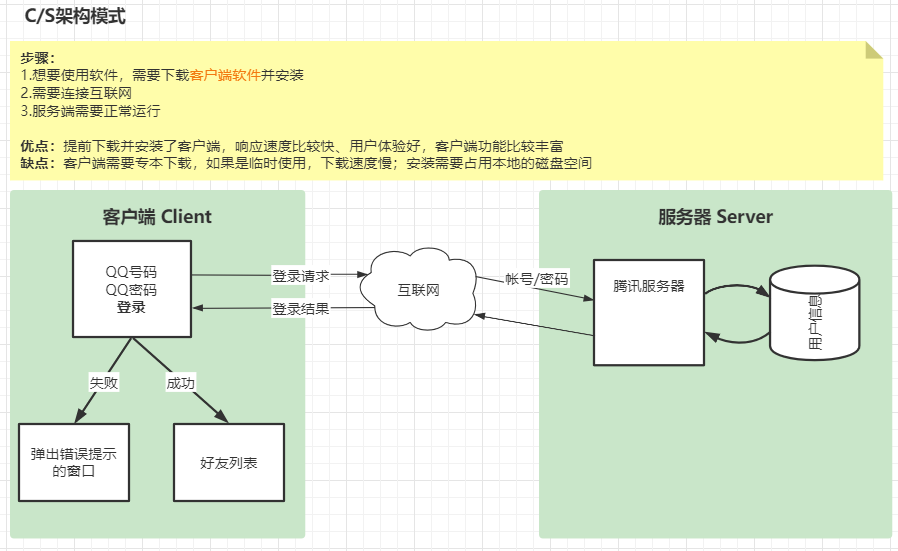
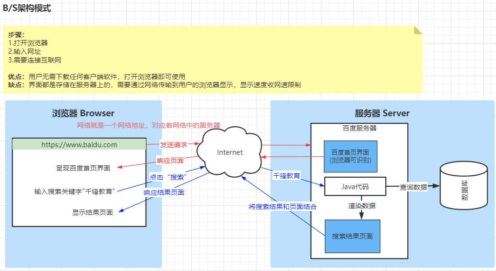
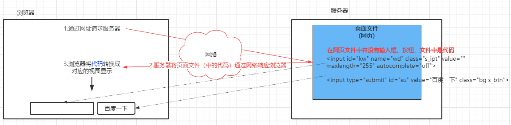
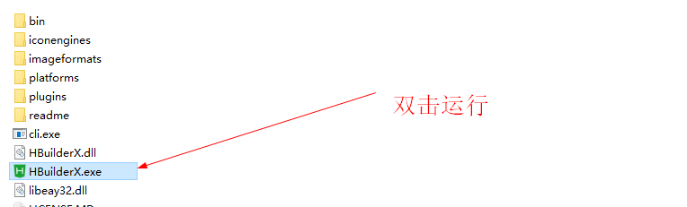
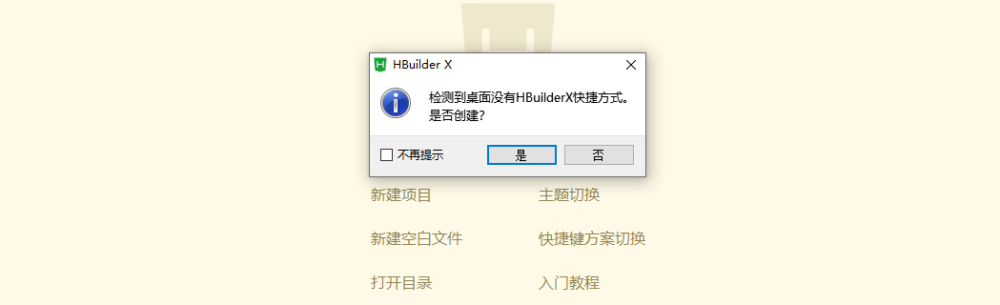
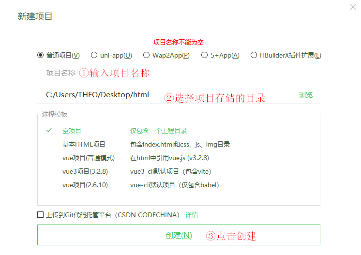
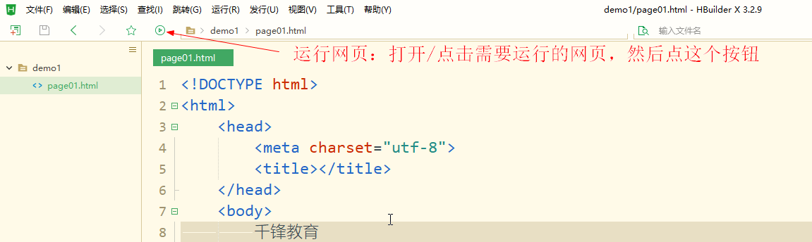
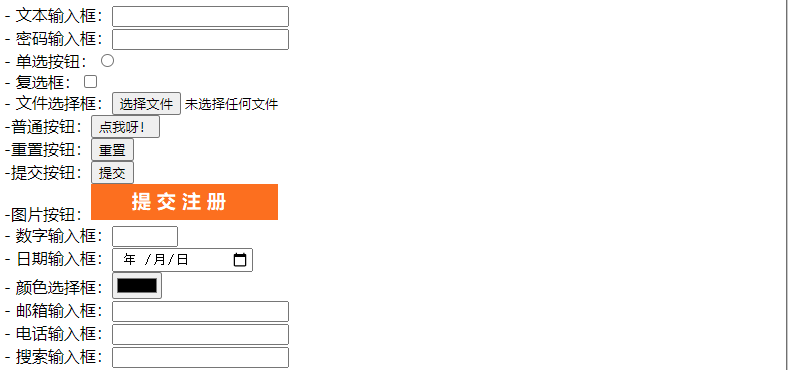
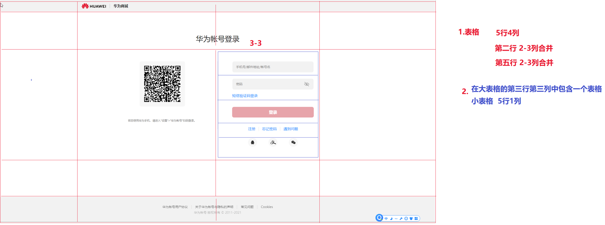
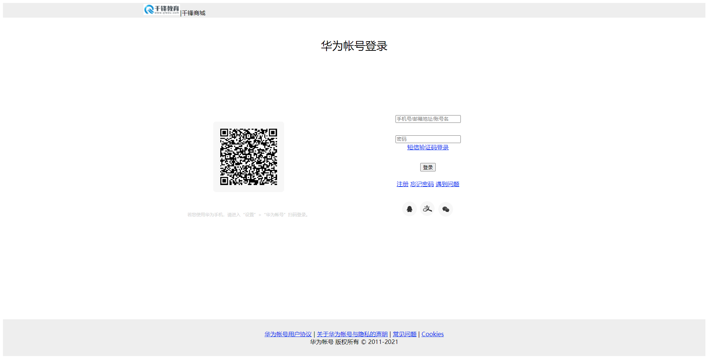

## 一、C/S架构与B/S架构

> 对于一个软件系统，用户是通过用户界面来完成与软件系统的交互的（用户是通过用户界面来使用软件系统的），根据软件不同的架构模式，软件系统界面设计的实现技术是不同的：
>
> - C/S架构
> - B/S架构

### 1.1 C/S架构

> C/S   Client-Server  基于客户端和服务器的架构模式



### 1.2 B/S架构

> B/S Browser-Server 基于浏览器和服务器的架构模式



### 1.3 不同架构的前端技术栈

#### 1.3.1 C/S

> Java语言可以进行C/S架构开发，JDK提供的AWT（abstract window toolkit）可以进行窗体开发

- awt
- swing

#### 1.3.2 B/S

> Java语言主要应用于web系统的开发，web系统就是基于B/S架构，其系统界面都是通过网页实现的

- HTML 超文本标记语言    网页的结构
- CSS 层叠样式表      网页的样式
- JavaScript 网页脚本语言  网页的行为

#### 1.3.3 移动应用

> Java语言还可以用于进行Android和HarmonyOS应用开发

- AndroidUI   xml及组件
- HarmonyOSUI   xml及组件


## 二、HTML简介

### 2.1 什么是网页？

> 网页 —— 可以在网络中传输、通过浏览器解析并显示视图的页面

问题：一个文件通过网络传递给浏览器之后，浏览器是如何显示视图的呢？

- 存储在服务器上的`页面文件`中编写的是浏览器可以识别的代码
- 当浏览器请求服务器时，服务器将这个`写有浏览器可以识别的代码的页面文件`通过网络传递给浏览器
- 浏览器接收到文件后，不会将代码显示出来，而是对代码进行解析，显示出对应的视图



网页设计：就是在`网页文件`中编写HTML代码(标签)，通过浏览器可以显示特定的用户界面

### 2.2 HTML是什么？

> HTML （Hyper Text Markup Language）超文本标记语言。以特定的标签在浏览器中呈现不同的视图
>
> 标记（标签）：就是由`<>`和特定的单词组成的符号，可以被浏览器识别并显示对应的视图
>
> 超文本：使用文本标签显示图片、视频、声音等非文本数据

### 2.3 HTML书写规范

> HTML标签需要写在一个`网页文件`中，网页文件的规则：
>
> - 网页文件是一个后缀名为`.html`或者`.htm`的文件
>
> - 网页文件有一个基本结构：
>
>   - 在网页文件第一行通过`<!DOCTYPE html>`声明当前文档遵循的HTML规范
>   - 在HTML规范声明之后，必须有一对根标签`<html></html>`（根标签：当前网页中其他的标签都在根标签的里面）
>   - 在根标签中，有两对子标签`<head></head>`和`<body></body>`
>     - head标签：用于定义当前网页文档的标题、字符集等属性信息
>     - body标签：用于定义当前网页显示的主体内容
>
>   ```html
>   <!DOCTYPE html>
>   <html>
>       <head>
>           <meta charset="utf-8"/>
>           <title>我的第一个网页</title>
>       </head>
>       <body bgcolor="red">
>            <input type="password"/>
>       </body>
>   </html>
>   ```
>
> - 标签：
>   - 双标签（围堵标签） <tag></tag>
>   - 单标签  <tag/>
>
> - 标签属性：在双标签前一个标签中、单标签的标签名后可以添加键值对，用于设置当前标签的特性
> - HTML标签是不区分大小写的，为了便于可读，建议统一写成小写

**HTML版本规范**

> 前端规范--- w3c
>
> HTML4
>
> `<!DOCTYPE HTML PUBLIC "-//W3C//DTD HTML 4.01 Transitional//EN" 
> "http://www.w3.org/TR/html4/loose.dtd">`
>
> XHTML  提出了基于HTML4更多的语法规则，让HTML编写规范更严谨
>
> `<!DOCTYPE html PUBLIC "-//W3C//DTD XHTML 1.0 Transitional//EN" "
> http://www.w3.org/TR/xhtml1/DTD/xhtml1-transitional.dtd">`
>
> HTML5
>
>  `<!DOCTYPE html>`

### 2.4 前端开发工具

> 为了便于前端开发，有很多的前端开发工具，可以为我们进行网页设计提供代码自动补全、代码错误提示、项目文件管理等功能，常见的工具：

- webStorm
- vsCode
- subline
- `HBuilder` --`HBuilderX`  

**HBuilderX的使用**

- 下载：www.dcloud.io

- 解压：解压到存放软件的目录（免安装）

- 运行：

  

- 首次运行，需要对HBuilderX进行用户使用习惯设置（主题）

- 第一次关闭HBuilderX的时候，会提示创建桌面快捷方式

  

- 创建web项目

  

- 创建网页文件：选择项目---右键---新建---HTML文件

  创建的HTML文件默认会给出规范的网页文件结构

- 运行网页文件：

  

## 三、HTML常用标签

> 网页就是使用HTML标签构成的文档，在浏览器显示视图页面。HTML什么样的标签表示什么样的是呢？

网页界面：显示数据、输入数据

- 为用户提供一个界面，显示用户想要看到的数据（文本、图片、声音、视频）
- 为用户提供一个界面，可以输入数据（发表博客：输入文本、选择图片、点击按钮）

> 如何使用HTML标签在网页中显示数据和提供输入视图呢？
>
> 根据HTML标签的作用，我们将HTML标签分为以下：
>
> - 显示标签：就是将图片、文本、声音、视频通过网页呈现给用户
> - 表单标签：就是给用户提供输入框、按钮、单选按钮、复选框、文本域等视图供其输入数据
> - 布局标签：对网页中的内容进行布局/排版
> - 功能标签：能够提供特定用户功能的标签
> - 框架标签：搭建页面框架（输入布局标签）

### 3.1 显示标签

> 将文本、图片、声音和视频显示到网页

#### 3.1.1 文本

```html
<!--显示文本-->
<!-- font标签：color属性设置颜色，fase属性设置字体，size属性设置大小 -->
<font color="red" face="华文行楷" size="7">千锋教育</font>
<font color="blue" face="微软雅黑" size="4">Java涛哥</font>

<!-- H5不推荐使用font标签，显示文本推荐使用label标签 -->
<!-- label标签没有字体属性，但是可以通过style属性值设置字体颜色、大小、样式 -->
<label style="color:green;font-size:100px;font-family:楷体">网页设计</label>
```

#### 3.1.2 图片

```html
<!-- 显示图片 ---  img标签：
	src属性用于指定显示的图片的路径，可以是网络图片路径，也可以本地图片路径
		(本地图片：先在项目中创建一个存放图片的目录imgs，再将要显示的图片拷贝进来 )
	width、hegiht属性,设置图片的宽度、高度 ,如果两个属性同时设置可能会改变图片的比例
		可以只设置其中一个属性，另一个属性会等比缩放
	alt属性，用于指定图片无法加载时的替换文本
-->


```

#### 3.1.3 声音和视频

```html
<!--audio标签 调用浏览器内置的音频播放器（默认是隐藏的）
	src属性指定音频的路径（网络路径、本地路径）
	controls属性表示显示播放器（此属性不需要属性值）
	autoplay属性表示音乐自动播放（考虑浏览器兼容性）
-->
<audio src="meida/麻雀.mp3" controls autoplay></audio>

<!--video标签 调用浏览器内置的视频播放器（默认是隐藏的）
	src属性指定视频的路径（网络路径、本地路径）
	controls属性表示显示播放器的控制条（此属性不需要属性值）
	autoplay属性表示视频自动播放（考虑浏览器兼容性）
	width、height属性设置视频播放器的尺寸
-->
<video src="meida/Java学科宣传片.mp4" controls autoplay width="400"></video>
```


### 3.2 表单标签

> 用户提供输入视图供其输入数据：

#### 3.2.1 input标签

> input标签可以用来显示多种表单输入视图效果，input标签有一个type属性，不同的属性表示不同的视图

```HTML
- 文本输入框：<input type="text"/><br/>
- 密码输入框：<input type="password"/><br/>
- 单选按钮：<input type="radio"/><br/>
- 复选框：<input type="checkbox"/><br/>
- 文件选择框：<input type="file"/><br/>

<!-- 普通按钮默认是没有文本的，通过value属性指定按钮文本 -->
-普通按钮：<input type="button" value="点我呀！"/><br/>
-重置按钮：<input type="reset"/><br/>
-提交按钮：<input type="submit"/><br/>
<!-- 图片按钮从功能讲和提交按钮一致，需要通过src属性指定按钮图片 -->
-图片按钮：<input type="image" src="imgs/btn.bmp"/><br/>

<!-- 以下input的type是HTML5新增的 ,要考虑浏览器的兼容性（浏览器是否支持）-->
<!-- type=number ，表示次输入框只能输入数字，min设置最小值，max设置最大值-->
- 数字输入框：<input type="number" min="10" max="20"/><br/>
- 日期输入框：<input type="date"/><br/>
- 颜色选择框：<input type="color"/><br/>
- 邮箱输入框：<input type="email"/><br/>
- 电话输入框：<input type="tel"/><br/>
- 搜索输入框：<input type="search"/><br/>
```



**单选按钮和复选框：**

```html
<hr/>
<!-- 单选按钮使用注意事项：
1.如果多个单选按钮是同一个主题的选项，则需要提供name属性，且那么属性值必须相同（排他性）
2.单选按钮必须提供value属性，value属性值会在当前单选按钮被选中时提交
3.单选按钮可以通过添加checked属性使其默认被选中，如果有多个单选按钮添加checked属性，则选中最后一个
-->
性别：<input type="radio" name="gender" value="M" checked/>男   
<input type="radio" name="gender" value="F"/>女
<input type="radio" name="gender" value="N" />不详
<hr/>
<!-- 复选框注意事项（与单选按钮一致） -->
爱好：<input type="checkbox" name="hobby" value="篮球" checked/>篮球
<input type="checkbox" name="hobby" value="足球"/>足球
<input type="checkbox" name="hobby" value="羽毛球" checked/>羽毛球
<input type="checkbox" name="hobby" value="溜溜球"/>溜溜球
```

#### 3.2.2 select标签

>下拉菜单（省、市、区选择）

```html
<!-- 
select标签表示下拉菜单的容器
1.添加multiple属性，设置此下拉菜单多选（ctrl）
2.size属性，设置下拉列表中可见选项的数量

option子标签表示下拉菜单的选项
1.option标签中的标签文本用于指定选项显示的文字
2.option标签需要提供value属性，当选择此菜单式提交到后台
-->
<select multiple size="3">
    <option value="BeiJing">北京</option>
    <option value="ShangHai">上海</option>
    <option value="GuangZhou">广州</option>
    <option value="ShenZhen">深圳</option>
    <option value="WuHan">武汉</option>
</select>
```

#### 3.2.3 textarea标签

> 文本域、多行文本框

```html
<!-- 多行输入框 textarea标签：
1、rows属性用于指定多行文本框显示的行数
2、cols属性用于设置多行文本输入框每行显示的字符个数（考虑浏览器兼容性）
3、输入框（文本输入框、密码输入框）是通过value属性来设置默认值的，textarea通过标签文本设置默认值
-->
<textarea rows="5" cols="30">这是文本域的默认值</textarea>
```

#### 3.2.4 表单标签共有属性

> 对于表单标签，他们有一些共有属性

- `id`属性，不仅是表单标签共有的属性，几乎所有的HTML标签都可以有这个属性，它表示此标签在当前网页文件中的唯一表示，便于我们定位标签进行操作；在一个网页中标签的ID属性值要保持唯一性。

- `name`属性，用于将数据提交（同步提交）到后端时，在后端接收数据。

- `required`属性，设置此输入框必须输入数据，否则不能提交。

  ```html
  <form>
      <input type="text" required="required"/>
      <input type="submit" />
  </form>
  ```

- `placeholder`属性，用于设置输入框空值提示信息。
- `readonly`属性，表示设置此输入框，只能显示数据，不能点击输入。
- `disabled`属性，设置输入组件禁用（输入框不能输入、按钮不能点击、下拉菜单不能选择）。
- `value`属性，表示当前输入框的值、下拉菜单选中的选项的值。

#### 3.2.5 form标签

> form标签，在页面中没有显示效果，它用于将用户在输入视图中输入的数据提交到后台

```html
<!-- form标签：用于提交数据的表单 
作用：当点击form标签中的提交按钮时，可以将form标签中输入视图中的数据提交到action属性指定的url
注意：1.提交form表单的按钮必须是提交按钮（type=submit，type=image）
     2.form表单中的输入标签需要提供name属性，否则输入标签中的值不会被提交
     3.form标签的method属性，指定表单提交数据的方式（get显式提交  post隐藏提交；其他区别暂不关注）
       method属性默认值是get，也就是说如果不写method属性，则get方式提交
     4.enctype属性，用于设置表单提交时数据的编码方式
重置按钮：
    必须在form表单中使用，用于重置表单中输入框的值（让输入框的值回到默认状态 ≠ 清空）
提交按钮：
    必须用在form表单中，用于提交表单 
-->
<form action="https://www.baidu.com" method="post" enctype="">
    <input type="text" placeholder="请输入帐号" name="userName" value="123"/><br/>
    <input type="password" placeholder="请输入密码" name="userPwd"/><br/>
    <input type="reset" /><br/>
    <input type="submit" value="登录"/>
</form>
```

在HTML5规范中，提交按钮也可以写在form外面,但是要通过form属性指定表单id

```html
<form id="form1">
    <input type="text" placeholder="请输入帐号" name="userName" value="123"/><br/>
    <input type="password" placeholder="请输入密码" name="userPwd"/><br/>
    <input type="reset" /><br/>
</form>
<!--对于同一个form，可以使用不同的提交按钮，提交到不同的URL-->
<input type="submit" value="登录1" form="form1" formaction="https://www.baidu.com" formmethod="get"/><br/>
<input type="submit" value="登录2" form="form1" formaction="http://www.qfedu.com" formmethod="post"/><br/>
```


### 3.3 布局标签

> 用于对网页中的视图组件进行排版

#### 3.3.1 标题

> h标签提供了默认的标题样式,HTML中提供了 h1~h6 用于表示6级标题

```html
<h1>一级标题</h1>
<h2>二级标题</h2>
<h3>三级标题</h3>
<h4>四级标题</h4>
<h5>五级标题</h5>
<h6>六级标题</h6>
```

#### 3.3.2 段落

> p标签： HTML可以将文档分割成多个段落
>
> hr标签： 水平分割线
>
> br标签：换行

```html
<hr/>
<p>
    枫桥夜泊<br/>
    张继<br/>
    月落乌啼霜满天，<br/>
    江枫渔火对愁眠；<br/>
    姑苏城外寒山寺，<br/>
    夜半钟声到客船。<br/>
</p>
<p>
    静夜思<br/>
    李白<br/>
    床前明月光，<br/>
    疑是地上霜；<br/>
    举头望明月，<br/>
    低头思故乡。<br/>
</p>
```

#### 3.3.3 列表

> 将相关联的多行文本以列表的形式进行展示

**1.有序列表**

```html
水龙头接水的步骤：
<!-- ol标签表示有序列表，li子标签表示列表项 -->
<!-- type属性用于指定序号的类型  1  A  a I i-->
<ol type="i">
    <li>放置水桶</li>
    <li>打开水龙头</li>
    <li>等待放水</li>
    <li>关闭水龙头</li>
    <li>提走水桶</li>
</ol>
```

**2.无序列表**

```html
水果列表
<!-- ul标签表示无序列表，li子标签表示列表项 -->
<!-- type属性用于指定图标的类型  disc实心圆 circle空心圆  square方形实心  -->
<ul type="square">
    <li>苹果</li>
    <li>菠萝</li>
    <li>西瓜</li>
    <li>火龙果</li>
    <li>香蕉</li>
</ul>
```

**3.自定义列表**

```html
自定义列表
<dl>
    <dt>分组1</dt>
    <dd>1-1</dd>
    <dd>1-2</dd>
    <dt>分组2</dt>
    <dd>2-1</dd>
    <dd>2-2</dd>
</dl>
```

#### 3.3.4 表格

> 在网页中显示一个表格，通过将页面的HTML元素存放在表格的不同单元格，以达到设置元素布局的效果

```html
<!-- table标签：用于在网页中定义一个表格 ，表格是由若干行组成，行被分割成多个单元格-->
<!-- 
表格（table）:table中的属性设置的是整个表格的属性
    border属性：设置表格的边框宽度（同时设置表格外边框，以及每个单元格的边框）
    cellspacing属性：设置单元格空隙
    cellpadding属性：设置当前表格中单元格的内边距
    width、height属性：设置当前表格的宽度、高度
    align属性：设置当前表格在网页中的水平位置（left|center|right）
    bgcolor属性：设置表格的背景颜色
    background属性：设置当前表格的背景图片

行（tr）：用在table标签里面，一对tr标签就表示表格中的一行 ，tr的属性设置影响当前行
    height属性：设置当前行的高度，如果不设置行高，则平均分配
    bgcolor属性：设置当前行的背景颜色

单元格（td）：写在tr标签，一对td标签就表示当前行中的一个单元格 ,每一行的对应列都会自动对齐
    width属性：设置当前单元格的宽度，设置某一行的单元格宽度，其他行对应单元格宽度同步修改
    bgcolor属性：设置当前单元格的背景颜色
    valign属性：设置当前单元格中的内容在当前单元格中的垂直位置（middle、top、bottom）
    align属性：设置当前单元格中的内容在当前单元格中的水平位置（left、center、right）
    colspan属性：横向合并单元格（设置当前单元格占用几个单元格的宽度）
    rowspan属性：纵向合并单元格（设置当前单元格占用几行的高度）
-->
<table border="1" cellspacing="0" cellpadding="0" width="300" height="300" align="center" bgcolor="orange">
    <tr height="50" bgcolor="aqua">
        <td colspan="2">1-1</td>
        <td width="50" rowspan="2">1-3</td>
    </tr>
    <tr>
        <td width="50" rowspan="2">2-1</td>
        <td valign="bottom" align="right">2-2</td>
    </tr>
    <tr height="50">
        <td colspan="2">3-2</td>
    </tr>
</table>
```

#### 3.3.5 div层

> 区块元素（标签），在浏览器中进行显示的时候，通常会有换行 （例如：段落p、表格table...）
>
> 内联元素（标签），在浏览器中进行显示的时候，不会进行换行（例如：label img）

```html
<!-- div标签：层，一个HTML标签的容器 
1.如果不设置宽度，则默认宽度为父容器的宽度（如下：body就是div的父容器）
2.如果不设置高度，则DIV的高度默认与其中存放的元素高度相同
3.div中可以包含HTML标签，我通过对DIV标签的设置可以实现HTML标签的层叠
-->
<!-- 

 -->

<div style=" width: 83px; height: 100px; border: 1px solid red; position: absolute; left: 0px; top:0px">
    
</div>

<div style=" width: 83px; height: 100px; border: 1px solid green; position: absolute; left: 50px; top:50px">
    
</div>

<div style=" width: 83px; height: 100px; border: 1px solid blue; position: absolute;left: 100px; top: 100px;">
    
</div>
```

#### 3.3.6 fieldset字段集

```html
<!-- fieldset标签：网页中的模块，也是一个容器，默认带有边框,有内边距 -->
<!-- legend子标签：用于设置当前模块区域的标题 -->
<fieldset style="width: 300px; height: 100px;">
    <legend>🏀管理员登录</legend>
    <p>帐号：<input type="text"/></p>
    <p>密码：<input type="password"/></p>
</fieldset>
```

### 3.4 功能标签

> 功能标签，在网页中没有对应的视图效果，但是可以实现特定的功能
>
> - form表单，用于提交用户输入数据的
> - a超链接

#### 3.4.1 form表单

参考3.2.5

#### 3.4.2 a 标签

**超链接** 激活文本可点击，当点击这个特定的文本之后，链接到对应的地址

```html
<!-- a标签（超链接）：激活文本/图片连接
href 属性指定当前文本/图片链接的地址-->
学Java开发就来<a href="http://www.qfedu.com">千锋教育</a> <br/>
<a href="https://www.baidu.com/s?wd=张韶涵"></a>
```

**锚点** 用于当前页面不同位置的跳转

```html
<hr/>
<a href="#aaa">div1</a><!-- 跳转到锚点 -->
<a href="#bbb">div2</a>
<a href="#ccc">div3</a>
<a href="#ddd">div4</a>
<hr/>

<a id="aaa"></a><!-- 定义锚点 -->
<div style="height: 1000px; background-color: aquamarine;">div1</div>

<a id="bbb"></a><!-- 定义锚点 -->
<div style="height: 1000px; background-color: lawngreen;">div2</div>

<a id="ccc"></a><!-- 定义锚点 -->
<div style="height: 1000px; background-color: palevioletred;">div3</div>

<a id="ddd"></a><!-- 定义锚点 -->
<div style="height: 1000px; background-color: peru;">div4</div>
```


### 3.5 框架标签-iframe

> 框架标签，实现页面的模块化
>
> - frameset  frame 不建议使用
> - iframe

```html
<!DOCTYPE html>
<html>
	<head>
		<meta charset="utf-8">
		<title></title>
	</head>
	<body>
		
		<table width="100%" height="880" cellpadding="0" cellspacing="0" >
			<tr height="80" bgcolor="lightblue">
				<td align="center">
					<label style="font-size: 40px;">QQMail</label>
				</td>
				<td align="right" valign="top">
					二狗，欢迎你！[<a href="#">退出</a>]
				</td>
			</tr>
			<tr>
				<td width="200" bgcolor="lightgray" valign="top">
					<ul>
						<li><a href="page02-表单标签.html" target="mainFrame">新邮件</a></li>
						<li><a href="https://www.taobao.com"  target="mainFrame">淘宝</a></li>
						<li><a href="http://www.qfedu.com"  target="mainFrame">千锋</a></li>
					</ul>
				</td>
				<td>
			<!-- iframe标签，表示一个页面的容器,通过name属性可以设置点击超链接以后，将页面显示到当前容器
						1.给iframe标签设置name属性
						2.给超链接a标签设置target等于iframe的name属性值
					 -->
				<iframe name="mainFrame" width="100%" height="800" frameborder="0"></iframe>
				</td>
			</tr>
		</table>
		
	</body>
</html>
```

### 3.6 其他标签

#### 3.6.1 文本修饰

```html
<b>粗体</b>
<i>斜体</i>
<u>下划线</u>
<del>删除线</del>

<strong>加重语气</strong>
<em>强调</em>

<small>小号文本</small>

10<sup>上标</sup>
4<sub>下标</sub>
```

#### 3.6.2 计算机输出相关

```html
<!-- 计算机输出标签，除了字体有所改变之外，更多的是语义上的设定 -->
<code>System.out.println("计算机代码!");</code>
<kbd>Ctrl+L</kbd>
<var>程序变量</var>
<pre>预定义</pre>
```

#### 3.6.3 引用标签

```html
<address>湖北省武汉市江夏区</address>
跟着涛哥一起学习<abbr title="Java DataBase Conectivity">JDBC</abbr>技术
<bdo dir="rtl">定义文字方向</bdo>
毛泽东同志说：<blockquote>生的伟大，死的光荣！</blockquote>
```

## 四、HTML页面设计案例

> 案例：使用HTML标签，完成华为商城的登录页面的设计

### 4.1 模仿页面分析



### 4.2 按照分析进行网页设计

```html
<!DOCTYPE html>
<html>
	<head>
		<meta charset="utf-8">
		<title>华为商城欢迎您</title>
	</head>
	<body>
		
		<table border="0" cellspacing="0" cellpadding="0" width="100%" height="960">
			<tr height="40" bgcolor="#eeeeee">
				<td width="355"</td>
				<td>
					|千锋商城
				</td>
				<td></td>
				<td width="355"></td>
			</tr>
			<tr height="150">
				<td></td>
				<td colspan="2" align="center">
					<label style="font-size: 30px;">华为帐号登录</label>
				</td>
				<td></td>
			</tr>
			<tr>
				<td></td>
				<td align="center" width="30%">
					
					<br/>
					<br/>
					<br/>
					<label style="font-size: 10px; color: lightgray;">若您使用华为手机，请进入“设置”>“华为帐号”扫码登录。</label>
				</td>
				<td width="30%">
					<table  height="320" width="400">
						<tr>
							<td align="center"><input type="text" placeholder="手机号/邮箱地址/账号名"/></td>
						</tr>
						<tr>
							<td align="center">
								<input type="password" placeholder="密码"/>
								<br/>
								<a href="#">短信验证码登录</a>
							</td>
						</tr>
						<tr>
							<td align="center"><input type="submit" value="登录"/></td>
						</tr>
						<tr>
							<td  align="center">
								<a href="#">注册</a>
								<a href="#">忘记密码</a>
								<a href="#">遇到问题</a>
							</td>
						</tr>
						<tr>
							<td  align="center">
								
								
								
							</td>
						</tr>
					</table>
				</td>
				<td></td>
			</tr>
			<tr height="150">
				<td></td>
				<td></td>
				<td></td>
				<td></td>
			</tr>
			<tr height="100"  bgcolor="#eeeeee">
				<td></td>
				<td colspan="2" align="center" valign="middle">
					<a href="#">华为帐号用户协议</a> | <a href="#">关于华为帐号与隐私的声明</a> | <a href="#">常见问题</a> | <a href="#">Cookies</a>
					<br/>
					华为帐号 版权所有 © 2011-2021
				</td>
				<td></td>
			</tr>
		</table>
		
	</body>
</html>
```

| 案例运行效果图                                               |
| ------------------------------------------------------------ |
|  |

