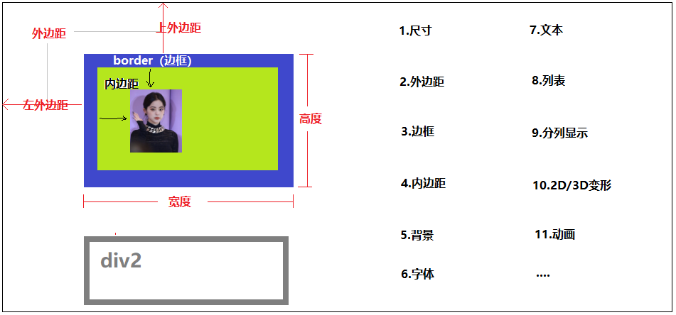
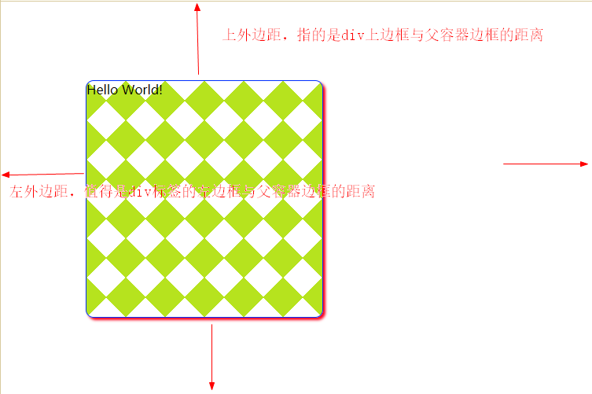
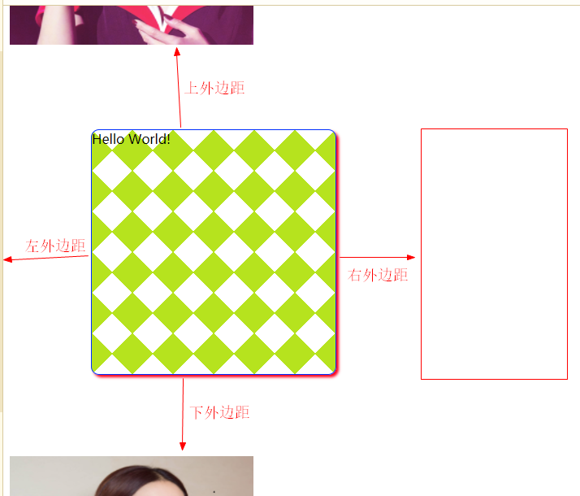

## 一、CSS基础

> HTML标签决定了网页的内容，CSS能够对HTML标签的显示效果进行设置

### 1.1 style属性

> 几乎所有的HTML标签都可以添加一个`style`属性，在style属性值中设置`样式属性`，来修改当前HTML标签的显示效果。

- 标签属性：在HTML标签中添加的键值对
- 样式属性：HTML标签的style属性值中的键值对

> style属性值（样式属性）的语法：
>
> 在style属性值中，可以添加多个样式属性，样式属性名与样式属性值之间以`:`隔开，两个样式属性之间用`;`隔开
>
> <tag style="样式属性名1:样式属性值1 ; 样式属性名2:样式属性值2..."/>

```html
<input type="text" style="width:300px ; height: 35px"/>

```

### 1.2 style标签

> 问题：style属性可以用来设置HTML的样式，但是如果在一个网页中有多个HTML标签要使用相同的样式，使用style属性设置样式会在每个HTML标签写重复的样式属性，同时如果要修改其效果，则需要修改所有HTML标签的style属性值——代码冗余度高、不便于维护
>
> 解决方案：我们可以将多个HTML标签共用的`样式属性列表`单独定义在`style标签`中

```html
<!DOCTYPE html>
<html>
	<head>
		<meta charset="utf-8">
		<title></title>
		<style type="text/css">
			/* CSS选择器：规定{}中的样式列表对哪些HTML标签有效 */
			input{width:270px ; height: 30px}
			img{width: 200px; height: 200px; border-radius: 50%;}
		</style>
	</head>
	<body>
		
		<input type="text" placeholder="请输入账号"/>
		<input type="password" placeholder="请输入密码"/>
		<input type="text" placeholder="请输入真实姓名"/>
		
		
		
		
		
	</body>
</html>
```

### 1.3 CSS层叠样式表

> CSS （Cascading Style Sheets） 层叠样式表
>
> 样式表：style标签中定义的、可以供网页中HTML标签复用的样式列表
>
> 层叠样式表：在style标签中定义的多个样式表可以叠加作用在同一个HTML标签上

**CSS基础语法**：

- CSS样式表定义在一对`{}`中
- 在`{}`中可以定义多个样式属性，样式属性名与样式属性值之间使用`:`分隔，多个样式属性之间使用`;`分隔
- 定义样式属性列表的`{}`前需要定义选择器

```html
<style type="text/css">
 	选择器{样式属性名1:样式属性值1 ; 样式属性名2:样式属性值2...}
</style>
```

### 1.4 CSS选择器

> CSS选择器：声明此样式列表对网页中哪些HTML标签有效
>
> - ID选择器

#### 1.4.1 ID选择器

- 语法：`#idAttrValue{样式列表}`

- 作用范围：对当前网页中`id`属性值为`idAttrValue`的标签有效（通常用于对某一个标签定义样式时使用）

- 示例：

  ```html
  <style type="text/css">
      /* 1、ID选择器 (样式表对id=img1的标签有效)*/
      #img1{width: 200px; height: 200px;}
  </style>
  
   <br/>
   <br/>
   <br/>
  ```

#### 1.4.2 标签选择器

- 语法：`tagName{样式列表}`

- 作用范围：对当前网页中所有`tagName`标签都有效

- 示例：

  ```html
  <style type="text/css">
      /* 2、标签选择器 (对当前网页中所有的img标签都有效) */
      img{border: 5px pink solid;}
  </style>
  
   <br/>
   <br/>
   <br/>
  <div class="borderStyle">This is DIV Tag</div>
  ```

#### 1.4.3 class选择器

- 语法：`.classAttrValue{样式列表}`

- 作用范围：对当前网页中所有的`class`属性值为`classAttrValue`

- 示例：

  ```html
  
  <style type="text/css">
      /* 3、CLASS选择器 (对当前网页中 class="borderStyle"的标签有效) */
      .borderStyle{border: 5px blue solid; border-radius: 50%;}
  </style>
  
   <br/>
   <br/>
   <br/>
  <div class="borderStyle">This is DIV Tag</div>
  ```

### 1.5 css文件

> 在一个HTML文件中如果有多个HTML标签需要使用相同的样式，可以将公用的样式定义在当前网页的style标签中，但是如果多个网页的HTML标签需要使用相同的样式，我们该如何处理呢？
>
> —— 将多个网页需要使用的共同的样式单独定义在一个`后缀名为.css的文件`中（CSS文件），然后在需要使用css文件中的样式的网页文件中，通过`link`标签引用此样式文件即可

- 在项目中创建css目录，在css目录中创建`css文件`,在css文件中定义公用样式表

  ```css
  /* 样式定义在CSS文件中，无需使用style标签 */
  .btnStyle{
  	width: 200px; 
  	height: 35px;
  	border: none;
  	background-color: pink;
  	border-radius: 5px;
  }
  ```

- 在需要使用css文件中定义的样式的网页文件，通过link标签引用css样式文件

  ```html
  <!DOCTYPE html>
  <html>
  	<head>
  		<meta charset="utf-8">
  		<title>Page03</title>
  		<link rel="stylesheet" href="css/style.css" />
  	</head>
  	<body>
  		
  		<button class="btnStyle">按钮1-1</button>
  		<button class="btnStyle">按钮1-2</button>
  		
  	</body>
  </html>
  ```

- 在一个网页文件中可以通过link标签引用多个css文件，同时还可添加style标签，定义当前网页的专属样式表

  ```html
  <!DOCTYPE html>
  <html>
  	<head>
  		<meta charset="utf-8">
  		<title>Page03</title>
  		<link rel="stylesheet" href="css/style.css" />
  		<link rel="stylesheet" href="css/index.css" />
  		<style type="text/css">
  			/* css样式表 */
  		</style>
  	</head>
  	<body>
  
  	</body>
  </html>
  ```


## 二、CSS常用样式设置

> CSS可以用于设置HTML标签的显示效果，那么HTML标签可以设置哪些显示效果呢 ？

### 2.1 CSS盒子模型

> 基于HTML标签的嵌套、并列关系，我们可以形象的用盒子的嵌套、并列堆放关系来理解常见的CSS样式审定的模型。



### 2.2 尺寸样式

| 属性名   | 说明     | 示例           |
| -------- | -------- | -------------- |
| `with`   | 设置宽度 | width: 200px;  |
| `height` | 设置高度 | height: 200px; |

1. CSS样式中设置尺寸，值需要带上单位 px像素，HTML标签属性值不能带px
2. 如果同时设置图片的宽度和高度，可能会导致比例发生变化，建议设置其中之一，另一个会等比缩放

### 2.3 边框样式

| 属性名         | 说明                                                         | 示例                              |
| -------------- | ------------------------------------------------------------ | --------------------------------- |
| border-color   | 边框颜色：值可以是颜色名（blue）、<br/>色号(#00ff00)、rgb(255,0,0)、rgba(255,0,0,0.3) | border-color:#ff0000              |
| border-style   | 边框样式：实线solid、点状虚线（dotted）、<br/>段状虚线（dashed）、 双实线(double) | border-style:double               |
| border-width   | 边框宽度：单位像素，对于双边框，宽度必须>=3px                | border-width:3px                  |
| **`border`**   | 同时设置边框颜色、样式、宽度 <br/>（三个值空格分隔，顺序不限） | border: #0000FF double 3px;       |
| `border-top`   | 设置上边框<br/>border-top-style  单独设置上边框的样式<br/>border-top-color 单独设置上边框的颜色<br/>border-top-width 单独设置上边框的宽度 | border-top:#0000FF double 3px;    |
| `boder-bottom` | 设置下边框                                                   | border-bottom: #FF0000 SOLID 3px; |
| `border-left`  | 设置左边框                                                   | ...                               |
| `border-right` | 设置右边框                                                   | ...                               |

1. 任何一个HTML组件，边框分为上、下、左、右四个边框，我们可以单独设置；
2. 组件的上下左右边框也可以单独设置 样式、颜色及宽度。

### 2.4 边框圆角及阴影

| 属性名          | 说明                                                         | 示例                                     |
| --------------- | ------------------------------------------------------------ | ---------------------------------------- |
| `border-radius` | 设置边框圆角：<br/>样式属性值可以是具体的像素（10px）,<br/>也可以是百分比(20%) | border-radius:20px<br/>border-radius:20% |
| `box-shadow`    | 设置阴影，<br/>四个参数：阴影颜色、X轴偏移、Y轴偏移、渲染    | box-shadow: red 3px 3px 4px              |

1. border-radius设置边框圆角有一下三种设置值的方式：
   - border-radius:10px    同时设置四个圆角
   - border-radius:0px 10px  分别设置左上右下 、左下右上圆角
   - border-radius:0px 10px 20px 30px  分别设置左上、右上、右下、左下四个圆角

2. 区域性显示的元素都可以设置阴影

### 2.5 背景样式

| 属性名              | 说明                           | 示例                                                         |
| ------------------- | ------------------------------ | ------------------------------------------------------------ |
| background-color    | 设置背景颜色                   | background-color: lightgreen;                                |
| background-image    | 设置背景图片                   | background-image: url(imgs/img02.png);                       |
| `background`        | 设置背景颜色或者图片           | background: lightgreen;<br/>background: url(imgs/img03.png); |
| background-position | 当背景图片过大时设置偏移       | background-position: -50px ;<br/>background-position: -50px -20px; |
| background-repeat   | 当背景图片比较小时设置平铺方式 | background-repeat: no-repeat; 不平铺 <br/>background-repeat: repeat-x; 横向平铺<br/>background-repeat: repeat-y; 纵向平铺<br/> background-repeat: repeat;  双向平铺 |

1. 当我们设置背景颜色的时候，区域的所有范围都是设定的颜色

2. 当我们设置背景图片的时候，图片有可能太大也有可能太小

   - 如果图片大于区域范围我们可以对图片进行偏移设置
   - 如果图片小于区域范围我们可以设置图片的平铺方式

   

### 2.6 外边距样式

> 外边距指的是HTML标签与父容器边框、同级标签的距离

- 在容器中没有同级标签，外边距指的是当前HTML标签与父容器边框的距离

  

- 如果父容器中存在与当前HTML标签的同级标签，外边距指的就是当前HTML标签与同级元素的距离

  

| 属性名        | 说明                                                         | 示例                  |
| ------------- | ------------------------------------------------------------ | --------------------- |
| `margin-left` | 设置左外边距                                                 | margin-left: 100px;   |
| `margin-top`  | 设置上外边距                                                 | margin-top: 100px;    |
| margin-right  | 设置右外边距                                                 | margin-right: 100px;  |
| margin-bottom | 设置下外边距                                                 | margin-bottom: 100px; |
| `margin`      | 设置外边距，可以设置1个参数、2个参数、4个参数<br/>margin:100px;   同时设置四个方向的外边距 <br/>margin:50px 100px; 分别设置上下、左右外边距<br/>margin:0px 100px 50px 100px  分别设置上、右、下、左外边距 |                       |

我们可以使用margin-left、margin-top等单独设置某一个方向的外边距，也可以直接使用`margin`设置多个方向的外边距

### 2.7 内边距样式

> 内边距，设置当前容器标签中的元素(文本/图片等)距离当前容器边框的距离

可以通过 padding-left、padding-top、padding-right、padding-bottom分别设置容器四边的内边距，也可以通过`padding`来设置

| 属性名         | 说明                                                         | 示例                   |
| -------------- | ------------------------------------------------------------ | ---------------------- |
| `padding-left` | 设置左内边距                                                 | padding-left: 100px;   |
| `padding-top`  | 设置上内边距                                                 | padding-top: 100px;    |
| padding-right  | 设置右内边距                                                 | padding-right: 100px;  |
| padding-bottom | 设置下内边距                                                 | padding-bootom: 100px; |
| `padding`      | padding:50px; 同时设置上下左右四个方向的内边距 <br/>padding: 50px 100px;分别设置上下、左右的内边距 <br/>padding: 0px 50px 100px 200px; <br/>分别设置上、右、下、左四个方向的内边距 |                        |

### 2.8 字体样式

> 设置网页显示的文本的字体样式

```html
<style>
/* 自定义字体：
    1.下载字体文件(ttc、ttf、woff格式)
    2.在项目中创建fonts目录，将字体文件粘贴进来
    3.根据字体文件自定义字体
    */
    @font-face{
        font-family: '华康娃娃体'; /* 声明自定义字体名称 */
        src: url(fonts/华康娃娃体简W5.ttc); /* 链接到字体文件 */ 
    }

    /* 字体样式 */
    .fontStyle{
        font-size:30px; /* 设置字体大小 */
        font-weight: bold; /* 设置字体加粗 */
        color: #0000FF; /* 设置字体颜色 */
        font-family: 华康娃娃体 ; /* 设置字体样式，需要当前系统支持的字体、或者使用自定义字体 */
    }
</style>
```

### 2.9 文本样式

```html
<style>
/* 文本样式 */
    .textStyle{
        text-align: center; /* 设置当前标签中的文本的水平对齐方式 left|center|right */
        text-decoration: none ;  /* 设置文本的装饰 none|underline|overline|line-through */
        text-shadow: #FF0000 2px 2px 3px; /* 设置文本阴影 */
    }
</style>
```

### 2.10 列表样式

> 列表样式主要时针对有序列表、无序列表、自定义列表等标签的样式

```html
<!DOCTYPE html>
<html>
	<head>
		<meta charset="utf-8">
		<title></title>
		<style type="text/css">
			/* 列表样式 */
			.listStyle1{
				list-style-type: circle;  
				list-style-position: inside ;
			}
			.listStyle2{
				list-style-type: circle;  /* 设置列表图标的样式，none表示不显示图标 */
				list-style-position: outside ;/* 设置列表项图标的位置，inside/outside */
				list-style-image: url(imgs/list_item.bmp); /* 设置自定义列表项图标 */
			}
		</style>
	</head>
	<body>
		<ul class="listStyle1">
			<li>苹果</li>
			<li>梨子</li>
			<li>香蕉</li>
			<li>西瓜</li>
		</ul>
		<ul class="listStyle2">
			<li>苹果</li>
			<li>梨子</li>
			<li>香蕉</li>
			<li>西瓜</li>
		</ul>
	</body>
</html>
```

### 2.11 分列显示（瀑布模型）

> 将一个容器下的多个HTML元素分成多列显示，在容器中分成多列高度会保持基本一致——瀑布模型

```html
<!DOCTYPE html>
<html>
	<head>
		<meta charset="utf-8">
		<title>分列显示</title>
		<style type="text/css">
			#container{
				width: 1000px;
				height: 3000px;
				border: 1px #0000FF solid;
				margin: 100px auto;  /* 设置DIV容器的外边距，上下100px，左右auto居中 */
				
				column-count: 4; /* 设置容器分列的列数 */
				column-rule: blue 1px dashed;  /* 设置分列显示之后列与列之间的分割线样式 */
				column-width: 230px; 	/* 设置分列之后的每列宽度（默认： 列宽=容器宽度/列数） */
				column-gap: 0px;	/* 设置列与列之间的空隙 */
			}
		
			img{
				width: 200px;
				border-radius: 5px;
				margin-left: 25px;
			}
		
		</style>
	</head>
	<body>
		
		<div id="container">
			
			
			
			
			
			
			
			
			
			
			
			
		</div>
		
	</body>
</html>

```


### 2.12 超链接（伪类）

> 超链接伪类，用于设置超链接在不同状态时的样式
>
> a:link  超链接初始状态(未激活) 
>
> `a:hover` 设置鼠标悬停的样式 
>
>  a:active 设置超链接鼠标点击下去时的样式
>
>  a:visited 设置激活后的超链接的样式 

```html
<!DOCTYPE html>
<html>
	<head>
		<meta charset="utf-8">
		<title></title>
		
		<style type="text/css">
			/*超链接默认样式: 
				未激活的超链接是蓝色的，
				超链接鼠标点击下去是红色，
				激活后的超链接是紫色的 
				
			 如何修改超链接不同状态下的样式呢 ？——使用超链接伪类
			*/
			a{
				text-decoration: none;
			/*color: gray;如果使用color设置超链颜色，则未激活、鼠标点下去、激活后颜色都是同一个颜色 */
			}
			
			/* a:link  超链接初始状态(未激活) */
			a:link{
				color: darkcyan;
			}
			
			/* a:hover 设置鼠标悬停的样式 */
			a:hover{
				color:blue
			}
			
			/* a:active 设置超链接鼠标点击下去时的样式*/
			a:active{
				color: orange;
			}
			
			/* a:visited 设置激活后的超链接的样式 */
			a:visited{
				color:gray
			}
			
			.btnStyle{
				border: #008B8B 1px solid;
				border-radius: 3px;
				width: 180px;
				height: 30px;
				color:  #008B8B;
			}
			.btnStyle:hover{
				background: #008B8B;
				color: white;
			}
		</style>
		
	</head>
	<body>
		<a href="http://www.qfedu.com">千锋教育</a>
		<button class="btnStyle">测试按钮</button>
	</body>
</html>
```


### 2.13 CSS布局

> div层是一个HTML标签的容器，我们可以将HTML标签放到div容器中，通过CSS改变DIV的排列方式，即可以实现对HTML元素的布局，DIV+CSS布局：
>
> - 绝对布局
> - 相对布局
> - 浮动布局

#### 2.13.1 绝对布局

**使用`position:absolute`设置绝对布局**

> 1、如果div标签直接写在body中，div的绝对布局位置是参考浏览器边框
> 2、如果div写在父容器中，且父容器div没有设置position，则父容器里面的div的绝对布局不是参考父容器，而是参考浏览器边框
> 3、如果div写在父容器中，其父容器div设置了position=absolute|relative|fixed, 父容器里面的div的绝对布局就是参考父容器边框

**使用`position:fiexd`设置绝对布局**

> 任何时候，div的绝对布局都是参考浏览器边框

```html
<!DOCTYPE html>
<html>
	<head>
		<meta charset="utf-8">
		<title></title>
		<style type="text/css">
			/* body标签在浏览器中默认是有边距，为了让body的元素可以紧挨着浏览器边缘，
			我们通常对body进行padding和margin设置为0px，以消除边距 */
			body{
				padding: 0px;
				margin: 0px;
			}
			img{
				/* height: 200px; */
				width: 200px;
				margin: 0px;
			}
			
			/* div块级元素，高度默认和div中内容一样高；宽度默认和父容器一样宽 */
			div{
				border:1px solid green;
				width: 200px;
				padding: 0px;
			}
			
			/* div+css布局：绝对布局 */
			#div1{
				position: fixed;  /* 设置div的布局方式  absolute 绝对布局*/
				left: 300px;
				top: 200px;
			}
			#div2{
				position: absolute;
				left: 450px;
				top: 400px;
			}
			#div3{
				position: absolute;
				left: 275px;
				top: 375px;
			}
			
			#container{
				width: 1000px;
				height: 800px;
				background: yellow;
				margin: 100px;
				position: fixed;
			}
			
		</style>
	</head>
	<body>
<!-- 使用 position: absolute 设置div绝对布局：
1、如果div标签直接写在body中，设置position: absolute; div的位置是参考浏览器边框
2、如果父容器div没有设置position，则父容器里面的div的绝对布局不是参考父容器，而是参考浏览器边框
3、如果父容器div设置了position=absolute|relative|fixed, 父容器里面的div的绝对布局就是参考父容器边框
-->
		<!-- 我们也可以使用 position: fiexd 设置div绝对布局： 任何时候div的位置都是参考浏览器-->
		<div id="container">
			<div id="div1">
				
			</div>
			
			<div id="div2">
				
			</div>
			
			<div id="div3">
				
			</div>
		</div>
	</body>
</html>
```

#### 2.13.2 相对布局

> - 相对布局，就是设置HTML标签（div）相对于自己原来的位置的偏移量
>
> - div的 position样式属性值为`relative`,通过设置`left`、`top`、`right`、`bottom`来设置div的位置

```html
<!DOCTYPE html>
<html>
	<head>
		<meta charset="utf-8">
		<title></title>
		<style type="text/css">
			/* body标签在浏览器中默认是有边距，为了让body的元素可以紧挨着浏览器边缘，
			我们通常对body进行padding和margin设置为0px，以消除边距 */
			body{
				padding: 0px;
				margin: 0px;
			}
			img{
				/* height: 200px; */
				width: 200px;
				margin: 0px;
			}
			
			/* div块级元素，高度默认和div中内容一样高；宽度默认和父容器一样宽 */
			div{
				border:1px solid green;
				width: 200px;
				padding: 0px;
			}
			
			/* 相对布局：div有默认的位置 ，相对布局就是参考默认位置的偏移量 */
			#div2{
				position: relative;
				left: 300px;
				top: 200px;
			}
			#div3{
				position: relative;
				left: 150px;
			}
			
			#container{
				width: 1000px;
				height: 800px;
				background: yellow;
				margin: 100px;
				position: relative;
			}
			
		</style>
	</head>
	<body>
		<div id="container">
			<div id="div1">
				
			</div>
			
			<div id="div2">
				
			</div>
			
			<div id="div3">
				
			</div>
		</div>
	</body>
</html>
```

#### 2.13.3 浮动布局

> float样式属性，设置当前div在容器中浮动起来，浮动方式有两种（left|right）
>
> clear样式属性，可以终止浮动布局

```html
<!DOCTYPE html>
<html>
	<head>
		<meta charset="utf-8">
		<title></title>
		<style type="text/css">
			#container{
				width: 1200px;
				height: 800px;
				border: 1px solid orange;
				margin: 0px auto;
			}
			
			/* CSS复合选择器：id=container里面的div标签 */
			#container div{}
			
			#div1{
				width: 200px;
				height:250px;
				background: red;
				float: left; /* 浮动 */
			}
			#div2{
				width: 500px;
				height: 200px;
				background: green;
				float: left;
			}
			#div3{
				width: 400px;
				height: 200px;
				background: blue;
				float: left;
			}
			#div4{
				width: 200px;
				height: 200px;
				background: purple;
				float: left;
			}
			
			#div5{
				width: 1200px;
				height: 100px;
				background: lightgray;
				clear: both;
			}
		</style>
		
	</head>
	<body>
		
		<div id="container">
			
			<div id="div1">div1</div>
			<div id="div2">div2</div>
			<div id="div3">div3</div>
			<div id="div4">div4</div>
			<div id="div5">div5</div>
		</div>
		
	</body>
</html>
```

### 2.14 2D&3D

> CSS3中提供一些关于HTML标签视图的2D(平面)及3D(立体)的视图转换
>
> 1.偏移
>
> 2.旋转
>
> 3.缩放
>
> 4.拉伸

```html
<!DOCTYPE html>
<html>
	<head>
		<meta charset="utf-8">
		<title></title>
		
		<style type="text/css">
			div{
				border:1px blue solid;
				background: lemonchiffon;
				width: 300px;
				height: 200px;
				/* display: inline; 将块级元素转换成内联元素 */
			}
			
			/* transform样式属性用于对HTML标签进行2D和3D转换 
				样式属性值为函数，不同的函数实现不同的转换：
				1、translate 偏移
				   transform: translate(200px,100px); 同时设置横向和纵向偏移
				   transform: translateX(250px);  设置横向偏移
				   transform: translateY(250px);  设置纵向偏移
			 */
			#div1{
				transform: translate(350px,100px); /* 相对布局 */
			}
			/* 2、rotate 旋转    函数参数为角度，单位deg
			      transform: rotateZ(45deg);
				  transform: rotate(45deg);    沿着Z轴（垂直于屏幕）旋转
				  transform: rotateX(45deg);   沿着X轴（垂直于屏幕）旋转
				  transform: rotateY(45deg);   沿着Y轴（垂直于屏幕）旋转
			 */
			#div2{
				transform: rotateY(45deg);
			}
			
			/* 3、scale 缩放 
					transform: scale(0.5);	 同时将原DIV宽度和高度变为原来的0.5倍
					transform: scale(0.5,2); 设置宽度为原来0.5倍，高度为原来2倍	 
					transform: scaleX(2);	单独设置宽度的缩放
					transform: scaleY(2);	单独设置高度的缩放
			*/
			#div3{
				transform: scaleY(0.5);	
			}
			
			/* 4、skew拉伸  参数也是角度
					transform: skewX(30deg);  沿着X轴拉伸 30deg
					transform: skewY(30deg);  沿着Y轴拉伸 30deg
					transform: skew(30deg,30deg);  沿着X和Y轴拉伸 30deg
			 */	
			#div4{
				transform: skew(30deg,30deg);  沿着X和Y轴拉伸 30deg
			}
		</style>
	</head>
	<body>
		<div id="div1">div1</div>
		<div id="div2">div2</div>
		<div id="div3">div3</div>
		<div id="div4">div4</div>
	</body>
</html>
```


### 2.15 自定义动画

> 可以借助于CSS实现HTML元素的动画

#### 2.15.1 过渡

```html
<!DOCTYPE html>
<html>
	<head>
		<meta charset="utf-8">
		<title></title>
		<style type="text/css">
			img{
				width: 200px;
				height: 200px;
				border-radius: 50%;
				transform: rotate(0deg);
				/* transition 样式过渡： 
					参数1：过渡的样式名（样式属性名）
					参数2：过渡时间
					参数3：过渡效果  ease(慢-快-慢)  ease-in(慢-快) ease-out(快-慢) linear(匀速)
					参数4：延迟时间
				*/
				transition: transform 5s linear -2s;
			}
			
			img:hover{
				transform: rotate(360deg);
			}
		
		</style>
	</head>
	<body>
		
		
		
	</body>
</html>
```

#### 2.15.2 动画

> 动画，就是由一帧一帧的画面连续的播放形成的

```html
<!DOCTYPE html>
<html>
	<head>
		<meta charset="utf-8">
		<title></title>
		<style type="text/css">
			/* 定义动画 */
			@keyframes xuanZhuan{
				/* 元素的原始状态  from   0% */
				0%{
					transform: rotate(0deg);
				}
				50%{
					transform: rotate(180deg);
				}
				 /* 元素的目标状态  to   100%*/
				25%,100%{
					transform: rotate(360deg);
				} 
			}
			
			#img2{
				width: 200px;
				height: 200px;
				border-radius: 50%;
				/* animation 应用动画:
					参数1：动画名称
					参数2：完成动画的时间
					参数3：动画的过渡效果
					参数4：动画的循环次数（整数,infinite表示无限循环）
				 */
				animation: xuanZhuan 10s linear  infinite;
			}
		
		</style>
	</head>
	<body>
		
	</body>
</html>
```


## 三、用户界面设计

> 如果同一个网页用户通过不同的设备（手机、平板、PC等）打开网页，我们如何保证页面显示的完整性及美观呢？

### 3.1 媒体查询

> 使用CSS设置网页根据不同的显示设备，动态的显示不同的CSS样式

```html
<!DOCTYPE html>
<html>
	<head>
		<meta charset="utf-8">
		<title></title>
		<style type="text/css">
			*{padding: 0px;margin: 0px;}
			
			
			/* 当屏幕最小尺寸为1800像素时，显示如下样式 */
			@media screen and (min-width:1800px) {
				div{
					width: 1800px;
					height: 800px;
					background: lightcyan;
					border: 1px solid #008B8B;
					margin: 20px auto;
				}
			}
			
			/* 当屏幕大于1200像素且小于1800像素时，显示如下样式 */
			@media only screen and (min-width:1200px) and (max-width:1800px) {
				div{
					width: 1200px;
					height: 800px;
					background: lemonchiffon;
					border: 1px solid #008B8B;
					margin: 20px auto;
				}
			}
			
			/* 当屏幕大于600像素且小于1200像素时，显示如下样式 */
			@media only screen and (min-width:600px) and (max-width:1200px) {
				div{
					width: 600px;
					height: 800px;
					background: deepskyblue;
					border: 1px solid #008B8B;
					margin: 20px auto;
				}
			}
			
			/* 当屏幕小于等于600像素时，显示如下样式 */
			@media only screen and (max-width:600px){
				div{
					width: 600px;
					height: 800px;
					background: deeppink;
					border: 1px solid #008B8B;
					margin: 20px auto;
				}
			}
		
		</style>
		
	</head>
	<body>
		<div></div>
	</body>
</html>
```


### 3.2 响应式布局

> 不设置每行显示几个图片，每行显示的图片个数可以随着父容器的宽度而动态变化

#### 3.2.1 浮动布局

```html
<!DOCTYPE html>
<html>
	<head>
		<meta charset="utf-8">
		<title></title>
		<style type="text/css">
			*{padding: 0px;margin: 0px;}
			
			
			/* 当屏幕最小尺寸为1800像素时，显示如下样式 */
			@media screen and (min-width:1800px) {
				#div1{
					width: 1540px;
					height: 800px;
					background: lightcyan;
					border: 1px solid #008B8B;
					margin: 20px auto;
				}
			}
			
			/* 当屏幕大于1200像素且小于1800像素时，显示如下样式 */
			@media only screen and (min-width:1200px) and (max-width:1800px) {
				#div1{
					width: 1100px;
					height: 800px;
					background: lemonchiffon;
					border: 1px solid #008B8B;
					margin: 20px auto;
				}
			}
			
			/* 当屏幕大于600像素且小于1200像素时，显示如下样式 */
			@media only screen and (min-width:600px) and (max-width:1200px) {
				#div1{
					width: 440px;
					height: 800px;
					background: deepskyblue;
					border: 1px solid #008B8B;
					margin: 20px auto;
				}
			}
			
			/* 当屏幕小于等于600像素时，显示如下样式 */
			@media only screen and (max-width:600px){
				#div1{
					width: 220px;
					height: 800px;
					background: deeppink;
					border: 1px solid #008B8B;
					margin: 20px auto;
				}
			}
		
			#div1 div{
				width: 210px;
				height: 280px;
				background: whitesmoke;
				margin: 5px;
				box-shadow: gray 2px 2px 3px; 
				float: left;
			}
			img{
				width: 200px;
				margin: 5px;
				border-radius: 5px;
			}
		</style>
		
	</head>
	<body>
		<div id="div1">
			<div><br/>图片1</div>
			<div><br/>图片2</div>
			<div><br/>图片3</div>
			<div><br/>图片1</div>
			<div><br/>图片2</div>
			<div><br/>图片3</div>
			<div><br/>图片1</div>
			<div><br/>图片2</div>
			<div><br/>图片3</div>
			<div><br/>图片1</div>
			<div><br/>图片2</div>
			<div><br/>图片3</div>
			<div><br/>图片1</div>
			<div><br/>图片2</div>
			<div><br/>图片3</div>
			
		</div>
	</body>
</html>

```

#### 3.2.2 弹性盒

> 父容器中的子标签不设置宽度/高度的具体值，只设置在父容器占据的宽度/高度的比例，当父容器宽度发生变化时，子标签宽度对对应发生变化

```html
<!DOCTYPE html>
<html>
	<head>
		<meta charset="utf-8">
		<title></title>
		<style type="text/css">
			*{padding: 0px;margin: 0px;}
			
			.row{
				width: 1200px;
				height: 300px;
				background: lightcyan;
				border: 1px solid #008B8B;
				margin: 20px auto;
				
				display: flex; /* 将父容器的div设置为弹性盒,此容器相当于一个行，容器中的每个标签相当于行中的列 */
				flex-direction: row; /* 设置弹性盒主轴方向row（左-右）   row-reverse(右-左)  column(上-下) column-reverse(下-上) */
			}
		
			.row div{
				height: 280px;
				background: whitesmoke;
				margin: 5px;
				box-shadow: gray 2px 2px 3px; 
			}
			img{
				width: 100%;
				border-radius: 5px;
			}
			
			/* flex样式属性，用于设置 弹性盒 中的标签所占的位置的比例*/
			#d1{flex: 1;}
			#d2{flex: 2;}
			#d3{flex: 2;}
			#d4{flex: 2;}
			#d5{flex: 2;}
			#d6{flex: 1;}
		</style>
		
	</head>
	<body>
		<div class="row">
			<div id="d1"><br/>图片1</div>
			<div id="d2"><br/>图片2</div>
			<div id="d3"><br/>图片3</div>
			<div id="d4"><br/>图片1</div>
			<div id="d5"><br/>图片2</div>
			<div id="d6"><br/>图片3</div>
		</div>
	</body>
</html>
```

## 四、CSS案例

> 华为商城登录页面的CSS优化

### 4.1 style.css

```css
/* 消除边距 */
*{
	margin: 0px;
	padding: 0px;
}

/* 标题样式 */
.titleTextStyle{
	/* 字体 */
	font-family: 黑体;
	font-size: 18px;
	font-weight: bold;
	transform: translateY(-20px);
	display: inline;
}
#logo{
	transform: translateY(10px);
}

/* 帐号密码输入框 */
.inputStyle{
	width: 320px;
	height: 30px;
	background: #eeeeee;
	border-radius: 4px;
	border:none;
	padding: 10px 20px;
}

/* 超链接样式 */
a{
	text-decoration: none;
}

/* 登录按钮样式 */
.btnStyle{
	width: 360px;
	height: 50px;
	border-radius: 5px;
	border:none;
	background: lightcoral;
	color: white;
	font-weight: bold;
	font-size: 20px;
}

/* 设置登录按钮下三个超链接样式 */
.linkStyle{
	margin-left: 30px;
	padding: 15px;
}
```

### 4.2 hw_login.html

```html
<!DOCTYPE html>
<html>
	<head>
		<meta charset="utf-8">
		<title>华为商城欢迎您</title>
		<link rel="stylesheet" href="css/style.css" />
	</head>
	<body>
		<table  cellspacing="0" cellpadding="0" width="100%" height="970">
			<tr height="50" bgcolor="#eeeeee">
				<td width="355"</td>
				<td>
					
					<div class="titleTextStyle">|&nbsp;千锋商城</div>
				</td>
				<td></td>
				<td width="355"></td>
			</tr>
			<tr height="150">
				<td></td>
				<td colspan="2" align="center" valign="bottom">
					<label style="font-size: 30px;">华为帐号登录</label>
				</td>
				<td></td>
			</tr>
			<tr>
				<td></td>
				<td align="center" width="30%">
					
					<br/>
					<br/>
					<br/>
					<label style="font-size: 10px; color: lightgray;">若您使用华为手机，请进入“设置”>“华为帐号”扫码登录。</label>
				</td>
				<td width="30%">
					<table  height="420" width="360">
						<tr>
							<td >
								<input type="text" class="inputStyle" placeholder="手机号/邮箱地址/账号名"/>
							</td>
						</tr>
						<tr>
							<td >
								<input type="password" class="inputStyle" placeholder="密码"/>
								<div style="margin-top: 20px;">
									<a href="#">短信验证码登录</a>
								</div>
							</td>
						</tr>
						<tr>
							<td align="center"><input type="submit" class="btnStyle" value="登录"/></td>
						</tr>
						<tr height="80">
							<td  align="center">
								<a href="#" class="linkStyle">注册</a>
								<a href="#" class="linkStyle">忘记密码</a>
								<a href="#" class="linkStyle">遇到问题</a>
							</td>
						</tr>
						<tr>
							<td  align="center">
								
								
								
							</td>
						</tr>
					</table>
				</td>
				<td></td>
			</tr>
			<tr height="150">
				<td></td>
				<td></td>
				<td></td>
				<td></td>
			</tr>
			<tr height="100"  bgcolor="#eeeeee">
				<td></td>
				<td colspan="2" align="center" valign="middle">
					<a href="#">华为帐号用户协议</a> | <a href="#">关于华为帐号与隐私的声明</a> | <a href="#">常见问题</a> | <a href="#">Cookies</a>
					<br/>
					华为帐号 版权所有 © 2011-2021
				</td>
				<td></td>
			</tr>
		</table>
		
	</body>
</html>
```

