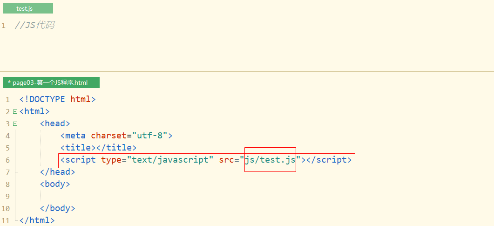
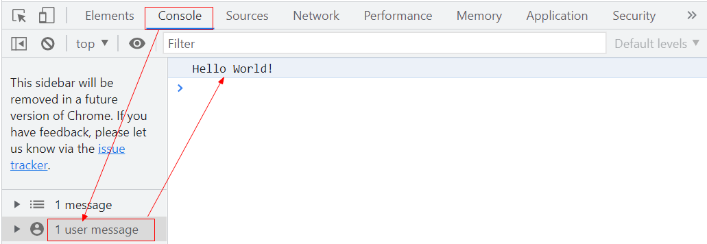
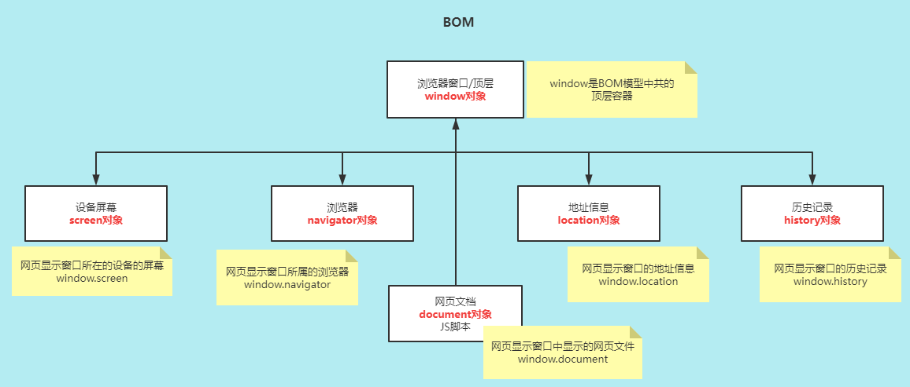
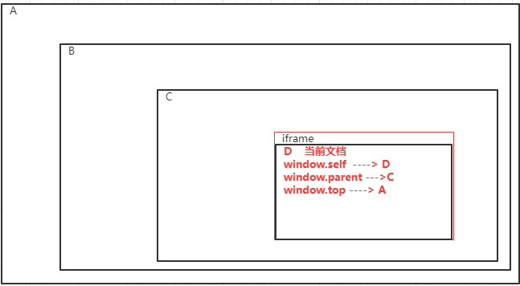
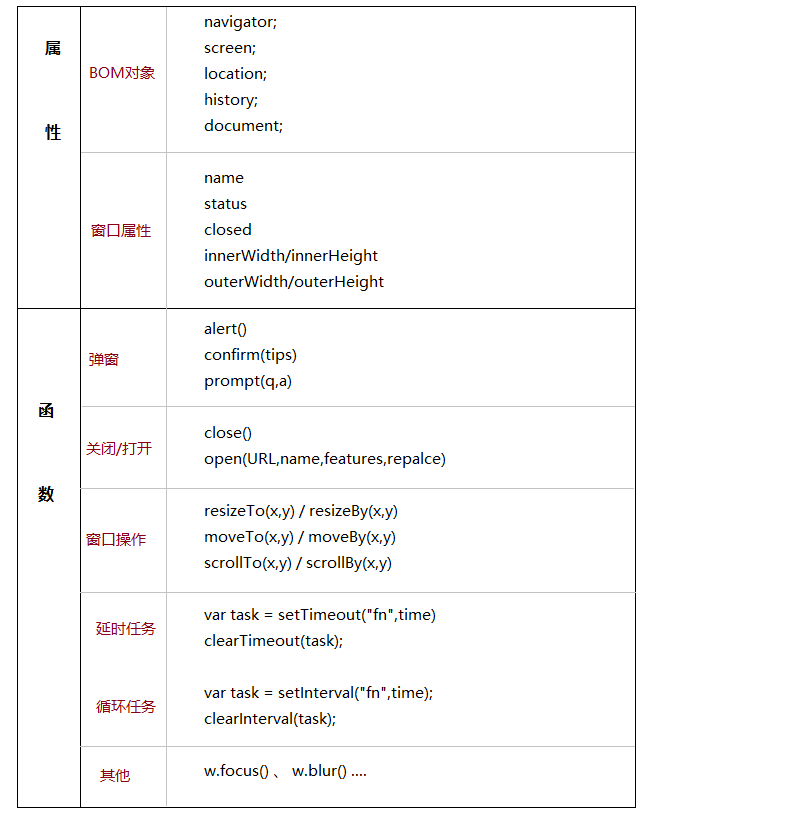
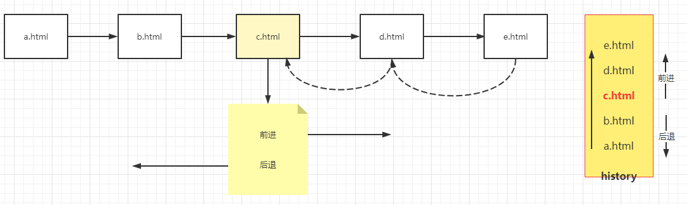
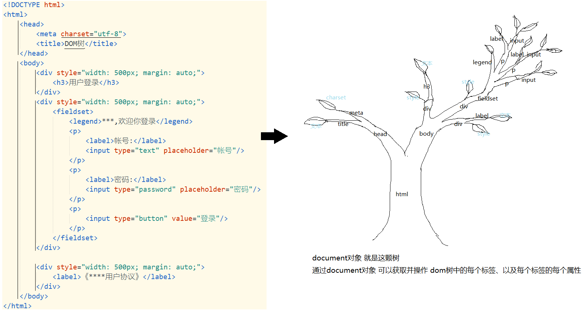
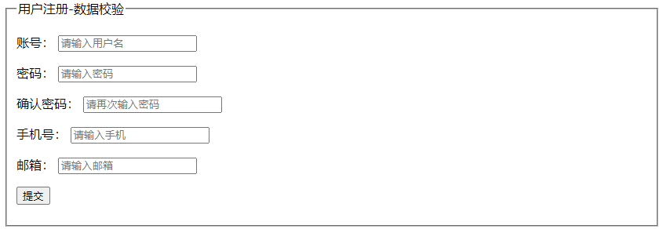

> HTML 决定了网页中的内容
>
> CSS 决定网页内容的显示效果
>
> JavaScript 决定了网页中标签的功能及动态效果

## 一、JavaScript介绍

### 1.1 JavaScript简介

> JavaScript是一种`基于对象的、事件驱动型的、解释型的脚本`语言

- 基于对象：（区别于面向对象），JavaScript和Java语言一样可以通过对象调用方法 `obj.fn()`
- 事件驱动：网页文档中的HTML标签事件触发JavaScript代码执行
- 解释型：边解释边执行（不会先对网页进行编译生成中间文件）
- 脚本语言：JavaScript不会独立运行，依赖于网页文件（HTML文档）存在  （通俗的理解为js要写在网页中）

```HTML
<!DOCTYPE html>
<html>
	<head>
		<meta charset="utf-8">
		<title></title>
		<style type="text/css">
			.btnStyle{
				width: 200px;
				height: 35px;
				background: lightcoral;
				border: none;
				border-radius: 5px;
				color: white;
				font-weight: bold;
			}
		</style>
		
		<script type="text/javascript">
			function test(){
				alert("Hello World!"); //弹窗提示
				var m = 10/0;
			}
		</script>
	</head>
	<body>
		<input type="button" value="测试按钮" class="btnStyle" onclick="test()"/>
	</body>
</html>

```

### 1.2 JavaScript的发展史

> JS是一种嵌入在网页中的脚本语言，网页是通过浏览器加载并显示的，因此JS的执行是在浏览器中完成的；对于浏览器而言，它能够执行JS代码，在浏览器中内置了JavaScript解释器（JavaScript引擎）

JavaScript是在1995年由一个知名的浏览器厂商Netscape（网景）公司的Brench Eich，基于网景导航者浏览器设计开发而来的，这个脚本语言最开始命名为LiveScript，后来基于Netscape与sun公司的合作以及LiveScript知名度比较低，后来就改名为JavaScript。

JavaScript的设计是为了完成网页文件的交互功能。

JavaScript是基于ECMAScript标准设计的，截止到2012，ECMAScript5.1标准已经普及；2015年，ECMAScript6的标准发布，目前大部分浏览器兼容ES6，但是为了保证浏览器对JavaScript普适性的支持，在JavaScript学习和使用中，更多的使用ES5标准规定的语法。

### 1.3 JavaScript作用

> JS设计的目的是实现网页的交互能力

#### 1.3.1 JS可以干什么？

- 可以动态改变网页中HTML标签的属性
- 可以动态改变网页中HTML标签的样式
- 可以对用户输入的数据进行合法性校验（格式检查）

- 可以动态操作（新增HTML标签、删除HTML标签、修改HTML标签）网页中的HTML标签
- 可以实现页面数据的异步通信

```html
<!DOCTYPE html>
<html>
	<head>
		<meta charset="utf-8">
		<title></title>
		<script type="text/javascript">
			function test(){
				//操作HTML标签的属性
				document.getElementById("img1").width = 200;
				document.getElementById("img1").height = 200;
				//操作HTML标签的样式
				document.getElementById("img1").style.borderRadius = "50%";
				//移出HTML标签（DOM操作）
				document.getElementById("img1").remove();
				//数据的异步交互
			}
		</script>
	</head>
	<body>
		 <br/>
		<input type="button" value="测试按钮"  onclick="test()"/>
	</body>
</html>
```

#### 1.3.2 JS不能干什么？

- JS虽然是在用户的浏览器中执行，但是JS不能访问用户的本地文件；
- JS不能操作来自于不同服务的网页文档

## 二、第一个JavaScript程序

### 2.1 JavaScript写在哪里？

- JS代码写在HTML文档的`script`标签中，`script`可以写在HTML文档的任何位置，通常写在body标签后，或者body标签中的最后面，并且一个HTML文档中支持多个script标签

  ```html
  <!DOCTYPE html>
  <html>
  	<head>
  		<meta charset="utf-8">
  		<title></title>
  		<script type="text/javascript">
  			//JS代码
  		</script>
  	</head>
  	<body>
  		
  		<script type="text/javascript">
  			// JS代码
  		</script>
  	</body>
  </html>
  ```

- JS代码也可以单独写在一个后缀名为`.js`的文件中，在HTML文档中通过`script`标签引用此JS文件

  | JavaScript代码写在JS文件中                                   |
  | ------------------------------------------------------------ |
  |  |

- 引用JS文件的script标签不能自定义JS代码

  ```html
  <!DOCTYPE html>
  <html>
  	<head>
  		<meta charset="utf-8">
  		<title></title>
  		<!-- script标签可以引用一个JS文件，也可以自定义JS代码实现：
  			1.如果script用来引用一个JS文件，script必须为双标签
  			2.script标签用来引用JS文件之后，则当前script标签中就不能再自定义JS代码
  			3.如果引用JS文件，还要进行自定JS代码实现，需要重新写一个script标签
  		 -->
  		<script type="text/javascript" src="js/test.js"></script>
  	</head>
  	<body>
  		
  		<script type="text/javascript">
  			//自定义JS代码
  		</script>
  	</body>
  </html>
  ```

### 2.2 JavaScript函数（方法）定义

- 我们将实现某个功能的JavaScript代码定义在一个函数中

- 函数的定义语法：

  ```javascript
  function <fnName>([参数]){
      //Javascript代码
  }
  ```

- 示例：（js/test.js）

  ```javascript
  function test(){
  	//相当于Java程序中 System.out.println("Hello World!");  浏览器控制台输出
  	console.log("Hello World!");
  }
  ```

### 2.3 JavaScript函数如何运行

- 通过HTML文档中的事件触发

  ```html
  <!DOCTYPE html>
  <html>
  	<head>
  		<meta charset="utf-8">
  		<title></title>
  		<script type="text/javascript" src="js/test.js"></script>
  	</head>
  	<body>
  		<button onclick="test()">测试按钮</button>
  	</body>
  </html>
  ```

### 2.4 查看浏览器的控制台输出

- 主流的浏览器点击`F12`按键

  

## 三、JavaScript基础语法

> 变量、数据类型
>
> 表达式、流程控制

### 3.1 变量与数据类型

#### 3.1.1 数据类型

> Java是强类型语言：存储不同类型的值的变量声明时，需要声明为不同的类型

```java
int i = 5;
String s = "abc" ;   
```

> JavaScript是`弱类型`语言：
>
> - 变量无论存储什么类型的值，我们一律使用`var`进行变量类型声明
> - 一个变量可以设置不同类型的值
> - 变量声明使用统一var类型，但是变量中存储的值是有类型的

```javascript
var i = 5;   i = "hello";
var s = "abc";

var i = 5;
var j = "5";
console.log(i+1);   //输出 6
console.log(j+1);   //输出 51
```

#### 3.1.2 变量

- 在JS代码如果要使用一个变量，需要先声明
- 声明一个变量需要指定其类型，所有变量都可以使用 `var`
- 如果一个变量只完成声明而没有初始化（赋初始值），则会输出`undefined`

#### 3.1.3  不同类型变量值的初始化

1. 字符串

   ```javascript
   var s = "hello";
   var s = 'hello';
   var s = "My name is 'ergou'";
   var s = 'My name is "ergou"';
   ```

2. 数字

   ```javascript
   var i = 12;		//整数
   var j = 3.14;	//小数
   var k = 10e5;   //科学计数法
   ```

3. 布尔

   ```javascript
   var b1 = true;
   var b2 = false;
   ```

4. 数组

   ```javascript
   var arr1 = new Array();  // JS中创建数组是不需要指定长度的
   arr1[0] = "aaa";
   arr1[1] = "bbb";
   
   var arr2 = new Array("aaa","bbb");
   
   var arr3 = ["aaa","bbb","ccc"];
   ```

5. 对象

   ```javascript
   // JS中{}就表示对象类型，JS对象的属性名可以直接定义，并且对象的属性支持扩展//1.定义stu对象有两个属性var stu = {stuNum:"10001",stuName:"王二狗"};//2.对象号之后扩展一个属性stu.stuGender = "男";
   ```

6. undefined和null

   - 如果一个变量只声明，没有初始化，输出undefined（undefined表示变量没有值）

   - 通过将一个变量值设置为null来清空一个变量的值

   ```javascript
   var i;   //如果直接输出，输出为 undefinedi = "aaa";i = null;  //将i的值设置null，来清空i变量 
   ```

### 3.2 表达式(运算符)

> 表达式就是由变量和运算符组合而成的代码

#### 3.2.1 算术运算符

> 进行算术运算

+、-、*、/除法、%取模

++ 、--

#### 3.2.2 赋值运算符

> 将值赋值给变量

=、+=、-=、*=、/=、%=

```javascript
int i = 5;i+=3;   //===>  i = i+3;
```

#### 3.2.3 字符串拼接+

```javascript
//1.如果+的两端都是数值，+就表示算术运算符//2.如果+有一端是字符串类型值，+就表示字符串拼接var = i+j;
```

#### 3.2.4 关系运算符

> 用于比较两个值的大小关系

`>`、`<`、>=、<=、== 、!=、===(绝对等于：值和类型都相同)

#### 3.2.5 逻辑运算符

> 与或非，用于连接两个逻辑条件

&& 与     ||或       ! 非

#### 3.2.6 三目运算符

```javascript
// 当条件成立时，将v1的值赋值给变量i，如果条件不成立，则将v2赋值给变量ivar i = 条件?v1:v2;
```

### 3.3 流程控制

#### 3.3.1 分支语句

> 当满足不同的条件时，执行不同的代码块

**if语句**

1. 单分支

```javascript
if(条件){    //代码：当条件成立时执行代码}
```

2. 双分支

```javascript
//如果条件成立则执行代码1，不成立则执行代码2   //程序员的浪漫：世界上最遥远的距离不仅是生与死的距离，还有我的if你在else，永远相伴但不相见if(条件){    //代码1   }else{    //代码2}
```

3. 多分支

```javascript
//当条件1成立，则执行代码1，不在判断后续条件//当条件1不成立，则判断条件2，条件2成立，则执行代码2，条件2不成立则继续判断条件3....直到找到第一个成立的条件//如果所有的条件都不成立，则执行else代码块 if(条件1){    //代码1}else if(条件2){    //代码2}else if(条件3){    //代码3}...{    //...}else if(条件n){    //代码n}else{    //代码m}
```

**switch语句**

> 如果case代码后面没有break：当变量n的值与某个case的值相等时，从当前case的代码开始执行，直到遇到break关键字，如果没有break则会从当前case的位置一直执行到switch代码块结束

```javascript
//判断 变量n 的值是否等于v1，如果相等则执行代码1；如果不相等则判断 变量n 的值是否等于v2
//哪个case后面的值与 变量n相等，就执行哪个case的代码，如果所有case的值与n都不相等，则执行default的值
switch(n){
    case v1:
        代码1;
        break;
    case v2:
        代码2;
        break;
    case v3:
        代码3;
        break;
    ...
    case vN:
        代码N;
        break;
    default:
        代码M;
}
```

```html
<!DOCTYPE html>
<html>
	<head>
		<meta charset="utf-8">
		<title></title>
	</head>
	<body>
		<button onclick="test1()">测试按钮</button>
		
		<script type="text/javascript">
			function test1(){
				var n = 5;
				switch(n){
					case 1:
						console.log("春天");
						break;
					case 2:
						console.log("夏天");
						break;
					case 3:
						console.log("秋天");
						break;
					case 4:
						console.log("冬天");
						break;
					default:
						console.log("未知季节");
				}
			}
		</script>
	</body>
</html>
```

#### 3.3.2 循环语句

> 当满足特定条件时，重复执行同一个代码块

**for循环**

```html
<!DOCTYPE html><html>	<head>		<meta charset="utf-8">		<title></title>	</head>	<body>		<button onclick="testFor()">测试FOR</button>		<button onclick="testForIn()">测试ForIn</button>		<script type="text/javascript">			function testFor(){				for(var i=0 ; i<10 ; i++){					console.log("★");				}			}						//遍历JS对象和数组			function testForIn(){				var stu = {stuNum:"10001",stuName:"张三",stuGender:"男"};				//1.遍历对象的属性名				for(v in stu){					//根据对象属性名，从对象中获取属性值					console.log(v+"："+stu[v]);				}								//2. 遍历数组的索引				var arr = ["aaa","bbb","ccc"];				for(i in arr){					//根据索引从数组中获取值					console.log(arr[i]);				}			}		</script>	</body></html>
```


**while循环**

```html
<!DOCTYPE html><html>	<head>		<meta charset="utf-8">		<title></title>	</head>	<body>		<button onclick="testWhile()">测试while</button>		<script type="text/javascript">			function testWhile(){                //注意：while循环，需要根据业务在循环体中修改循环条件变量				var i = 0;				while(i<10){					console.log(i+"★");					i++;				}								//do while ： 无论条件是否成立，都先执行一次循环体代码				//        然后判断条件是否成立，如果成立则继续执行下一次				var j = 10;				do{					console.log("☆");					j++;				}while(j<10); 			}		</script>	</body></html>
```


#### 3.3.3 break 和 continue

> break 和 continue都可以用来中断/终端循环:
>
> - break终止循环：跳出循环
> - continue中止循环：停止本次循环体的执行，进入到下一次循环

```html
<!DOCTYPE html>
<html>
	<head>
		<meta charset="utf-8">
		<title></title>
	</head>
	<body>
		<button onclick="testBreakAndContinue()">测试break和continue的区别</button>
		<script type="text/javascript">
			function testBreakAndContinue(){
				// break终止循环：跳出循环
				for (var i = 1; i <= 10; i++) {
					if(i == 5){
						break;
					}
					console.log("~~~~"+i);
				}
				
				// continue中止循环：停止本次循环体的执行，进入到下一次循环
				for (var i = 1; i <= 10; i++) {
					if(i == 5){
						continue;
					}
					console.log("----"+i);
				}
			}
		</script>
	</body>
</html>
```

### 3.4 JavaScript错误处理

> 当JS引擎执行JS代码的过程中，因为代码错误、数据错误、系统资源等问题都可能导致JS执行过程中的异常

JS中的异常处理机制：

- try：检查其包含的JS代码是否出现错误
- catch：处理JS中的错误（异常）
- finally：无论是否有异常，finally里面的代码总会执行 
- throw：用于创建自定义错误

JS异常处理语法：

```javascript
try{
    if(n >= 0){
       var age = n;
    }else{
       throw "年龄不合法，不能为负数";  
    }
    //JS代码   try会检查JS代码是否出现错误，一旦出现错误就停止JS代码的执行，将错误提交给JS引擎
}catch(e){
    //异常处理代码    JS引擎一旦检测到错误，就停止try中代码的执行，进入到catch代码的执行，进行异常处理
}finally{
    //代码， 无论try中的JS代码是否出现异常，finally里面的代码总会执行 （通常在finally做一些释放资源的工作）
}
```

JS错误处理示例：

```html
<!DOCTYPE html><html>	<head>		<meta charset="utf-8">		<title></title>	</head>	<body>		<button onclick="testError()">测试错误处理</button>				<script type="text/javascript">			function testError(){				try{					console.log("--------------try");					var m = 10;					var n = 2;					if(n!=0){						var k = m/n;  //JS中变量提升：将变量的声明提升至最全面					}else{						throw "n的值不能为0"; //创建自定义错误  （这个地方有错误）					}					console.log("K的值为："+k);				}catch(e){					console.log(e);				}finally{					console.log("--------------finally");				}			}		</script>	</body></html>
```

## 四、JavaScript对象

> 基于对象——通过对象完成属性、方法的调用

### 4.1 JavaScript对象创建

> 在Java中，先定义类，通过类的构造器创建对象，创建的这个类的对象具有类中定义的属性，并且能够调用这个类中定义的方法。
>
> 在JS中对象如何创建？
>
> - 直接通过{}创建对象
> - 通过构造器创建对象

#### 4.1.1 直接创建JS对象

```HTML
<!DOCTYPE html>
<html>
	<head>
		<meta charset="utf-8">
		<title>JS对象</title>
	</head>
	<body>
		<button onclick="testObj()">创建JS对象</button>
		<script type="text/javascript">
			function testObj(){
				//创建对象:通过{}创建对象
				//1.定义对象属性：可以直接在{}中指定对象的属性
				//2.定义对象方法:也可以直接在{}中定义当前对象的方法
				var obj = {
					id:"101",
					name:"zhangsan",
					test1:function(){
						console.log("----test1");
					}
				};
				
				//通过【对象.属性名】可以调用对象属性
                //通过【对象.方法名(参数)】可以调用对象方法
				console.log(obj.id);
				obj.test1();
			}
		</script>
	</body>
</html>
```

#### 4.1.2 使用JS构造函数创建对象

> 在JS中没有类的概念，但是可以定义构造器

```html
<!DOCTYPE html>
<html>
	<head>
		<meta charset="utf-8">
		<title>JS对象</title>
	</head>
	<body>
		<button onclick="testObj2()">使用构造函数创建JS对象</button>
		<script type="text/javascript">
			//1.自定义JS构造函数
			function Student(num,name){
				//1-1.定义属性
				this.stuNum = num;
				this.stuName = name;
				//1-2.定义方法
				this.method1 = function(a){
					console.log("Student---method1:"+a);
				}
				this.method2 = myMethod2;
			}
			
			function myMethod2(){
				console.log("Student---method2");
			}
			
			function testObj2(){
				//2.使用构造函数创建JS对象:通过构造函数创建的对象可以调用构造器中的属性和方法
				var s1 = new Student("1001","张三");
				console.log(s1);
				s1.method1("wahaha");
				s1.method2();
				
				var s2 = new Student("1002","李四");
				console.log(s2)
				s2.method1("hehehe");
			}
		</script>
	</body>
</html>

```

### 4.2 JavaScript扩展属性

> 扩展属性——对象本没有某个属性，但是我们可以对其进行新增

#### 4.2.1 对象扩展属性

当对象创建好之后，我们可以通过`对象.新属性=属性值;`语法给当前对象新增属性，这个新增的属性只有当前对象才可以调用，即使通过同一个构造器创建的其他对象也没有这个属性。

```javascript
//定义构造函数，有两个属性function Student(num,name){    this.stuNum = num;    this.stuName = name;}function testObj2(){    //通过Student构造函数，创建了第一个对象    var s1 = new Student("1001","张三");    //给s1对象扩展 stuGender 属性    s1.stuGender = "男";    console.log(s1);	    //通过Student构造函数，创建了第二个对象，s1扩展的属性s2是没有    var s2 = new Student("1002","李四");    console.log(s2)}
```

#### 4.2.2 构造函数扩展属性

针对构造器方式创建JS对象，我们还可以扩展构造器的属性，当扩展构造器属性之后，此构造器创建的所有对象都有这个属性。

```javascript
//定义构造函数，有两个属性function Student(num,name){    this.stuNum = num;    this.stuName = name;}function testObj2(){    //【构造器扩展属性: 构造器名.prototype.新属性名 = 属性值;】    Student.prototype.stuGender = "男";	    //通过Student构造器创建的对象，都有扩展的stuGender属性    var s1 = new Student("1001","张三");    console.log(s1);	//输出对象看不到 stuGender属性    console.log(s1.stuGender); // 但是可以通过对象调用stuGender属性    var s2 = new Student("1002","李四");    console.log(s2);    console.log(s2.stuGender);}
```


## 五、JavaScript内置对象

### 5.1 内置对象介绍

#### 5.1.1 什么是JS内置对象？

> JS中我们可以自定义构造器，通过自定义构造器创建JS对象。
>
> JavaScript引擎预定义了一些构造器，并且在构造器中定义了能够完成特定功能的函数，通过这些构造器我们可以直接创建对象，创建的对象就可以可以调用函数完成功能。
>
> JS内置对象：就是通过JavaScript预定义构造器创建的对象。

#### 5.1.2 JavaScript中提供了哪些构造器？

| 构造器      | 说明                                                         |
| ----------- | ------------------------------------------------------------ |
| `Array`     | JavaScript中的数组(集合)，在此构造器中定义了可以对数据进行操作的函数 |
| `String`    | 字符串，其中定义了对字符串进行截取、分隔、正则校验等操作的函数、 |
| `Date`      | 日期，包含对日期进行操作函数                                 |
| `Math`      | 数学，其中定义了数学运算绝对值、三角函数、四舍五入等操作的函数 |
| Number      | 数值，包含对数值进行操作的函数                               |
| `RegExp`    | 正则表达式，用于对字符串进行正则校验                         |
| Boolean     | 布尔                                                         |
| Object      | 通用对象                                                     |
| Error       | 用于异常处理的错误对象                                       |
| `Functions` | 顶层对象，Functions属性--全局属性，Functions函数--全局函数   |
| Events      | 事件对象     例如按钮发生了点击事件                          |

### 5.2 String对象

> String 构造器创建的对象

```html
<!DOCTYPE html>
<html>
	<head>
		<meta charset="utf-8">
		<title>内置对象</title>
	</head>
	<body>
		
		<button onclick="testString()">测试String</button>
		
		<script type="text/javascript">
			function testString(){
				//1.创建String对象
				var str1 = "www.qfedu.com";
				var str2 = new String("www.TAOBAO.com");
				
				//2.属性
				// length属性获取当前字符串的长度
				var len = str1.length;
				
				//3.常用函数
				// charAt : 获取str1中索引为3的字符（索引从0开始）
				var c = str1.charAt(3);
				
				// indexOf: 获取str1中第一次出现"edu"的索引
				var i = str1.indexOf("edu");
				
				// lastIndexOf: 获取str2中最后一个“o”的索引
				var j = str2.lastIndexOf("o");
				
				// split :分隔字符串，将str1用"."分隔成多个字符串，存放到arr中
				var arr = str1.split(".");
				
				// substring : 从str1字符串索引为4的位置开始截取，直到str1结束
				var s1 = str1.substring(4);
				// 从str1字符串索引为4的位置开始截取(包含)，直到索引为9的位置(不包含)
				var s2 = str1.substring(4,9); 
				
				//substr:从str1字符串索引为4的位置开始截取(包含),一共截取5个字符
				var s3 = str1.substr(4,5);
				
				// toUpperCase : 将str2所有字母都转大写
				var s4 = str2.toUpperCase();
				//toLowerCase : 将str2所有字母都转小写
				var s5 = str2.toLowerCase();
				
				//match : 判断str3字符串的格式是否匹配reg的规则，如果不匹配则返回值为null
				var str3 = "1303030330";  //假设str3是用户在页面输入的手机号
				var reg = "^1[3,5,7,8]\\d{9}$"; //手机号码的规则（正则表达式）
				var b = str3.match(reg);
				
				console.log(b);
			}
		</script>
		
	</body>
</html>
```

### 5.3 RegExp对象（正则）

> 专门用于对字符串的格式进行规则的检查（规则：通过正则表达式体现）

```html
<!DOCTYPE html><html>	<head>		<meta charset="utf-8">		<title></title>	</head>	<body>		<button onclick="testRegExp()">测试RegExp</button>		<script type="text/javascript">			function testRegExp(){				//String对象的match函数进行正则校验				var str1 = "1303030330";				var reg1 = "^1[3,5,7,8]\\d{9}$";				//match函数：如果校验匹配返回字符串，不匹配返回null				var r = str1.match(reg1);				console.log(r);								//------------------------------------------------------------------				//RegExp对象的test函数进行正则校验				var str = "1303030330";				// 一个RegExp对象就是一个正则规则				var reg = new RegExp("^1[3578]\\d{9}$");				//test 函数：如果匹配返回true，不匹配返回false				var b = reg.test(str);				console.log(b);			}		</script>	</body></html>
```

**正则表达式：**

1. 特殊符号：

   | 符号   | 作用                   |
   | ------ | ---------------------- |
   | \d     | 任意数字 ，相当于[0-9] |
   | \s     | 空白字符               |
   | \b     | 单词便捷               |
   | \u???? | 匹配unicode字符        |

2. 区间

   | 表达式      | 说明                            |
   | ----------- | ------------------------------- |
   | [0-9]       | 从0到9的任意数字 [0123456789]   |
   | [13579]     | 表示1、3、5、7、9中任意一个数字 |
   | [a-z]       | 从a到z的任意一个小写字母        |
   | [A-Z]       | 从A到Z的任意一个大写字母        |
   | [a-zA-Z]    | 任意一个字母                    |
   | [0-9a-zA-Z] | 任意字母和数字                  |

3. 量词

   | 量词   | 作用      |
   | ------ | --------- |
   | a+     | 至少一个a |
   | a*     | 0~n个a    |
   | a?     | 0~1个a    |
   | a{m}   | m个a      |
   | a{m,n} | m~n个     |

### 5.4 Math

> Math中提供的函数（静态函数），可以通过`Math.`直接调用

```html
<!DOCTYPE html>
<html>
	<head>
		<meta charset="utf-8">
		<title>内置对象-Math</title>
	</head>
	<body>
		<button onclick="testMath()">测试Math</button>
		<script type="text/javascript">
			function testMath(){
				//1.常量属性
				var e = Math.E;
				var pi = Math.PI;
				
				//2.“静态”数学函数
				//random : 随机产生一个[0,1)小数
				var num = Math.random()*10;
				
				//round : 对参数进行四舍五入得到一个整数
				var i = Math.round(num);  //0-10
				
				//floor：只舍不入，获取比参数小的最大整数
				var j = Math.floor(num);  //0-9
				
				//ceil: 只入不舍，获取大于等于参数的最小整数
				var k = Math.ceil(num);  
				
				// abs : 获取参数的绝对值
				var m = Math.abs(-5);
				
				//sqrt : 获取参数的平方根
				var n = Math.sqrt(9);
				
				console.log(n);
			}
		</script>
	</body>
</html>
```

### 5.5 Array对象

> 数组，存放一组相同类型数据的数据结构
>
> 在JS中，同一个数组中可以存放多种不同类型的数据，相当于Java等强类型语言中的集合（长度可变，可以存储多种类型数据）

```html
<!DOCTYPE html>
<html>
	<head>
		<meta charset="utf-8">
		<title></title>
	</head>
	<body>
		<button onclick="testArray()">测试Array</button>
		<script type="text/javascript">
		function testArray(){
			//1.创建数组
			// a.通过构造器创建数组
			var arr1 = new Array();
			var arr2 = new Array("aaa","bbb","ccc");
			// b.静态初始化数组
			var arr3 = ["a","b","c","d",1,2,3];
			
			//2.数组的操作
			// a.添加元素(索引可以不连续，数组长度=最大索引+1)
			arr1[0] = "wanglaoji";
			arr1[1] = "jiaduobao";
			arr1[5] = "kangshifu";
			// b.通过索引获取数组中的元素
			var v1 = arr1[0];
			var v2 = arr1[1];
			var v3 = arr1[9]; //数组索引越界（返回undefined）
			// c.遍历
			//   ①for循环遍历
			for (var i = 0; i <arr1.length; i++) {
				var v = arr1[i];
				console.log(i+":"+v);
			}
			//   ②for ... in  遍历获取的数组元素的索引
			for(var i in arr2){
				var v = arr2[i];
				console.log(i+":"+v)
			}
			
			//3.Array中定义的函数
			// join :将数组中所有的元素使用"-"拼接成一个字符串
			var s1 = arr3.join("-");
			//slice : 从当前数组中截取元素，生成一个新数组
			var arr = arr3.slice(2,4);
			// reverse: 将当前数组中的元素反转
			arr3.reverse();
			
			console.log(arr3);
		}
		</script>
	</body>
</html>
```

### 5.6 Date对象

```html
<!DOCTYPE html>
<html>
	<head>
		<meta charset="utf-8">
		<title>内置对象Date</title>
	</head>
	<body>
		<button onclick="testDate()">测试Date</button>
		<script type="text/javascript">
			function testDate(){
				//1.创建Date对象:一个Date对象就表示一个时间，new Date()表示系统当前时间
				var date = new Date();
				
				//2. 函数
				// set*: 设置当前日期的日期成分
				date.setFullYear(2029);
				date.setMonth(11);
				date.setDate(28);
				
				// get* : 从当前日期对象中获取 时间成分 （年月日时分秒毫秒星期）
				var year = date.getYear()+1900;  //获取年份，相对于1900年的偏移年份
				var year2 = date.getFullYear();  //获取公元纪年你年份
				
				var month = date.getMonth()+1;	//获取月份0-11
				var d = date.getDate();			//获取日期
				var hour = date.getHours();		//获取小时
				var min = date.getMinutes();	//获取分钟
				var sec = date.getSeconds();	//获取秒
				var ms = date.getMilliseconds();//获取毫秒
				var day = date.getDay();		//获取星期
				
			var timeStr = year+"年"+month+"月"+d+"日 "+hour+":"+min+":"+sec+" "+ms+" 星期"+day;
				
				console.log(timeStr);
			}
		</script>
	</body>
</html>
```

### 5.7 Functions对象

全局函数

> 全局对象是一个预定义的对象，作为JavaScript中全局函数的占位符。通过全局对象，可以访问所有JS中的全局函数、全局属性。
>
> 全局对象不是任何对象的属性，所以它没有名称。
>
> - obj.method();
> - 全局函数();
>
> PS：我们将全局函数归纳到Functions对象，但是在JS中`window`对象作为顶层容器，在语法上可以通过`window`对象调用全局函数。  例如：window.eval()

```html
<!DOCTYPE html>
<html>
	<head>
		<meta charset="utf-8">
		<title></title>
	</head>
	<body>
		
		<button onclick="testFunctions()">测试全局函数</button>
		
		<script type="text/javascript">
			function testFunctions(){
				
			//全局函数：通过全局对象Functions调用全局函数，Functions没有名称，因此全局函数可以直接调用
				//parseInt：将字符串转换成整数数值
				var s1 = "123";
				var m = parseInt(s1);
				//parseFloat：将字符串转换成小数数值
				var s2 = "3.14";
				var n = parseFloat(s2);
				
				var url = "http://www.qfedu.com/?param=中华有我";
				//encodeURI ： 对网址的参数部分进行编码（特殊符号和中文）
				var newUrl = encodeURI(url);
				//decodeURI：对编码后的网址进行解码
				var url2 = decodeURI(newUrl);
				
				//escape：对字符串中的特殊和中文进行编码
				var str1 = "My name is 韩梅梅";
				var s = escape(str1);
				//unescape：对编码后的字符串进行解码
				var str2 = unescape(s);
				
				//当一个字符串满足JS中对象的格式（JSON格式），我们可以通过eval转换成对象格式
				var jsonStr = "{stuNum:'1001',stuName:'张三'}";
				//eval:将满足JSON格式的字符串转换成JS对象
				var stu = eval("("+jsonStr+")");
				
				console.log(stu.stuName);
			}
		</script>
	</body>
</html>
```

## 六、BOM 浏览器对象模型

### 6.1 BOM介绍

Browser Object Model 浏览器对象模型。



JS编写在网页文档(document)中，网页文档运行在浏览器窗口(window)中，像document、window这样的对象也成为JS的`宿主对象`

### 6.2 window对象

window对象是BOM模型中的顶层容器，表示打开的浏览器窗口

#### 6.2.1 获取window对象

window对象是所有浏览器都支持，是浏览器内置的对象，在JS代码中可以直接使用。

#### 6.2.2 window对象属性

1. BOM对象属性

   ```javascript
   //获取BOM对象属性
   var v = window.navigator;
   var s = window.screen;
   var l = window.location;
   var h = window.history;
   var d = window.document;
   ```

2. 浏览器窗口属性

   ```javascript
   //获取/设置当前浏览器窗口的名字
   window.name = "w1";
   var name = window.name;
   
   //获取/设置当前浏览器窗口的状态栏
   window.status = "☆";
   
   //获取当前窗口是否关闭
   var s = window.closed;
   
   //innerWidth: 获取浏览器的内部宽度   (IE8及以下版本不支持当前属性)
   //innerHeight：获取浏览器的内部高度   (IE8及以下版本不支持当前属性)
   var w = window.innerWidth;
   var h = window.innerHeight;
   
   //outerWidth: 获取浏览器的外部宽度   (IE8及以下版本不支持当前属性)
   //outerHeight：获取浏览器的外部高度   (IE8及以下版本不支持当前属性)
   var ow = window.outerWidth;
   var oh = window.outerHeight;
   ```

3. 窗口对象属性

   

   ```javascript
   //self 就是当前窗口本身，等价于windows对象
   var w = window.self;
   //parent : 如果当前网页是现在另一个网页的iframe中，parent属性就表示获取当前窗口的上一级窗口 
   var p = window.parent;
   //top ： 获取当前窗口的顶层窗口
   var t = window.top;
   ```

#### 6.2.3 window对象函数

##### 1.弹窗函数

```javascript
// alert ： 警告提示框,当用户在网页中进行错误操作时用于提示
window.alert("请注意，倒车！");

//confirm：消息确认框，当用户进行不可逆、且影响数据的操作，进行用户确认
//   此弹窗有返回值，当用户点击“确定”时，返回true
var v = window.confirm("请问你确定删除这个信息吗？");

//prompt：用户交互输入框，参数1(弹框问题提示信息)，参数2(输入框默认值)
//   此弹窗有返回值，如果点击确定返回值为输入框中的值，点击取消返回值为null
var v= window.prompt("请输入你的出生年份:","2021");
```

##### 2.打开/关闭窗口

```javascript
//close：关闭当前窗口对象（IE有确认提示，谷歌就直接关了）
window.close();

//open(URL,name,features,replace) ： 打开一个新窗口
// 参数1：新打开的窗口显示的网址
// 参数2：新打开窗口的名字
// 参数3：新打开的窗口的属性
// 参数4：是否替换当前窗口  默认值为false，设置为true表示打开的新窗口会替代当前窗口
// 返回值：打开的窗口对象
var URL = "https://www.baidu.com";
var features = "";
// var w = window.open(URL); 
//var w = window.open(URL,"百度");
// var w = window.open(URL,"百度",features);
var w = window.open(URL,name,true);
```

**打开新窗口特征（Window Features）**

| channelmode=yes\|no\|1\|0 | 是否使用剧院模式显示窗口。默认为 no。                        |
| ------------------------- | ------------------------------------------------------------ |
| directories=yes\|no\|1\|0 | 是否添加目录按钮。默认为 yes。                               |
| fullscreen=yes\|no\|1\|0  | 是否使用全屏模式显示浏览器。默认是 no。处于全屏模式的窗口必须同时处于剧院模式。 |
| height=pixels             | 窗口文档显示区的高度。以像素计。                             |
| left=pixels               | 窗口的 x 坐标。以像素计。                                    |
| location=yes\|no\|1\|0    | 是否显示地址字段。默认是 yes。                               |
| menubar=yes\|no\|1\|0     | 是否显示菜单栏。默认是 yes。                                 |
| resizable=yes\|no\|1\|0   | 窗口是否可调节尺寸。默认是 yes。                             |
| scrollbars=yes\|no\|1\|0  | 是否显示滚动条。默认是 yes。                                 |
| status=yes\|no\|1\|0      | 是否添加状态栏。默认是 yes。                                 |
| titlebar=yes\|no\|1\|0    | 是否显示标题栏。默认是 yes。                                 |
| toolbar=yes\|no\|1\|0     | 是否显示浏览器的工具栏。默认是 yes。                         |
| top=pixels                | 窗口的 y 坐标。                                              |
| width=pixels              | 窗口的文档显示区的宽度。以像素计。                           |

##### 3.窗口操作函数

对浏览器窗口进行尺寸设置、位置设置、滚动条操作等的函数

```html
<!DOCTYPE html>
<html>
	<head>
		<meta charset="utf-8">
		<title></title>
	</head>
	<body>
		<button onclick="testWindow()">测试window</button>
		<div style="height: 1500px; width: 2500px; background: lemonchiffon;">
			1<br><br><br><br><br><br><br><br><br><br><br><br><br><br><br><br>
			2<br><br><br><br><br><br><br><br><br><br><br><br><br><br><br><br>
			3<br><br><br><br><br><br><br><br><br><br><br><br><br><br><br><br>
			4<br><br><br><br><br><br><br><br><br><br><br><br><br><br><br><br>
			5<br><br><br><br><br><br><br><br><br><br><br><br><br><br><br><br>
		</div>
		<script type="text/javascript">
			function testWindow(){
				//打开新窗口，返回值w就表示新打开的浏览器窗口，w本身就是一个window对象
				//var w = window.open("http://www.qfedu.com","千锋官网","width=400,height=300");
				
				//1.修改窗口尺寸
				// resizeTo：将w窗口尺寸修改为 *,*
				w.resizeTo(800,600);
				// resizeBy：在窗口之前的尺寸宽度和高度各增加多少
				w.resizeBy(800,600)
				
				//2.改变窗口位置
				//moveTo：将窗口移动到指定的位置
				//	参数1:窗口与屏幕左边的距离
				//  参数2:窗口与屏幕顶端的距离
				w.moveTo(200,100);
				//moveBy：基于窗口当前的位置，横向偏移和纵向偏移
				w.moveBy(200,100);
				
				//3.滚动滚动条(针对当前窗口的滚动条操作)
				//scrollTo：将当前窗口的横向和纵向滚动条滚动指定的偏移量(x,y)
				window.scrollTo(100,300);
				//scrollBy：将当前窗口的横向和纵向滚动条滚动指定相对偏移量
				window.scrollBy(-100,-200);
			}
		</script>
	</body>
</html>
```

##### 4.延时/循环任务

延时任务：延迟指定的时间之后再去调用对应的函数

```html
<!DOCTYPE html>
<html>
	<head>
		<meta charset="utf-8">
		<title></title>
	</head>
	<body>
		<button onclick="test1()">打开延时任务</button>
		<button onclick="test2()">关闭延时任务</button>
		
		<script type="text/javascript">
			var task1;
		
			function test1(){
				console.log("~~~~~~~~test1");
				//setTimeout，延时调用指定方法
				//  参数1：调用的方法，  参数2：延迟的时间（单位：ms）
				task1 = window.setTimeout( "showDate()",3000);
			}
			
			function showDate(){
				var date = new Date();
				date.setFullYear(2029);
				date.setMonth(11);
				date.setDate(28);
				date.setHours(14);
				
				var year = date.getYear()+1900;  //获取年份，相对于1900年的偏移年份
				var month = date.getMonth()+1;	//获取月份0-11
				var d = date.getDate();			//获取日期
				var hour = date.getHours();		//获取小时
				var min = date.getMinutes();	//获取分钟
				var sec = date.getSeconds();	//获取秒
				
				var str = year+"-"+month+"-"+d+" "+hour+":"+min+":"+sec;
				console.log(str);
			}
		
			function test2(){
				console.log("~~~~~~~~test2");
				//关闭未执行的延时任务
				window.clearTimeout(task1);
			}
		</script>
	</body>
</html>
```


循环任务：间隔指定的时间循环调用函数

```html
<!DOCTYPE html>
<html>
	<head>
		<meta charset="utf-8">
		<title></title>
	</head>
	<body>
		
		<button onclick="test1()">打开循环任务</button>
		<button onclick="test2()">关闭循环任务</button>
		
		<script type="text/javascript">
			var task2;
		
			function test1(){
				console.log("~~~~~~~~test1");
				//setInterval，启动循环任务
				//  参数1：调用的方法，  参数2：间隔的时间（单位：ms）
				task2 = window.setInterval( "showDate()",1000);
			}
			
			function showDate(){
				var date = new Date();
				date.setFullYear(2029);
				date.setMonth(11);
				date.setDate(28);
				date.setHours(14);
				
				var year = date.getYear()+1900;  //获取年份，相对于1900年的偏移年份
				var month = date.getMonth()+1;	//获取月份0-11
				var d = date.getDate();			//获取日期
				var hour = date.getHours();		//获取小时
				var min = date.getMinutes();	//获取分钟
				var sec = date.getSeconds();	//获取秒
				
				var str = year+"-"+month+"-"+d+" "+hour+":"+min+":"+sec;
				console.log(str);
			}
		
			function test2(){
				console.log("~~~~~~~~test2");
				//clearInterval：关闭正在进行的循环任务
				window.clearInterval(task2);
			}
		</script>
	</body>
</html>
```

#### 6.2.4 window对象总结

> window对象调用属性、函数都可以省略



### 6.3 screen对象

> screen对象，表示网页显示的硬件设备的屏幕
>
> screen是一个只读对象，它收集硬件屏幕的相关参数，我们可以通过此对像获取当前终端屏幕的相关参数。

```html
<!DOCTYPE html>
<html>
	<head>
		<meta charset="utf-8">
		<title></title>
	</head>
	<body>
		<button onclick="testScreen()">测试Screen</button>
		
		<script type="text/javascript">
			function testScreen(){
				//1.获取屏幕的宽度和高度(分辨率)
				var w = screen.width;
				var h = screen.height;
				
				//2.获取屏幕可用的宽度和高度（除掉状态栏）
				var aw = screen.availWidth;
				var ah = screen.availHeight;
				
				//3.屏幕硬件一英寸的物理像素点
				var xdpi = screen.deviceXDPI;
				var ydpi = screen.deviceYDPI;
				
				alert(xdpi+"*"+ydpi);
				//练习：通过获屏幕的宽度和高度，打开一个新窗口，使其位于屏幕的正中间
			}
		</script>
	</body>
</html>
```

### 6.4 navigator对象

> navigator对象包含了浏览器相关的信息

```html
<!DOCTYPE html>
<html>
	<head>
		<meta charset="utf-8">
		<title></title>
	</head>
	<body>
		<button onclick="testnavigator()">测试navigator</button>
		
		<script type="text/javascript">
			function testnavigator(){
				
				//返回浏览器的名称（在老版本的IE中可以测试）
				var name = navigator.appName;
				
				//返回浏览器的代码名
				var code = navigator.appCodeName;
				
				//返回浏览的平台及版本信息
				var version = navigator.appVersion;
				
				//返回浏览器的语言环境（并不是所有浏览器都支持）
				var lang = navigator.browserLanguage;
				
				//检查当前浏览器是否启用cookie
				var b = navigator.cookieEnabled;
				
				console.log(b);
			}
		</script>
	</body>
</html>
```

### 6.5 location对象

> 表示当前浏览器窗口的地址信息，通过此对象可以获取地址栏信息、设置地址栏信息

```html
<!DOCTYPE html>
<html>
	<head>
		<meta charset="utf-8">
		<title></title>
	</head>
	<body>
		
		<button onclick="testLocation()">测试Location</button>
		
		<script type="text/javascript">
			function testLocation(){
		//获取地址栏完整的网址  http://127.0.0.1:8848/demo3/page20-BOM-location.html?key=value
		//                    协议   主机       端口   路径                         参数
				var s1 = location.href;
				//获取地址栏网址的协议
				var s2 = location.protocol;
				//获取地址栏网址的端口
				var s3 = location.port;
				// 获取地址栏网址的主机和端口
				var s4 = location.host;
				// 获取地址栏网址的主机
				var s5 = location.hostname;
				// 获取地址栏网址的资源路径
				var s6 = location.pathname;
				
				//★ 修改地址栏完整的网址（可以实现网页跳转）
				location.href = "http://www.qfedu.com/";
				
				
				//location对象的函数
				//reload ： 重新载入当前网页（刷新网页）
				location.reload();
				//replace：使用参数指定的网址替换当前地址栏的网址（实现网页跳转）
				location.replace("http://www.qfedu.com/");
			}
		</script>
	</body>
</html>
```

### 6.6 history对象

> history对象包含了用户在当前浏览器窗口中访问过的URL



```html
<!DOCTYPE html>
<html>
	<head>
		<meta charset="utf-8">
		<title>C</title>
	</head>
	<body>
		C页面
		<hr/>
		<a href="d.html">跳转到D页面</a>
		<hr/>
		<button onclick="test1()">🔙</button>
		<button onclick="test2()">➡</button>
		<button onclick="test3()">历史记录的数量</button>
		
		<script type="text/javascript">
			function test1(){
				//back ： 返回上一个页面
				//history.back();
				history.go(-1);
			}
			function test2(){
				//forward：切换到下一个页面
				//history.forward();
				history.go(1);
			}
			function test3(){
				//length属性，获取历史记录中网址的个数
				var len = history.length;
				console.log(len);
			}
		</script>
	</body>
</html>
```


## 七、DOM 文档对象模型

### 7.1 文档对象模型介绍

> DOM树——对于一个网页文件，我们可以类比做一颗树，根标签HTML看做树根，文档中所有的标签都可以理解为这棵树上的树枝或叶子。
>
> 通过DOM树结构，我们可以从根标签有序的获取、操作文档中任何一个子标签。

#### 7.1.1 DOM树

| DOM树模型                                                    |
| ------------------------------------------------------------ |
|  |

#### 7.1.2 相关术语

元素：标签以及标签所包含的内容

元素属性：标签的属性

节点：元素、属性、文本统称为节点（元素—标签节点、属性—属性节点、文本—文本节点）

节点名称：标签节点的节点名就是标签名，属性节点的节点名就是属性名，文本节点的节点名是text

### 7.2 document对象

document对象指代的就是一个网页文档，document对象提供属性、函数大多都是获取网页文档中的元素

#### 7.2.1 集合属性

```javascript
// all : 获取当前网页文档中的所有元素
var arr1 = document.all;

// imgs : 获取当前网页文档中所有图片
var arr2 = document.images;

// links: 获取当前网页文档中所有的链接(a,area)
var arr3 = document.links;

// forms：获取当前网页文档中的form元素
var arr4 = docuemnt.forms;
```

#### 7.2.2 其他属性

```javascript
// body:获取当前网页文档中的body元素
var body = document.body;

// title：获取当前网页文档的标题内容
var title = document.title;
//        设置当前文档的标题
document.title = "千锋Java";

// URL : 获取当前网页文档的URL
var url = document.URL;

// cookie : 向cookie中添加新的数据
document.cookie = "key=value";
document.cookie = "key2=value2";
// cookie : 获取cookie中缓存的内容
var cs = document.cookie;
```

#### 7.2.4 函数

1. 流操作

   ```html
   <!DOCTYPE html>
   <html>
   	<head>
   		<meta charset="utf-8">
   		<title>document对象</title>
   	</head>
   	<body>
   		<button onclick="testDocument()">测试document对象</button>
   		<script type="text/javascript">
   			function testDocument(){
   				//write : 通过网页输出流将数据输出并显示到网页中
   				//        如果执行多次write函数使用的是同一个流，则输出的数据会追加
   				//        如果多次write使用的是不同的流，后面write的内容会覆盖之前的内容
   				document.write("从前有座山");
   				document.write("山里有座庙");
   				
   				//close: 关闭当前网页输出流，关闭之后如果执行write，则会打开新的流
   				document.close();
   				
   				//open ：打开并使用一个新的流
   				document.open();
   				document.write("庙里有...");
                   
                   //writeln
   			}
   		</script>
   	</body>
   </html>
   ```

2. 获取网页元素的函数

   ```html
   <!DOCTYPE html>
   <html>
   	<head>
   		<meta charset="utf-8">
   		<title>document对象</title>
   	</head>
   	<body>
   		<br/>
   		<br/>
   		<br/>
   		<p>p1</p>
   		<p class="cc">p2</p>
   		<p>p3</p>
   
   		<button onclick="test1()">测试getElement...函数</button>
   		
   		<script type="text/javascript">
   
   			function test1(){
   				//getElementById：根据标签的id属性获取一个元素
   				var e = document.getElementById("img2");
   				
   				//getElementsByName：根据标签的name属性获取一组元素
   				var es = document.getElementsByName("m1");
   				
   				//getElementsByClassName：根据标签的class属性获取一组元素
   				var es2 = document.getElementsByClassName("cc");
   				
   				//getElementsByTagName：根据标签名获取一组元素
   				var es3 = document.getElementsByTagName("p");
   				console.log(es3);
   			}
   		</script>
   	</body>
   </html>
   ```

### 7.3 对HTML标签的操作

> 对HTML标签的操作，主要是标签属性操作和标签样式操作

```html
<!DOCTYPE html>
<html>
	<head>
		<meta charset="utf-8">
		<title></title>
		<style type="text/css">
			.imgStyle{
				width: 200px;
				height: 200px;
				border-radius: 50%;
				transform: rotate(45deg);
			}
		</style>
	</head>
	<body>
		
		<br/>
		<br/>
		<br/>
		
		<button onclick="testAttrOper()">操作标签属性</button>
		<button onclick="testStyleOper()">操作标签样式</button>
		<button onclick="testClassOper()">操作标签class属性</button>
		
		<script type="text/javascript">
			function testAttrOper(){
				var img = document.getElementById("img2");
				//操作标签属性（标签对象.标签属性名）
				// a.获取属性值
				var s = img.src;
				// b.设置属性值
				img.src = "imgs/img03.png";
			}
		
			function testStyleOper(){
				var img = document.getElementById("img2");
				//操作标签样式 (标签对象.style.样式属性名)
				//样式属性名在css中是以"-"分割多个单词，在JS中操作要使用驼峰命名
				// a.设置标签的样式属性
				img.style.border = "2px rgba(255,0,0,0.5) solid";
				img.style.borderRadius="10px";
				// b.获取标签的样式属性
				var m = img.style.border;
				console.log(m);
			}
		
			function testClassOper(){
				var img3 = document.getElementById("img3");
				//标签对象的 class属性 使用className进行操作
				img3.className = "imgStyle";
			}
		</script>
		
	</body>
</html>
```

### 7.4 案例：表单数据校验

#### 7.4.1 案例说明

> 在网页中的数据提交时（登录、注册、提交订单等），如果必须填写的数据没有填写完成，或者填写的数据格式不符合要求，表单是不允许提交的。在网页中就是通过JS完成数据的完成行及合法性校验。



检验规则：

- 帐号： 不能为空，长度8~20之间，只能包含数字和字母
- 密码：不能为空，长度8~16
- 确认密码：要与密码一致
- 手机号：不能为空，满足手机号码规则
- 邮箱：不能为空，满足邮箱格式规则

#### 7.4.2 案例实现

1. form_validate.js

   ```javascript
   function doValidate(){
   	console.log("-----doValidate")
   	//对输入的数据进行校验，如果输入的数据OK，return true
   	
   	//1.校验用户名
   	var userName = document.getElementById("userNameInput").value;
   	var label1 = document.getElementById("userNameTipsLabel");
   	
   	if(userName== null || userName == ""){
   		// 通过innerHTML属性修改 标签对象的里面的值
   		label1.innerHTML = "请输入用户名！";
   		label1.style.color = "red";
   		return false;
   	}else if( userName.length<8 || userName.length>20 ){
   		label1.innerHTML = "用户名长度必须为8-20个字符！";
   		label1.style.color = "red";
   		return false;
   	}else if( ! new RegExp("^[0-9a-zA-Z]*$").test(userName) ){
   		label1.innerHTML = "用户名只允许包含数字和字母";
   		label1.style.color = "red";
   		return false;
   	}else{
   		//进入else 表示用户名已经合法
   		label1.innerHTML = "用户名输入正确！";
   		label1.style.color = "green";
   	}
   	
   	//2.检验密码
   	var userPwd = document.getElementById("userPwdInput").value;
   	var label2 = document.getElementById("userPwdTipsLabel");
   	if(userPwd == null || userPwd == ""){
   		label2.innerHTML = "请输入密码！";
   		label2.style.color="red";
   		return false;
   	}else if(userPwd.length<8 ||userPwd.length>16 ){
   		label2.innerHTML = "密码长度必须为8-16个字符！";
   		label2.style.color = "red";
   		return false;
   	}else{
   		//密码正确
   		label2.innerHTML = "密码输入正确！";
   		label2.style.color = "green";
   	}
   	
   	//3.确认密码
   	var rePwd = document.getElementById("rePwdInput").value;
   	var label3 = document.getElementById("rePwdTipsLabel");
   	if(rePwd == null || rePwd == ""){
   		label3.innerHTML = "请再次输入密码！";
   		label3.style.color="red";
   		return false;
   	}else if(userPwd != rePwd){
   		label3.innerHTML = "两次密码输入不一致！";
   		label3.style.color="red";
   		return false;
   	}else{
   		label3.innerHTML = "重复密码输入正确！";
   		label3.style.color="green";
   	}
   	
   	//4.验证手机
   	//5.验证邮箱
   	
   	return true;
   }
   ```

2. regist.html

   ```html
   <!DOCTYPE html>
   <html>
   	<head>
   		<meta charset="utf-8">
   		<title></title>
   		<script type="text/javascript" src="js/form_validate.js"></script>
   	</head>
   	<body>
   		<!-- onsubmit 表单提交时间 ，如果函数返回false则不提交表单，如果返回ture则提交表单-->
   		<form action="http://www.qfedu.com" onsubmit="return doValidate()">
   			<fieldset>
   				<legend>用户注册-数据校验</legend>
   				<p>
   					账号：<!-- 对于输入框对象而言，value属性就是输入框的值 -->
   					<input id="userNameInput" type="text" placeholder="请输入用户名"/>
   					<label id="userNameTipsLabel"></label>
   				</p>
   				<p>
   					密码：
   					<input id="userPwdInput" type="password" placeholder="请输入密码"/>
   					<label id="userPwdTipsLabel"></label>
   				</p>
   				<p>
   					确认密码：
   					<input id="rePwdInput" type="password" placeholder="请再次输入密码"/>
   					<label id="rePwdTipsLabel"></label>
   				</p>
   				<p>
   					手机号：
   					<input type="text" placeholder="请输入手机"/><label></label>
   				</p>
   				<p>
   					邮箱：
   					<input type="text" placeholder="请输入邮箱"/><label></label>
   				</p>
   				<p>
   					<input type="submit"  value="提交"/>
   				</p>
   			</fieldset>
   		</form>
   	</body>
   </html>
   ```

   

### 7.5 节点操作

> 元素、元素属性以及文本都称之为节点
>
> 节点操作——使用JS完成节点创建、插入节点、修改节点、删除节点

#### 7.5.1 节点属性

| 节点类型 | nodeType | nodeName | nodeValue |
| -------- | -------- | -------- | --------- |
| 标签节点 | 1        | 标签名   | null      |
| 属性节点 | 2        | 属性名   | 属性值    |
| 文本节点 | 3        | #text    | 文本内容  |

对于HTML元素对象：

```javascript
//1.获取标签属性
var arr1 = tag.attributes;

//2.获取标签的子标签
var arr2 = tag.childNodes;
```

示例：

```html
<!DOCTYPE html>
<html>
	<head>
		<meta charset="utf-8">
		<title></title>
	</head>
	<body style="color: #F08080;" bgcolor="azure">
		
		<div id="div1">hello<h3>枫桥夜泊</h3>
			<p>月落乌啼霜满天，</p>
			<p>江枫渔火对愁眠；</p>
			<p>姑苏城外寒山寺，</p>
			<p>夜半钟声到客船。</p>
		</div>
		
		<input type="button" value="测试" onclick="test()"/>
		
	</body>
	<script type="text/javascript">
		function test(){
			
			var body = document.body;
			console.log(body);
			
			//attributes：所有的标签对象都可以调用attributes属性，获取当前标签的属性列表
			var attrsArr = body.attributes;  //此数组中存放的就是style 和 bgcolor两个属性
			//属性节点：
			var attrNode = attrsArr[0];
			console.log(attrNode.nodeType);
			console.log(attrNode.nodeName);
			console.log(attrNode.nodeValue);
			
		//childNodes所有的标签对象都可以通过childNodes属性获取当前标签的子节点(包括标签节点、文本节点)
			var div = document.getElementById("div1");
			var nodesArr = div.childNodes;
			
			//文本节点
			var textNode = nodesArr[0];
			console.log(textNode.nodeType);
			console.log(textNode.nodeName);
			console.log(textNode.nodeValue);
			
			//标签节点
			var tagNode = nodesArr[1];
			console.log(tagNode.nodeType);
			console.log(tagNode.nodeName);
			console.log(tagNode.nodeValue);
			
		}
	</script>
</html>
```

#### 7.5.2 创建新节点

> 网页中原来没有这个节点，通过JS代码新建一个节点

```javascript
//创建标签节点（元素）
var tagNode = document.createElement("img");

//创建文本节点
var textNode = document.createTextNode("hello world");

//创建属性节点
var attrNode = document.createAttribute("name");
```

#### 7.5.3 插入节点

>将创建的新节点载入到网页文档中

1. 标签节点的属性操作

```javascript
//1.创建标签节点
var imgTag = document.createElement("img");  //

//-------------------------------------------------------------begin
//2.创建属性节点
var srcAttr = document.createAttribute("src");  //  src=""
srcAttr.nodeValue = "imgs/img01.png";			//  src="imgs/img01.png"
//3.将属性节点添加到标签节点中  
imgTag.setAttributeNode(srcAttr);				// 
//---------------------------------------------------------------end

//4.给标签节点添加/修改属性
imgTag.setAttribute("src","imgs/img02.png");
imgTag.setAttribute("width","200");
imgTag.alt = "图片无法显示";

//5.从标签节点上移出一个属性
imgTag.removeAttribute("alt");
```

2. 拼接子节点

```javascript
//6.appendChild :  拼接子节点 
//tagNode.appendChild(cNode);  将cNode这个标签节点拼接到 body标签里面（最后面）
var body = document.body;
body.appendChild(imgTag);
```

3. 插入子节点

```javascript
//7.insertBefore: 插入子节点   parentTag.insertBefore(imgTag,btnTag); 将imgTag插入到parentTag里面btnTag之前
var btnTag = document.getElementById("btn_test");
body.insertBefore(imgTag,btnTag);
```

#### 7.5.4 替换子节点

> 可以使用新建的标签节点去替换某个节点，也可以获取网页中已经存在的标签去替换：
>
> - 如果使用新创建的节点 去替换 某个父节点的子节点则直接替换；
>
> - 如果使用网页中已经存在的标签A  去替换标签B  ，A会发生移动（并不是拷贝A去替换B）

```html
<!DOCTYPE html>
<html>
	<head>
		<meta charset="utf-8">
		<title></title>
		<style type="text/css">
			#container{
				border: #F08080 2px solid;
				width: 400px;
				height: 300px;
			}
		</style>
	</head>
	<body >
		<div id="container">
			<p>hello</p>
			<p id="p">我是一个图片</p>
			<p>world</p>
		</div>
		 
		
		<input id="btn_test" type="button" value="测试" onclick="test()"/>
		<script type="text/javascript">
			function test(){
				//使用一个图片标签，替换div中的p标签
				//0. 创建新节点
				//var imgTag = document.createElement("img");
				//imgTag.src = "imgs/img01.png";
				//imgTag.height=100;
				
				// 获取网页中已经存在的图片标签:
				// 如果使用网页中已经存在的标签A  去替换标签B  ，A会发生移动（并不是拷贝A去替换B）
				var imgTag = document.getElementById("img3");
				
				// 1.替换子节点
				// parentTag.replaceChild(newChild,oldChild) 
                // 使用newChild替换parentTag中的oldChild
				var parentTag = document.getElementById("container");
				var oldChild = document.getElementById("p");
				parentTag.replaceChild(imgTag,oldChild);
				
				// 2.替换节点
				// currentTag.replace( newTag):使用newTag来替换currentTag  (受浏览器支持的限制)
				// oldChild.replaceNode(imgTag);
			}
		</script>
		
	</body>
</html>
```

#### 7.5.5 删除子节点

```html
<!DOCTYPE html>
<html>
	<head>
		<meta charset="utf-8">
		<title></title>
		<style type="text/css">
			#container{
				border: #F08080 2px solid;
				width: 400px;
				height: 300px;
			}
		</style>
	</head>
	<body >
		<div id="container">
			<p>hello</p>
			<p id="p">我是一个图片</p>
			<p>world</p>
		</div>
		
		<input id="btn_test" type="button" value="测试" onclick="test()"/>
		
		<script type="text/javascript">
			function test(){
				
				var div = document.getElementById("container");
				var p = document.getElementById("p");
				
				//删除节点  
				//removeNode ：删除当前节点 （IE支持，其他浏览器兼容性不强）
				//p.removeNode(true);
				
				//删除子节点
				//parentTag.removeChild(oldChild) :从parentTag中删除oldChild
				div.removeChild(p);
			}
		</script>
	</body>
</html>
```


## 八、JavaScript事件

> 事件：在网页文档中发生行为（可以是网页文档加载过程产生、也可以用户人为操作的）

### 8.1 JS事件绑定

> JS函数是通过网页事件驱动的，驱动的方式有两种：内联方式 和 外联方式

#### 8.1.1 HTML内联绑定

在HTML标签上添加事件属性，绑定对应的JS函数：

```html
<button onclick="test1()">测试按钮1</button>

<script type="text/javascript">
    function test1(){
        console.log("------------test1");
    }
</script>
```

#### 8.1.2 JS脚本外联绑定

不在HTML标签上写事件属性，通过JS获取HTML元素，调用事件属性绑定JS函数：

```html
<button id="btn2">测试按钮2</button>

<script type="text/javascript">
    var btn2 = document.getElementById("btn2");
    btn2.onclick = function(){
        console.log("------------test2");
    }
</script>
```


### 8.2 HTML常用事件

>- 鼠标事件
>- 键盘事件 （表单标签）
>
>- window事件
>- 表单事件

#### 8.2.1 鼠标事件

> 用户的鼠标在HTML标签上产生点击、双击、移动、放上、离开等动作

- onclick	单击
- ondblclick  双击
- onmouseover  鼠标移动到HTML元素上
- onmouseout   鼠标从HTML元素上移走
- onmousemove  鼠标在HTML元素上移动
- onmousedown  鼠标在HTML元素上左键按下
- onmouseup 鼠标在HTML元素上左键松开

```html


<script type="text/javascript">
    function test1(){
        console.log("----test1");
    }
    function test2(){
        console.log("----test2");
    }
    function test3(){
        console.log("----test3");
    }
    function test4(){
        console.log("----test4");
    }
    function test5(){
        console.log("----test5");
    }
    function test6(){
        console.log("----test6");
    }
    function test7(){
        console.log("----test7");
    }
</script>
```

#### 8.2.2 键盘事件

> 键盘事件主要是针对于表单中的输入标签

- onkeydown  键盘按键按下（如果按下去不松开则一直触发）
- onkeyup 键盘按键抬起
- onkeypress 键盘按键按下(只支持字符键)

```html
<input type="text" onkeydown="test8()" onkeyup="test9()" onkeypress="test10()"/>
		
<script type="text/javascript">
    function test8(){
        console.log("----test8");
    }
    function test9(){
        console.log("----test9");
    }
    function test10(){
        console.log("----test10");
    }
</script>
```

#### 8.2.3 window事件

> window对象触发的时间，window对象并不是一个HTML标签，window对象的事件通常使用JS脚本绑定

```javascript
//onload ： 当网页中body标签内容加载完毕触发
window.onload = function(){
    console.log("------onload");
}

//onunload ： 当前网页关闭或刷新时执行，用于回收资源
window.onunload = function(){
    console.log("------onunload");
}

//onscroll ：当网页发生滚动时触发执行
window.onscroll = function(){
    console.log("------onscroll");
}

//onresize ：窗口的尺寸发生变化时触发
window.onresize = function(){
    console.log("------onscroll");
}
		
```

案例：如果在HTML的head标签中通过js绑定事件，必须写在 `window.onload= function(){}`中

```html
<!DOCTYPE html>
<html>
	<head>
		<meta charset="utf-8">
		<title></title>
		<script type="text/javascript">
			window.onload = function(){
				var btn = document.getElementById("btn");
				btn.onclick = function(){
					console.log("-----hello");
				}
			}
		</script>
	</head>
	<body>
		<button id="btn">测试按钮</button>
	</body>
</html>
```

#### 8.2.4 表单事件

> 上面讲到的键盘事件通常是绑定在表单输入标签，但是表单输入标签支持的事件不止键盘事件

- onfocus  获取焦点
- onblur 失去焦点
- onchange 内容发生改变
- onselect 内容被选中
- onsubmit 表单提交（必须绑定在form元素上）
- onreset 重置表单（必须绑定在form元素上）

```html
<!DOCTYPE html>
<html>
	<head>
		<meta charset="utf-8">
		<title></title>
	</head>
	<body>
		
		<input type="text" id="userName"/>
		<select id="num">
			<option value="1">1</option>
			<option value="2">2</option>
			<option value="3">3</option>
		</select>
		
		<form action="http://www.qfedu.com">
			<input type="text" />
			<input type="submit" />
			<input type="reset" />
		</form>
		
		<script type="text/javascript">
			var userNameInputTag = document.getElementById("userName");
		
			//onfocus：当表单标签获得焦点时触发
			userNameInputTag.onfocus = function(){
				console.log("~~~~~~~test1");
			}
			//onblur ：当表单标签失去焦点时触发
			userNameInputTag.onblur = function(){
				console.log("~~~~~~~test2");
			}
			//onchange ：当表单标签中的值发生变化触发（输入框输入完成失去焦点后判断）
			userNameInputTag.onchange = function(){
				console.log("~~~~~~~test3");
			}
			//select标签页支持onchange事件
			document.getElementById("num").onchange = function(){
				console.log("~~~~~~~test4");
			}
			//onselect：当输入框中输入的内容被选中时触发
			userNameInputTag.onselect = function(){
				console.log("~~~~~~~test5");
			} 
			
			//onsubmit ：绑定在form元素上，当此表单被提交时触发
			document.forms[0].onsubmit = function(){
				console.log("~~~~~~~test6");
				return false; //阻止表单提交
			}
			//onsubmit ：绑定在form元素上，当此表单被重置时触发
			document.forms[0].onreset = function(){
				console.log("~~~~~~~test7");
			}
		</script>
		
	</body>
</html>
```


### 8.3 Event事件对象

> JS将标签发生的动作抽象为事件对象
>
> Event对象用来描述HTML标签与发生的动作的组合
>
> - 一个按钮发生了点击事件 --- Event对象
> - 一个图片发生了点击事件 --- Event对象
> - 一个图片发生了鼠标移动时间 ---Event对象

#### 8.3.1 获取event对象

方式一：在JS函数中，使用window对象调用event属性获取触发当前JS函数的event对象

```html
<button onmouseover="test1()">按钮</button>

<script type="text/javascript">
    function test1(){
        //window.event 获取当前事件对象
        var ev = window.event;
    }
</script>
```

方式二：如果使用JS脚本绑定函数，也可以使用函数的参数直接获取

```html


<script type="text/javascript">
    var img = document.getElementById("img");
    img.onclick = function(ev){
        //参数 ev 即为 event对象
        console.log(ev);
    }
</script>
```

#### 8.3.2 event对象属性

```javascript
//event对象调用srcElement属性，可以获取触发此事件的标签
var tag = event.srcElement; 
console.log(tag);

//event对象调用type属性，可以获取事件的类型
var type = event.type;
console.log(type);
```

### 8.4 阻止事件冒泡

> 事件冒泡：在子标签发生的事件触发了当前标签上层父标签绑定的函数
>
> 通过event对象阻止事件冒泡：
>
> - event.cancelBubble = true;
> - event.stopPropagation();

```html
<!DOCTYPE html>
<html>
	<head>
		<meta charset="utf-8">
		<title></title>
	</head>
	<body>
		
		<div id="div" style="padding:50px; width: 100px; height: 100px; background: rgba(255,0,0,0.5);">
			<button id="btn">测试按钮</button>
			
		</div>
		
		<script type="text/javascript">
			var div = document.getElementById("div");
			
			div.onclick = function(){
				console.log("------------test1");
			}
			
			//阻止事件冒泡
			var arr = div.childNodes;
			for(var i=0; i<arr.length ; i++){
				var node = arr[i];
				if(node.nodeType == 1){
					node.onclick=function(ev){
						var event = ev || window.event; //浏览器兼容
						event.cancelBubble = true;
					}
				}
			}
		</script>
		
	</body>
</html>
```


## 九、综合案例-锅打灰太狼

### 9.1 准备工作

- 图片素材
- 创建web项目

- 创建游戏主界面网页 index.html

### 9.2 游戏界面设计

####  index.html

```html
<!DOCTYPE html>
<html>
	<head>
		<meta charset="utf-8">
		<title>锅打灰太狼</title>
		<link rel="stylesheet" href="css/style.css"/>
	</head>
	<body>
		<!-- 游戏主界面 -->
		<div id="container">
			
			<!-- 记录分数的DIV -->
			<div id="fraction">0</div>
			
			<!-- 时间进度条 -->
			<div id="time"></div>
			
			<!-- 开始按钮 -->
			<div id="startMenu">
				<input id="start" type="button" value="开始游戏">
			</div>
			
			<!-- 结束按钮 -->
			<div id="overMenu">
				<input id="over" type="button" value="结束游戏">
			</div>
			
			<!-- 重新开始 -->
			<div id="reloadMenu">
				<input id="reload" type="button" value="重新开始">
			</div>
			
		</div>
		<!-- 引用JS文件 -->
		<script type="text/javascript" src="js/wolf.js"></script>
	</body>
</html>

```

#### style.css

```css
/* 游戏主界面样式 */
#container{
	width: 320px;
	height: 480px;
	/* border:1px solid #ff0000; */
	margin: auto;
	background: url(../imgs/game_bg.jpg);
	border-radius: 5px;
	position: relative;  /* 让父容器中的HTML布局都参考父容器 */
}

/* 设置记分牌的样式：位置、外观 */
#fraction{
	position: absolute;
	left: 60px;
	top: 10px;
	color: yellow;
	font-weight: bold;
	font-size: 18px;
}

/* 设置时间进度条的样式 */
#time{
	position: absolute;
	left: 63px;
	top: 66px;
	width: 180px;
	height: 15.5px;
	background: orangered;
	border-radius: 8px;
}

/* 设置按钮div的样式 */
#startMenu,#overMenu,#reloadMenu{
	width: 320px;
	height: 35px;
	text-align: center;
	position: absolute;
	left: 0px;
	top: 200px;
}
#reloadMenu{
	top: 240px;
}
/* 设置 结束按钮   和   重新开始 按钮 默认隐藏 */
#overMenu,#reloadMenu{
	display: none;
}

/* 设置三个按钮的样式 */
#start,#over,#reload{
	width: 100px;
	height: 35px;
	border: none;
	border-radius: 5px;
	background: orangered;
	color: white;
	font-size: 16px;
}
#start:hover,#over:hover,#reload:hover{
	background: orange;
}
```

### 9.3 游戏功能实现

#### wolf.js

```javascript
// 获取页面中需要操作的HTML元素
var containerDiv = document.getElementById("container");
var fractionDiv = document.getElementById("fraction");
var timeDiv = document.getElementById("time");
var startMenuDiv = document.getElementById("startMenu");
var overMenuDiv = document.getElementById("overMenu");
var reloadMenuDiv = document.getElementById("reloadMenu");

var startBtn = document.getElementById("start");
var overBtn = document.getElementById("over");
var reloadBtn = document.getElementById("reload");

//1.点击开始按钮，隐藏按钮，并开始计时
startBtn.onclick = function(){
	//a.隐藏开始按钮（就是隐藏开始按钮所在的div）
	startMenuDiv.style.display = "none";
	
	//b.开始记时（时间进度条逐渐变短  默认宽度  180px,假设游戏时间1min,每秒减少3像素）
	var timeDivWidth = 180;
	var px = timeDivWidth/(60);  //使用进度条宽度除于游戏时间  （每 0.1s 减少 0.3像素）
	
	//每0.1s将时间进度条的宽度减少0.3像素
	var timeTask = setInterval(function(){
		//计算
		timeDivWidth = timeDivWidth - px;
		//将计算后的宽度设置给时间进度条DIV
		timeDiv.style.width = timeDivWidth+"px";
		if(timeDivWidth<=0){
			//表示游戏时间结束: 停止计时
			clearInterval(timeTask);
			//停止显示狼的循环任务
			clearInterval(showWolfsTask);
			//显示 游戏结束 和 重新开始 按钮
			overMenuDiv.style.display = "block";
			reloadMenuDiv.style.display = "block";
		}
	},100);
	
	//c.显示狼群(使用循环任务)
	wolfsGoGoGo();
}

//显示图片的洞口的坐标
var arrPos = [["98px","115px"],["17px","160px"],["15px","221px"],["30px","294px"],
["122px","274px"],["207px","296px"],["200px","212px"],["187px","142px"],["100px","192px"]];

//记录游戏分数
var score = 0; 
var showWolfsTask;

function wolfsGoGoGo(){
	showOneWolf();
	showWolfsTask = setInterval("showOneWolf()",1000);
}

function showOneWolf(){
	//1. 创建一个img标签
	var img = document.createElement("img");
	//将img标签添加为containerDiv的子标签
	containerDiv.appendChild(img);
	
	//2. 将img显示到洞口位置(随机显示到某个洞口：列出9个洞口的坐标，随机选择一个)
	var index = Math.floor( Math.random()*arrPos.length );  // 0-8
	img.style.position = "absolute";
	img.style.left = arrPos[index][0];
	img.style.top = arrPos[index][1];
	
	//3.随机产生一只狼，设置到img标签的src属性
	// 算法：产生一个0、1、2随机数,如果能被2整除则显示大灰狼，否则显示小灰灰
	var wolfIndex = Math.floor( Math.random()*3 );
	var wolfName = wolfIndex%2==0?"h":"x";
	
	
	//4.让狼有一个上升的过程 （h0---h5,  x0--x5）
	//显示图片
	var i = -1;
	var task = null; // task表示狼完全显示以后的等待任务
	var hideImgTask = null; //hideImgTask表示狼下降的循环任务
	var showImgTask = setInterval(function(){
		i++;
		img.src = "imgs/"+wolfName+i+".png";
		if(i == 5){
			//狼已经完全显示
			clearInterval(showImgTask);
			//隐藏图片 ： 等待一定的时间（500ms），如果没有对狼进行点击，则狼要消失
			var task = setTimeout(function(){
				//狼要消失（就是将图片移出,但是在移出之前需要有狼躲进洞的效果）
				var hideImgTask = setInterval(function(){
					i--;
					img.src = "imgs/"+wolfName+i+".png";
					if(i<=0){
						clearInterval(hideImgTask);
						img.remove();
					}
				},50);
			},500);
		}
	},50);
	
	
	//5.游戏计分：当img被点击，则进行计分
	img.onclick = function(){
		//a.清除任务：点击事件可能发生在狼上升、等待、下降任何一个过程
		clearInterval(showImgTask);
		clearTimeout(task);
		clearInterval(hideImgTask);
		
		//b.显示狼被打击的动画
		var j = 5;
		var hitTask = setInterval(function(){
			j++;
			img.src = "imgs/"+wolfName+j+".png";
			if(j>9){
				clearInterval(hitTask);
				img.remove();
			}
		},50);
		
		//c.计分
		if(wolfName == "h"){
			score = score+10;
		}else{
			score = score-10;
		}
		fractionDiv.innerHTML = score;
	}
	
}

```


