## 一、web服务器

> 思考：我们设计好的的网页如何才能够让互联网用户通过浏览器访问呢？

### 1.1 什么是web服务器？

> web服务器就是web项目的容器，我们将开发好的web项目部署到web容器中，才能使用网络中的用户通过浏览器进行访问。


### 1.2 静态资源和动态资源

> web项目中的资源根据其特性可以分为两类：
>
> - 静态网页：网页界面中的数据始终保持不变（HTML/CSS/JS/图片）
> - 动态网页：网页中的数据根据用户不同的请求可以会发生变化，也就是说网页中的数据是由程序根据用户的请求意图动态产生的


### 1.3 常用服务器产品

- Tomcat（Apache开源，主流的web服务器之一，多应用于Javaweb项目开发）
- Jetty（运行效率高于Tomcat）
- WebLogic (Oracle，收费)
- WebSpere(IBM)
- Nginx（web静态资源服务器）

### 1.4 Tomcat简介

Tomcat是Apache开源组织（apache.org）共享的Jakarta项目中的一个核心向，Tomcat开源免费、支持Java中的动态网页技术Servlet和JSP规范，因此Java开发者多使用Tomcat.

Tomcat目前最新版本是10.1（alpha），在企业主流使用8.5和9，我们的学习主要基于8.5.72版本；各个版本之间的最大区别就是对于JavaEE版本及Servlet规范的支持、依赖的JDK版本。Tomcat8.x全面支持Servlet3.x规范及JavaEE4规范。

Tomcat基于其先进的技术、稳定的性能深受Java开发者的青睐。

Tomcat官网：https://tomcat.apache.org/

### 1.5 Tomcat的安装

#### 1.5.1 下载

(Tomcat v8.5.72)下载页面地址：https://tomcat.apache.org/download-80.cgi


#### 1.5.2 解压安装

> 如果下载的是压缩包，则解压即可使用
>
> 解压注意事项：
>
> - 建议解压的目标目录层级不要多
> - 不建议解压到中文目中

#### 1.5.3 Tomcat的目录结构

- `bin` 该目录存放的是可执行的二进制文件(startup.bat用于启动Tomcat、shutdown.bat用于停止Tomcat)
- `conf` 存放的是Tomcat的配置文件（server.xml可以配置Tomcat的端口，web.xml）
- `lib` 此目录存放了Tomcat服务器运行web项目所需的基础类库
- `logs` 存放Tomcat服务器的运行日志、记录了服务器启动、运行异常及关闭等操作的记录
- `temp` 临时目录，存放Tomcat运行过程中产生的临时文件
- **`webapps`** 存放Tomcat管理的web项目的目录，此目录中默认部署了Tomcat管理器等几个web项目
- `work` Tomcat可以运行动态网页，动态网页就是在服务器上将数据加载到网页生成的页面，此目录就是存放Tomcat生成的文件

### 1.6 Tomcat启动和关闭

方式1：双击运行`...\apache-tomcat-8.5.72\bin\starup.bat`    关闭窗口，服务器就关闭了

方式2：双击运行`...\apache-tomcat-8.5.72\bin\tomcat8.exe` 关闭窗口，服务器就关闭了

方式3：双击运行`...\apache-tomcat-8.5.72\bin\tomcat8w.exe` (这种方式启动服务器之后，如果关闭了窗口，服务器依然在运行，我们就不能重复启动)

​				

**Tomcat无法启动：**

- Tomcat是基于Java语言的web服务器，它的运行需要依赖JDK，因此在安装Tomcat之前要确保计算机上安装了JDK并正确配置环境变量（特别是JAVA_HOME这个一定要配置正确）

  

### 1.7 web项目部署

> web项目部署：将web项目交给Tomcat管理，当用户访问Tomcat时，Tomcat可以将web项目中的资源响应给用户浏览器。
>
> - 方式1：直接将web项目拷贝到Tomcat的`webapps`目录 （访问路径就是项目名）
>
> - 方式2：将web项目的路径配置到Tomcat中
>
>   - 拷贝web项目的路径 `E:\JavaWeb\workspace\html\demo1`
>
>   - 在Tomcat的conf目录中`Catalina\localhost`创建一个xml文件（xml文件名可以自定义，建议和项目名称一致）
>
>   - 在xml文件中如下配置：
>
>     - path配置web项目的访问路径
>     - docBase配置web项目的目录路径
>
>     ```xml
>     <Context path="/demo1" docBase="E:\JavaWeb\workspace\html\demo1"></Context>
>     ```

### 1.8 浏览器访问web服务器

> 部署项目完成之后，建议可以重启一次Tomcat

打开浏览器输入网址：http://host-ip:tomcat-port/web-Path/index.html

- `http://`  web服务的HTTP传输协议
- `host-ip` 服务器所在计算机的IP
- `tomcat-port` Tomcat服务器占用的网络端口（默认8080，可以在`conf/server.xml`中修改端口），如果tomcat端口为80，则可以省略

- `web-Path` Tomcat中部署的web项目的访问路径
  - 如果是直接将项目拷贝到 tomcat的 webapps中，并且没有进行其他配置，这个路径就是项目文件夹名称
  - 如果是通过在`Catalina\localhost`配置xml文件的形式部署项目，则项目的访问路径就是Context标签path属性的值

示例：

- http://192.168.155.1:8080/wolf/index.html
- http://192.168.155.1:8080/demo1/hw_login.html

### 1.9 Tomcat服务器请求响应流程


### 1.10 Tomcat端口配置

> Tomcat默认端口是8080，我们可以通过修改`conf/server.xml`配置文件，修改服务器端口；
>
> - 端口可以是1~65535中的数字，但是2000以下的很多端口被系统服务绑定，建议不要使用；
>
> - 如果将服务器端口修改为80，则浏览器访问的时候无需添加端口号`http://192.168.155.1/wolf/index.html`

```xml
<!--conf/server.xml  69行-->
<Connector port="80" protocol="HTTP/1.1"
           connectionTimeout="20000"
           redirectPort="8443" />
```


## 二、HTTP协议

> web服务器可以接受浏览器的请求，并将服务器中的web项目资源响应给浏览器，浏览器与服务器之间进行网络通信遵循HTTP协议。

### 2.1 什么是HTTP协议？

超文本传输协议（HTTP，HyperText Transfer Protocol）  （ 浏览器----> web服务器）

网络中的通信协议：

- TCP协议，基于连接的安全传输协议  （客户端和服务器先建立连接，再通过连接发送数据）
- UDP协议，基于广播/分发的非安全传输协议 （不会建立网络连接）

> HTTP超文本传输协议是运行于TCP协议的基础之上、基于请求与响应模式、无状态的应用层协议，是互联网中应用最为广泛的一种网络协议。

### 2.2 HTTP协议特点

- 基于连接通信：当浏览器与服务器进行通信时，会首先建立网络连接，通过网络连接进行通信

  - 短连接：在HTTP1.0中，浏览器向服务器发送请求，建立连接，但是这个连接只作用于浏览器和服务器的一次请求响应，这次请求响应完成之后则断开连接。

    

  - 长连接：在HTTP1.1中，浏览器请求与服务器建立连接、进行请求和响应之后，会等待几秒钟，在这几秒内如果浏览器有新的请求，则直接使用之前的这个连接进行请求和数据响应，如果过了几秒钟没有新的请求，则将连接断开。

    

- 请求与响应模式：首先由浏览器向服务器发送请求，服务器再对请求进行响应，如果没有浏览器的请求服务器是不会主动向浏览器进行响应的。
- 无状态：服务器不会感知同一个客户端的多次请求（就是当服务器接收到客户端请求之后，不能识别这个客户端是否请求我）
- 简单灵活：实现简便、可以传输不同类型的数据（客户端----文件\文本---->服务器）

### 2.3 HTTP协议通信规则

> 通信协议：客户端与服务器之间共同遵守的规则
>
> HTTP协议是就请求和响应模式，浏览器向服务器发送请求时，需要准守`HTTP请求规则`，服务器对浏览器进行响应时也遵守`HTTP响应规则`。

#### 2.3.1 http请求规则

> 说明：当在浏览器中发送请求时，浏览器已经实现了HTTP请求协议，基于这个协议发送请求的。
>
> 通过浏览器查看步骤（这种方式没法查看到所有的HTTP请求内容）：
>
> - 打开浏览器
> - F12打开调试窗口、点击 network
> - 在浏览器输入网址进行访问
> - 在network窗口中查看请求头信息（Request Headers）

通过自定义的HTTP服务器，接收浏览器请求，查看HTTP请求规则：

- 自定义HTTP服务器

  ```java
  package com.qfedu.http.request;
  
  import java.io.BufferedReader;
  import java.io.IOException;
  import java.io.InputStream;
  import java.io.InputStreamReader;
  import java.net.ServerSocket;
  import java.net.Socket;
  
  /**
   * @Description
   * @Author 千锋涛哥
   * 公众号： Java架构栈
   */
  public class MyHttpServer {
  
      public static void main(String[] args) throws IOException {
  
          //创建一个网络服务器（可以通过浏览器请求这个服务）
          ServerSocket serverSocket = new ServerSocket(9999);
          //当浏览器请求我这个服务器之后，就建立网络连接（socket对象）
          Socket socket = serverSocket.accept();
          //通过socket对象的输入流，
          InputStream inputStream = socket.getInputStream();
          BufferedReader reader = new BufferedReader(new InputStreamReader(inputStream));
          //读取 浏览器发送的 HTTP请求
          String content = null;
          while( (content = reader.readLine())!=null){
              System.out.println(content);
          }
  		//暂时未浏览器请求进行响应
      }
  
  }
  ```

- HTTP请求内容：

  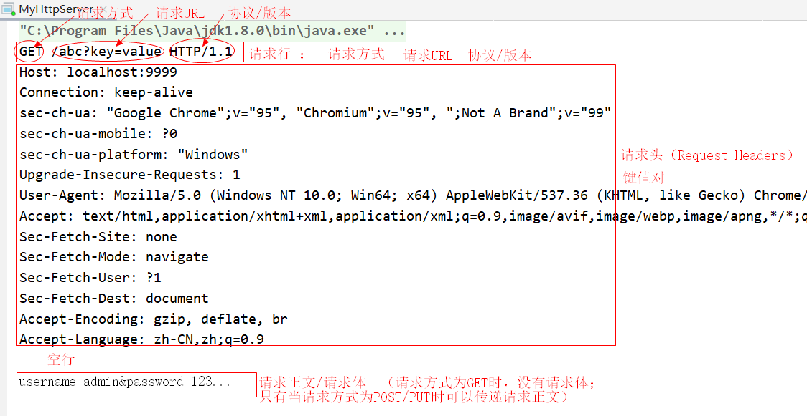

#### 2.3.2 http响应规则

> 自定义“浏览器”查看HTTP响应规则

- 自定义“浏览器”

  ```java
  package com.qfedu.http.response;
  
  import jdk.internal.util.xml.impl.Input;
  
  import java.io.*;
  import java.net.Socket;
  
  /**
   * @Description
   * @Author 千锋涛哥
   * 公众号： Java架构栈
   */
  public class MyBrowser {
  
      public static void main(String[] args) throws IOException {
          //将上一个案例中浏览器发送给 MyHttpServer的 http请求内容，发送给百度
  
          // 1.向百度服务器发送链接请求
          Socket socket = new Socket("www.baidu.com", 80);
          // 2.通过链接中的输出流，将HTTP请求内容发送给百度
          OutputStream outputStream = socket.getOutputStream();
          PrintWriter out = new PrintWriter(outputStream);
          out.println("GET /s HTTP/1.1");
          out.println("Host: www.baidu.com:80");
          out.println("Connection: keep-alive");
          out.println("sec-ch-ua: \"Google Chrome\";v=\"95\", \"Chromium\";v=\"95\", \";Not A Brand\";v=\"99\"");
          out.println("sec-ch-ua-mobile: ?0");
          out.println("sec-ch-ua-platform: \"Windows\"");
          out.println("Upgrade-Insecure-Requests: 1");
          out.println("User-Agent: Mozilla/5.0 (Windows NT 10.0; Win64; x64) AppleWebKit/537.36 (KHTML, like Gecko) Chrome/95.0.4638.69 Safari/537.36");
          out.println("Accept: text/html,application/xhtml+xml,application/xml;q=0.9,image/avif,image/webp,image/apng,*/*;q=0.8,application/signed-exchange;v=b3;q=0.9");
          out.println("Sec-Fetch-Site: none");
          out.println("Sec-Fetch-Mode: navigate");
          out.println("Sec-Fetch-User: ?1");
          out.println("Sec-Fetch-Dest: document");
          out.println("Accept-Encoding: gzip, deflate, br");
          out.println("Accept-Language: zh-CN,zh;q=0.9");
          out.println("");
          out.flush();
          //3.通过输入流接受百度的响应数据（HTTP响应规则）
          BufferedReader reader = new BufferedReader(new InputStreamReader(socket.getInputStream()));
          String responseContent = null;
          while( (responseContent = reader.readLine())!=null){
              System.out.println(responseContent);
          }
  
      }
  }
  ```

- HTTP响应内容

  

- 使用自定义HTTP服务器响应浏览器请求（遵循HTTP响应规则）

  ```java
  package com.qfedu.http.request;
  
  import java.io.*;
  import java.net.ServerSocket;
  import java.net.Socket;
  
  /**
   * @Description
   * @Author 千锋涛哥
   * 公众号： Java架构栈
   */
  public class MyHttpServer {
  
      public static void main(String[] args) throws IOException {
  
          //创建一个网络服务器（可以通过浏览器请求这个服务）
          ServerSocket serverSocket = new ServerSocket(9999);
          //当浏览器请求我这个服务器之后，就建立网络连接（socket对象）
          Socket socket = serverSocket.accept();
          //通过socket对象的输入流，
          InputStream inputStream = socket.getInputStream();
          BufferedReader reader = new BufferedReader(new InputStreamReader(inputStream));
          //读取 浏览器发送的 HTTP请求
          String content = null;
          while( !"" .equals(content = reader.readLine())){
              System.out.println(content);
          }
  
          // 自定义HTTP服务器响应浏览器
          PrintWriter out = new PrintWriter(socket.getOutputStream());
          out.println("HTTP/1.1 200 OK");
          out.println("Connection: keep-alive");
          out.println("Content-Length: 154");
          out.println("Content-Type: text/html;charset=utf-8");
          out.println("Date: Sun, 07 Nov 2021 17:52:42 GMT");
          out.println("Location: https://www.baidu.com/");
          out.println("P3p: CP=\" OTI DSP COR IVA OUR IND COM \"");
          out.println("P3p: CP=\" OTI DSP COR IVA OUR IND COM \"");
          out.println("Server: BWS/1.1");
          out.println("X-Frame-Options: sameorigin");
          out.println("X-Ua-Compatible: IE=Edge,chrome=1");
          out.println("");
          out.println("<!DOCTYPE html>");
          out.println("<html>");
          out.println("<head>");
          out.println("<title>这是自定义服务器响应的页面</title>");
          out.println("</head>");
          out.println("<body>");
          out.println("<label style='color:red'>这是自定义服务器响应的内容</label>");
          out.println("</body>");
          out.println("</html>");
          out.flush();
          out.close();
      }
  
  }
  ```


### 2.4 HTTP响应状态码

> 当浏览器向服务器发送请求、服务器对浏览器进行响应时，会响应给浏览器一个状态码,不同的状态码表示服务器对请求的不同处理。

#### 2.4.1 响应状态码分类

- 1xx  表示浏览器请求服务器，服务器未做任何操作
- 2xx  表示服务器正常响应，并且响应成功
- 3xx  表示服务器只对浏览器的请求进行了部分处理，通知浏览器进行下一步操作
- 4xx  表示浏览器端（客户端）错误：404、401
- 5xx  表示服务器端资源错误

#### 2.4.2 常见状态码

- 200 表示响应成功
- 302 表示服务器临时重定向
- 304 表示服务器资源没有变化
- 404 访问的资源不存在
- 500 访问的服务器端资源错误


## 三、Servlet基础使用

### 3.1 Servlet简介

> 问题：浏览器可以通过http协议请求web服务器，访问web服务器上的web资源，web资源又分为静态资源和动态资源，静态资源可以直接存储在web服务器上供浏览器访问，动态资源该如何访问呢 ？

Servlet是`服务器端的Java程序、能够接收HTTP请求、处理HTTP请求、并对HTTP请求进行响应的`动态网页技术。

Servlet是JavaEE（JavaWeb）规范的一个重要组成部分。

Servlet的作用：

- 接收客户端的HTTP请求（浏览器）
- 根据用户请求进行数据处理
- 动态生成网页（网页中的数据是根据客户端请求动态改变的）
- 将生成的包含动态数据的网页响应给客户端

### 3.2 创建Java web工程

> Servlet是JavaEE规范的一部分，Servlet的开发需要依赖JavaEE环境，之前创建的单纯的Java应用已经不能满足Servlet开发所需的环境需求，我们要创建Java web工程。
>
> - Java工程 ： 只引入了JDK的标准库（JavaSE）
> - Java web工程：引入了Java企业级开发环境（JavaEE）

1. File--->New--->Project...

2. 选择`Java Enterprise`

   

3. 如何配置Tomcat ?

   - 点击`New`按钮，选择`Tomcat Server`

   - 配置Tomcat服务器

     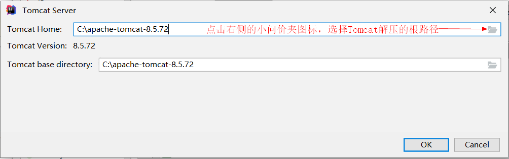

4. 选择 web application项目框架及版本

   

5. 输入项目名称

   

6. Java web工程目录

   

### 3.3 创建Servlet类

> Servlet是一个Java程序，是一个能够接收HTTP请求的Java类，因此需要实现HTTP协议。
>
> 在JavaEE库中有一个类 `javax.servlet.http.HttpServlet`实现了HTTP协议，我们创建的类只要继承这个 `HttpServlet`类，就实现了HTTP协议，就能够接受HTTP请求。

1. 创建一个类继承`javax.servlet.http.HttpServlet`；
2. 继承HttpServlet的类就能够接收HTTP请求，我们把这样的类称之为Servlet类，类以`***Servlet`格式命名；
3. 在我们创建的Servlet类中，重写`doPost`/`doGet`用于处理用户不同的请求

### 3.4 配置Servlet类的URL

> Servlet创建完成之后，需要配置url访问路径，然后将web项目运行在Tomcat之上，就能够通过配置的url访问Servlet类。Servlet自3.0规范开始支持两种配置方式：
>
> - 基于web.xml配置文件进行配置
> - 基于注解配置

#### 3.4.1 基于web.xml配置Servlet

- 打开Java web工程中`web/WEB-INF/web.xml`文件

- 配置如下：

  ```xml
  <!--  配置BookListServlet类的访问路径  -->
  
  <!-- servlet标签： 配置类路径  -->
  <servlet>
      <!--  配置与servlet-mapping标签的匹配表示，理论上可以是任意字符串，
          只要多个servlet标签的servlet-name不重复就可以，实际开发中建议使用当前Servlet类 -->
      <servlet-name>BookListServlet</servlet-name>
      <!--Servlet类路径-->
      <servlet-class>com.qfedu.test1.BookListServlet</servlet-class>
  </servlet>
  
  <!-- servlet-mapping标签：配置url-->
  <servlet-mapping>
      <!--servlet-mapping标签的servlet-name属性与对应的 servlet标签的servlet-name属性一致-->
      <servlet-name>BookListServlet</servlet-name>
      <!--  url-pattern配置Servlet的访问路径，必须以 / 开头 -->
      <url-pattern>/book-list</url-pattern>
  </servlet-mapping>
  ```

#### 3.4.2 基于注解配置Servlet

- 在创建的Servlet类上添加`@WebServlet`注解，在注解后的参数中配置url，url也必须以`/`开头

```java
/**
 * @Description 根据图书ID查询一个图书信息
 * @Author 千锋涛哥
 * 公众号： Java架构栈
 */
@WebServlet("/book-query")
public class BookQueryServlet extends HttpServlet {

    @Override
    protected void doPost(HttpServletRequest req, HttpServletResponse resp) 
        throws ServletException, IOException {
        System.out.println("BookQueryServlet--------doPost");
    }

    @Override
    protected void doGet(HttpServletRequest req, HttpServletResponse resp) 
        throws ServletException, IOException {
        System.out.println("BookQueryServlet--------doGet");
    }
}
```

### 3.5 IDEA部署web项目

> 通过IDEA，将java web项目部署到Tomcat中并运行Tomcat。

#### 3.5.1 配置服务器

- File---Settings


#### 3.5.2 部署web项目

> 将web项目部署到Tomcat

1. 点击IDEA右上角：

   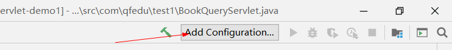

2. 添加Tomcat服务器

   

3. 部署项目

   

4. 配置web项目的访问路径

   

#### 3.5.3 启动Tomcat

`如果在创建web项目时选择了web服务器，则直接点击IDEA右上角运行即可`：

- 播放按钮：直接运行
- 甲壳虫：debug运行


#### 3.5.4 Tomcat启动完成工作

- 构建web项目
- 将web项目拷贝到Tomcat
- 启动Tomcat
- 打开浏览器，访问当前项目首页

### 3.6 浏览器访问测试

> 通过浏览器发送HTTP请求，访问tomcat中web项目中的Servlet类


### 3.7 GET请求与POST请求

> Servlet类中的doGet和doPost是用来处理浏览器不同请求方式的HTTP请求，在HTTP协议中，HTTP请求有多种请求方式（get\post\delete\put\option等），不同请求方式传递的数据是不同的。
>
> - Servlet中的doGet方法用于处理客户端的get方式请求
> - Servlet中的doPost方法用于处理客户端的post方式请求

#### 3.7.1 GET请求

- 使用Get方式请求服务器，传递的参数会拼接到URL后面，以`?`分隔url和参数,多个参数以`&`符号分开；

  ```html
  <form action="https://www.baidu.com" method="get">
      <input type="text" name="id"/><br/>
      <input type="text" name="name"/><br/>
      <input type="submit" value="get提交"/><br/>
  </form>
  ```

  |  |
  | ------------------------------------------------------------ |
  |  |

- get方式是明文提交、提交的数据量小、安全性较差；

- get方式传输效率较高，浏览器地址栏输入网址默认采用get方式提交

- get方式提交数据的场景：

  - 浏览器地址栏

  - 网页中的超链接

    ```html
    <a href="http://localhost:80/demo1/book-query">请求BookQueryServlet</a>
    ```

  - form表单 method="get"提交


#### 3.7.2 POST请求

-  使用POST方式请求服务器，参数是通过请求正文进行传递的（request body）；

  ```html
  <form action="http://localhost:9999" method="post">
      <input type="text" name="id"/><br/>
      <input type="text" name="name"/><br/>
      <input type="submit" value="POST提交"/><br/>
  </form>
  ```

  |  |
  | ------------------------------------------------------------ |
  | 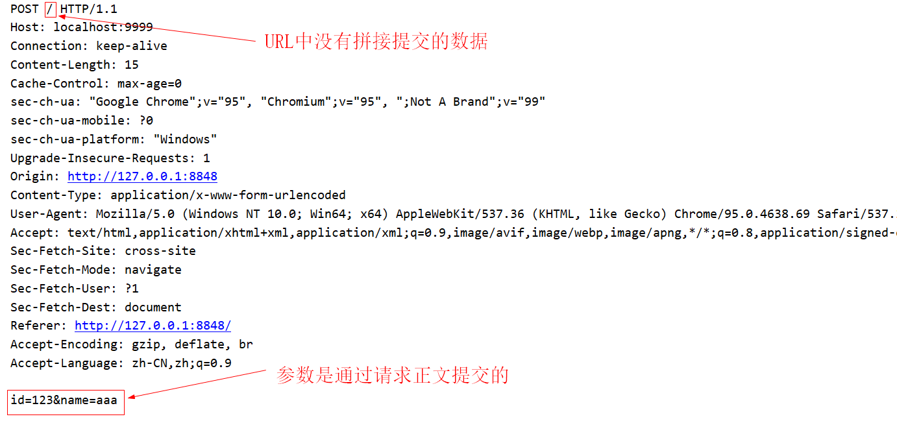 |

- POST使用密文传递数据，数据量大，安全性高；
- POST以牺牲传输效率为代价保障了安全性，因此性能较get低。

- POST提交数据的场景：form表单 method="post"提交

### 3.8 Servlet响应动态网页

> 案例：根据客户端请求的bookId,动态查询图书信息，生成HTML文档，响应给客户端

| 流程图                                                       |
| ------------------------------------------------------------ |
|  |

实现代码：

```java
package com.qfedu.test1.dto;

/**
 * @Description 图书实体类
 * @Author 千锋涛哥
 * 公众号： Java架构栈
 */
public class Book {
    private String bookId;
    private String bookName;
    private String bookAuthor;
    private double bookPrice;
    private String bookImgPath;
	//无参构造器
	//全参构造器
    //get 和 set方法
}
```

```java
package com.qfedu.test1;

import com.qfedu.test1.dto.Book;

import javax.servlet.ServletException;
import javax.servlet.annotation.WebServlet;
import javax.servlet.http.HttpServlet;
import javax.servlet.http.HttpServletRequest;
import javax.servlet.http.HttpServletResponse;
import java.io.IOException;
import java.io.PrintWriter;
import java.util.HashMap;
import java.util.Map;

/**
 * @Description 根据图书ID查询一个图书信息
 * @Author 千锋涛哥
 * 公众号： Java架构栈
 */
@WebServlet("/book-query")
public class BookQueryServlet extends HttpServlet {

    @Override
    protected void doPost(HttpServletRequest req, HttpServletResponse resp) throws ServletException, IOException {
        System.out.println("BookQueryServlet--------doPost");
    }

    @Override
    protected void doGet(HttpServletRequest request, HttpServletResponse response) throws ServletException, IOException {
        System.out.println("BookQueryServlet--------doGet");
        //动态生成HTML
        // 1.接收到浏览器请求时传递的图书ID (bookId)
        String bid = request.getParameter("bookId");

        // 2.根据bid查询数据库图书表(伪代码)
        Map<String, Book> bookMap = new HashMap<>();
        bookMap.put("1001",new Book("1001","Java","张三",55.66,""));
        bookMap.put("1002",new Book("1002","C++","李四",33.44,""));
        bookMap.put("1003",new Book("1003","Python","王五",44.55,""));
        // book就是根据用户请求查询到的动态数据
        Book book = bookMap.get(bid);

        // 3.将查询到图书信息生成网页，将网页响应给浏览器：通过IO流（输出流）向浏览器响应一个网页数据
        // 这个out对象，就是用于响应浏览器的输出流，通过这个输出流写出什么数据，浏览器就可以接受到什么数据
        // a.设置响应头
        response.setCharacterEncoding("utf-8");
        response.setContentType("text/html");
        // b.通过输出流响应网页数据
        PrintWriter out = response.getWriter();
        out.println("<!DOCTYPE html>");
        out.println("<html>");
        out.println("<head><meta charset='utf-8'><title>这是Servlet响应的网页</title></head>");
        out.println("<body>");
        out.println("<table style='border:1px deepskublue solid; width:1000px;' align='center' border='1' cellspacing='0'>");
        out.println("<tr><th>图书编号</th><th>图书名称</th><th>图书作者</th><th>图书价格</th><th>图书封面</th></tr>");
        out.println("<tr>");
        out.println("<td>"+book.getBookId()+"</td>");
        out.println("<td>"+book.getBookName()+"</td>");
        out.println("<td>"+book.getBookAuthor()+"</td>");
        out.println("<td>"+book.getBookPrice()+"</td>");
        out.println("<td>"+book.getBookImgPath()+"</td>");
        out.println("</tr>");
        out.println("</table>");
        out.println("</body>");
        out.println("</html>");
        out.flush();
        out.close();
    }
}
```

## 四、Servlet原理解析

### 4.1 ServletAPI核心类与接口


### 4.2 Servlet类处理请求的流程

准备工作：

1. 新建一个Javaweb工程：servlet-demo2

2. 新建一个Servlet类：TestServlet

   ```
   创建servlet类的步骤：
   1.创建一个命名为 **Servlet
   2.继承javax.servlet.http.HttpServlet类
   3.重写doGet和doPost方法
   4.配置当前Servlet类的访问路径
   ```

   ```xml
   <servlet>
       <servlet-name>TestServlet</servlet-name>
       <servlet-class>com.qfedu.servlets.TestServlet</servlet-class>
   </servlet>
   <servlet-mapping>
       <servlet-name>TestServlet</servlet-name>
       <url-pattern>/test</url-pattern>
   </servlet-mapping>
   ```

3. 为了测试Servlet处理请求的流程，我们重写了从HttpServlet继承的多个方法：

   - init
   - service(ServletRequest,ServletResponse)
   - service(HttpServletRequest,HttpServletResponse)
   - `doGet`
   - `doPost`
   - destroy

   ```java
   package com.qfedu.servlets;
   
   import javax.servlet.ServletConfig;
   import javax.servlet.ServletException;
   import javax.servlet.ServletRequest;
   import javax.servlet.ServletResponse;
   import javax.servlet.http.HttpServlet;
   import javax.servlet.http.HttpServletRequest;
   import javax.servlet.http.HttpServletResponse;
   import java.io.IOException;
   
   /**
    * @Description
    * @Author 千锋涛哥
    * 公众号： Java架构栈
    *
    * 创建servlet类的步骤：
    * 1.创建一个命名为 **Servlet
    * 2.继承javax.servlet.http.HttpServlet类
    * 3.重写doGet和doPost方法
    * 4.配置当前Servlet类的访问路径
    */
   public class TestServlet  extends HttpServlet {
   
       @Override
       public void init(ServletConfig config) throws ServletException {
           System.out.println("------------init");
           super.init(config);
       }
   
       @Override
       public void service(ServletRequest req, ServletResponse res) 
           throws ServletException, IOException {
           System.out.println("------------Servlet接口定义的service");
           super.service(req, res);
       }
   
       @Override
       protected void service(HttpServletRequest req, HttpServletResponse resp) 
           throws ServletException, IOException {
           System.out.println("------------HttpServlet类定义的service");
           super.service(req, resp);
       }
   
       @Override
       protected void doGet(HttpServletRequest req, HttpServletResponse resp) 
           throws ServletException, IOException {
           System.out.println("------------doGet");
       }
   
       @Override
       protected void doPost(HttpServletRequest req, HttpServletResponse resp) 
           throws ServletException, IOException {
           System.out.println("------------doPost");
       }
   
       @Override
       public void destroy() {
           System.out.println("------------destroy");
           super.destroy();
       }
   }
   ```

| Servlet请求处理流程                                          |
| ------------------------------------------------------------ |
|  |

### 4.3 Servlet实例的生命周期[重点]

> 当客户端的请求到达Tomcat，Tomcat会创建一个线程来接收、处理、响应客户端请求，客户端在请求某个Servlet类时，线程需要通过这个Servlet类的实例来调用service方法、调用doGet/doPost..方法来处理响应请求，这个Servlet类的实例是何时创建、何时销毁的呢？
>
> Servlet实例的生命周期指的是一个Servlet类的实例从创建到销毁的过程。

1. Servlet类是单实例多线程的，一个Servlet类自始至终只会创建一个对象；

2. 如果当前Servlet类**没有配置 `<load-on-startup>1</load-on-startup>`**:

   当客户端第一次请求Servlet时，创建当前Servlet类的实例，然后使用这个实例调用service(ServletRequest, ServletResponse)方法——service(HttpServletRequest, HttpServletResponse)方法——doGet/doPost处理客户端请求;当客户端请求再次到达时将不会重新创建Servlet实例，直接使用第一次创建的实例调用方法进行响应；

3. 如果当前Servlet类**配置了 `<load-on-startup>1</load-on-startup>`**:

   当服务器启动时就会创建Servlet类的实例，无论客户端第一次请求这个Servlet类，还是再次请求都不会创建Servlet类实例，直接使用服务器启动时创建的Servlet实例来接收、处理、响应客户端请求；

4. 当服务器关闭时，Serlvet类的实例会被销毁。

**配置load-on-startup的两种方式：**

- xml配置

  ```xml
  <servlet>
      <servlet-name>TestServlet</servlet-name>
      <servlet-class>com.qfedu.servlets.TestServlet</servlet-class>
      <!--如果有多个Servlet都配置了load-on-startup，里面的数字就是在服务器中创建实例的顺序-->
      <load-on-startup>1</load-on-startup>
  </servlet>
  <servlet-mapping>
      <servlet-name>TestServlet</servlet-name>
      <url-pattern>/test</url-pattern>
  </servlet-mapping>
  ```

- 注解配置：

  ```java
  @WebServlet(value = "/test",loadOnStartup = 1)
  ```


### 4.4 线程安全问题

> 因为Servlet实例是单例模式，当多个客户端并发访问同一个Servlet类时，Tomcat会创建多个线程，多个线程会使用同一个Servlet实例，有可能会导致线程安全问题，如何保证线程安全呢？

#### 4.4.1 方案1：实现SingleThreadModel接口

> 我们可以让Servlet类实现SingleThreadModel接口，每个线程都会创建servlet实例，避免了多线程使用通过Servlet实例的请求，但是使用这种方式会导致对客户端的请求响应效率变低，增加了服务器因频繁创建和销毁Servlet实例的开销，因此此种方式不建议使用，已经过时。

#### 4.4.2 方案2：使用synchronized同步锁

```java
@Override
protected void doGet(HttpServletRequest req, HttpServletResponse resp) {
    synchronized (this) {
       // 业务代码
    }
}
```

#### 4.4.3 建议：在Servlet实例中尽量不使用成员变量

> 如果将变量定义为成员变量，则这个变量在多个线程中是共享的，就有可能因为多个线程同时修改这个变量导致并发问题，因此我们可以将变量定义在处理业务的doXX方法中，定义为局部变量之后，每个线程都有属于自己的局部变量。


## 五、Servlet开发技术

> Servlet动态网页技术，为客户端请求提供动态响应：
>
> - Servlet如何接收客户端请求
> - Servlet如何为客户端提供响应

### 5.1  HttpServletRequest对象

> 我们在Servlet类中的doGet/doPost/doXX 方法中通过 request 对象接收客户端请求信息.
>
> 客户端向服务器发送的请求信息都会被封装到request对象，request（HttpServletRequest类）提供了多个方法可以用于获取http请求中的数据。

#### 5.1.1 接收请求数据


#### 5.1.2 request对象常用方法

**接收请求行数据**

```java
//getMethod:获取客户端请求方式
String method = request.getMethod();

//getRequestURL: 获取客户端的请求URL（不包含url上的参数）
String url = request.getRequestURL().toString();

//getParameter : 获取请求行中url参数，根据参数的key获取参数的value
//               如果客户端是通过输入框提交数据，则参数要和输入框的name属性值一致
String p1 = request.getParameter("k1");

//getProtocol ：获取客户端提交数据的协议及版本
String protocol = request.getProtocol();
```

**接收请求头数据**

```java
//getHeaderNames ：获取请求头中所有的key
Enumeration<String> en = request.getHeaderNames();
while(en.hasMoreElements()){
    String key = en.nextElement();
    //getHeader ： 根据请求头中的key获取对应value
    String value = request.getHeader(key);
    System.out.println(key+":"+value);
}
```

**接收请求正文数据**

```java
// 获取请求正文
// getInputStream ：获取客户端请求的输入流
ServletInputStream inputStream = request.getInputStream();
BufferedReader reader = new BufferedReader(new InputStreamReader(inputStream));
// 从输入流中读取请求正文
String s = reader.readLine();
System.out.println(s);
```

#### 5.1.3 request对象接收表单数据案例

> 图书添加操作：需要从图书添加页面提交数据到Servlet

**book-add.html**

```html
<!DOCTYPE html>
<html lang="en">
<head>
    <meta charset="UTF-8">
    <title>提交图书</title>
</head>
<body>
    <form action="http://localhost/demo3/BookAddServlet" method="get">
        <p>图书编号：<input type="text" name="bookId"/></p>
        <p>图书名称：<input type="text" name="bookName"/></p>
        <p>图书作者：<input type="text" name="bookAuthor"/></p>
        <p>图书价格：<input type="text" name="bookPrice"/></p>
        <p><input type="submit" value="Get提交"/></p>
    </form>

    <hr/>

    <form action="http://localhost/demo3/BookAddServlet" method="post">
        <p>图书编号：<input type="text" name="bookId"/></p>
        <p>图书名称：<input type="text" name="bookName"/></p>
        <p>图书作者：<input type="text" name="bookAuthor"/></p>
        <p>图书价格：<input type="text" name="bookPrice"/></p>
        <p><input type="submit" value="Post提交"/></p>
    </form>
</body>
</html>
```

**BookAddServlet**

```java
package com.qfedu.servlets;

import javax.servlet.ServletException;
import javax.servlet.ServletInputStream;
import javax.servlet.annotation.WebServlet;
import javax.servlet.http.HttpServlet;
import javax.servlet.http.HttpServletRequest;
import javax.servlet.http.HttpServletResponse;
import java.io.BufferedReader;
import java.io.IOException;
import java.io.InputStreamReader;

/**
 * @Description 添加图书
 * @Author 千锋涛哥
 * 公众号： Java架构栈
 */
@WebServlet("/BookAddServlet")
public class BookAddServlet extends HttpServlet {

    @Override
    protected void doGet(HttpServletRequest request, HttpServletResponse response) 
        throws ServletException, IOException {
        //getParameter 方法参数字符串 必须要和 form表单中输入框的name属性一致
        //              此方法获取的客户端提交的数据一律为String类型，根据需要可以进行类型转换
        int id = Integer.parseInt(request.getParameter("bookId"));//5
        String name = request.getParameter("bookName");
        String author = request.getParameter("bookAuthor");
        double price = Double.parseDouble(request.getParameter("bookPrice"));

        System.out.println("图书编号:"+id);
        System.out.println("图书名称:"+name);
        System.out.println("图书作者:"+author);
        System.out.println("图书价格:"+price);
    }

    @Override
    protected void doPost(HttpServletRequest request, HttpServletResponse response) 
        throws ServletException, IOException {
        // 如果页面采用form表单post方式提交数据，数据是通过 请求正文 传递的
        // 1.我们可以通过请求正文获取数据
        //ServletInputStream inputStream = request.getInputStream();
        //BufferedReader reader = new BufferedReader(new InputStreamReader(inputStream));
        //String s = reader.readLine();
        //System.out.println("请求正文数据："+s);

        // 2.form表单post方式提交的数据，也可以通过request对象的getParameter方法接收，
        //   之前是不能打开request输入流
        int id = Integer.parseInt(request.getParameter("bookId"));//5
        String name = request.getParameter("bookName");
        String author = request.getParameter("bookAuthor");
        double price = Double.parseDouble(request.getParameter("bookPrice"));

        System.out.println("图书编号:"+id);
        System.out.println("图书名称:"+name);
        System.out.println("图书作者:"+author);
        System.out.println("图书价格:"+price);
    }

}
```

#### 5.1.4 request对象处理中文乱码问题

> 客户端向服务器的Servlet类提交数据中包含中文，可能会出现中文乱码问题

###### 1. 为什么会产生乱码问题？

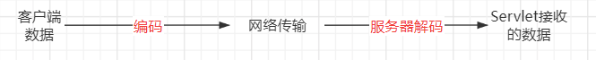

- 客户端提交的数据通过网络发送到服务器，传输的过程数据数据通常会进行编码，服务器会对数据进行解码；如果服务器使用的解码方式与网页的原始编码不一致，将会导致服务器的解码出现乱码

###### 2.get方式提交数据的乱码问题

- get方式提交的数据会拼接在请求行的URL后面进行传递，不同的浏览器处理方式是不一样的，有的浏览器会进行编码，有的浏览器则直接提交；

- 数据到达服务器之后，服务器会根据参数的编码方式对参数进行解码，如果没有编码则服务器直接接受，如果进行了服务器能够解析的编码，服务也会进行转换。

- 结论：GET方式提交的请求行参数，是通过服务器进行处理的。

- 解决方案：在Tomcat的conf/server.xml中配置URL的编码方式

  ```xml
  <Connector port="80" protocol="HTTP/1.1"
             connectionTimeout="20000"
             redirectPort="8443" URIEncoding="utf-8" />
  ```

###### 3.post方式提交数据的乱码问题

- post方式提交表单数据是通过请求正文进行传递的，会对数据进行编码；Tomcat会对URL传递的参数进行解码，但是不能对请求正文进行解码，因此需要我们在Servlet类中接收数据之前对客户端提交的请求数据进行编码设置: `request.setCharacterEncoding("utf-8");`

- 页面表单提交数据-post方式提交：

  ```html
  <form action="http://localhost/demo3/BookAddServlet" method="post">
      <p>图书编号：<input type="text" name="bookId"/></p>
      <p>图书名称：<input type="text" name="bookName"/></p>
      <p>图书作者：<input type="text" name="bookAuthor"/></p>
      <p>图书价格：<input type="text" name="bookPrice"/></p>
      <p><input type="submit" value="Post提交"/></p>
  </form>
  ```

- Servlet类对post提交的数据进行编码设置：

  ```java
  protected void doPost(HttpServletRequest request, HttpServletResponse response) 
      throws ServletException, IOException {
  
      //在servlet中接收数据之间，通过request对象设置http请求数据的编码方式
      request.setCharacterEncoding("utf-8");
  
      int id = Integer.parseInt(request.getParameter("bookId"));
      String name = request.getParameter("bookName");
      String author = request.getParameter("bookAuthor");
      double price = Double.parseDouble(request.getParameter("bookPrice"));
  
  }
  ```

### 5.2 HttpServletResponse对象

> Servlet类中doGet/doPost/doXX等方法都有一个HttpServletResponse对象，用于响应客户端请求

#### 5.2.1 response对象常用方法

```java
//【设置响应状态行】
//setStatus : 设置状态行中的状态码
response.setStatus(200);

//【设置响应头】
//setContentType: 设置响应头中的Content-Type属性，设置响应客户端的数据格式
response.setContentType("text/html"); //等价于： response.setHeader("Content-Type","text/html");
//setContentLength：设置响应客户端的数据长度（一般无需设置）
response.setContentLength(1024);      //等价于：
//setHeader ： 设置其他的响应头属性
response.setHeader("Connection","keep-alive");

//【设置响应正文】
//setCharacterEncoding：设置响应客户端的数据编码格式
response.setCharacterEncoding("utf-8");
// 通过response对象获取输出流出
// 字节流（如果要响应文件数据给客户端，则需要使用字节流）
ServletOutputStream outputStream = response.getOutputStream();
// 字符流（如果响应文本数据-HTML文档，则使用字符流）
PrintWriter out = response.getWriter();
```

#### 5.2.2 查询成绩案例

```java
package com.qfedu.servlets;

import javax.servlet.ServletException;
import javax.servlet.ServletInputStream;
import javax.servlet.ServletOutputStream;
import javax.servlet.annotation.WebServlet;
import javax.servlet.http.HttpServlet;
import javax.servlet.http.HttpServletRequest;
import javax.servlet.http.HttpServletResponse;
import java.io.BufferedReader;
import java.io.IOException;
import java.io.InputStreamReader;
import java.io.PrintWriter;
import java.util.Enumeration;

/**
 * @Description  查询成绩
 * @Author 千锋涛哥
 * 公众号： Java架构栈
 */
@WebServlet("/gradeQuery")
public class GradeQueryServlet extends HttpServlet {

    @Override
    protected void doGet(HttpServletRequest request, HttpServletResponse response) throws ServletException, IOException {
        System.out.println("~~~~~~~~~~~~~~~doGet");
        //1.接收学号和课程编号
        String stuNum = request.getParameter("stuNum");
        String curseId = request.getParameter("curseId");

        //2.查询数据库
        int grade = 95;

        //3.通过response响应浏览器
        response.setStatus(200);
        response.setContentType("text/html"); 
        response.setHeader("Connection","keep-alive");

        //【设置响应正文】
        //setCharacterEncoding：设置响应客户端的数据编码格式
        response.setCharacterEncoding("utf-8");
        // 通过response对象获取输出流出
        PrintWriter out = response.getWriter();
        //通过流写出的数据，就会以响应正文的形式传输给客户端浏览器，如果浏览器可以识别数据，则直接显示
        out.println("<!DOCTYPE html>");
        out.println("<html>");
        out.println("<head>");
        out.println("<meta charset='utf-8'>");
        out.println("<title>学生成绩查询结果</title>");
        out.println("</head>");
        out.println("<body>");
        out.println("<div style='padding:50px; font-size:50px; text-align:center; border:1px gray solid; margin:auto'>");
        out.println("<label>您的成绩为：</label>");
        out.println("<label style='color:red'>"+grade+"</label>");
        out.println("</div>");
        out.println("</body>");
        out.println("</html>");
        out.flush();
        out.close();
    }

    @Override
    protected void doPost(HttpServletRequest request, HttpServletResponse response)
            throws ServletException, IOException {
        // 获取请求正文
        // getInputStream ：获取客户端请求的输入流
        ServletInputStream inputStream = request.getInputStream();
        BufferedReader reader = new BufferedReader(new InputStreamReader(inputStream));
        // 从输入流中读取请求正文
        String s = reader.readLine();
        System.out.println(s);
    }

}
```


### 5.3 Servlet动态网页案例

> 学生信息管理系统：
>
> - 学生登录
> - 学生查询成绩

#### 5.3.1 案例流程分析


#### 5.3.2 项目环境搭建

- 数据库环境准备: 创建一个名为`db_sgms`，然后创建如下数据表：

  ```sql
  -- 学生信息表
  create table students(
  	stu_num char(5) primary key,
  	stu_name varchar(20) not null,
  	stu_gender char(2) not null,
  	stu_age int not null,
  	stu_pwd varchar(20) not null
  );
  
  -- 课程信息表
  create table courses(
  	course_id char(6) primary key,
  	course_name varchar(50) not null
  );
  
  -- 学生成绩表
  create table grades(
  	gid int primary key auto_increment,
  	snum char(5) not null,  
  	cid char(6) not null,   
    score int not null
  );
  ```

- 创建一个Java web工程: `servlet-demo4`

- 搭建JDBC环境

  - 导入JDBC所需的驱动jar、数据库连接池jar、DBUtils.jar

    - 在web/WEB-INF创建lib目录
    - 将三个jar包拷贝到lib目录
    - 选择拷贝到lib目录三个jar文件----右键----Add as library

  - 配置连接池信息

    - 在项目中创建`com.qfedu.sgms.utils`包

    - 在包中创建druid.properties配置druid连接池信息

      ```properties
      # 数据库连接信息
      driverClassName=com.mysql.cj.jdbc.Driver
      url=jdbc:mysql://localhost:3306/db_sgms?characterEncoding=utf8
      username=root
      password=@QFedu123
      
      # 连接池属性
      # 连接池的初始化连接数<创建数据库连接池时默认初始化的连接的个数>
      initialSize=10
      # 连接池的最大连接数
      maxActive=50
      # 最小空闲连接数（当数据库连接使用率很低时，连接池中的连接会被释放一部分）
      minIdle=5
      # 超时等待时间(单位：ms)
      maxWait=30000
      ```

    - 在utils包中创建连接池工具类：DruidUtils

      ```java
      package com.qfedu.sgms.utils;
      
      import com.alibaba.druid.pool.DruidDataSource;
      import com.alibaba.druid.pool.DruidDataSourceFactory;
      
      import javax.sql.*;
      import java.io.InputStream;
      import java.sql.*;
      import java.util.Properties;
      
      /**
       * @Description 数据库连接池工具类
       * @Author 千锋涛哥
       * 公众号： Java架构栈
       */
      public class DruidUtils {
      
          private static DruidDataSource druidDataSource;
      
          static{
              try {
                  InputStream is = DruidUtils.class.getResourceAsStream("druid.properties");
                  Properties properties = new Properties();
                  properties.load(is);
                  druidDataSource = (DruidDataSource) DruidDataSourceFactory.createDataSource(properties);
              } catch (Exception e) {
                  e.printStackTrace();
              }
          }
      
          /**
           * 获取数据库连接池数据源对象
           * @return
           */
          public static DataSource getDataSource(){
              return druidDataSource;
          }
      
          /**
           * 从数据库连接池中获取数据库连接对象
           * @return
           */
          public static Connection getConnection(){
              Connection connection = null;
              try {
                  connection = druidDataSource.getConnection();
              } catch (SQLException e) {
                  e.printStackTrace();
              }
              return connection;
          }
      
      }
      ```

#### 5.3.3 完成数据库操作

> 根据项目业务流程图，完成需要数据库操作
>
> - 学生登录实现：
>   - `根据输入的学号和密码查询学生信息`，如果查询到了说明学号密码输入正确，登录成功；
>   - `根据输入的学号查询学生`，如果查询到了说明学号正确，再比较输入的密码和查询出来的密码是否一致，如果一致则登录成功；
> - 查询成绩：
>   - 根据学号和课程号从成绩表中查询成绩

**根据学号和密码查询学生**

- 创建实体类 Student类

  ```java
  package com.qfedu.sgms.dto;
  
  /**
   * @Description 学生信息实体类
   * @Author 千锋涛哥
   * 公众号： Java架构栈
   */
  public class Student {
      
      private String stuNum;
      private String stuName;
      private String stuGender;
      private int stuAge;
      private String stuPwd;
  
  }
  ```

- 创建DAO，完成对应数据库操作

  ```java
  package com.qfedu.sgms.dao;
  
  import com.qfedu.sgms.dto.Student;
  import com.qfedu.sgms.utils.DruidUtils;
  import org.apache.commons.dbutils.QueryRunner;
  import org.apache.commons.dbutils.handlers.BeanHandler;
  
  /**
   * @Description
   * @Author 千锋涛哥
   * 公众号： Java架构栈
   */
  public class StudentDAO {
  
      /**
       * 根据学号和密码查询学生信息
       * @param stuNum
       * @param stuPwd
       * @return 如果学号密码正确返回Student，否则返回null
       */
      public Student queryStudentByNumAndPwd(String stuNum,String stuPwd){
          Student student = null;
          try{
              String sql = "select stu_num stuNum,stu_name stuName,stu_gender stuGender,stu_age stuAge,stu_pwd stuPwd from students where stu_num=? and stu_pwd=?";
              QueryRunner queryRunner = new QueryRunner(DruidUtils.getDataSource());
              student = queryRunner.query(sql,new BeanHandler<Student>(Student.class),stuNum,stuPwd);
          }catch (Exception e){
              e.printStackTrace();
          }
          return student;
      }
  
  }
  ```

**根据学号、课程号查询成绩**

- 创建实体类 Grade类

  ```java
  package com.qfedu.sgms.dto;
  
  /**
   * @Description
   * @Author 千锋涛哥
   * 公众号： Java架构栈
   */
  public class Grade {
  
      private String snum;
      private String sname; //此属性在成绩表中没有，但是关联学生信息可以查询
      private String cid;
      private String cname; //此属性在成绩表也没有，但是关联课程表可以查询
      private int score;
  
  }
  ```

- 创建GradeDAO查询成绩

  ```java
  package com.qfedu.sgms.dao;
  
  import com.qfedu.sgms.dto.Grade;
  import com.qfedu.sgms.utils.DruidUtils;
  import org.apache.commons.dbutils.QueryRunner;
  import org.apache.commons.dbutils.handlers.BeanHandler;
  
  /**
   * @Description
   * @Author 千锋涛哥
   * 公众号： Java架构栈
   */
  public class GradeDAO {
  
      /**
       * 根据学号和课程号查询这个学生这门课的成绩
       * @param snum
       * @param cid
       * @return
       */
      public Grade queryGradeBySnumAndCid(String snum,String cid){
          Grade grade = null;
          try{
              //注意查询出的列名要取别名，和grade对象的属性一致
              String sql = "select s.stu_num snum,s.stu_name sname,c.course_id cid,c.course_name cname ,g.score score from students s INNER JOIN grades g INNER JOIN courses c  on s.stu_num = g.snum and g.cid = c.course_id where s.stu_num=? and c.course_id=?";
              QueryRunner queryRunner = new QueryRunner(DruidUtils.getDataSource());
              grade = queryRunner.query(sql,new BeanHandler<Grade>(Grade.class),snum,cid);
          }catch (Exception e){
              e.printStackTrace();
          }
          return grade;
      }
  
  }
  ```

#### 5.3.4 实现LoginPageServlet登录界面

> LoginPageServlet就是为用户提供一个登陆页面

```java
package com.qfedu.sgms.servlets;

import javax.servlet.ServletException;
import javax.servlet.annotation.WebServlet;
import javax.servlet.http.HttpServlet;
import javax.servlet.http.HttpServletRequest;
import javax.servlet.http.HttpServletResponse;
import java.io.IOException;
import java.io.PrintWriter;

/**
 * @Description
 * @Author 千锋涛哥
 * 公众号： Java架构栈
 */
@WebServlet("/login")
public class LoginPageServlet extends HttpServlet {

    @Override
    protected void doPost(HttpServletRequest request, HttpServletResponse response) throws ServletException, IOException {

    }

    @Override
    protected void doGet(HttpServletRequest request, HttpServletResponse response) throws ServletException, IOException {
        //响应一个登录界面
        response.setStatus(200);
        response.setContentType("text/html;charset=utf-8");
        response.setCharacterEncoding("utf-8");

        PrintWriter out = response.getWriter();
        out.println("<!DOCTYPE html>");
        out.println("<html>");
        out.println("<head>");
        out.println("<meta charset='utf-8'>");
        out.println("<title>学生成绩查询系统-登录</title>");
        out.println("</head>");
        out.println("<body>");
        out.println("<form action='' method='post'>");
        out.println("<h3>学生成绩查询系统—学生登录</h3>");
        out.println("<p>学号：<input type='text' name='stuNum' placeholder='学生学号'/></p>");
        out.println("<p>密码：<input type='password' name='stuPwd' placeholder='登录密码'/></p>");
        out.println("<p><input type='submit' value='登录'/></p>");
        out.println("</form>");
        out.println("</body>");
        out.println("</html>");
        out.flush();
        out.close();
    }
}
```

#### 5.3.5 实现CheckServlet验证登录

> CheckServlet接收用户在页面中输入学号和密码、调用StudentDAO查询验证

- 创建CheckServlet类

- 修改`LoginPageServlet`中的 form表单action属性为CheckServlet的访问路径

  ```java
  // 点击登录之后跳转到另一个CheckServlet，在一个项目中action的值可以只写 CheckServlet的url
  out.println("<form action='CheckServlet' method='post'>");
  ```

- 在CheckServlet类验证客户端提交的学号和密码

  ```java
  package com.qfedu.sgms.servlets;
  
  import com.qfedu.sgms.dao.StudentDAO;
  import com.qfedu.sgms.dto.Student;
  
  import javax.servlet.ServletException;
  import javax.servlet.annotation.WebServlet;
  import javax.servlet.http.HttpServlet;
  import javax.servlet.http.HttpServletRequest;
  import javax.servlet.http.HttpServletResponse;
  import java.io.IOException;
  import java.io.PrintWriter;
  
  /**
   * @Description 验证学生登录
   * @Author 千锋涛哥
   * 公众号： Java架构栈
   */
  @WebServlet("/CheckServlet")
  public class CheckServlet extends HttpServlet {
  
      @Override
      protected void doGet(HttpServletRequest request, HttpServletResponse response) 
          throws ServletException, IOException {
  
      }
  
      @Override
      protected void doPost(HttpServletRequest request, HttpServletResponse response) 
          throws ServletException, IOException {
          //1. 接收学号和密码
          request.setCharacterEncoding("utf-8");
          String num = request.getParameter("stuNum");
          String pwd = request.getParameter("stuPwd");
  
          //2.调用StudentDAO中的方法，根据学号和密码查询学生
          StudentDAO studentDAO = new StudentDAO();
          Student student = studentDAO.queryStudentByNumAndPwd(num, pwd);
  
          //3.判断查询结果，响应客户端
          response.setStatus(200);
          response.setContentType("text/html;charset=utf-8");
          response.setCharacterEncoding("utf-8");
          PrintWriter out = response.getWriter();
          out.println("<!DOCTYPE html>");
          out.println("<html>");
          out.println("<head>");
          out.println("<meta charset='utf-8'>");
  
          //根据登录验证的不同结果响应给客户端不同的页面
          if(student == null){
              //登录失败：响应客户端登录页面
              out.println("<title>学生成绩查询系统-登录</title>");
              out.println("</head>");
              out.println("<body>");
             //点击登录之后跳转到另一个CheckServlet，在一个项目中action的值可以只写CheckServlet的url
              out.println("<form action='CheckServlet' method='post'>");
              out.println("<h3>学生成绩查询系统—学生登录</h3>");
         out.println("<p>学号：<input type='text' name='stuNum' placeholder='学生学号'/></p>");
         out.println("<p>密码：<input type='password' name='stuPwd' placeholder='登录密码'/></p>");
              out.println("<p><input type='submit' value='登录'/></p>");
              out.println("</form>");
          }else{
              //登录成功：响应客户端系统的主页
              out.println("<title>学生成绩查询系统-主页面</title>");
              out.println("</head>");
              out.println("<body>");
              out.println("登录成功！");
          }
          out.println("</body>");
          out.println("</html>");
          out.flush();
          out.close();
      }
  }

#### 5.3.6 业务与视图分离

> 通过上个步骤CheckServlet的实现，我们发现一些问题：
>
> - 如果登录验证失败，需要响应登录页面，登录界面已经在LoginPageServlet中写过，在CheckServlet又写了一遍，不满足我们代码复用性原则，不便于代码维护；
> - 在CheckServlet中，业务代码与视图代码混在一起，不满足单一原则的编程规范

业务与视图分离：

1. CheckServlet只负责学生登录校验的业务处理；
2. 如果登录成功需要呈现主界面，可以创建单独的IndexPageServlet来响应主页面；
3. 如果登录失败需要呈现登录界面，可以重复使用LoginPageServlet来响应登录页面；

#### 5.3.7 实现IndexPageServlet主页面

> IndexPageServlet显示成绩查询的主页面，并且能够输入学号和课程号查询成绩

```java
package com.qfedu.sgms.servlets;

import javax.servlet.ServletException;
import javax.servlet.annotation.WebServlet;
import javax.servlet.http.HttpServlet;
import javax.servlet.http.HttpServletRequest;
import javax.servlet.http.HttpServletResponse;
import java.io.IOException;
import java.io.PrintWriter;

/**
 * @Description 提供登录成功之后的主页面
 * @Author 千锋涛哥
 * 公众号： Java架构栈
 */
@WebServlet("/IndexPageServlet")
public class IndexPageServlet extends HttpServlet {

    @Override
    protected void doGet(HttpServletRequest request, HttpServletResponse response) throws ServletException, IOException {
        //响应一个登录界面
        response.setStatus(200);
        response.setContentType("text/html;charset=utf-8");
        response.setCharacterEncoding("utf-8");

        PrintWriter out = response.getWriter();
        out.println("<!DOCTYPE html>");
        out.println("<html>");
        out.println("<head>");
        out.println("<meta charset='utf-8'>");
        out.println("<title>学生成绩查询系统-主页面</title>");
        out.println("</head>");
        out.println("<body>");
        out.println("<table border='1' width='100%' height='700'>");
        out.println("<tr height='100'><td colspan='2'><label>学生成绩查询系统欢迎您！</label></td></tr>");
        out.println("<tr>");
        out.println("<td width='200'>2-1</td>");
        out.println("<td align='center' valign='top'>");
            //查询成绩的表单
            out.println("<form action='GradeQueryServlet' method='post'>");
            out.println("<h3>查询成绩</h3>");
            out.println("<p>学号：<input type='text' name='stuNum' placeholder='学生学号'/></p>");
            out.println("<p>课程：<input type='text' name='courseId' placeholder='课程编号'/></p>");
            out.println("<p><input type='submit' value='查询'/></p>");
            out.println("</form>");
        out.println("</td>");
        out.println("</tr>");
        out.println("</table>");
        out.println("</body>");
        out.println("</html>");
        out.flush();
        out.close();
    }

    @Override
    protected void doPost(HttpServletRequest request, HttpServletResponse response) throws ServletException, IOException {

    }
}
```

#### 5.3.8 登录失败转发到LoginPageServlet

- CheckServlet转发到LoginPageServlet，并传递参数

  ```java
  //3.判断查询结果，响应客户端
  //根据登录验证的不同结果响应给客户端不同的页面
  if(student == null){
      //登录失败：响应客户端登录页面,提示“登录失败，学号或密码错误！”
  
      //转发到下一个Servlet是可以通过request传递数据过去的
      request.setAttribute("tips","登录失败，学号或密码错误！");
      //转发到LoginPageServlet：在当前Servlet类的doPost方法转到，也会转发到下一个Servelt的doPost
      request.getRequestDispatcher("login").forward(request,response);
  }else{
      //登录成功：响应客户端系统的主页
  }
  ```

- LoginPageServlet接收参数响应登录页面

  ```java
   @Override
  protected void doPost(HttpServletRequest request, HttpServletResponse response) throws ServletException, IOException {
      System.out.println("-----doPost");
      //1. doPost调用doGet
      doGet(request,response);
  }
  
  @Override
  protected void doGet(HttpServletRequest request, HttpServletResponse response) throws ServletException, IOException {
      System.out.println("-----doGet");
  
      //2.接收从CheckServlet传递的提示信息
      String tips = (String) request.getAttribute("tips");
  
      //响应一个登录界面
  	//...代码省略
      //显示提示信息
      if(tips != null){
          out.println("<label style='color:red'>"+tips+"</label>");
      }
  	//...代码省略
  }
  ```

#### 5.3.9 登录成功重定向IndexPageServlet

- CheckServlet重定向IndexPageServlet

```java
//3.判断查询结果，响应客户端
//根据登录验证的不同结果响应给客户端不同的页面
if(student == null){
    //登录失败：响应客户端登录页面,提示“登录失败，学号或密码错误！”

    //转发到下一个Servlet是可以通过request传递数据过去的
    request.setAttribute("tips","登录失败，学号或密码错误！");
    //转发到LoginPageServlet：在当前Servlet类的doPost方法转到，也会转发到下一个Servelt的doPost
    request.getRequestDispatcher("login").forward(request,response);
}else{
    //登录成功：响应客户端系统的主页
    //重定向到IndexPageServlet：无需传递参数到IndexPageServlet，所以我们可以使用重定向
    response.sendRedirect("IndexPageServlet");
}
```

#### 5.3.10 实现GradeQueryServlet查询成绩

> GradeQueryServlet接收客户端输入的学号、课程ID，查询成绩

- 创建GradeQueryServlet

  ```java
  package com.qfedu.sgms.servlets;
  
  import com.qfedu.sgms.dao.GradeDAO;
  import com.qfedu.sgms.dto.Grade;
  
  import javax.servlet.ServletException;
  import javax.servlet.annotation.WebServlet;
  import javax.servlet.http.HttpServlet;
  import javax.servlet.http.HttpServletRequest;
  import javax.servlet.http.HttpServletResponse;
  import java.io.IOException;
  
  /**
   * @Description 根据客户端传递的学号、课程号查询成绩
   * @Author 千锋涛哥
   * 公众号： Java架构栈
   */
  @WebServlet("/GradeQueryServlet")
  public class GradeQueryServlet extends HttpServlet {
  
      @Override
      protected void doGet(HttpServletRequest request, HttpServletResponse response)
              throws ServletException, IOException {
          //如果允许客户端get和post方式提交，我们可以在doGet中调用doPost,业务代码写在doPost
          doPost(request,response);
      }
  
      @Override
      protected void doPost(HttpServletRequest request, HttpServletResponse response)
              throws ServletException, IOException {
          //1.接收客户端输入的学号、课程ID
          String snum = request.getParameter("stuNum");
          String cid = request.getParameter("courseId");
  
          //2.调用GradeDAO中的方法根据学号、课程号查询成绩
          GradeDAO gradeDAO = new GradeDAO();
          Grade grade = gradeDAO.queryGradeBySnumAndCid(snum, cid);
  
          //3.查询到成绩之后，将成绩传递到GradePageServlet
          //   由GradePageServlet响应给浏览器一个页面，并把成绩显示出来
          request.setAttribute("grage",grade);
          request.getRequestDispatcher("GradePageServlet").forward(request,response);
      }
      
  }
  ```

- 修改IndexPageServlet响应的主页面，form标签的action属性为`GradeQueryServlet`
  - 直接修改到 5.3.7 的代码

#### 5.3.11 实现GradePageServlet显示成绩

> GradePageServle响应给客户端一个成绩结果页面，并显示成绩

```java
package com.qfedu.sgms.servlets;

import com.qfedu.sgms.dto.Grade;

import javax.servlet.ServletException;
import javax.servlet.annotation.WebServlet;
import javax.servlet.http.HttpServlet;
import javax.servlet.http.HttpServletRequest;
import javax.servlet.http.HttpServletResponse;
import java.io.IOException;
import java.io.PrintWriter;

/**
 * @Description 成绩查询结果页面
 * @Author 千锋涛哥
 * 公众号： Java架构栈
 */
@WebServlet("/GradePageServlet")
public class GradePageServlet extends HttpServlet {

    @Override
    protected void doGet(HttpServletRequest request, HttpServletResponse response) throws ServletException, IOException {
        doPost(request, response);
    }

    @Override
    protected void doPost(HttpServletRequest request, HttpServletResponse response) throws ServletException, IOException {
        //1.接收转发时传递的成绩
        Grade grade = (Grade) request.getAttribute("grade");

        //2.设置响应头
        response.setStatus(200);
        response.setContentType("text/html;charset=utf-8");
        response.setCharacterEncoding("utf-8");

        //3.响应成绩结果页面
        PrintWriter out = response.getWriter();
        out.println("<!DOCTYPE html>");
        out.println("<html>");
        out.println("<head>");
        out.println("<meta charset='utf-8'>");
        out.println("<title>学生成绩查询系统</title>");
        out.println("</head>");
        out.println("<body>");
        out.println("<table border='1' width='100%' height='700'>");
        out.println("<tr height='100'><td colspan='2'><label>学生成绩查询系统欢迎您！</label></td></tr>");
        out.println("<tr>");
        out.println("<td width='200'>2-1</td>");
        out.println("<td align='center' valign='top'>");
            //查询成绩的表单 ： 修改action属性为 GradeQueryServlet
            out.println("<h3>查询结果</h3>");
            if(grade != null){
                out.println("<table width='200' border='1' cellspacing='0'>");
                out.println("<tr><td>学号</td><td>"+grade.getSnum()+"</td></tr>");
                out.println("<tr><td>姓名</td><td>"+grade.getSname()+"</td></tr>");
                out.println("<tr><td>课程ID</td><td>"+grade.getCid()+"</td></tr>");
                out.println("<tr><td>课程名</td><td>"+grade.getCname()+"</td></tr>");
                out.println("<tr><td>成绩</td><td><label style='color:red;font-weight:bold'>"+grade.getScore()+"</label></td></tr>");
                out.println("</table>");
            }else{
                out.println("<label style='color:red;font-weight:bold;font-size:20px'>学号或课程号有误!</label>");
            }
            out.println("<a href='IndexPageServlet'>继续查询</a>");
        out.println("</td>");
        out.println("</tr>");
        out.println("</table>");
        out.println("</body>");
        out.println("</html>");
        out.flush();
        out.close();
    }
}
```


### 5.4 转发和重定向

> 当客户端请求到了某个Servlet类之后，Servlet类进行处理，但是并不使用这个Servlet来响应客户端，而是要使用另一个Servlet来响应。

#### 5.4.1 转发

###### 1. 转发跳转流程


###### 2. 转发的特点

- 转发是在服务器端，两个Servlet之间的请求行为；
- 浏览器只对服务器进行了一次请求；
- 浏览器的地址不会改变，浏览器请求ServletA，ServletA转到ServletB由ServletB响应浏览器，浏览器显示的是ServletA的访问地址；
- 转发过程中，可以通过request对象传递数据；

###### 3. 转发的代码实现

- ServletA 转发到 ServletB

| 在ServletA中：                                               |
| ------------------------------------------------------------ |
| request.getRequestDispatcher("`ServletB的URL`").forward(request,response); |

###### 4. 数据传递

- ServletA 转发到 ServletB，并传递参数
- 传数据

```java
//ServletA：在转发操作之前，将需要传递给ServletB的参数设置到request对象中，可以传递不同类型数据
//设置转发传递的数据
request.setAttribute("stuNum","10001");
request.setAttribute("stuAge",21);	//如果直接给简单类型数据，则会自动装箱为对应的封装类对象
request.setAttribute("stu",new Student(...));
//转发
request.getRequestDispatcher("ServletB的URL").forward(request,response);
```
- 取数据

```java
//ServletB：在ServletB的doGet/doPost方法中，通过request对象获取ServletA传递的参数
//Object obj = request.getAttribute(String key);
String snum = (String)request.getAttribute("stuNum");
int sage = (Integer)request.getAttribute("stuAge");
Student stu = (Studennt)request.getAttribute("stu");
```


#### 5.4.2 重定向

###### 1. 重定向跳转流程

- 客户端请求ServletA，ServletA响应给客户端一个新的请求地址ServletB，让客户端重新向ServeltB发送请求。

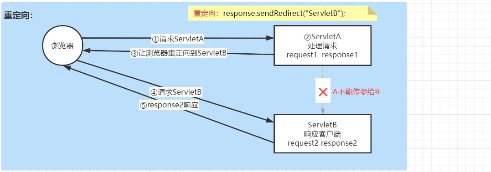

###### 2. 重定向特点

- 重定向是客户端的行为
- 浏览器对服务器发送了两次请求；
- 重定向是由浏览器再次发送请求，浏览器地址会改变为转发的地址；
- 不能通过request对象将ServletA中的数据传递给ServletB

- 如果ServletA重定向到ServletB的时候有数据要传递到ServletB该如何实现？——url传值

###### 3. 重定向代码实现

| 在ServletA中                                |
| ------------------------------------------- |
| response.sendRedirect("`ServletB访问URL`"); |

###### 4. 数据传递

```JAVA
//ServletA：在响应浏览器重定向地址的时候，在URL声明参数
response.sendRedirect("ServletB?key=value");
```

```java
//ServletB: 获取浏览器请求的参数
String value = request.getParameter("key");
```

### 5.5 状态管理

#### 5.5.1 现有问题

- http请求是无状态的，不能保存客户每次提交的信息；
- 客户端发送一个新的请求达到服务器，服务器无法知道此客户端是否曾经请求过服务器，两次请求之间是没有联系的；
- 如果用户在访问系统的主页面（主页面需要登录之后才可以访问），需要访问之前请求提交的数据该如何实现？

#### 5.5.2 状态管理实现

> 将浏览器与服务器之间的多次交互作为一个整体处理，通过服务器数据存储和浏览器数据存储集合的形式实现状态管理：
>
> - 客户端状态管理：cookie技术 （在浏览器缓存数据）
>
> - 服务器状态管理：session技术（在服务器存储用户信息，基于cookie）

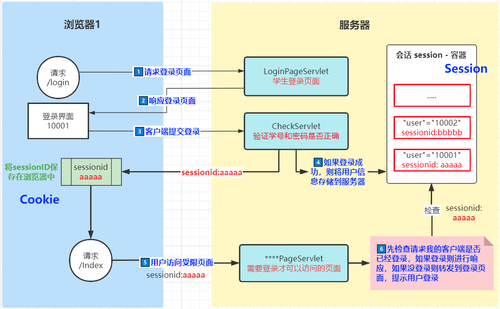

### 5.6 Cookie的使用

#### 5.6.1 什么是Cookie？

- Cookie是在浏览器访问web服务器上的某个资源时，由web服务器在响应浏览器时通过响应头附带的传送给浏览器并存储在浏览器端的一小段数据；
- 一旦web浏览器保存了来自于某个服务器的Cookie，那么当浏览器再次访问这个服务器的时候，会通过请求头将cookie传递给web服务器；
- 浏览器访问服务器的时候，只会携带由当前服务器存储在客户端的cookie；
- Cookie中缓存的数据数据是以键值对形式存储的（name-value）。


#### 5.6.2 Cookie的使用

案例流程图：


- 创建一个Java web工程：servlet-demo5

- 修改web项目在服务器上的访问路径为`/demo5`：

  

- 创建两个Servlet类，分别为`FirstServlet`和`SecondServlet`

###### 1. 写Cookie到浏览器

- 创建cookie `Cookie cookie = new Cookie("key1", "value1");`
- 设置cookie  `cookie.setMaxAge(24*60*60);`
- 写cookie  `response.addCookie(cookie);`
- 服务器可以同时写多个Cookie存储到客户端

```java
package com.qfedu.servlets;

import javax.servlet.ServletException;
import javax.servlet.annotation.WebServlet;
import javax.servlet.http.Cookie;
import javax.servlet.http.HttpServlet;
import javax.servlet.http.HttpServletRequest;
import javax.servlet.http.HttpServletResponse;
import java.io.IOException;
import java.io.PrintWriter;

/**
 * @Description 写Cookie
 * @Author 千锋涛哥
 * 公众号： Java架构栈
 */
@WebServlet("/FirstServlet")
public class FirstServlet extends HttpServlet {

    @Override
    protected void doGet(HttpServletRequest req, HttpServletResponse resp) throws ServletException, IOException {
        doPost(req, resp);
    }

    @Override
    protected void doPost(HttpServletRequest request, HttpServletResponse response) throws ServletException, IOException {

        //向浏览器存储一个Cookie
        // 1. 创建Cookie对象  （javax.servlet.http.Cookie）
        Cookie cookie = new Cookie("key1", "value1");

        // 设置cookie生命周期
        // 情况1：如果设置>0的值，表示设置cookie有效时间（单位s）
        // 情况2：如果参数=0，表示浏览器关闭销毁cookie
        // 情况3：如果参数=-1，表示内存存储
        cookie.setMaxAge(24*60*60);

        // 2. 将cookie对象添加到HTTP响应头，写Cookie到客户端
        response.addCookie(cookie);

        //响应浏览器一个界面
        //a.设置响应头
        response.setStatus(200);
        response.setContentType("text/html;charset=utf-8");
        response.setCharacterEncoding("utf-8");
        //b.响应正文
        PrintWriter out = response.getWriter();
        out.println("<!DOCTYPE html>");
        out.println("<html>");
        out.println("<head>");
        out.println("<meta charset='utf-8'>");
        out.println("<title></title>");
        out.println("<body>");
        out.println("<a href='SecondServlet'>请求SecondServlet</a>");
        out.println("</body>");
        out.println("</head>");
        out.println("</html>");
        out.flush();
        out.close();
    }
}
```

###### 2. 服务器读取Cookie

- 通过request对象获取所有cookie： `Cookie[] cookies = request.getCookies();`
- 获取Cookie对象的key： `String key = cookie.getName();`
- 获取Cookie对象的value：`String value = cookie.getValue();`

```java
package com.qfedu.servlets;

import javax.servlet.ServletException;
import javax.servlet.annotation.WebServlet;
import javax.servlet.http.Cookie;
import javax.servlet.http.HttpServlet;
import javax.servlet.http.HttpServletRequest;
import javax.servlet.http.HttpServletResponse;
import java.io.IOException;

/**
 * @Description 读Cookie
 * @Author 千锋涛哥
 * 公众号： Java架构栈
 */
@WebServlet("/SecondServlet")
public class SecondServlet extends HttpServlet {

    @Override
    protected void doGet(HttpServletRequest req, HttpServletResponse resp) throws ServletException, IOException {
        doPost(req, resp);
    }

    @Override
    protected void doPost(HttpServletRequest request, HttpServletResponse response) throws ServletException, IOException {
        // 读取cookie: 当客户端再次请求服务器时，通过request将cookie传递到服务器
        // 通过request对象获取浏览器传递的cookie
        Cookie[] cookies = request.getCookies();
        for (Cookie cookie: cookies) {
            String key = cookie.getName();
            String value = cookie.getValue();
            System.out.println(key+"对应的值："+value);
        }
        // SecondServlet暂时不响应浏览器
    }
}
```

#### 5.6.3 Cookie的优点和限制

优点：

- 可以灵活的配置过期规则
- 简洁，cookie中存储的是最简单的键值对格式的文本数据
- 数据的持久性，保存到浏览器中的cookie在过期之前是持久存储的

限制：

- 存储数据的大小，大多浏览器支持4k、8k的数据存储
- 用户可以通过浏览器设置禁用Cookie，因此限制了cookie的使用场景（如果一定要使用cookie，可以检查浏览器cookie是否可用，如果不可用提醒用户设置开启cookie）
- cookie是存储在客户端浏览器中的，有被纂改的风险，有潜在的安全隐患

### 5.7 HttpSession对象

#### 5.7.1 Session概述

> Session对象，就是当浏览器向服务器发送请求建立连接后，由服务器创建的存储在服务器端的用于记录用户状态对象。

#### 5.7.2 Session特性

- 服务器会为每个客户端连接分配一个Session对象，存储在服务器上；
- 同一个浏览器发送多次请求，同属于一次会话，共享同一个Session对象；

#### 5.7.3 Session原理

问题：HTTP请求时无状态的，那么同一个浏览器的多次请求为什么能够使用同一个Session对象，如何实现的？

结论：借助于Cookie让浏览器多次请求共享同一个Session

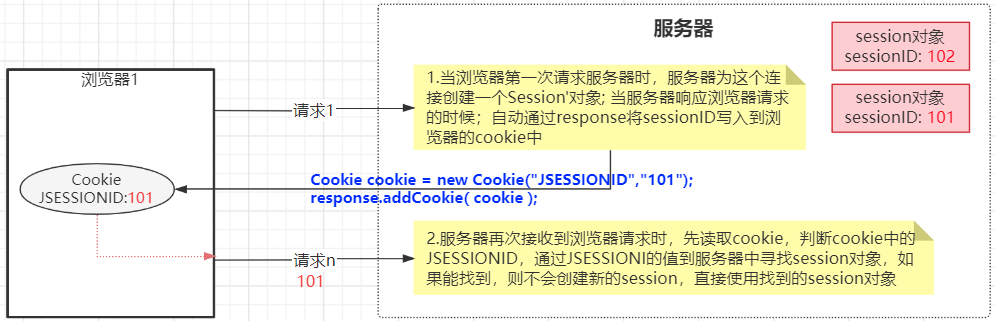

Session原理：

1. 当客户端浏览器(第一次)请求服务器时，服务器会为当前客户端连接创建一个Session对象，同时将sessionID通过Cookie响应给客户端，并存储在客户端；
2. 当客户端端再次请求服务器的时候，会通过请求头携带存储sessionID的cookie，服务器接收请求之后获取cookie中的sessionID，通过这个sessionID获取第一次连接时创建Session对象。

#### 5.7.4 获取Session对象

> 当用户连接到服务器时，服务器会为这个用户连接创建一个session对象，在Servlet类中可以通过request对象调用getSession()方法获取当前用户连接的Session对象。

```java
// session对象是 javax.servlet.http.HttpSession接口的对象
//1.获取session对象
// getSession() : 获取当前用户连接
HttpSession session = request.getSession();

// getId() : 获取sessionID
String sessionId = session.getId();
```

#### 5.7.5 Session对象数据操作

###### 1.向session对象存储数据

```java
//2.将数据保存到session对象，session对象的数据结构底层维护的就是一个Map，可以存放多个键值对
session.setAttribute("key1","Hello QF!");
session.setAttribute("key2","Java");
```

###### 2.从session对象获取数据

```java
//3.从session对象中取数据，根据key获取value
String s1 = (String) session.getAttribute("key1");
System.out.println("SecondServlet:"+s1);
```

###### 3.修改session对象数据

```java
//4.修改session数据，如果key存在，则表示修改session中这个key的值
session.setAttribute("key1","千锋武汉！");
```

###### 4.删除session对象数据

```java
//5.删除session中 key1的键值对
session.removeAttribute("key1");
```


#### 5.7.6 session对象失效

> 一个客户端的多次请求正常情况下获取到的是同一个session对象，也是正式因为多次请求获取的是同一个session对象才实现了session中存储的用户状态可以作用于请求。
>
> 如果session失效，将会导致session失效的后的请求无法获取之前的session对象，也就是说多次请求获取的不是同一个session。

**导致session失效的原因有2种**：

- 客户端禁用Cookie，或者客户端在两次请求之间清除了cookie，将导致下一次请求无法获取上一次请求创建的Cookie；
- session是有生命周期的，当客户端请求服务器建立连接之后，服务器会为此会话创建session对象，如果客户端的两次请求时间间隔>session过期时间（默认30min），服务器会将之前创建的session对象销毁；

**session失效解决方案**：

- 如果客户端禁用了Cookie：不能通过cookie来记录、传递sessionId， 我们可以通过重写URL，使用url传递sessionID（在url上追加sessionId）

- 如果session过期：我们可以根据系统的需求灵活设置session的生命周期或者手动销毁session对象

  ```java
  //设置session对象的过期时间（单位:s）
  //设置session过期时间10s：当客户端的两次请求时间>10s,session将会被销毁
  session.setMaxInactiveInterval(10);
  
  //手动销毁session对象
  session.invalidate();
  ```

#### 5.7.7 使用session实现用户登录验证

> 在一个软件系统中，有很多资源是需要用户登录之后才可以请求访问的（受限资源）

步骤：

1. 当用户登录成功之后，将用户信息保存到当前用户连接的session对象中；

   ```java
   //CheckServlet
   
   //当学生登录成功，将学生信息存储到session
   HttpSession session = request.getSession();
   session.setAttribute("stu",student);
   
   //重定向到IndexPageServlet
   response.sendRedirect("IndexPageServlet");
   ```

2. 当用户访问受限资源时，先检查session中是否有用户信息：

   - 如果有用户信息则表示当前用户已经登录，可以继续访问
   - 如果session中没有用户信息，表示用户未登录或session过期，则跳转到登录页面，提示用户登录。

   ```java
   HttpSession session = request.getSession();
   Student stu = (Student) session.getAttribute("stu");
   if(stu == null){
       //从session没有获取stu,则提示重新登录
       request.setAttribute("tips","请先登录！");
       request.getRequestDispatcher("login").forward(request,response);
   }else{
       //响应
   }
   ```

#### 5.7.8 request与session的区别

> request对象用于获取用户的请求数据，作用于浏览器和服务器的一次请求；
>
> session对象用于记录当前用户的状态，作用于一个客户端的多次请求；

**场景1**：浏览器请求ServletA，ServletA转发到ServletC


ServletC与ServletA同属于一次请求，共享同一个request对象，都可以通过request获取浏览器提交的数据


**场景2**：浏览器请求ServletB，ServletB重定向到ServletD


重定向到ServletD，ServletB与ServletD是浏览器的两次请求，ServletD中的request与ServletB是不同的对象

### 5.8 ServletContext对象

####  5.8.1 ServletContext对象介绍

> HttpServletRequest对象作用于一次用户请求，获取用户数据
>
> HttpSession对象作用于一个用户的多次请求，实现数据共享
>
> ServletContext对象作用域整个web项目，实现多个用户之间的数据共享


ServletContext是Javaweb项目的全局对象，包含当前web项目在web服务器中的信息，同时它也是一个域对象，可以实现访问当前web项目的所有用户之间的数据共享。

#### 5.8.2 通过ServletContext对象获取web应用信息

```java
//ServletContext对象 —— Servlet上下文对象
//1.获取ServletContext对象
ServletContext servletContext = getServletContext();

//2.通过ServletContext对象获取当前web应用的上下文路径
//   就是当前web应用在web服务器上的访问路径
String contextPath = servletContext.getContextPath();

//3.通过ServletContext对象获取web项目中的目录在 服务器上的绝对路径
String realPath = servletContext.getRealPath("/files");
```

#### 5.8.3 通过ServletContext对象实现全局数据共享

```java
//1.将数据存储到全局对象
servletContext.setAttribute("ckey",value);

//2.根据key从全局对象取数据
Object v = servletContext.getAttribute("ckey");

//3.从全局对象移出数据
servletContext.removeAttribute("ckey");
```

#### 5.8.4 ServletContext对象特性

- ServletContext是当前web项目的全局上下文对象，可以被多个用户请求共享；
- ServletContext在服务器启动的时候创建，当服务器关闭或者将项目从服务器移出时销毁ServletContext对象；
- ServletContext可以实现 在线人数统计等需要全局存储的场景。

#### 5.8.5 通过ServletContext对象获取全局参数

- 在web.xml可以配置当前web应用的全局参数，在服务器启动的时候会加载web.xml

  ```xml
  <?xml version="1.0" encoding="UTF-8"?>
  <web-app xmlns="http://xmlns.jcp.org/xml/ns/javaee"
           xmlns:xsi="http://www.w3.org/2001/XMLSchema-instance"
           xsi:schemaLocation="http://xmlns.jcp.org/xml/ns/javaee http://xmlns.jcp.org/xml/ns/javaee/web-app_4_0.xsd"
           version="4.0">
  
      <!--  配置上下文参数  ： 键值对 -->
      <context-param>
          <param-name>key1</param-name>
          <param-value>HelloWorld</param-value>
      </context-param>
      <context-param>
          <param-name>key2</param-name>
          <param-value>wahaha</param-value>
      </context-param>
  
  </web-app>
  ```

- 在Servlet类中，可以通过ServletContext对象读取初始化参数：

  ```java
  //通过ServletContext对象获取web.xml中配置的全局参数
  // getInitParameterNames()：获取web.xml中全局参数所有的key[key1,key2]
  Enumeration<String> keys = servletContext.getInitParameterNames();
  
  // getInitParameter(key): 根据key获取value
  String v1 = servletContext.getInitParameter("key1");
  ```

  

### 5.9 ServletConfig对象

> ServletConfig对象表示的一个Servlet在web服务器的配置信息

Servlet类通过web.xml配置方式可以配置Servlet类的初始化参数：

```xml
<!--  xml方式配置Servlet，可以配置当前Servlet的初始化参数  -->
<servlet>
    <servlet-name>TestServlet</servlet-name>
    <servlet-class>com.qfedu.servlets.TestServlet</servlet-class>
    <!-- Servlet类的初始化参数 -->
    <init-param>
        <param-name>key3</param-name>
        <param-value>hahaha</param-value>
    </init-param>
    <init-param>
        <param-name>key4</param-name>
        <param-value>hehehe</param-value>
    </init-param>
</servlet>
<servlet-mapping>
    <servlet-name>TestServlet</servlet-name>
    <url-pattern>/TestServlet</url-pattern>
</servlet-mapping>
```

- 在TestServlet类中获取当前类的ServletConfig对象，并通过对象获取类路径、加载初始化参数

```java
//1.获取ServletConfig对象
//getServletConfig() : 获取当前Servlet类的ServletConfig对象
ServletConfig servletConfig = getServletConfig();

//2.通过ServletConfig获取当前Servlet类路径
String servletName = servletConfig.getServletName();

//3.通过ServletConfig对象加载当前Servlet类的初始化参数
//getInitParameterNames 获取当前Servlet所有初始化参数的key
Enumeration<String> names = servletConfig.getInitParameterNames();

//getInitParameter 根据key获取value
String v3 = servletConfig.getInitParameter("key3");

System.out.println("TestServlet:"+v3);
```

## 六、过滤器

### 6.1 过滤器介绍

> 过滤器(Filter)是位于客户端与服务器资源之间的一道过滤技术，可以在客户端请求到达目标资源之前进行预处理业务。

**过滤器作用**

- 执行多个Servlet公共的代码，解决了代码的冗余性问题，提高代码复用性（例如首先资源的登录验证）；

  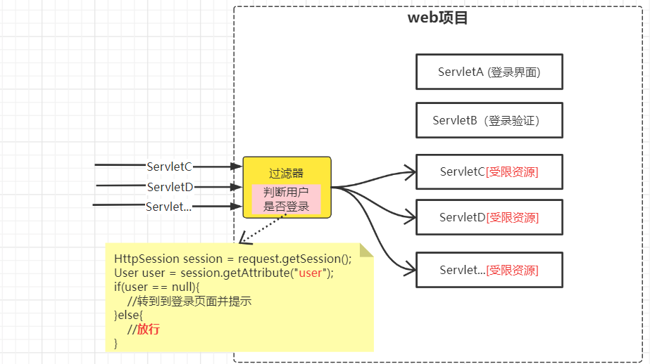


### 6.2 过滤器使用

#### 6.2.1 创建过滤器

> 在doFilter编写过滤业务规则，如果允许继续访问，则通过`filterChain.doFilter(servletRequest,servletResponse);`让客户端请求继续访问；如果不允许通行则可以通过servletResponse直接响应客户端（转发、重定向）。

```java
package com.qfedu.filters;

import javax.servlet.*;
import java.io.IOException;

/**
 * @Description
 * @Author 千锋涛哥
 * 公众号： Java架构栈
 * 1.创建一个类实现javax.servlet.Filter接口
 * 2.实现Filter接口中的init、doFilter、destroy抽象方法
 *    init 是过滤器初始化方法，用于获取过滤器的初始化参数等
 *    destory 是过滤器的销毁方法，用以释放资源
 *    doFilter 方法 用于定义过滤器的业务
 * 3.在doFilter实现过滤器业务
 */
public class MyFilter01 implements Filter {

    @Override
    public void init(FilterConfig filterConfig) throws ServletException {
    }

    @Override
    public void doFilter(ServletRequest servletRequest, ServletResponse servletResponse, FilterChain filterChain)
            throws IOException, ServletException {
        System.out.println("~~~~~~MyFilter01");
        //放行:运行继续执行浏览器请求的目标资源
        filterChain.doFilter(servletRequest,servletResponse);
    }

    @Override
    public void destroy() {
    }
}

```

#### 6.2.2 配置过滤器

> 配置过滤器拦截哪些服务器资源

- xml配置

  ```xml
  <filter>
      <filter-name>MyFilter01</filter-name>
      <filter-class>com.qfedu.filters.MyFilter01</filter-class>
  </filter>
  <filter-mapping>
      <filter-name>MyFilter01</filter-name>
      <!--过滤器的拦截规则-->
      <url-pattern>/FirstServlet</url-pattern>
  </filter-mapping>
  ```

- 注解配置：在过滤器类添加`@WebFilter`注解

  ```java
  @WebFilter("/*")
  public class MyFilter01 implements Filter {
  	//...
  }
  ```

#### 6.2.3 过滤器路径配置规则

**精确过滤：** 配置过滤器拦截指定的请求url

例如：/FirstServlet，/index.html 

**后缀过滤：** 配置过滤器拦截指定的后缀的请求url

例如：*.jpg 、 *.html

**通配符过滤**：

- /*   拦截所有请求
- /aaa/bbb/*   拦截项目名后 `demo8/aaa/bbb/FirstServlet` 或者 `demo8/aaa/bbb/a.html`


### 6.3 前置过滤器与后置过滤器

> 根据过滤器在目标资源执行的时机，我们可以将过滤器分为三类：
>
> - 前置过滤器：过滤器在目标资源之前执行
> - 后置过滤器：过滤器在目标资源之后执行
> - 环绕过滤器：执行目标资源之前会执行过滤器，目标资源执行之后还会执行过滤器

如何设置前置、后置、环绕过滤器？

- 在过滤器的`doFilter`方法中，写在`放行代码（filterChain.doFilter(...)）`业务会在目标资源执行之前执行，写在放行代码后面的业务，则会在目标资源执行之后执行

```java
@WebFilter("/FirstServlet")
public class MyFilter01 implements Filter {

    @Override
    public void init(FilterConfig filterConfig) throws ServletException {
    }

    @Override
    public void doFilter(ServletRequest servletRequest, ServletResponse servletResponse, FilterChain filterChain)
            throws IOException, ServletException {
        System.out.println("~~~~~~before");
        //放行:运行继续执行浏览器请求的目标资源
        filterChain.doFilter(servletRequest,servletResponse);
        System.out.println("~~~~~~after");
    }

    @Override
    public void destroy() {
    }
}
```

### 6.4 过滤器链

#### 6.4.1 过滤器链介绍

> 在同一个服务器资源（Servlet类）上可以添加多个过滤器，当用户请求资源时，会依次执行每一个过滤器，然后再执行目标资源，再依次通过过滤器响应客户端请求。

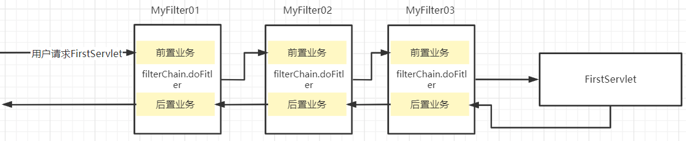

#### 6.4.2 过滤器的优先级

> 过滤器优先级：在一个web项目中如果配置多个过滤器，多个过滤器的先后执行顺序

- 如果多个过滤器都是使用注解配置的，则按照过滤器类的名称字符串的字典顺序执行；
- 如果多个过滤器都是在web.xml中配置的，则按照web.xml配置的先后顺序执行；
- web.xml中配置的过滤器优先级高于注解配置；
- 如果同一个过滤器通过注解及web.xml两种方式都进行了配置，过滤器会执行多次。

### 6.5 过滤器应用案例

#### 6.5.1 编码过滤器

```java
package com.qfedu.utils;

import javax.servlet.*;
import javax.servlet.annotation.WebFilter;
import java.io.IOException;

/**
 * @Description 编码过滤器
 * @Author 千锋涛哥
 * 公众号： Java架构栈
 */
@WebFilter("/*")
public class EncodingFilter implements Filter {
    @Override
    public void init(FilterConfig filterConfig) throws ServletException {
    }

    @Override
    public void doFilter(ServletRequest servletRequest, ServletResponse servletResponse, FilterChain filterChain)
            throws IOException, ServletException {
        //对request请求数据进行编码设置
        servletRequest.setCharacterEncoding("utf-8");
        //请求放行
        filterChain.doFilter(servletRequest, servletResponse);
    }

    @Override
    public void destroy() {
    }
}
```

#### 6.5.2 登录验证过滤器

###### 1.实现流程


###### 2.登录过滤器代码实现

```java
package com.qfedu.sgms.utils;

import com.qfedu.sgms.dto.Student;

import javax.servlet.*;
import javax.servlet.annotation.WebFilter;
import javax.servlet.http.HttpServletRequest;
import javax.servlet.http.HttpServletResponse;
import javax.servlet.http.HttpSession;
import java.io.IOException;

/**
 * @Description 登录验证过滤器
 * @Author 千锋涛哥
 * 公众号： Java架构栈
 */
@WebFilter("/*")
public class LoginFilter implements Filter {
    @Override
    public void init(FilterConfig filterConfig) throws ServletException {

    }

    @Override
    public void doFilter(ServletRequest servletRequest, ServletResponse servletResponse, FilterChain filterChain) throws IOException, ServletException {
        //1.因为此过滤器会拦截所有用户请求（包括受限资源和非受限资源）
        //  所以当一个用户请求被拦截之后，我们需要知道这个请求的路径
        // a.将ServletRequest转换成 HttpServletRequest
        HttpServletRequest request = (HttpServletRequest) servletRequest;
        HttpServletResponse response = (HttpServletResponse) servletResponse;
        // b.通过request对象获取用户的请求路径
        String uri = request.getRequestURI();    //  ----  /demo4/IndexPageServlet
        // c.截取uri最后一个/后的路径，即为请求路径
        String requestPath = uri.substring( uri.lastIndexOf("/")+1 );
        System.out.println("requestPath:"+requestPath);

        //2.判断：如果请求路径是非受限资源则直接放行，如果是受限资源则需要验证用户是否登录
        if("CheckServlet".equals(requestPath) || "login".equals(requestPath)){
            //放行
            filterChain.doFilter(servletRequest, servletResponse);
        }else{
            //进入else代码，表示此请求是受限资源，需要验证用户是否登录
            //3.判断session中是否有用户信息，如果有则表示用户已经登录——放行
            //  如果没有则表示用户未登录，转发到登录页面，提示请先登录
            HttpSession session = request.getSession();
            Student stu = (Student) session.getAttribute("stu");
            if(stu != null){
                filterChain.doFilter(servletRequest, servletResponse);
            }else{
                //转到到登录页面
                request.setAttribute("tips","请先登录！");
                request.getRequestDispatcher("login").forward(request,response);
            }
        }
    }

    @Override
    public void destroy() {

    }
}
```


## 七、Servlet应用

### 7.1 文件上传

> 客户端提交文件（图片/ppt/doc/md...）到Servlet类，Servlet类该如何接收并保存文件呢 ？

#### 7.1.1 文件上传案例流程

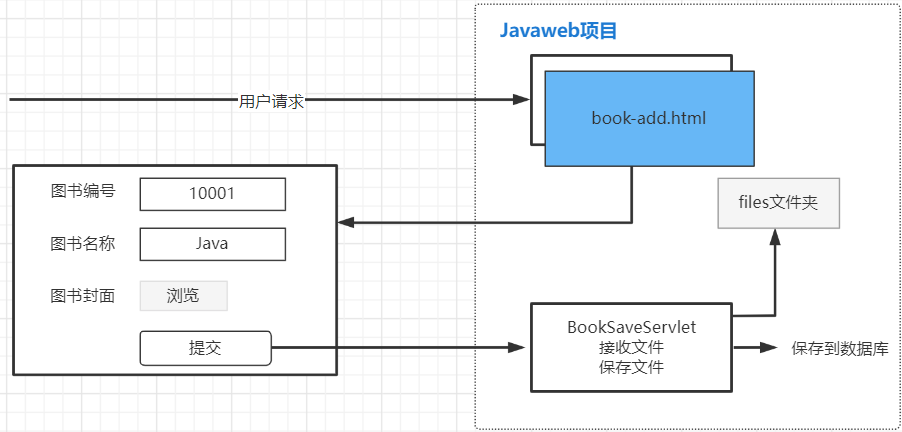


#### 7.1.2 准备工作

- 创建一个Java web工程：`serlvet-demo9`

- 在web工程的 web 目录创建一个 `book-add.html`的网页文档，提供图书添加界面

  ```html
  <!DOCTYPE html>
  <html lang="en">
      <head>
          <meta charset="UTF-8">
          <title>图书添加页面</title>
      </head>
      <body>
          <h3>添加图书信息</h3>
          <form action="" method="">
              <p>图书编号：<input type="text" name="bookId"/></p>
              <p>图书名称：<input type="text" name="bookName"/></p>
              <p>图书封面：<input type="file" name="bookImg"/></p>
              <p><input type="submit" value="提交"/></p>
          </form>
      </body>
  </html>
  ```

- 创建`BookSaveServlet类`：

  ```java
  package com.qfedu.servlets;
  
  import javax.servlet.ServletException;
  import javax.servlet.annotation.WebServlet;
  import javax.servlet.http.HttpServlet;
  import javax.servlet.http.HttpServletRequest;
  import javax.servlet.http.HttpServletResponse;
  import java.io.IOException;
  
  /**
   * @Description 接收图书信息并保存
   * @Author 千锋涛哥
   * 公众号： Java架构栈
   */
  @WebServlet("/BookSaveServlet")
  public class BookSaveServlet extends HttpServlet {
  
      @Override
      protected void doGet(HttpServletRequest request, HttpServletResponse response)
              throws ServletException, IOException {
          doPost(request, response);
      }
  
      @Override
      protected void doPost(HttpServletRequest request, HttpServletResponse response)
              throws ServletException, IOException {
          
      }
  }
  ```

- 创建图书实体类：`Book`

  ```java
  /**
   * @Description 图书信息实体类
   * @Author 千锋涛哥
   * 公众号： Java架构栈
   */
  public class Book {
  
      private String bookId;
      private String bookName;
      private String bookImgPath;
      
  }
  ```

- 创建保存图书信息操作的DAO类：`BookDAO`

#### 7.1.3 文件上传实现

###### 1.前端提交文件

- 表单post方式提交数据

- 设置表单的enctype="multipart/form-data"，不对表单数据进行编码

  ```html
  <!--
  当form表单数据提交时，浏览器会对表单数据进行编码，然后提交；
  当表单中存在文件的时候，要设置不编码传输
  通过form表单的enctype属性设置表单数据的压缩方式：
  - application/x-www-form-urlencoded 在发送前编码所有字符（默认）
  - text/plain 将表单数据空格转换成+，不对特殊字符进行编码
  - multipart/form-data 不对表单数据进行编码
  -->
  <form action="BookSaveServlet" method="post" enctype="multipart/form-data">
      <p>图书编号：<input type="text" name="bookId"/></p>
      <p>图书名称：<input type="text" name="bookName"/></p>
      <p>图书封面：<input type="file" name="bookImg"/></p>
      <p><input type="submit" value="提交"/></p>
  </form>
  ```

###### 2.Servlet类接收文件

- 在Servlet类前添加`@MultipartConfig`注解，赋予当前Servlet类处理未编码提交的数据的能力；

- 通过request对象调用`getPart(key)`或者`getParts()`方法接收文件

  ```java
  package com.qfedu.servlets;
  
  import javax.servlet.ServletException;
  import javax.servlet.annotation.MultipartConfig;
  import javax.servlet.annotation.WebServlet;
  import javax.servlet.http.HttpServlet;
  import javax.servlet.http.HttpServletRequest;
  import javax.servlet.http.HttpServletResponse;
  import javax.servlet.http.Part;
  import java.io.IOException;
  import java.util.Collection;
  
  /**
   * @Description 接收图书信息并保存
   * @Author 千锋涛哥
   * 公众号： Java架构栈
   */
  @WebServlet("/BookSaveServlet")
  @MultipartConfig
  public class BookSaveServlet extends HttpServlet {
  
      @Override
      protected void doGet(HttpServletRequest request, HttpServletResponse response)
              throws ServletException, IOException {
          doPost(request, response);
      }
  
      @Override
      protected void doPost(HttpServletRequest request, HttpServletResponse response)
              throws ServletException, IOException {
  
          //1.设置utf-8编码
          request.setCharacterEncoding("utf-8");
  
          //2.接收普通文本
  //当网页提交数据的表单设置了enctype="multipart/form-data"之后不能直接使用getParameter接收文本数据
          //需要在当前serlvet类添加 @MultipartConfig 用于处理非压缩提交的数据
          String id = request.getParameter("bookId");
          String name = request.getParameter("bookName");
  
          System.out.println("id:"+id );
          System.out.println("name:"+name );
  
          //3. 接收表单提交的图片
          // getPart("输入框name属性"): 接收表单中的文件
          Part bookImg = request.getPart("bookImg");
          System.out.println(bookImg);
          //  getParts(): 接收表单中所有文件
          //Collection<Part> parts = request.getParts();
  
          //4.保存图片
  
      }
  }
  ```

###### 3.保存图片

- 在web工程的web目录下新建一个`files`目录（保存文件的目录如果不在web服务器上，用户将无法访问）

- 在`files`目录先放一个任意的文件（空的目录在进行项目部署的时候不会在web服务器中创建）

  ```java
  //4.保存图片
  // a.获取files目录在web服务器上的路径（不是工作空间的路径）
  ServletContext servletContext = getServletContext();
  String dir = servletContext.getRealPath("/files");
  
  // b.给上传的文件重命名 （不同用户有可能上传相同名称的图片，如果不重命名将导致文件覆盖）
  //   文件重命名后缀名不能改变
  String header = bookImg.getHeader("Content-Disposition");  //form-data; name="bookImg"; filename="千锋武汉（横版）.jpg"
  //   截取上传的文件的后缀名
  int begin = header.lastIndexOf(".");
  int end = header.lastIndexOf("\"");
  String ext = header.substring(begin, end);
  // 取名（时间毫秒数、UUID、雪花算法）
  String fileName  = UUID.randomUUID().toString()+ext;
  
  //c.存储文件到目录
  bookImg.write(dir+"\\"+fileName);
  
  //5.将图书信息保存到数据库: 保存到数据库的是图片的访问路径（不是绝对路径）
  Book book = new Book(id, name, "files/" + fileName);
  //调用BookDAO 将book对象保存到数据库
  ```

  

### 7.2 文件下载

> 客户端向服务器发送请求，服务器将客户端请求的文件响应给客户端。

#### 7.2.1 文件下载案例流程


#### 7.2.2 案例准备工作

- 在项目的`files`目录添加几个待下载的图片

- 创建文件下载的Servlet类`FileDownloadServlet`

- 创建文件列表的静态网页：在web目录下创建`file-list.html`

  ```html
  <!DOCTYPE html>
  <html lang="en">
      <head>
          <meta charset="UTF-8">
          <title>Title</title>
      </head>
      <body>
          <br/>
          <a href="FileDownloadServlet?fileName=img01.png">下载</a><br/>
  
          <br/>
          <a href="FileDownloadServlet?fileName=img02.png">下载</a><br/>
  
          <br/>
          <a href="FileDownloadServlet?fileName=img03.png">下载</a><br/>
      </body>
  </html>
  ```

#### 7.2.3 文件下载实现

```java
package com.qfedu.servlets;

import javax.servlet.ServletContext;
import javax.servlet.ServletException;
import javax.servlet.ServletOutputStream;
import javax.servlet.annotation.WebServlet;
import javax.servlet.http.HttpServlet;
import javax.servlet.http.HttpServletRequest;
import javax.servlet.http.HttpServletResponse;
import java.io.FileInputStream;
import java.io.IOException;

/**
 * @Description
 * @Author 千锋涛哥
 * 公众号： Java架构栈
 */
@WebServlet("/FileDownloadServlet")
public class FileDownloadServlet extends HttpServlet {

    @Override
    protected void doGet(HttpServletRequest request, HttpServletResponse response)
            throws ServletException, IOException {
        doPost(request, response);
    }

    @Override
    protected void doPost(HttpServletRequest request, HttpServletResponse response)
            throws ServletException, IOException {
        //1.接收客户端传递过来的文件名（即为要下载的文件）
        String fileName = request.getParameter("fileName");  //img01.png

        //2.获取存储文件的files目录路径
        ServletContext servletContext = getServletContext();
        String dir = servletContext.getRealPath("/files");
        // 拼接要下载的文件路径
        String filePath = dir+"\\"+fileName;

        //3.设置响应头
        //设置响应的类型如果浏览器无法识别则会提示另存为
        response.setContentType("application/image"); 
        response.addHeader("Content-Disposition","attachment; fileName="+fileName);

        //4. 通过IO流将文件数据响应给浏览器（文件是二进制数据，所以获取字节流）
        ServletOutputStream outputStream = response.getOutputStream();
        // 读取服务文件，写给客户端
        FileInputStream fis = new FileInputStream(filePath);
        byte[] bs = new byte[1024];
        int len = -1;
        while( (len = fis.read(bs))!=-1){
            outputStream.write(bs,0,len);
        }
        outputStream.close();
        fis.close();
    }
}
```


### 7.3 验证码

#### 7.3.1 什么是验证码？

> 在应用系统用户登录、用户注册的功能中，使用验证码用于避免客户端通过暴力破解的形式获取用户信息，提高用户信息的安全性。


#### 7.3.2 验证码生成流程


#### 7.3.3 验证码生成实现

- 创建新的Javaweb工程：`servlet-demo10`

- 项目的web目录创建`login.html`,提供登录界面视图：

  ```html
  <!DOCTYPE html>
  <html lang="en">
      <head>
          <meta charset="UTF-8">
          <title>用户登录</title>
      </head>
      <body>
          <form action="" method="post">
              <p>账号：<input type="text" name="userName"/></p>
              <p>密码：<input type="password" name="userPwd"/></p>
              <p>
                  验证码：
                  <input type="text" name="userCode" maxlength="4"/>
                  
              </p>
              <p><input type="submit" value="登录"/></p>
          </form>
      </body>
  </html>
  ```

- 创建生成验证码的Servlet类：`ValidateCodeServlet`

  ```java
  package com.qfedu.servlets;
  
  import javax.imageio.ImageIO;
  import javax.servlet.ServletException;
  import javax.servlet.annotation.WebServlet;
  import javax.servlet.http.HttpServlet;
  import javax.servlet.http.HttpServletRequest;
  import javax.servlet.http.HttpServletResponse;
  import java.awt.*;
  import java.awt.image.BufferedImage;
  import java.io.IOException;
  import java.util.Random;
  
  /**
   * @Description 生成验证码图片
   * @Author 千锋涛哥
   * 公众号： Java架构栈
   */
  @WebServlet("/ValidateCodeServlet")
  public class ValidateCodeServlet extends HttpServlet {
  
      @Override
      protected void doGet(HttpServletRequest request, HttpServletResponse response)
              throws ServletException, IOException {
          doPost(request, response);
      }
      @Override
      protected void doPost(HttpServletRequest request, HttpServletResponse response)
              throws ServletException, IOException {
          //接收客户端请求，生成一个验证码图片，响应给客户端
          // 使用Java中提供的 awt 工具包动态生成一个验证码图片
          //1.创建一张图片
          int width = 300;  //验证码宽度
          int height = 90;  //验证码高度
          BufferedImage image = new BufferedImage(width,height,BufferedImage.TYPE_INT_RGB);
  
          //2.绘制图片 , 从图片对象中获取绘制图片的 “笔”
          Graphics2D pen = image.createGraphics();
          //a.绘制背景
          pen.setColor(getRandomColor());
          //fillRect: 绘制实心矩形
          pen.fillRect(0,0,width,height);
  
          //b.绘制验证码字符串
          int letterNum = 4;  //验证码图片上的字符的个数
          int space = 20; // 验证码图片上两个字母之间的空隙
          int letterWidth = ( width-(letterNum+1)*space )/letterNum; //计算每个字母占据的宽度
  
          //for循环每循环一次，绘制一个字母  （小写字母的ascii码  97-122）
          Random random = new Random();
          for(int i=0; i<letterNum ; i++){
              //随机生成一个小写字母：
              int ascii = random.nextInt(26) + 97; //97-122
              byte[] bs = {(byte)ascii};
              String letter = new String(bs);
              //drawString: 绘制字母
              pen.setColor(getRandomColor());
              pen.setFont( new Font("Gulim",Font.BOLD,70) );
              pen.drawString(letter, space+(letterWidth+space)*i,height-space);
          }
  
          // 为了让图片不是那么容易被程序识别，可以绘制干扰线、干扰图形
  
          //图片绘制完成之后，将图片通过 response的输出流响应到客户端
          ImageIO.write(image,"png",response.getOutputStream());
      }
  
      /**
       *  产生一种随机颜色
       */
      private Color getRandomColor(){
          Random random = new Random();
          int r = random.nextInt(256);
          int g = random.nextInt(256);
          int b = random.nextInt(256);
          Color color = new Color(r, g, b);
          return color;
      }
  
  }
  ```

- 修改登录页面验证码图片的src属性，请求验证码Servlet类

  ```html
  
  ```

#### 7.3.4 点击验证码图片切换验证码

| 点击验证码图片，触发JS代码，重新请求验证码Servlet类          |
| ------------------------------------------------------------ |
|  |

#### 7.3.5 验证码验证流程


#### 7.3.6 验证流程实现

- 在ValidateCodeServlet中生成验证码时，将验证码存入到session

  | ValidateCodeServlet                                          |
  | ------------------------------------------------------------ |
  |  |

- 创建验证用户登录的Servlet类`LoginCheckServlet`

- 修改登录页面提交数据到`LoginCheckServlet`

  | login.html                                                   |
  | ------------------------------------------------------------ |
  |  |

- 在 `LoginCheckServlet`中接收用户输入的帐号、密码、验证码，对验证码进行校验

  ```java
  package com.qfedu.servlets;
  
  import javax.servlet.ServletException;
  import javax.servlet.annotation.WebServlet;
  import javax.servlet.http.HttpServlet;
  import javax.servlet.http.HttpServletRequest;
  import javax.servlet.http.HttpServletResponse;
  import javax.servlet.http.HttpSession;
  import java.io.IOException;
  
  /**
   * @Description 校验验证码
   * @Author 千锋涛哥
   * 公众号： Java架构栈
   */
  @WebServlet("/LoginCheckServlet")
  public class LoginCheckServlet extends HttpServlet {
  
      @Override
      protected void doGet(HttpServletRequest request, HttpServletResponse response) 
          throws ServletException, IOException {
          doPost(request, response);
      }
  
      @Override
      protected void doPost(HttpServletRequest request, HttpServletResponse response) 
          throws ServletException, IOException {
  
          //1.接收帐号、密码、验证码
          String userName = request.getParameter("userName");
          String userPwd = request.getParameter("userPwd");
          String userCode = request.getParameter("userCode");
  
          //2.从session取出生成验证码时存储的正确的验证码
          HttpSession session = request.getSession();
          String vCode = (String) session.getAttribute("vCode");
  
          //3.将用户输入的验证码和从session取出的正确的验证码进行对比
          if(userCode.equals(vCode)){
              //验证码正确,继续校验帐号和密码
              //...
              System.out.println("---验证码正确");
          }else{
              //验证码错误,转发到登录页面，并提示验证码错误
              //（在此案例中登录页面是用html实现的，不能显示提示信息）
              System.out.println("---验证码错误");
          }
      }
  }
  ```

  
