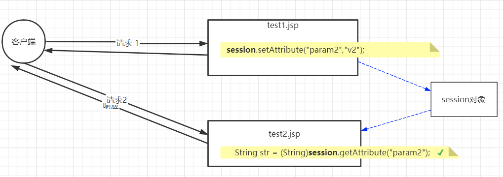
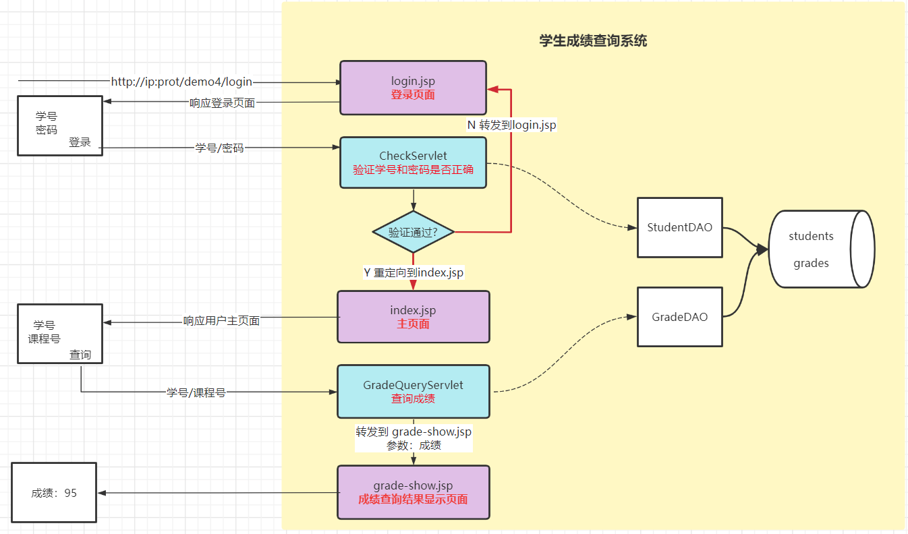
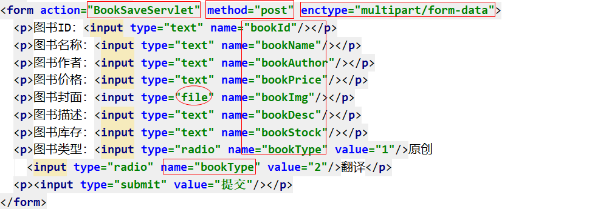
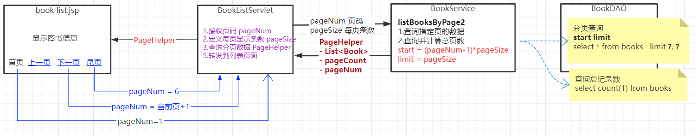

## 一、JSP概述

### 1.1 Servlet使用的不足

> Servlet是一个动态网页技术，客户端通过请求Servlet类可以相应给客户端一个动态网页，但是Servlet在使用过程中有什么不足之处呢？
>
> - 开发方式麻烦：继承HttpServlet父类、重写doGet/doPost、Servlet配置
>
> - 项目更新麻烦：Servlet类中的代码发生改变，需要重新编译、部署、启动Tomcat
>
> - 网页呈现复杂：需要进行HTML标签拼接，同时要通过输出流逐行打印
>
> - 协同开发困难：UI负责页面美化，但是页面是由Servlet类提供，如果UI不懂Java、则不能完成Servlet响应的页面的优化

### 1.2 JSP简介

> JSP (Java Server Page)  基于Servlet技术的、运行在服务器之上、支持Java语言的动态网页技术。

背景：JSP简化了Servlet的设计，采用在HTML标签中嵌套代码的形式进行动态网页的呈现，用于高效开发web应用的动态网页。

作用：替换显示页面部分的Servlet（使用`*.jsp`网页文件替换`*PageServlet.java`类）

## 二、JSP入门案例

| JSP入门案例流程：                                            |
| ------------------------------------------------------------ |
|  |

### 2.1 案例准备

#### 2.1.1 创建数据库数据表

- 创建数据库 `db_jsp`
- 创建图书信息表

```sql
create table books(
   book_id char(6) primary key,
	 book_name varchar(50) not null,
	 book_author varchar(20) not null,
	 book_price DECIMAL(10,2),
	 book_img_path varchar(100) not null,
	 book_desc varchar(200),
	 book_type int not null 
);
```

#### 2.1.2 创建web项目

JSP必须依赖于服务器运行，因此只能在web应用中使用JSP技术

web项目名称`jsp-demo1`

#### 2.1.3 完成JDBC准备

- 导入jar包：mysql驱动、druid.jar、apache commons dbutils

- 创建`com.qfedu.jsp.utils`包，在包中创建`druid.properties`文件配置连接池参数

  ```properties
  # 数据库连接信息
  driverClassName=com.mysql.cj.jdbc.Driver
  url=jdbc:mysql://localhost:3306/db_jsp?characterEncoding=utf8
  username=root
  password=@QFedu123
  
  # 连接池属性
  # 连接池的初始化连接数<创建数据库连接池时默认初始化的连接的个数>
  initialSize=10
  # 连接池的最大连接数
  maxActive=50
  # 最小空闲连接数（当数据库连接使用率很低时，连接池中的连接会被释放一部分）
  minIdle=5
  # 超时等待时间(单位：ms)
  maxWait=30000
  ```

- 在utils包中连接池工具类`DruidUtils`

  ```java
  package com.qfedu.jsp.utils;
  
  import com.alibaba.druid.pool.DruidDataSource;
  import com.alibaba.druid.pool.DruidDataSourceFactory;
  
  import javax.sql.*;
  import java.io.InputStream;
  import java.sql.*;
  import java.util.Properties;
  
  /**
   * @Description 数据库连接池工具类
   * @Author 千锋涛哥
   * 公众号： Java架构栈
   */
  public class DruidUtils {
  
      private static DruidDataSource druidDataSource;
  
      static{
          try {
              InputStream is = DruidUtils.class.getResourceAsStream("druid.properties");
              Properties properties = new Properties();
              properties.load(is);
              druidDataSource = (DruidDataSource) DruidDataSourceFactory.createDataSource(properties);
          } catch (Exception e) {
              e.printStackTrace();
          }
      }
  
      /**
       * 获取数据库连接池数据源对象
       * @return
       */
      public static DataSource getDataSource(){
          return druidDataSource;
      }
  
      /**
       * 从数据库连接池中获取数据库连接对象
       * @return
       */
      public static Connection getConnection(){
          Connection connection = null;
          try {
              connection = druidDataSource.getConnection();
          } catch (SQLException e) {
              e.printStackTrace();
          }
          return connection;
      }
  
  }
  ```

### 2.2 完成案例的数据库操作

#### 2.2.1 创建实体类

- 创建`com.qfedu.jsp.dto`包

- 创建实体类

  ```java
  package com.qfedu.jsp.dto;
  
  /**
   * @Description 图书信息实体类
   * @Author 千锋涛哥
   * 公众号： Java架构栈
   */
  public class Book {
  
      private String bookId;
      private String bookName;
      private String bookAuthor;
      private double bookPrice;
      private String bookImgPath;
      private String bookDesc;
      private int bookType;
  
  }
  ```

#### 2.2.2 创建DAO类完成操作

- 创建`com.qfedu.jsp.dao`包

- 创建BookDAO类，完成查询操作

  ```java
  package com.qfedu.jsp.dao;
  
  import com.qfedu.jsp.dto.Book;
  import com.qfedu.jsp.utils.DruidUtils;
  import org.apache.commons.dbutils.QueryRunner;
  import org.apache.commons.dbutils.handlers.BeanListHandler;
  
  import java.sql.SQLException;
  import java.util.List;
  
  /**
   * @Description
   * @Author 千锋涛哥
   * 公众号： Java架构栈
   */
  public class BookDAO {
  
      public List<Book> listBooks(){
          List<Book> bookList = null;
          try {
              String sql = "select book_id bookId,book_name bookName,book_author bookAuthor,book_price bookPrice,book_img_path bookImgPath,book_desc bookDesc,book_type bookType from books";
              QueryRunner queryRunner = new QueryRunner(DruidUtils.getDataSource());
              bookList = queryRunner.query(sql, new BeanListHandler<Book>(Book.class));
          } catch (SQLException e) {
              e.printStackTrace();
          }
          return bookList;
      }
      
  }
  ```

### 2.3 JSP呈现动态网页

#### 2.3.1 创建BookListServlet

- 创建BookListServlet类,接收用户请求

- 调用BookDAO查询图书信息，并将数据转发到 `book-list.jsp`

  ```java
  package com.qfedu.jsp.servlets;
  
  /**
   * @Description 接收客户端请求场、查询图书信息，将图书信息转发到一个JSP文件进行显示
   * @Author 千锋涛哥
   * 公众号： Java架构栈
   */
  @WebServlet("/BookListServlet")
  public class BookListServlet extends HttpServlet {
  
      @Override
      protected void doGet(HttpServletRequest req, HttpServletResponse resp) throws ServletException, IOException {
          doPost(req, resp);
      }
  
      @Override
      protected void doPost(HttpServletRequest request, HttpServletResponse response) throws ServletException, IOException {
          //1.调用BookDAO查询图书信息
          BookDAO bookDAO = new BookDAO();
          List<Book> bookList = bookDAO.listBooks();
  
          //2.将数据转发到book-list.jsp进行动态显示
          request.setAttribute("bookList",bookList);
          request.getRequestDispatcher("book-list.jsp").forward(request,response);
      }
  }
  ```

#### 2.3.2 创建JSP页面

- 在项目的web目录下右键 --- 新建 --- JSP --- 输入名称`book-list.jsp` --- OK

- 在`book-list.jsp`进行网页界面设计（HTML+CSS+JS）

  ```jsp
  <%@ page contentType="text/html;charset=UTF-8" language="java" %>
  <html>
      <head>
          <title>Title</title>
      </head>
      <body>
  
          <table width="80%" align="center" border="1" cellspacing="0">
              <caption>图书信息列表</caption>
              <tr>
                  <th>图书ID</th>
                  <th>图书名称</th>
                  <th>作者</th>
                  <th>价格</th>
                  <th>封面</th>
                  <th>描述</th>
                  <th>类型</th>
              </tr>
              <tr>
                  <td>10001</td>
                  <td>Java</td>
                  <td>张三</td>
                  <td>11.11</td>
                  <td>files/aaa.jpg</td>
                  <td>这本书真香</td>
                  <td>1</td>
              </tr>
          </table>
  
      </body>
  </html>
  ```

#### 2.3.3 在JSP页面中显示动态数据

- 在JSP页面文件中，通过Java代码接收图书信息，并遍历显示在HTML标签中

```jsp
<%@ page import="java.util.List" %>
<%@ page import="com.qfedu.jsp.dto.Book" %>
<%@ page contentType="text/html;charset=UTF-8" language="java" %>
<html>
    <head>
        <title>Title</title>
    </head>
    <body>

        <table width="80%" align="center" border="1" cellspacing="0">
            <caption>图书信息列表</caption>
            <tr>
                <th>图书ID</th>
                <th>图书名称</th>
                <th>作者</th>
                <th>价格</th>
                <th>封面</th>
                <th>描述</th>
                <th>类型</th>
            </tr>
            <%-- 在JSP中可以写Java代码，但是代码必须写在<%%>符号中 --%>
            <%
            //1.通过Java代码，接收BookListServlet转发时传递的 图书信息集合的数据
            List<Book> bookList = (List<Book>) request.getAttribute("bookList");
            for(int i=0; i< bookList.size() ; i++){
                //book是java代码中的变量
                Book book = bookList.get(i);
            %>
                <tr>
                    <%-- 如果需要将JSP中java代码的变量显示在HTML标签中，则需要使用<%=attr%> --%>
                    <td><%=book.getBookId() %></td>
                    <td><%=book.getBookName() %></td>
                    <td><%=book.getBookAuthor() %></td>
                    <td><%=book.getBookPrice() %></td>
                    <td><%=book.getBookImgPath() %></td>
                    <td><%=book.getBookDesc() %></td>
                    <td><%=book.getBookType() %></td>
                </tr>
            <%
            }
            %>
        </table>

    </body>
</html>
```

## 三、JSP开发详解

### 3.1 JSP和Servlet

> JSP和Servlet一样可以接受客户端请求，并响应一个动态网页。

JSP是对Servlet的一种高级封装，一个JSP文件底层就是一个Servlet类。

JSP文件需要依赖服务器运行，当客户端请求一个JSP文件时，JSP文件会在服务器中转换成Servlet来执行。


使用JSP的必要性：

​	我们将动态网页显示使用JSP完成，在HTML标签中嵌入Java代码的形式开发动态网页更为便捷。

### 3.2 JSP开发的语法规则

#### 3.2.1 JSP文档规范

- JSP文件和HTML文档一样是一个视图文件，JSP文件创建在项目的web目录

- JSP文件以`.jsp`后缀名结尾

- JSP文档内容结构：

  - 在JSP文件的第一行需要通过 `<%@ page %>`声明使用java语言

  - JSP文件的主体内容是一个HTML文档，符合HTML的文档规范

  ```jsp
  <%@ page contentType="text/html;charset=UTF-8" language="java" %>
  <html>
      <head>
          <title>Title</title>
      </head>
      <body>
          
      </body>
  </html>
  ```

#### 3.2.2 Java脚本

> JSP页面可以嵌入java代码，java代码就是这个页面的脚本

- java代码：在jsp中的java代码必须写在`<%  %>`中，代码可以写在JSP文件的任何位置，而且可以包含多段代码

  ```jsp
  <%
     java代码
  %>
  ```

- 变量输出

  ```jsp
  "/>
  ```

- 声明成员变量和方法：

  ```jsp
  <%! int i = 5;%>
  
  <%! 
    public void method(){
       System.out.println("hello");  
    }  
  %>
  ```

#### 3.2.3 JSP注释

- HTML文档注释

  ```jsp
  <!-- HTML文档注释：这种注释会出现在jsp编译之后的Java代码中 -->
  ```

- JSP注释

  ```jsp
  <%-- JSP 注释： 这种注释不会出现在编译后的java代码  --%>
  ```

### 3.3 JSP编译指令

编译指令：在JSP文件转换成Java代码之后，编译成.class文件的过程中执行的指令

><%@ page %> : 声明当前JSP页面在web容器中的配置、引用；
>
><%@ include %> : 在当前JSP中引用其他的资源（JSP\HTML）作为当前JSP的一部分；
>
><%@ taglib %> : 引用第三方标签库、扩展JSP文件中的标签；

#### 3.3.1 <%@ page%>

| 标签属性     | 说明                                         | 示例                                  |
| ------------ | -------------------------------------------- | ------------------------------------- |
| contentType  | 用于声明当前JSP文档的MIME类型和字符集编码    | contentType="text/html;charset=UTF-8" |
| language     | 定义JSP中所用的脚本语言类型，默认java        | language="java"                       |
| import       | 声明当前JSP中的Java代码依赖的类              | import="java.util.List"               |
| pageEncoding | 声明当前JSP文档的解码格式                    | pageEncoding="UTF-8"                  |
| errorPage    | 如果当前JSP出现异常则跳转到errorPage指向页面 | errorPage="error.jsp"                 |
| isErrorPage  | 定义当前页面是否可以作为错误页面             | isErrorPage="true"                    |

#### 3.3.2 <%@ include %>

> 在当前JSP中引用其他的资源（JSP\HTML）作为当前JSP的一部分，被引入的页面不会单独作为一个JSP编译，而是将引入的页面中的代码插入到当前JSP之后作为一个整体进行编译。
>
> 被引入的页面只需要是一个HTML片段即可。
>
> `静态引入`：将被页面引入到当前JSP之后再进行整体的编译，被引入的页面不会单独编译。

- header.jsp

  ```jsp
  <div style="height: 100px; background: deepskyblue" >header</div>
  ```

- footer.jsp

  ```jsp
  <div style="height: 50px; background: lightgray" >footer</div>
  ```

- index.jsp

  ```jsp
  <%@ page contentType="text/html;charset=UTF-8" language="java" %>
  <%@ page import="java.util.Date"%>
  <html>
    <head>
      <title>$Title$</title>
    </head>
    <body>
     
      <%@ include file="header.jsp"%>
      <div style="height: 400px; background: orange">index</div>
      <%@ include file="footer.jsp"%>
    </body>
  </html>
  ```

#### 3.3.3 <%@ taglib %>

> 引用第三方标签库、扩展JSP文件中的标签

```jsp
<!--引入JSTL标签库-->
<%@ taglib prefix="c" uri="http://java.sun.com/jsp/jstl/core" %>
```

### 3.4 JSP动作指令

> 在JSP文件中，除了支持标准的HTML标签库和编译指令之外，还支持JSP特有的动作指令（动作标签）。
>
> 动作指令：在JSP中以`jsp:`开头的、在JSP页面运行期间执行的指令。

#### 3.4.1 jsp:include

```jsp
<%-- 动态引入 --%>
<jsp:include page="test1.jsp"/>
```

动态引入JSP文件文件：被引入的JSP文件先单独编译执行，将执行的结果引入到当前JSP文件。

因为被引入的JSP页面需要独立的编译执行，因此被引入的页面需要是一个完整的JSP文件。

在动态引入的页面中不能访问主页面中定义的Java变量。

**静态引入和动态引入的区别：**

- 静态引入，使用`<%@include file=""%>`编译指令将HTML或者JSP页面引入到当前文件，静态引入是先引入再执行，因此被引入的页面可以是一个HTML片段，也可在被引入的页面中访问主页面定义的Java变量；
- 动态引入，使用`<jsp:include page=""/>`动作指令将JSP页面引入到当前文件，动态引入是先独立编译执行被引入的页面，将执行结果引入到当前页面，被引入的页面需要独立执行因此必须是一个完成的JSP，同时在被引入的JSP中不能访问主页面定义的Java变量。

#### 3.4.2 jsp:userBean

> 在JSP页面中构造Java对象

```jsp
<%-- 相当于 Book book = new Book(); --%>
<jsp:useBean id="book" class="com.qfedu.jsp.dto.Book"></jsp:useBean>
```

- id属性， 创建的对象的变量名
- class属性，类的全限定名

#### 3.4.3 jsp:setProperty

> 给创建的Java对象属性赋值

```java
<%-- 相当于 book.setBookId("100001")   --%>
<jsp:setProperty name="book" property="bookId" value="100001"></jsp:setProperty>
<jsp:setProperty name="book" property="bookName" value="Java"></jsp:setProperty>
```

- name属性，对象的变量名
- property属性，对象的属性名
- values属性，属性的值

#### 3.4.4 jsp:getProperty

> 获取创建的对象的值，并输出到网页

```jsp
<%-- 相当于 book.getBookId()，并将获取的值输出到页面   --%>
<jsp:getProperty name="book" property="bookId"/>
```

- name属性，对象的变量名
- property属性，对象的属性名

#### 3.4.5 jsp:forward

> 用于转发客户端请求

```jsp
<jsp:forward page="test2.jsp"></jsp:forward>
```

#### 3.4.6 jsp:param

> 在JSP页面转发过程中进行参数传递

```jsp
<%--  从当前JSP转发到另一个JSP   --%>
<jsp:forward page="test2.jsp">
    <%-- 转发的同时携带参数  --%>
    <jsp:param name="name" value="zhangsan"/>
    <jsp:param name="sex" value="nan"/>
</jsp:forward>
```

### 3.5 JSP九大内置对象

> 一个JSP文件在服务器上是转换成Java文件（Servlet类）编译执行的，我们在JSP文件中嵌入的Java代码都会转换到这个Java文件的方法中（_jspService）,因此这个方法的参数、方法中定义的变量以及当前类继承的父类中定义的变量，我们的代码都可以使用。
>
> 在JSP中编写Java代码可以不用创建、直接使用的对象我们称之为JSP内置对象。

| 对象名        | 类型                                   |                                                              |
| ------------- | -------------------------------------- | ------------------------------------------------------------ |
| `request`     | javax.servlet.http.HttpServletRequest  | 表示客户端请求对象，用户获取HTTP请求信息                     |
| response      | javax.servlet.http.HttpServletResponse | 表示服务器对客户端的响应对象，用于将JSP处理的数据响应给客户端 |
| `session`     | javax.servlet.http.HttpSession         | 表示当前客户端与服务器的会话对象                             |
| `application` | javax.servlet.ServletContext           | 当前web应用在服务器上的全局对象                              |
| config        | javax.servlet.ServletConfig            | 表示当前Servlet类的配置信息                                  |
| `pageContext` | javax.servlet.jsp.PageContext          | 当前JSP的上下文，可以获取当前JSP的任何信息                   |
| out           | javax.servlet.jsp.JspWriter            | 指向当前JSP文档的输出流                                      |
| exception     | java.lang.Throwable                    | 只有在设置了isErrorPage=“true”的JSP可使用                    |
| page          | java.lang.Object                       | 当前JSP转换的servlet类的实例，相当于this                     |

### 3.6 JSP四大域对象

> 域对象——可以用来存取数据的对象
>
> - pageContext
> - request
> - session
> - application

#### 3.6.1 pageContext

> pageConext对象 只作用于当前JSP文件


#### 3.6.2 request

> request作用于一次请求


#### 3.6.3 session

> session对象作用于用户一次连接的多次请求



#### 3.6.4 application

> application实际上就是servletContext对象，作用于一个web应用的所有用户


#### 3.6.5 使用域对象传值示例

- Servlet类

  ```java
  package com.qfedu.jsp.servlets;
  /**
   * @Description
   * @Author 千锋涛哥
   * 公众号： Java架构栈
   */
  @WebServlet("/TestServlet")
  public class TestServlet extends HttpServlet {
      @Override
      protected void doGet(HttpServletRequest req, HttpServletResponse resp) throws ServletException, IOException {
          doPost(req, resp);
      }
  
      @Override
      protected void doPost(HttpServletRequest request, HttpServletResponse response) throws ServletException, IOException {
  
          //1.分别通过 request、session、application传值
          request.setAttribute("key1","value1");
  
          HttpSession session = request.getSession();
          session.setAttribute("key2","value2");
  
          ServletContext application = getServletContext();
          application.setAttribute("key3","value3");
  
          //2.转发到test3.jsp
          request.getRequestDispatcher("test3.jsp").forward(request,response);
      }
  }
  ```

- JSP页面

  ```jsp
  <%@ page contentType="text/html;charset=UTF-8" language="java" %>
  <html>
  <head>
      <title>Title</title>
  </head>
  <body>
  Test3
  <hr/>
  
  <%
      String s1 = (String) request.getAttribute("key1");
      String s2 = (String) session.getAttribute("key2");
      String s3 = (String) application.getAttribute("key3");
  %>
  request取出的数据:<%=s1%> <br/>
  session取出的数据:<%=s2%> <br/>
  application取出的数据:<%=s3%> <br/>
  </body>
  </html>
  ```

### 3.7 JSP开发应用



- JSP负责项目中的视图呈现
- Servlet负责接收、处理用户请求
- Servlet类查询的数据转发并传递给JSP页面进行显示

`注意：当将进行页面显示的Servlet类转换成jsp文件之后，要修改对应跳转的路径；同时注意修改登录过滤器的放行路径，以及未登录时要跳转到login.jsp（而不是原来的LoginPageServlet）`

## 四、EL表达式

> 思考问题：JSP相较于Servlet来说，在动态网页的数据渲染方面要便捷很多，但是依然要进行HTML和Java代码的混合编程，代码的可读性和维护性依然有待提高，能不能做HTML和Java代码的完全分离呢？

### 4.1 什么是EL?

> Expression Language 表达式语言，应用于JSP页面，可以更简单、便捷的获取page、request、session、application等作用域的值，进行渲染。

**EL表达式就是替代以下代码的作用**：

- pageContext.getAttribute("key");
- request.getAttribute("key");
- session.getAttribute("key");
- application.getAttribute("key");

**EL表达式使用示例：**

- Servlet类:

  ```java
  /**
   * @Description
   * @Author 千锋涛哥
   * 公众号： Java架构栈
   */
  @WebServlet("/TestServlet")
  public class TestServlet extends HttpServlet {
  
      @Override
      protected void doGet(HttpServletRequest request, HttpServletResponse response)
              throws ServletException, IOException {
          doPost(request, response);
      }
  
      @Override
      protected void doPost(HttpServletRequest request, HttpServletResponse response)
              throws ServletException, IOException {
          //1.传递数据
          request.setAttribute("str","Hello EL!");
          //2.转发到JSP页面
          request.getRequestDispatcher("test.jsp").forward(request,response);
  
      }
  }
  ```

- JSP文件：

  ```jsp
  <%@ page contentType="text/html;charset=UTF-8" language="java" %>
  <html>
      <head>
          <title>Title</title>
      </head>
      <body>
          <%-- 使用Java代码接收数据 --%>
          <%
              String s = (String) request.getAttribute("str");
          %>
          Java脚本获取的数据：<%=s %>
  
          <%--  通过EL获取并显示TestServlet传递的数据  --%>
          EL表达式获取的数据：${str}
      </body>
  </html>
  ```

### 4.2 EL表达式应用

#### 4.2.1 实体类

```java
package com.qfedu.dto;

/**
 * @Description 图书信息实体类
 * @Author 千锋涛哥
 * 公众号： Java架构栈
 */
public class Book {

    private String bookId;
    private String bookName;
    private String bookAuthor;
    private double bookPrice;

    //无参构造器
    //全参构造器
    //toString
    //get和set方法

}
```

#### 4.2.2 TestServlet类

- 在TestServlet类传递各种数据，并转发到test.jsp页面

```java
package com.qfedu.servlets;

import com.qfedu.dto.Book;

import javax.servlet.ServletException;
import javax.servlet.annotation.WebServlet;
import javax.servlet.http.HttpServlet;
import javax.servlet.http.HttpServletRequest;
import javax.servlet.http.HttpServletResponse;
import java.io.IOException;
import java.util.ArrayList;
import java.util.HashMap;
import java.util.List;
import java.util.Map;

/**
 * @Description
 * @Author 千锋涛哥
 * 公众号： Java架构栈
 */
@WebServlet("/TestServlet")
public class TestServlet extends HttpServlet {

    @Override
    protected void doGet(HttpServletRequest request, HttpServletResponse response)
            throws ServletException, IOException {
        doPost(request, response);
    }

    @Override
    protected void doPost(HttpServletRequest request, HttpServletResponse response)
            throws ServletException, IOException {
        //1.传递数据
        //简单类型
        request.setAttribute("key1",123);
        //字符串
        request.setAttribute("key2","Hello EL!");
        //对象
        request.setAttribute("key3",new Book("1001","Java","亮亮",20.00));
        //数组
        String[] arr = {"aaa","bbb","ccc"};
        request.setAttribute("key4",arr);
        //集合
        List<Book> bookList = new ArrayList<>();
        bookList.add(new Book("1001","Java","亮亮",20.00));
        bookList.add(new Book("1002","C++","张三",21.00));
        bookList.add(new Book("1003","Python","李四",22.00));
        request.setAttribute("key5",bookList);
        //Map
        Map<String,Book> map = new HashMap<>();
        map.put("a1001",new Book("1001","Java","亮亮",20.00));
        map.put("a1002",new Book("1002","C++","张三",21.00));
        map.put("a1003",new Book("1003","Python","李四",22.00));
        request.setAttribute("key6",map);

        //2.转发到JSP页面
        request.getRequestDispatcher("test.jsp").forward(request,response);

    }
}
```

#### 4.2.3 test.jsp

- 在test.jsp页面通过EL表达式获取各种类型数据

```jsp
<%@ page contentType="text/html;charset=UTF-8" language="java" %>
<html>
    <head>
        <title>Title</title>
    </head>
    <body>
<%--  1.接收简单类型及字符串 ${key}  --%>
    ${key1}<br/>
    ${key2}<br/>

<%--  2.接收对象数据  ${key}获取对象的toString方法输出，
      我们可以通过 ${key.attrName}获取对象属性值，通过反射调用类中属性的get方法获取属性值
       因此传递到JSP页面、使用EL表达式获取属性值的对象必须提供get方法 --%>
    ${key3}<br/>
    ${key3.bookId}<br/>
    ${key3.bookName}<br/>
    ${key3.bookAuthor}<br/>
    ${key3.bookPrice}<br/>

<%-- 3.接收数组数据  ${key[index]} --%>
    ${key4[0]}-${key4[1]}-${key4[2]}<br/>

<%-- 4.接收集合中的数据：${key[index]}
     如何集合中的元素是对象 ，可以进一步使用 ${key[index].attrName} 获取集合中对象的属性--%>
    ${key5[0].bookName}- ${key5[0].bookAuthor}<br/>
    ${key5[1].bookName}- ${key5[1].bookAuthor}<br/>
    ${key5[2].bookName}- ${key5[2].bookAuthor}<br/>

<%-- 5.接收Map中的数据: 使用${key}获取整个map
                    使用${key.mapKey} 根据可以获取元素
                    如果map中的key是以数字开头，可以使用${key['mapKey']}
     如果map中的value是对象，我们还可以进一步使用 ${key.mapKey.attrName}获取对象属性值--%>
    ${key6['a1001']}<br/>
    ${key6.a1001}<br/>
    ${key6.a1001.bookName}<br/>

    </body>
</html>
```

### 4.3 EL访问域对象

> 如果从Servlet分别使用request、session、application同时向JSP页面传递数据，并且key都相同；那么在JSP页面直接使用${key}获取的是什么数据呢？ 如何能够获取我们想要访问的域对象中的数据呢？


#### 4.3.1 ${key}获取哪个域对象的数据呢？

- 四个域对象的访问从小到大依次是：pageContext-->request-->session-->application
- 如果没有指定域对象，${key}默认获取最小域对象中的数据

#### 4.3.2 如何使用EL获取指定域对象数据？

- 在EL表达式中，分别为四个域对象各自取了一个名字
  - pageContext对象 ---> pageScope
  - request对象--->requestScope
  - session对象--->sessionScope
  - application对象--->applicationScope

- 在JSP中如果多个域对象都有相同的key，可以通过`${***Scope.key}`来获取指定域对象中数据，如果获取不到则返回""，显示到页面为空白

  ```jsp
  ${sessionScope.key}
  ```

### 4.4 EL的隐式对象

> EL语法中提供的隐藏对象——隐式对象
>
> 除了四个域对象pageScope、requestScope、sessionScope、applicationScope之外，EL中还提供了另外七个隐式对象，分别用于获取不同的数据

| 隐式对象     | 说明                                                         |
| ------------ | ------------------------------------------------------------ |
| param        | 获取Rquest对象的参数，返回String，<br/>`${param.key}`等价于`request.getParameter("key")` |
| paramValues  | 获取Rquest对象传递的所有的参数值，返回字符串集合<br> `${paramValues}`等价于`request.getParameterValues()` |
| header       | 获取HTTP请求头  `${header.contentPosition}`                  |
| headerValues | 获取HTTP请求头中所有的值                                     |
| initParam    | 获取上下文初始化参数                                         |
| pageContext  | 获取当前页面的pageContext对象：  <br>`${pageContext.request.contextPath}`当前web项目在服务器的访问路径 |
| cookie       | 获取cookie中的值，${cookie.username}                         |

### 4.5 EL的运算符

EL表达式不能能够从域对象获取数据，同时可以对取出的数据进行算术运算、关系比较、逻辑运算等运算

#### 4.5.1 算术运算

| 运算符     | 描述/示例                                                    |
| ---------- | ------------------------------------------------------------ |
| +          | `${key1+key2}`  表示根据key1获取的值然后加上key2获取的值，显示到网页 |
| -          | 减法                                                         |
| *          | 乘法                                                         |
| /  or  div | 除法，   `${key/4}` 等价于 `${key div 4}`                    |
| % or mod   | 取模                                                         |

#### 4.5.2 关系比较

| 运算符       | 描述/示例                                                    |
| ------------ | ------------------------------------------------------------ |
| `==` or `eq` | `${key == v}`  表示比较根据key获取的值是否等于v，返回结果为true/false<br>等价于 `${key eq v}` |
| `!=` or `ne` | 不等于                                                       |
| `>` or  `gt` | 大于                                                         |
| `< ` or `lt` | 小于                                                         |
| `>=` or `ge` | 大于等于                                                     |
| `<=` or `le` | 小于等于                                                     |

#### 4.5.3 逻辑运算

| 运算符        | 描述/示例               |
| ------------- | ----------------------- |
| `&&` or `and` | 逻辑与,用于连接两个条件 |
| `||`or `or`   | 逻辑或                  |
| `!` or `not`  | 逻辑非                  |

#### 4.5.4 判空

| 运算符 | 描述/示例                                          |
| ------ | -------------------------------------------------- |
| empty  | `${empty key}` 如果key对应取出的值为空，则返回true |


## 五、JSTL

> 如果EL表达式在JSP页面中获取的集合中的元素个数不确定，我们该如何将集合中的数据全部显示呢？

### 5.1 JSTL简介

> JSTL (JSP Standard Tag Library) JSP标准标签库，用于扩展JSP中的标签，能够为JSP页面提供流程控制、类型转换等功能的标签。
>
> 作用：在JSP中通常是JSTL+EL的组合来进行数据的提取及渲染。

JSTL标签库提供了多类标签：

- c ，核心标签库，提供流程控制的标签
- fmt，转换标签库，提供了日期、数值类型转换的标签
- sql
- fn
- x

### 5.2 JSTL的引入步骤

> 需要在JSP中引用JSTL标签库之后，才可以使用JSTL提供的标签

1. 下载JSTL标签库的依赖jar  https://mvnrepository.com/

   - 
   - 

2. 将jar文件引入到当前web项目

3. 在需要使用JSTL标签的JSP文件，通过`<%@taglib%>`引入JSTL标签库（JSTL包含多种标签，每种标签需要单独引入）

   ```jsp
   <!--引入JSTL的核心标签库-->
   <%@ taglib prefix="c" uri="http://java.sun.com/jsp/jstl/core" %>
   <!--引入JSTL的转换标签库-->
   <%@ taglib prefix="fmt" uri="http://java.sun.com/jsp/jstl/fmt" %>
   ```

### 5.3 JSTL核心标签库

> c标签，主要用于完成JSP页面中逻辑控制/流程控制
>
> - 分支
> - 循环

#### 5.3.1 c:if

> `<c:if test="EL表达式条件">`
>
> ​      html
>
> `</c:if>`

```jsp
<%--  如果test属性的el表达式返回的为true，则显示c:if标签包含的HTML  --%>
<c:if test="${score >= 60}">
    <label style="color: green">通过</label>
</c:if>
<c:if test="${score < 60}">
    <label style="color: red">不通过</label>
</c:if>
```

#### 5.3.2 c:choose

> c:choose为多分支语句，可以包含多个c:when和一个c:otherwise ,
> 寻找并执行第一个条件成立的c:when，如果所有c:when的条件都不成立则执行c:otherwise

```jsp
<c:choose>
    <c:when test="${score>=90}">
        <label style="color: green">优秀</label>
    </c:when>
    <c:when test="${score>=80}">
        <label style="color: green">良好</label>
    </c:when>
    <c:when test="${score>=70}">
        <label style="color: green">中等</label>
    </c:when>
    <c:when test="${score>=60}">
        <label style="color: green">及格</label>
    </c:when>
    <c:otherwise>
        <label style="color: red">不及格</label>
    </c:otherwise>
</c:choose>
```

#### 5.3.3 c:forEach

> 迭代标签、循环标签

```jsp
 <%--  遍历传递过来的集合中的图书信息，显示在一个表格中  --%>
<table align="center" border="1" cellspacing="0">
    <tr>
        <th>图书编号</th>
        <th>图书名称</th>
        <th>图书作者</th>
        <th>图书价格</th>
    </tr>
    <%--    获取传递过来的集合，集合中有几个图书信息，table就显示几行
    items 指定要遍历的集合
    var  指定从集合中每次取出的数据的变量
    begin 指定从集合中的哪个元素开始显示，0表示第一个
    end 指定取到哪个索引对应的集合元素
    step 指定元素的间隔个数（默认为1，依次取出所有元素）
    --%>
    <c:forEach items="${bookList}" var="book" begin="1" end="4" step="2">
        <tr>
            <td>${book.bookId}</td>
            <td>${book.bookName}</td>
            <td>${book.bookAuthor}</td>
            <td>${book.bookPrice}</td>
        </tr>
    </c:forEach>
</table>
```

### 5.4 JSTL转换标签

> fmt标签，提供了用于日期、数字等类型数据的格式转换的标签

```jsp
<%--  格式化数字输出 --%>
<fmt:formatNumber value="${num}" pattern="#.0000"></fmt:formatNumber><br/>
<fmt:formatNumber value="${num}" type="currency"></fmt:formatNumber><br/>

<%-- 格式化日期输出 --%>
<fmt:formatDate value="${date}" pattern="yyyy-MM-dd"></fmt:formatDate><br/>
<fmt:formatDate value="${date}" pattern="hh:mm:ss"></fmt:formatDate><br/>
<fmt:formatDate value="${date}" pattern="yyyy-MM-dd HH:mm:ss"></fmt:formatDate><br/>
```


## 六、Servlet和JSP的综合案例

> 图书信息管理系统：管理员登录，对图书信息进行管理
>
> - 管理员登录
> - 添加图书信息
> - 图书信息列表
> - 修改图书信息
> - 删除图书信息

### 6.1 书城后台管理系统业务流程


### 6.2 项目的MVC分层架构

将项目中实现不同业务的代码进行分离:

- 视图View — jsp负责进行客户端的页面呈现

- 控制器Controller — servlet负责接收用户请求，调用service进行处理，根据处理结果进行流程跳转
- 模型Model — service对数据的业务处理、DAO对数据的持久化操作

### 6.3 数据库设计

1. 根据项目业务功能抽象数据实体

   - 管理员
   - 图书

2. 提取实体的数据项

   - 管理员（ID，登录名，登录密码，真实姓名，性别，电话，备注）
   - 图书（编号，名称，作者，价格，封面图片，描述，库存，分类...）

3.  使用三范式约束的实体数据项（???）

4. E-R图

5. 数据库建模

6. 建库建表

   ```sql
   create database db_bookmall;
   
   create table users(
       user_id int primary key auto_increment,
       user_name varchar(40) not null unique,
       user_pwd varchar(40) not null,
       real_name varchar(20) not null,
       user_gender char(2) not null,
       user_tel char(11) not null unique,
       user_desc varchar(200)
   );
   
   create table books(
        book_id char(6) primary key,
   	 book_name varchar(50) not null,
   	 book_author varchar(20) not null,
   	 book_price DECIMAL(10,2),
   	 book_img_path varchar(100) not null,
   	 book_desc varchar(200),
        book_stcok int not null,
   	 book_type int not null 
   );
   ```

### 6.4 web项目环境搭建

1. 创建web项目
2. 搭建JDBC环境
   - 驱动
   - 连接池
   - DBUtils

### 6.5 数据库访问实现

#### 6.5.1 管理员登录的数据库操作

> - 根据登录名查询用户信息 （根据用户名查询用户，将查询出来的用户的密码和输入的密码进行对别）

1. 创建实体类

   ```java
   package com.qfedu.bookmall.ms.dto;
   
   /**
    * @Description 管理员实体类
    * @Author 千锋涛哥
    * 公众号： Java架构栈
    */
   public class User {
   
       private int userId;
       private String userName;
       private String userPwd;
       private String realName;
       private String userGender;
       private String userTel;
       private String userDesc;
   	//....
   }
   ```

2. 创建DAO类实现数据库操作

   ```java
   package com.qfedu.bookmall.ms.dao;
   
   import com.qfedu.bookmall.ms.dto.User;
   import com.qfedu.bookmall.ms.utils.DruidUtils;
   import org.apache.commons.dbutils.QueryRunner;
   import org.apache.commons.dbutils.handlers.BeanHandler;
   
   import java.sql.SQLException;
   
   /**
    * @Description 用于实现管理员的数据库操作
    * @Author 千锋涛哥
    * 公众号： Java架构栈
    */
   public class UserDAO {
   
       /**
        * 根据管理员登录名查询管理员信息
        * @param userName
        * @return
        */
       public User selectUserByUserName(String userName){
           User user = null;
           try {
               String sql = "select user_id userId,user_name userName,user_pwd userPwd,real_name realName,user_gender userGender,user_tel userTel,user_desc userDesc from users where user_name=?";
               QueryRunner queryRunner = new QueryRunner(DruidUtils.getDataSource());
               user = queryRunner.query(sql, new BeanHandler<User>(User.class));
           } catch (SQLException e) {
               e.printStackTrace();
           }
           return user;
       }
   
   }
   ```

   

#### 6.5.2 图书管理的数据库操作

> - 添加图书信息
> - 查询所有图书信息
> - 根据图书ID删除一个图书信息
> - 根据图书ID查询一个图书信息
> - 根据图书ID修改一个图书信息

1. 创建图书实体类

   ```java
   package com.qfedu.bookmall.ms.dto;
   
   /**
    * @Description 图书信息实体类
    * @Author 千锋涛哥
    * 公众号： Java架构栈
    */
   public class Book {
       
       private String bookId;
       private String bookName;
       private String bookAuthor;
       private double bookPrice;
       private String bookImgPath;
       private String bookDesc;
       private int bookStock;
       private int bookType;
   
   }
   ```

2. 创建DAO类完成数据库操作

   ```java
   package com.qfedu.bookmall.ms.dao;
   
   import com.qfedu.bookmall.ms.dto.Book;
   import com.qfedu.bookmall.ms.utils.DruidUtils;
   import org.apache.commons.dbutils.QueryRunner;
   import org.apache.commons.dbutils.handlers.BeanHandler;
   import org.apache.commons.dbutils.handlers.BeanListHandler;
   
   import java.sql.SQLException;
   import java.util.List;
   
   /**
    * @Description 完成图书信息的数据库操作
    * @Author 千锋涛哥
    * 公众号： Java架构栈
    */
   public class BookDAO {
   
       /**
        * 添加图书信息
        * @param book
        * @return
        */
       public int insertBook(Book book){
           int i = 0;
           try {
               String sql = "insert into books(book_id,book_name,book_author,book_price,book_img_path,book_desc,book_stcok,book_type) values(?,?,?,?,?,?,?,?)";
               QueryRunner queryRunner = new QueryRunner(DruidUtils.getDataSource());
               //给SQL中的参数赋值
               Object[] params = {book.getBookId(),book.getBookName(),book.getBookAuthor(),book.getBookPrice(),book.getBookImgPath(),book.getBookDesc(),book.getBookStock(),book.getBookType()};
               i = queryRunner.update(sql, params);
           } catch (SQLException e) {
               e.printStackTrace();
           }
           return i;
       }
   
       /**
        * 查询所有图书信息
        * @return
        */
       public List<Book> selectBooks(){
           List<Book> bookList = null;
           try {
               String sql = "select book_id bookId,book_name bookName,book_author bookAuthor,book_price bookPrice,book_img_path bookImgPath,book_desc bookDesc,book_stcok bookStock,book_type bookType from books";
               QueryRunner queryRunner = new QueryRunner(DruidUtils.getDataSource());
               bookList = queryRunner.query(sql, new BeanListHandler<Book>(Book.class));
           } catch (SQLException e) {
               e.printStackTrace();
           }
           return bookList;
       }
   
       /**
        * 根据图书ID删除一个图书信息
        * @param bookId
        * @return
        */
       public int deleteBook(String bookId){
           int i = 0;
           try {
               String sql = "delete from books where book_id=?";
               QueryRunner queryRunner = new QueryRunner(DruidUtils.getDataSource());
               i = queryRunner.update(sql, bookId);
           } catch (SQLException e) {
               e.printStackTrace();
           }
           return i;
       }
   
       /**
        * 根据图书ID查询一个图书信息
        */
       public Book selectBookByBookId(String bookId){
           Book book = null;
           try {
               String sql = "select book_id bookId,book_name bookName,book_author bookAuthor,book_price bookPrice,book_img_path bookImgPath,book_desc bookDesc,book_stcok bookStock,book_type bookType from books where book_id=?";
               QueryRunner queryRunner = new QueryRunner(DruidUtils.getDataSource());
               book = queryRunner.query(sql, new BeanHandler<Book>(Book.class),bookId);
           } catch (SQLException e) {
               e.printStackTrace();
           }
           return book;
       }
   
       /**
        * 根据图书ID修改一个图书信息
        * @param book
        * @return
        */
       public int updateBook(Book book){
           int i = 0;
           try {
               String sql = "update books set book_name=?,book_author=?,book_price=?,book_img_path=?,book_desc=?,book_stcok=?,book_type=? where book_id=?";
               QueryRunner queryRunner = new QueryRunner(DruidUtils.getDataSource());
               Object[] params = {book.getBookName(),book.getBookAuthor(),book.getBookPrice(),book.getBookImgPath(),book.getBookDesc(),book.getBookStock(),book.getBookType(),book.getBookId()};
               i = queryRunner.update(sql, params);
           } catch (SQLException e) {
               e.printStackTrace();
           }
           return i;
       }
   }
   ```

### 6.6 网页设计

- login.html
- index.html
- prompt.html
- book-add.html
- book-list.html
- book-modify.html

### 6.7 业务层实现

#### 6.7.1 管理员登录业务

```java
package com.qfedu.bookmall.ms.service;

import com.qfedu.bookmall.ms.dao.UserDAO;
import com.qfedu.bookmall.ms.dto.User;

/**
 * @Description 管理员相关业务实现
 * @Author 千锋涛哥
 * 公众号： Java架构栈
 */
public class UserService {

    /**
     * 管理员登录业务：根据账号密码验证管理登录，验证通过返回user对象，否则返回null
     * @param userName
     * @param userPwd
     * @return
     */
    public User checkLogin(String userName, String userPwd){
        //1.根据userName查询管理员信息
        UserDAO userDAO = new UserDAO();
        User user = userDAO.selectUserByUserName(userName);
        //2.判断密码
        if(user != null && user.getUserPwd() .equals(userPwd)){
            return user;
        }else{
            return null;
        }
    }
    
}
```

#### 6.7.2 图书管理业务实现

```java
package com.qfedu.bookmall.ms.service;

import com.qfedu.bookmall.ms.dao.BookDAO;
import com.qfedu.bookmall.ms.dto.Book;

import java.util.List;

/**
 * @Description 图书管理的业务实现
 * @Author 千锋涛哥
 * 公众号： Java架构栈
 */
public class BookService {

    private BookDAO bookDAO = new BookDAO();

    /**
     * 添加图书业务实现
     * @param book
     * @return
     */
    public boolean saveBook(Book book){
        int i = bookDAO.insertBook(book);
        return i>0?true:false;
    }

    /**
     * 删除图书业务实现
     * @param bookId
     * @return
     */
    public boolean deleteBook(String bookId){
        int i = bookDAO.deleteBook(bookId);
        return i>0?true:false;
    }

    /**
     * 根据ID查询一个图书的业务实现
     * @param bookId
     * @return
     */
    public Book getBook(String bookId){
        Book book = bookDAO.selectBookByBookId(bookId);
        return book;
    }


    /**
     * 修改图书业务实现
     * @param book
     * @return
     */
    public boolean modifyBook(Book book){
        int i = bookDAO.updateBook(book);
        return i>0?true:false;
    }

    /**
     * 查询所有图书信息
     * @return
     */
    public List<Book> listBooks(){
        List<Book> bookList = bookDAO.selectBooks();
        return bookList;
    }

}
```

### 6.8 功能流程实现

#### 6.8.1 创建JSP及Servlet类

1. 在项目创建所需的JSP文件，将设计好的HTML整合到JSP中
2. 创建servlets包，在servlets中创建业务流程实现所需的Servlet类

#### 6.8.2 管理员登录

| `login.jsp`  --->   提交账号和密码到LoginCheckServlet        |
| ------------------------------------------------------------ |
|  |

| `LoginCheckServlet`  --->  接收账号和密码进行校验，根据校验跳转 |
| ------------------------------------------------------------ |
|  |

| `login.jsp` ---> 显示登录失败时传递的提示信息                |
| ------------------------------------------------------------ |
|  |

#### 6.8.3 添加图书

| `index.jsp` ---> 点击添加图书菜单，显示book-add.jsp          |
| ------------------------------------------------------------ |
|  |

| `book-add.jsp` ---> 提交数据到BookSaveServlet（表单中有文件上传） |
| ------------------------------------------------------------ |
|  |

| `BookSaveServlet` ---> 在Servlet前添加 `@MultipartConfig`注解 |
| ------------------------------------------------------------ |
|  |

| `prompt.jsp` ---> 显示提示信息                               |
| ------------------------------------------------------------ |
|  |

注意：如果添加的中文出现乱码则添加编码过滤器

#### 6.8.4 图书列表

| `index.jsp` ----> 点击图书列表向BookListServlet发送请求      |
| ------------------------------------------------------------ |
|  |

| `BookListServlet` --->查询图书信息，转发传递到book-list.jsp  |
| ------------------------------------------------------------ |
|  |

| `book-list.jsp` ---> JSTL+EL遍历显示图书信息 （需要在项目中引入jstl的2个jar文件） |
| ------------------------------------------------------------ |
|  |

#### 6.8.5 删除图书

| `book-list.jsp`---> 显示图书列表时，将图书id和删除按钮绑定，点击删除时将当前图书的id传递到BookDeleteServlet |
| ------------------------------------------------------------ |
|  |

| `BookDeleteServlet` ---> 获取图书ID，删除图书信息，进行提示  |
| ------------------------------------------------------------ |
|  |

#### 6.8.6 修改图书

| `book-list.jsp` ---> 点击修改，将图书ID传递到BookQueryServlet |
| ------------------------------------------------------------ |
|  |

| `BookQueryServlet` ---> 查询要修改的图书的原始信息           |
| ------------------------------------------------------------ |
|  |

| `book-modify.jsp` ---> 显示BookQueryServlet传递的图书的原始信息,修改之后提交到BookUpdateServlet<br/>红色标注表示显示图书原始信息、紫色标注表示提交修改 |
| ------------------------------------------------------------ |
|  |

| `BookUpdateServlet`---> 接收修改后的数据，执行修改，并提示   |
| ------------------------------------------------------------ |
|  |

## 七、分页功能实现

### 7.1 分页概念

> 分页是web应用开发中非常重要的一个业务实现。数据库中的数据可能很多（成千上万、几十万、上百万都又可能），不能将这些数据全部查询出来并显示到列表页面。一般我们需要为用户提供`翻页功能`，例如一次显示10行/20行，然后点击下一页查看接下来的10行/20行。


### 7.2 分页实现思路


### 7.3 分页代码实现

#### 7.3.1 BookDAO

- 分页查询数据

  ```java
  /**
  * 分页查询图书信息
  * @param start 查询数据的起始行索引
  * @param limit 最多返回的数据记录数（每页显示的条数）
  * @return 返回的集合中只包含一页的数据
  */
  public List<Book> selectBooks(int start,int limit){
      List<Book> bookList = null;
      try {
          String sql = "select book_id bookId,book_name bookName,book_author bookAuthor,book_price bookPrice,book_img_path bookImgPath,book_desc bookDesc,book_stcok bookStock,book_type bookType from books limit ?,?";
          QueryRunner queryRunner = new QueryRunner(DruidUtils.getDataSource());
          bookList = 
              queryRunner.query(sql, new BeanListHandler<Book>(Book.class),start,limit);
      } catch (SQLException e) {
          e.printStackTrace();
      }
      return bookList;
  }
  ```

- 查询总记录数

  ```java
  /**
  * 查询图书的总记录数
  * @return
  */
  public long selectBookCount(){
      long count = 0;
      try {
          String sql = "select count(1) from books";
          QueryRunner queryRunner = new QueryRunner(DruidUtils.getDataSource());
          count = queryRunner.query(sql,new ScalarHandler<Long>());
      } catch (SQLException e) {
          e.printStackTrace();
      }
      return count;
  }
  ```

#### 7.3.2 BookService

- 根据页码、每页条数查询当前页的数据

- 根据每页条数计算总页数

  ```java
  /**
       * 分页查询图书信息
       * @param pageNum 页码
       * @param pageSize 每页显示的条数
       * @return
       */
  public List<Book> listBooksByPage( int pageNum,int pageSize){
      int start = (pageNum-1)*pageSize;
      int limit = pageSize;
      List<Book> bookList = bookDAO.selectBooks(start,limit);
      return bookList;
  }
  
  /**
       * 查询图书总页数
       * @param pageSize 每页显示的条数
       * @return
       */
  public int getPageCount(int pageSize){
      //1.查询总记录
      long count = bookDAO.selectBookCount();
      //2.根据总记录数和每页显示的条数，计算总页数
      long pageCount = count%pageSize == 0 ? count/pageSize: count/pageSize+1;
      return (int)pageCount;
  }
  ```

#### 7.3.3 BookListServlet

1.接收页码 pageNum

2.定义每页显示条数 pageSize

3.查询当前页数据 bookList

4.查询总记录数 pageCount

5.转发到列表页面

```java
package com.qfedu.bookmall.ms.servlets;

import com.qfedu.bookmall.ms.dto.Book;
import com.qfedu.bookmall.ms.service.BookService;

import javax.servlet.ServletException;
import javax.servlet.annotation.WebServlet;
import javax.servlet.http.HttpServlet;
import javax.servlet.http.HttpServletRequest;
import javax.servlet.http.HttpServletResponse;
import java.io.IOException;
import java.util.List;

/**
 * @Description  分页查询图书信息
 * @Author 千锋涛哥
 * 公众号： Java架构栈
 */
@WebServlet("/BookListServlet")
public class BookListServlet extends HttpServlet {

    @Override
    protected void doGet(HttpServletRequest request, HttpServletResponse response) 
        throws ServletException, IOException {
        doPost(request, response);
    }

    @Override
    protected void doPost(HttpServletRequest request, HttpServletResponse response) 
        throws ServletException, IOException {
        //1.接收客户端传递的页码
        //  (如果客户端没有传递页码，则默认页码为1，如果传递了则使用客户端传递的页码)
        String num = request.getParameter("pageNum");
        int pageNum = num==null? 1: Integer.parseInt( num );
        //2.定义pageSize
        int pageSize = 10;

        //3.调用BookService查询这一页的图书信息
        BookService bookService = new BookService();
        List<Book> bookList = bookService.listBooksByPage(pageNum,pageSize);
        //4.调用BookService查询图书的总页数
        int pageCount = bookService.getPageCount(pageSize);


        //5.将查询到的当前页数据的集合、当前页码、总页数  转发到book-list.jsp
        request.setAttribute("bookList",bookList);
        request.setAttribute("pageNum",pageNum);
        request.setAttribute("pageCount",pageCount);
        request.getRequestDispatcher("book-list.jsp").forward(request,response);
    }
}
```

#### 7.4 book-list.jsp

```jsp
<%@ page contentType="text/html;charset=UTF-8" language="java" %>
<%@ taglib prefix="c" uri="http://java.sun.com/jsp/jstl/core" %>
<%@ taglib prefix="fmt" uri="http://java.sun.com/jsp/jstl/fmt" %>
<html>
  <head>
    <meta charset="utf-8">
    <title></title>
  </head>
  <body>
  <h3>图书信息列表</h3>
    <table width="90%" align="center" border="1" cellspacing="0">
      <tr>
        <th>编号</th>
        <th>封面</th>
        <th>名称</th>
        <th>作者</th>
        <th>价格</th>
        <th>库存</th>
        <th>描述</th>
        <th>类型</th>
        <th>操作</th>
      </tr>
      <c:forEach items="${bookList}" var="book">
        <tr>
          <td>${book.bookId}</td>
          <td></td>
          <td>${book.bookName}</td>
          <td>${book.bookAuthor}</td>
          <td><fmt:formatNumber value="${book.bookPrice}" type="currency" /></td>
          <td>${book.bookStock}</td>
          <td>${book.bookDesc}</td>
          <td>
            <c:if test="${book.bookType ==1}">原创</c:if>
            <c:if test="${book.bookType ==2}">翻译</c:if>
          </td>
          <td>
            <a href="BookQueryServlet?bookId=${book.bookId}">修改</a>
            <a href="BookDeleteServlet?bookId=${book.bookId}"
               onclick="javascript:return confirm('你确定删除吗？')">删除</a>
          </td>
        </tr>
      </c:forEach>
      <!--  显示分页效果及页码切换 -->
      <tr height="50">
        <td colspan="9" align="center">
            <!--显示首页、上一页：如果当前页就是第一页，则不显示超链接-->
            <c:if test="${pageNum ==1 }">
                <label style="color:gray">首页</label>
                <label style="color:gray">上一页</label>
            </c:if>
            <c:if test="${pageNum > 1 }">
                <a href="BookListServlet?pageNum=1">首页</a>
              <a href="BookListServlet?pageNum=${pageNum-1}">上一页</a>
            </c:if>

            <!-- 显示页码 和总页数 -->
            当前第${pageNum}页/共${pageCount}页

            <!-- 显示下一页 和 尾页 -->
            <c:if test="${pageNum < pageCount}">
              <a href="BookListServlet?pageNum=${pageNum+1}">下一页</a>
              <a href="BookListServlet?pageNum=${pageCount}">尾页</a>
            </c:if>
            <c:if test="${pageNum == pageCount}">
                <label style="color:gray">下一页</label>
                <label style="color:gray">尾页</label>
            </c:if>
        </td>
      </tr>
    </table>
  </body>
</html>
```

### 7.4 PageHelper封装

> 思考：
>
> 1. 分页操作在Service查询页面数据及总页码都属同一个分页业务，为什么要携程两个方法呢？能不能在一个方法完成呢？
> 2. Servlet类主要负责流程控制，在上述代码实现过程中也涉及到了分页业务，不可理。该如何解决呢？

#### 7.4.1 PageHelper封装思路



#### 7.4.2  创建分页帮助类PageHelper

```java
package com.qfedu.bookmall.ms.utils;

import java.util.List;

/**
 * @Description 分页帮助类
 * @Author 千锋涛哥
 * 公众号： Java架构栈
 */
public class PageHelper<T> {
    
    //存放页面数据的List集合
    public List<T> list;
    
    //存放当前页码
    public int pageNum;
    
    //存放总页数
    public int pageCount;

    //无参构造器
    //全参构造器
    //get和set
}
```

#### 7.4.3 BookService

```java
/**
     * 分页查询图书信息
     * @param pageNum 页码
     * @param pageSize 每页显示的条数
     * @return
     */
public PageHelper<Book> listBooksByPage( int pageNum,int pageSize){
    //1.查询当前页码的数据
    int start = (pageNum-1)*pageSize;
    int limit = pageSize;
    List<Book> bookList = bookDAO.selectBooks(start,limit);

    //2.查询并计算图书总页数
    //a.查询总记录
    long count = bookDAO.selectBookCount();
    //b.根据总记录数和每页显示的条数，计算总页数
    long pageCount = count%pageSize == 0 ? count/pageSize: count/pageSize+1;

    //3.将分页数据都放到一个PageHelper对象
    PageHelper<Book> bookPageHelper = new PageHelper<Book>(bookList, pageNum, (int)pageCount);

    return bookPageHelper;
}
```

#### 7.4.4 BookListServlet

```java
/**
 * @Description  分页查询图书信息
 * @Author 千锋涛哥
 * 公众号： Java架构栈
 */
@WebServlet("/BookListServlet")
public class BookListServlet extends HttpServlet {

    @Override
    protected void doGet(HttpServletRequest request, HttpServletResponse response) throws ServletException, IOException {
        doPost(request, response);
    }

    @Override
    protected void doPost(HttpServletRequest request, HttpServletResponse response) throws ServletException, IOException {
        //1.接收客户端传递的页码
        //  (如果客户端没有传递页码，则默认页码为1，如果传递了则使用客户端传递的页码)
        String num = request.getParameter("pageNum");
        int pageNum = num==null? 1: Integer.parseInt( num );
        //2.定义pageSize
        int pageSize = 10;

        //3.调用BookService查询这一页的图书信息
        BookService bookService = new BookService();
        PageHelper<Book> bookPageHelper = bookService.listBooksByPage(pageNum, pageSize);

        //5.将查询到的bookPageHelper(当前页数据的集合、当前页码、总页数)  转发到book-list.jsp
        request.setAttribute("bookPageHelper",bookPageHelper);
        request.getRequestDispatcher("book-list.jsp").forward(request,response);
    }
}
```

#### 7.4.5 book-list.jsp

| `book-list.jsp` 页面的数据都从`bookPageHelper`对象获取       |
| ------------------------------------------------------------ |
|  |


