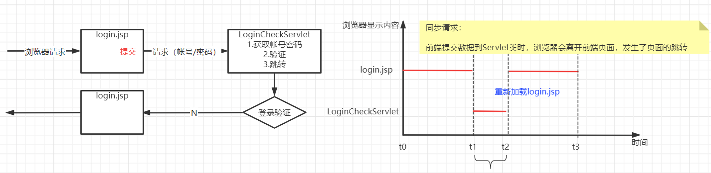
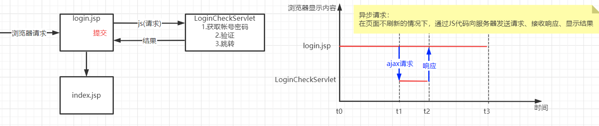
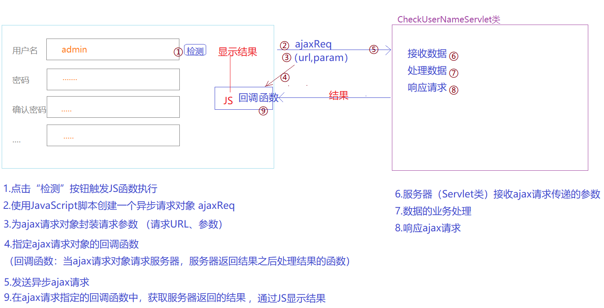

>  AJAX异步交互技术

## 一、AJAX简介

### 1.1 概念

> AJAX “Asynchronous JavaScript And XML”  异步JS与XML，指的是在网页使用JavaScript脚本实现前端与服务器的异步交互技术。
>
> 在不刷新前端网页的前提下实现和服务器的数据交互
>
> ajax不是一种编程语言，而是使用JavaScript代码实现前端和后端异步数据交互的技术。

### 1.2 同步与异步

1. 同步请求

   

2. 异步请求

   

### 1.3 异步交互的使用场景

> 异步交互技术:
>
> 适用于网页中显示大量的数据，同时我们只想对一小部分数据进行更新(大部分数据是不更新)的场景
>
> - 首页登录（系统首页有大量的信息显示，用户需要登录可以使用异步交互完成，避免首页刷新导致重新加载页面中的所有数据）
> - 表单填写中：省市区联动
> - 注册功能中：检测用户名是否可用

## 二、AJAX实现

### 2.1 ajax异步交互的实现流程



### 2.2 ajax的代码实现

#### 2.2.1 ajax实现案例准备

- 创建java web工程

- 创建注册页面 regist.jsp

  ```jsp
  <%@ page contentType="text/html;charset=UTF-8" language="java" %>
  <html>
    <head>
      <title>$Title$</title>
    </head>
    <body>
      <h3>用户注册</h3>
      <form action="" method="post">
        <p>帐号：<input type="text"/>
          <input type="button" value="检测"/>
        </p>
        <p>密码：<input type="password"/></p>
        <p>确认密码：<input type="password"/></p>
        <p>姓名：<input type="text"/></p>
        <p>电话：<input type="text"/></p>
        <p><input type="submit" value="提交注册"/></p>
      </form>
    </body>
  </html>
  ```

- 创建检测用户名的Servlet类

  ```java
  package com.qfedu.servlets;
  
  import javax.servlet.ServletException;
  import javax.servlet.annotation.WebServlet;
  import javax.servlet.http.HttpServlet;
  import javax.servlet.http.HttpServletRequest;
  import javax.servlet.http.HttpServletResponse;
  import java.io.IOException;
  
  /**
   * @Description 检测注册页面输入的用户名是否可用
   * @Author 千锋涛哥
   * 公众号： Java架构栈
   */
  @WebServlet("/CheckUserNameServlet")
  public class CheckUserNameServlet extends HttpServlet {
  
      @Override
      protected void doGet(HttpServletRequest req, HttpServletResponse resp)
              throws ServletException, IOException {
          doPost(req, resp);
      }
  
      @Override
      protected void doPost(HttpServletRequest request, HttpServletResponse response)
              throws ServletException, IOException {
          //1.接收用户名
          String userName = request.getParameter("userName");
  
          //2.检查用户名是否存在（查数据库）
          // 测试规则：只要用户名不是以admin开头就都可以使用
          boolean r = !userName.startsWith("admin");
  
          //3.响应
      }
  }
  ```

#### 2.2.2 创建ajax请求对象

###### 1.  判断浏览器

- window.XMLHttpRequest

###### 2. 创建AJAX对象

- IE7+、FF、O、Safari、Chrome

  ```javascript
  var ajaxReq = new XMLHttpRuquest();
  ```

- IE5\IE6

  ```javascript
  var ajaxReq = new ActiveXObject("Microsoft.XMLHTTP");
  ```

#### 2.2.3 封装ajax请求数据

- open(method,url,asyn)
  - method表示异步请求的请求方式 （GET|POST）
  - url 异步请求的目标路径
  - asyn 是否异步（true异步，false同步）

- 封装参数：

  - get请求，通过url传递参数

    ```javascript
    ajaxReq.open("GET","url?key=value&key2=value2",true);
    ```

  - post请求，可以通过url传参，也可以通过请求正文传参

    ```javascript
    ajaxReq.open("POST","url?key=value&key2=value2",true);
    ```

    ```javascript
    //在封装请求数据时不设置参数
    ajaxReq.open("POST","url",true);
    //在发送请求时，使用请求正文传递参数
    ajaxReq.send("key1=value1&key2=value2")
    ```

#### 2.2.4 指定ajax回调函数

>  ajaxReq请求对象是有状态的，可以通过ajaxReq.readyState获取状态值
>  ajaxReq请求对象的不同状态值表示异步交互的不同阶段
>
>  - ajaxReq.readyState == 0  表示ajax请求对象完成创建但并未初始化
>  - ajaxReq.readyState == 1  表示ajax请求对象完成初始化但未发送请求
>  - ajaxReq.readyState == 2  表示ajax请求已经发送并到达服务器
>  - ajaxReq.readyState == 3  表示服务器正在处理ajax请求（通信....）
>  - ajaxReq.readyState == 4  表示服务器正处理完成，ajax请求对象已经成功获取响应结果

指定回调函数：

```javascript
//只要ajax请求状态发送变化，就会触发这个回调函数的执行
ajaxReq.onreadystatechange = callback;

//回调函数：处理结果
function callback(){
    if(ajaxReq.readyState == 4){
        //获取结果
    }
}
```

#### 2.2.5 发送ajax请求

- 通过ajax请求对象调用send(body)

- 如果请求方式为GET

  ```javascript
  ajaxReq.send(null);
  ```

- 如果请求方式为POST

  ```javascript
  ajaxReq.send(null);
  ajaxReq.send("key1=value1&key2=value2")
  ```

#### 2.2.6 Servlet类响应ajax请求

```java
//3.通过response的输出流、响应ajax请求
response.setCharacterEncoding("utf-8");
PrintWriter out = response.getWriter();
out.println(str);
out.flush();
out.close();
```

#### 2.2.7 在回调函数中获取结果

```javascript
function callback(){
    //获取服务器响应结果的两个条件：
    //1.异步请求完成 ajaxReq.readyState == 4
    //2.http状态为200  ajaxReq.status == 200
    if(ajaxReq.readyState == 4 && ajaxReq.status == 200){
        //获取结果
        // 如果服务器响应的是文本数据（字符串），使用responseText属性接收
        var result = ajaxReq.responseText;
        // 如果服务器响应的是XML文件，使用responseXML属性接收
        // var doc = ajaxReq.responseXML;
        // 将获取的响应结果显示到网页的标签中
        document.getElementById("tipsLabel").innerHTML = result;
    }
}
```

#### 2.2.8 验证用户名案例代码

###### 1.regist.jsp

```jsp
<%@ page contentType="text/html;charset=UTF-8" language="java" %>
<html>
  <head>
    <title>$Title$</title>
    <script type="text/javascript" src="js/test.js"></script>
  </head>
  <body>
    <h3>用户注册</h3>
    <form action="" method="post">
      <p>
        帐号：<input type="text" id="userName"/><label id="tipsLabel"></label>
        <input type="button" value="检测" onclick="checkUserName()"/>
      </p>
      <p>密码：<input type="password"/></p>
      <p>确认密码：<input type="password"/></p>
      <p>姓名：<input type="text"/></p>
      <p>电话：<input type="text"/></p>
      <p><input type="submit" value="提交注册"/></p>
    </form>
  </body>
</html>
```

###### 2.test.js

```javascript
var ajaxReq;

function checkUserName(){
    //发送ajax请求到CheckUserNameServlet，并将用户名传递
    //1、创建ajax请求对象
    if(window.XMLHttpRequest){
        ajaxReq = new XMLHttpRequest();
    }else{
        ajaxReq = new ActiveXObject("Microsoft.XMLHTTP");
    }
    console.log("---------"+ajaxReq.readyState);

    //2、封装ajax请求数据（初始化）
    var userName = document.getElementById("userName").value;
    var method = "GET";
    var url = "CheckUserNameServlet?userName="+userName;
    var async = true;
    ajaxReq.open(method,url,async);
    console.log("---------"+ajaxReq.readyState);

    //3、指定ajax请求的回调函数
    // ajaxReq请求对象是有状态的，可以通过ajaxReq.readyState获取状态值
    // ajaxReq请求对象的不同状态值表示异步交互的不同阶段
    // ajaxReq.readyState == 0  表示ajax请求对象完成创建但并未初始化
    // ajaxReq.readyState == 1  表示ajax请求对象完成初始化但未发送请求
    // ajaxReq.readyState == 2  表示ajax请求已经发送并到达服务器
    // ajaxReq.readyState == 3  表示服务器正在处理ajax请求（通信....）
    // ajaxReq.readyState == 4  表示服务器正处理完成，ajax请求对象已经成功获取响应结果

    // 只要ajax请求状态发送变化，就会触发这个回调函数的执行
    ajaxReq.onreadystatechange = callback;

    //4、发送请求
    ajaxReq.send(null);
}

//回调函数：处理结果
function callback(){
    //获取服务器响应结果的两个条件：
    //1.异步请求完成 ajaxReq.readyState == 4
    //2.http状态为200  ajaxReq.status == 200
    if(ajaxReq.readyState == 4 && ajaxReq.status == 200){
        //获取结果
        // 如果服务器响应的是文本数据（字符串），使用responseText属性接收
        var result = ajaxReq.responseText;
        // 如果服务器响应的是XML文件，使用responseXML属性接收
        // var doc = ajaxReq.responseXML;
        // 将获取的响应结果显示到网页的标签中
        document.getElementById("tipsLabel").innerHTML = result;
    }
}
```

###### 3.CheckUserNameServlet

```java
package com.qfedu.servlets;

import javax.servlet.ServletException;
import javax.servlet.annotation.WebServlet;
import javax.servlet.http.HttpServlet;
import javax.servlet.http.HttpServletRequest;
import javax.servlet.http.HttpServletResponse;
import java.io.IOException;
import java.io.PrintWriter;

/**
 * @Description 检测注册页面输入的用户名是否可用
 * @Author 千锋涛哥
 * 公众号： Java架构栈
 */
@WebServlet("/CheckUserNameServlet")
public class CheckUserNameServlet extends HttpServlet {

    @Override
    protected void doGet(HttpServletRequest req, HttpServletResponse resp)
            throws ServletException, IOException {
        doPost(req, resp);
    }

    @Override
    protected void doPost(HttpServletRequest request, HttpServletResponse response)
            throws ServletException, IOException {
        //1.接收用户名
        String userName = request.getParameter("userName");

        //2.检查用户名是否存在（查数据库）
        // 测试规则：只要用户名不是以admin开头就都可以使用
        boolean r = !userName.startsWith("admin");
        String str = r?"<label style='color:green'>用户名可用！</label>":"<label style='color:red'>用户名不可用！</label>";

        //3.通过response的输出流、响应ajax请求
        response.setCharacterEncoding("utf-8");
        PrintWriter out = response.getWriter();
        out.println(str);
        out.flush();
        out.close();
    }
}
```

## 三、JSON

AJAX 就是一种使用JavaScript在前端页面不刷新的情况下和服务器进行数据交互

### 3.1 JSON介绍

> ajax既然是实现前后端之间异步通信的技术，必然要考虑如何将前端的数据提交到服务器，如何将服务器的数据响应到前端并且能够被前端识别。
>
> JSON就是不同系统之间、前后端之间、不同语言之间进行数据交互所遵守的一种数据的格式。


### 3.2 JSON格式

- 对象和Map 转换成 `{key:value , key:value,...}`
- 数组和集合转换成`[e1,e2,e3,...]`
- JSON格式可以嵌套


### 3.3 JSON格式转换

#### 3.3.1 前端JS对象与JSON格式转换

- JS对象转换成JSON格式字符串

  ```javascript
  //创建JS对象
  var obj = {stuNum:"10001",stuName:"张三"};
  obj.stuGender = "男";
  //将JS对象转换成json格式字符串
  var jsonStr = JSON.stringify(obj);
  ```

-  将JSON格式字符串转换成JS对象

  ```javascript
  var obj2 =  eval("("+jsonStr+")");
  ```

#### 3.3.2 后端Java对象与JSON格式转换

> FASTJson
>
> GSon 
>
> JackSon

- 将json格式字符串转换成Java对象

  ```java
  //要求：json格式的字符串中的key 要和目标Java对象属性一致
  Gson gson = new Gson();
  Student student = gson.fromJson(str, Student.class);
  ```

- 将Java对象转换成JSON格式

  ```java
  Student stu2 = new Student("10006","Lucy","女");
  String jsonStr = gson.toJson(stu2);
  ```

#### 3.3.3 随堂案例代码

###### 1.前端test-json.jsp

```jsp
<%@ page contentType="text/html;charset=UTF-8" language="java" %>
<html>
  <head>
    <title>$Title$</title>
    <script type="text/javascript" src="js/test.js"></script>
  </head>
  <body>
    <h3>测试前端JSON格式转换</h3>
    <input type="button" value="测试" onclick="testJson()"/>
    <script type="text/javascript">
      function testJson(){
        //1.将JS对象转换成JSON格式字符串
        var obj = {stuNum:"10001",stuName:"张三"};
        obj.stuGender = "男";
        var jsonStr = JSON.stringify(obj);

        //发送异步请求，将JSON格式的字符串提交到TestJsonServlet
        var ajaxReq;
        if(window.XMLHttpRequest){
           ajaxReq = new XMLHttpRequest();
        }else{
          ajaxReq = new ActiveXObject("Microsoft.XMLHTTP");
        }
        ajaxReq.open("POST","TestJsonServlet",true);
        ajaxReq.onreadystatechange = function(){
            if(ajaxReq.status==200 && ajaxReq.readyState==4){
                var s = ajaxReq.responseText;
                //将接收的服务器的响应的JSON字符串转换成js对象
              var stu = eval("("+s+")");
              console.log(stu.stuName);
            }
        };
        //ajax采用的是POST请求，将json格式字符串通过请求正文提交
        ajaxReq.send(jsonStr);
      }
    </script>
  </body>
</html>
```

###### 2.后端TestJsonServlet

- 需要在项目中添加`gson-2.8.9.jar`依赖

```java
package com.qfedu.servlets;

import com.google.gson.Gson;
import com.qfedu.dto.Student;

import javax.servlet.ServletException;
import javax.servlet.ServletInputStream;
import javax.servlet.annotation.WebServlet;
import javax.servlet.http.HttpServlet;
import javax.servlet.http.HttpServletRequest;
import javax.servlet.http.HttpServletResponse;
import java.io.BufferedReader;
import java.io.IOException;
import java.io.InputStreamReader;
import java.io.PrintWriter;

/**
 * @Description 测试JSON转换
 * @Author 千锋涛哥
 * 公众号： Java架构栈
 */
@WebServlet("/TestJsonServlet")
public class TestJsonServlet extends HttpServlet {

    @Override
    protected void doGet(HttpServletRequest req, HttpServletResponse resp)
            throws ServletException, IOException {
        doPost(req, resp);
    }

    @Override
    protected void doPost(HttpServletRequest request, HttpServletResponse response)
            throws ServletException, IOException {
        //1.接收请求正文
        request.setCharacterEncoding("utf-8");
        ServletInputStream inputStream = request.getInputStream();
        StringBuilder builder = new StringBuilder();
        byte[] bs = new byte[1024];
        int len = -1;
        while((len = inputStream.read(bs))!=-1){
            String s = new String(bs,0,len,"utf-8");
            builder.append(s);
        }
        String str = builder.toString();
        System.out.println(str);
        //2.将接收的json字符串，转换成Java对象(Student)
        Gson gson = new Gson();
        Student student = gson.fromJson(str, Student.class);
        System.out.println(student);

        //3.java对象转换成JSON格式
        Student stu2 = new Student("10006","Lucy","女");
        String jsonStr = gson.toJson(stu2);
        //将json格式字符串响应给ajax请求
        response.setContentType("application/json;charset=utf-8");
        response.setCharacterEncoding("utf-8");
        PrintWriter out = response.getWriter();
        out.println(jsonStr);
        out.flush();
        out.close();
    }
}
```

