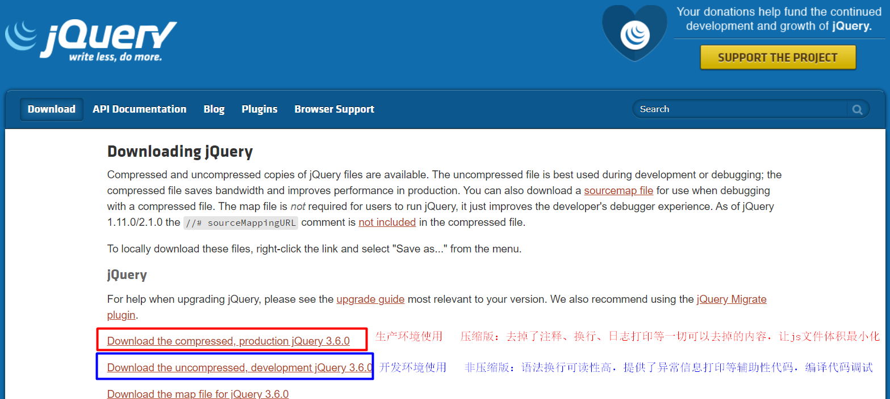
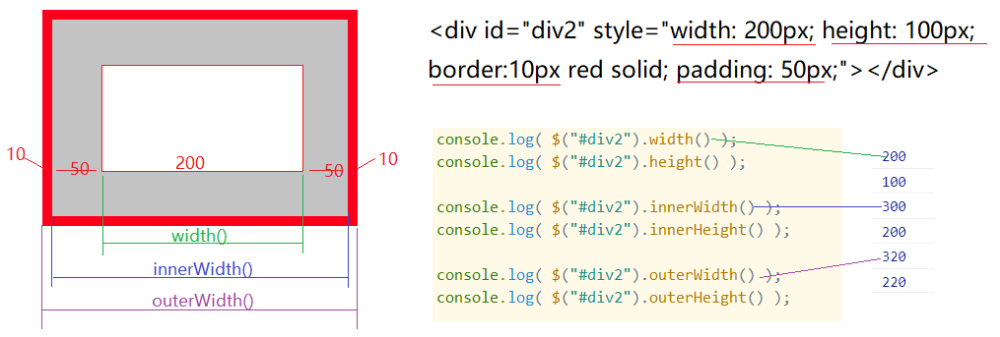

## 一、jQuery简介

### 1.1 web前端的知识回顾

- HTML  决定了网页的内容
- CSS   决定了标签的样式
- JavaScript 决定了网页的功能：对标签属性、样式的操作、DOM节点操作、ajax异步交互
  - 在使用JS完成对应功能时，需要程序员自行完成代码的编写，开发相对还是比较繁琐的

### 1.2 jQuery什么？

> jQuery就是一个JavaScript的框架，简化了JS的语法和操作，定义了HTML属性操作、样式操作、DOM操作等相关函数，实现了对ajax异步请求封装。
>
> jQuery就是一个提供了很多预定义函数的JS文件。

## 二、jQuery入门使用

### 2.1 下载jQuery函数库

官网：https://jquery.com/

下载：https://jquery.com/download/



### 2.2 在网页中引入jQuery文件

#### 2.2.1 本地文件引入

- 先下载jquery.js文件

- 将jquery.js文件拷贝粘贴到web项目中

- 在html文件或者jsp文件，通过script标签引入jQuery文件

  ```html
  <!DOCTYPE html>
  <html>
  	<head>
  		<meta charset="utf-8">
  		<title></title>
  		<!-- 引入jQuery -->
  		<script type="text/javascript" src="js/jquery-3.6.0.js"></script>
  	</head>
  	<body>
  		
  	</body>
  </html>
  ```

#### 2.2.2 CDN引入

> CDN 内容分发网络，将jQuery.js文件提前部署到一个服务器，我们可以通过jquery文件在服务器上的访问路径来引入此jquery.js文件：
>
> - jQuery官方提供的CDN地址：
>   - http://code.jquery.com/jquery-3.6.0.js
>   - http://code.jquery.com/jquery-3.6.0.min.js

- 在html、jsp文件中,通过script标签直接引入jquery的cdn地址即可

  ```html
  <!DOCTYPE html>
  <html>
  	<head>
  		<meta charset="utf-8">
  		<title></title>
  		<!-- 引入jQuery -->
  		<script type="text/javascript" src="http://code.jquery.com/jquery-3.6.0.js"></script>
  	</head>
  	<body>
  		
  	</body>
  </html>
  ```

### 2.3 jQuery入门示例

- 使用示例：点击按钮隐藏图片

  ```html
  <!DOCTYPE html>
  <html>
  	<head>
  		<meta charset="utf-8">
  		<title></title>
  		<!-- 引入jQuery -->
  		<script type="text/javascript" src="http://code.jquery.com/jquery-3.6.0.js"></script>
  	</head>
  	<body>
  		<br/>
  		<button id="btn">测试</button>
  		<script type="text/javascript">
  			//点击按钮隐藏图片
  			$("#btn").click(function(){
  				$("#img1").hide();
  			});
  		</script>
  	</body>
  </html>
  ```

## 三、jQuery API

> https://www.94xh.com/index.html

### 3.1 核心函数

- `jQuery()`函数，选择器函数， 用于获取HTML文档中的元素 ，简写为 `$()`

  - **jQuery([selector,[context]])**  根据特定的规则从HTML文档中获取元素(特定的规则：选择器语法)

    ```javascript
    $("#btn");  //获取当前文档中id=btn的元素
    $(".inputStyle"); //获取当前文档中class=inputStyle的元素
    ```

  - **jQuery(html,[ownerDocument]) **创建一个新的HTML元素

    ```javascript
    $("<textarea></textarea>")
    ```

  - **jQuery(fn)**  表示当网页文档加载完毕执行fn, 等价于 jQuery(document).ready(fn).

    ```javascript
    $(function(){
        //给id=btn的按钮绑定点击事件
        $("#btn").click(function(){
            alert(111);
        });
    });
    ```

- **$(selector).事件(fn)**: 当选择器选择的元素发生对应的事件就执行fn

  ```javascript
  //1.当前文档加载完毕执行fn
  $(document).ready(fn);
  
  //2.当id=btn的元素发生点击事件，就执行fn
  $("#btn").click(fn);
  ```

### 3.2 选择器

> 在 `jQuery()`函数的参数中传递不同的选择器表达式，就可以获取网页文档中不同的元素

#### 3.2.1 基本选择器

- ID选择器： $("#id")     

  ```javascript
  // 获取网页文档中id=btn的元素，相当于 document.getElementById("id")
  $("#btn")
  ```

- 标签选择器： $("tagName") 

  ```javascript
  // 获取网页文档中所有的img标签元素，相当于  document.getElementsByTagName("tagName");
  $("img")
  ```

- class选择器： $(".class")

  ```javascript
  //获取网页文档中所有class=inputStyle的元素,相当于 document.getElementsByClassName("inputStyle")
  $(".inputStyle")
  ```

#### 3.2.2 复合选择器

> 复合选择器——将多个基本选择器通过特定的符号进行连接，以实现更为精确的选择

- $("selector1 selector2")  选择所有selector1 匹配的元素`里面`的匹配selector2的元素

- $("selector1,selector2")  选择所有匹配selector1`和`selector2的元素（并集）

- $("selector1 > selector2") 选择匹配selector1元素的`子标签中`匹配selector2的元素

- $("selector1 + selector2") 匹配所有`紧接`在 selector1 元素后的 selector2元素
- $("selector1 ~ selector2") 匹配所有在 selector1 元素后的 selector2元素

#### 3.2.3 选择器筛选

> 在选择器匹配的元素中根据特定的筛选条件（索引、属性）更灵活的选择要操作的元素

| 选择器筛选语法                       | 说明                                                        |
| ------------------------------------ | ----------------------------------------------------------- |
| $("selector:`first`")                | 匹配selector选择的元素集合中的第一个                        |
| $("selector:`last`")                 | 匹配selector选择的元素集合中的最后一个                      |
| $("selector:`odd`")                  | 匹配selector选择的元素集合中索引为奇数的元素(1,3,5,7,...)   |
| $("selector:`even`")                 | 匹配selector选择的元素集合中索引为偶数的元素(0,2,4,6,...)   |
| $("selector:`eq(index)`")            | 匹配selector选择的元素集合中索引为index的元素               |
| $("selector:`lt(index)`")            | 匹配selector选择的元素集合中索引小于index的元素             |
| $("selector:`gt(index)`")            | 匹配selector选择的元素集合中索引大于index的元素             |
| $("selector`[attrName=attrValue]`")  | 匹配selector选择的元素集合中attrName属性值为attrValue的元素 |
| $("selector`[attrName!=attrValue]`") |                                                             |

### 3.3 筛选函数

> jQuery中提供了一些函数，对选择器匹配的元素集合进行筛选

| 筛选函数                                                     | 说明                                                         |
| ------------------------------------------------------------ | ------------------------------------------------------------ |
| $("selector").`first()`                                      | 从选择器匹配的元素集合中选择第一个元素                       |
| $("selector").`last()`                                       | 从选择器匹配的元素集合中选择最后一个元素                     |
| $("selector").`eq(index)`                                    | 匹配selector选择的元素集合中索引为index的元素                |
| $("input").each(function(){<br/>	var r = $(this).`hasClass("inputStyle1")`;<br/>    console.log(r);<br/>}); | 判断某个元素是否有class='inputStyle1',返回boolean            |
| $("selector1").`filter("selector2")`                         | 从selector1匹配的元素集合中选择匹配selector2的元素           |
| $("selector").`is(tag)`                                      | 判断选择器选择的元素是否为指定的标签                         |
| $("selector1").`find(selector2)`                             | 从selector1匹配的元素集合中的元素里面，选择匹配selector2的元素 |

### 3.4 属性操作函数

> jQuery提供了一组函数用于对HTML标签进行属性操作

- `attr()`: 获取/设置元素属性

  ```javascript
  //1.获取元素属性值
  var v1 = $("img").attr("src");
  var v2 = $("img").attr("width");
  
  //2.设置元素属性
  $("img").attr("src","imgs/img02.png");
  $("img").attr("width",200);
  ```

- `val()`：获取/设置元素的value属性值

  ```javascript
  //1.获取元素value属性值
  var v3 = $("#userName").val();
  
  //2.设置元素的value属性值
  $("#userName").val("这是设置的值");
  ```

- `removeAttr('属性名')`：移除元素属性

  ```javascript
  //removeAttr() 移除元素属性
  $("img").removeAttr("width");
  ```

- `prop({})`:同时设置元素的多个属性

  ```javascript
  $("#img2").prop({width:200,src:"imgs/img03.png",alt:"看不到吗？"});
  ```

- `addClass(styleName)、removeClass(styleName)、toggleClass(styleName)` 操作标签class属性值

  ```javascript
  //addClass()  为元素class属性添加一个样式名
  $("#div1").addClass("style1");
  
  //removeClass() 删除元素class属性中指定的样式名
  $("#div1").removeClass("style2");
  
  //toggleClass 从元素的class属性中添加/移除指定的样式名
  $("#div1").toggleClass("style1");
  ```

- `text()`、`html()`  相当于innerHTML操作

  - text("") : 将参数以文本的形式设置到选择器匹配元素的里面，即使设置的内容是HTML标签，也不会当成标签解析
  - html("") : 将参数以HTML标签的形式设置到匹配的元素里面，参数内容会被浏览器解析为HTML标签，显示对应的标签效果。

  ```javascript
  $("#div2").html("");  //会在div中显示一张图片
  $("#div2").text("");  //会将参数直接以文本形式显示出来
  ```


### 3.5 样式操作函数

- `css()` 设置/获取元素的样式属性

  ```javascript
  //1.设置标签的样式
  $("#div1").css("width","200px");
  $("#div1").css("height","200px");
  $("#div1").css("border","1px red solid");
  //多个样式也可以一起设置
  $("#div1").css({width:"100px",height:"100px",background:"#ff0000"});
  
  //2.获取标签指定的样式
  var v = $("#div1").css("height");
  ```

- `position()` 获取元素的位置信息

  ```javascript
  var position = $("#div1").position();
  console.log(position.top);
  console.log(position.left);
  ```

- 获取尺寸的函数：

  - width() / height();
  - innerWitdh() / innerHeight();
  - outerWidth()/ outerHeight();

  

### 3.6 文档处理函数

> DOM操作

#### 3.6.1 添加子节点

- append
- appendTo

```javascript
// parent.append(child) :  在父节点中拼接子节点  (子节点会添加到父节点中的最后)
//      child可以是一个HTML标签字符串，表示新建一个HTML元素拼接到parent
//      child也可以是通过选择器选择的当前文档中的元素（被选择的元素发生移动）
$("#div1").append("");

// child.appendTo(parent) : 将子节点拼接到父节点里面
$("").appendTo($("#div1"));
```

#### 3.6.2 插入节点

- before
- insertBefore

```javascript
// node1.before(node2): 在node1的前面插入node2
$("#img2").before("");

// node2.insertBefore(node1): 将node2插入到node1之前
$("").insertBefore($("#img2"));
```

- after
- insertAfter

```javascript
// node1.after(node2) : 在node1的后面插入node2
//$("#img1").after("");

node2.insertAfter(node1): 将node2插入到node1的后面
$("").insertAfter($("#img1"));
```

#### 3.6.3 替换节点

- replaceWith

```javascript
// node1.replaceWith(node2) : 使用node2替换node1
$("#img2").replaceWith("");
```

#### 3.6.4 删除节点

- empty

```javascript
//parent.empty():清楚当前标签中所有的子标签
$("#div1").empty();
$("body").empty();
```

- remove

```javascript
// node.remove() :删除当前节点
$("#img1").remove();
```

#### 3.6.5 节点包裹

- wrap
- unwrap

```javascript
//node1.wrap(node2) : 使用node2将node1包裹起来
$("#img3").wrap("<div style='border:2px pink solid'></div>")

//node.unwrap() : 删除当前标签的父标签
$("#img4").unwrap();
```

### 3.7 事件函数

> 用于为页面中的元素绑定事件

元素事件绑定语法：

```javascript
$("selector").事件函数(fn);

//例如: 当id=btn的元素发生点击事件时，就执行对应的fn
$("#btn").click(function(){
    
});
```

#### 3.7.1 文档加载事件

- ready()  文档加载完毕时触发

  ```javascript
  $(document).ready(function(){
      //alert(1);
  });
  ```

#### 3.7.2 焦点事件

- blur() 元素失去焦点时触发

  ```javascript
  $("#userName").blur(function(){
      console.log("---输入框失去焦点");
  });
  ```

- focus()  元素获得焦点时触发

  ```javascript
  $("#userName").focus(function(){
      console.log("---输入框获得焦点");
  });
  ```

#### 3.7.3 鼠标事件

- mousedown() 鼠标左键按下
- mouseup()  鼠标左键松开
- mouseenter() 鼠标指针穿过
- mouseleave() 鼠标离开  （与 mouseout 事件不同，只有在鼠标指针离开被选元素时，才会触发 mouseleave 事件。如果鼠标指针离开任何子元素，同样会触发 mouseout 事件)

- mouseout()  鼠标离开
- mouseover()  鼠标指针移到元素上
- mousemove()  鼠标指针在元素上移动

#### 3.7.4 键盘事件

- keydown()  按键按下
- keyup() 按键松开

#### 3.7.5 点击事件

- click()  鼠标单击事件

  ```javascript
  $("#btn").click(function(){
      alert(666);
  });
  ```

- dbclick() 鼠标双击事件

#### 3.7.6 内容改变

- change()  输入框或下拉菜单等内容被改变

  ```html
  <select id="city">
      <option value="北京">北京</option>
      <option value="上海">上海</option>
      <option value="武汉">武汉</option>
  </select>
  <script type="text/javascript">
  	//输入框 和 下拉菜单 等内容可被改变的元素
      $("#city").change(function(){
          console.log("内容被改变了");
      });
  </script>
  ```

#### 3.7.7 关闭/打开事件

- off("事件名称")   关闭元素的事件

- on("事件名称",fn)   重新打开/绑定元素的事件

  ```html
  <button id="btn2">关闭事件</button>
  <button id="btn3">打开事件</button>
  
  <select id="city">
      <option value="北京">北京</option>
      <option value="上海">上海</option>
      <option value="武汉">武汉</option>
  </select>
  		
  <script type="text/javascript">
      //输入框 和 下拉菜单 等内容可被改变的元素
      $("#city").change(function(){
          console.log("内容被改变了");
      });
  
      //关闭事件
      $("#btn2").click(function(){
          $("#city").off("change");
      });
  
      //重新打开事件
      $("#btn3").click(function(){
          $("#city").on("change",function(){
              console.log("重新被打开的change事件");
          });
      });
  </script>
  ```

#### 3.7.8 获取事件对象

- 在事件函数的参数fn添加一个参数，可以获取当前事件的event对象

  ```javascript
  $("#city").change(function(event){
      //event表示事件对象
      console.log(event);
      //$(this)表示发生事件的元素
  });
  ```

 

### 3.8 效果函数

> - 元素的隐藏与显示
> - 动画

#### 3.8.1 隐藏与显示

> 以下显示与隐藏的函数都可以设置一个时间参数，用于设置显示隐藏的速度
>
> - 时间参数可以是slow \normal\fast 单词
> - 也可以是具体的数值，单位ms

###### 1. show/hide/toggle

> 瞬间显示与隐藏

```html


<hr>
<button id="btn1">测试hide()</button>
<button id="btn2">测试show()</button>
<button id="btn3">测试toggle()</button>

<script type="text/javascript" src="js/jquery-3.6.0.js"></script>
<script type="text/javascript">
    // hide() 隐藏
    $("#btn1").click(function(){
        $("img").hide();
    });
    // show() 显示
    $("#btn2").click(function(){
        $("img").show();
    });
    // toggle() 如果原来显示就执行隐藏，如果原来隐藏就执行显示
    $("#btn3").click(function(){
        $("img").toggle();
    });
</script>
```

###### 2.slideDown/slideUp/slideToggle

> 放大缩小的显示与隐藏

```html
<button id="btn4">测试slideUp()</button>
<button id="btn5">测试slideDown()</button>
<button id="btn6">测试slideToggle()</button>

<script type="text/javascript" src="js/jquery-3.6.0.js"></script>
<script type="text/javascript">
    // slideUp() 缩起来
    $("#btn4").click(function(){
        $("img").slideUp();
    });
    // slideDown()  展开
    $("#btn5").click(function(){
        $("img").slideDown();
    });
    // slideToggle()  如果原来显示就执行隐藏，如果原来隐藏就执行显示
    $("#btn6").click(function(){
        $("img").slideToggle();
    });
</script>
```

###### 3.fadeOut/fadeIn/fadeToggle/fadeTo

> 淡入淡出的显示与隐藏

```html
<button id="btn7">测试fadeOut()</button>
<button id="btn8">测试fadeIn()</button>
<button id="btn9">测试fadeToggle()</button>
<button id="btn10">测试fadeTo()</button>

<script type="text/javascript" src="js/jquery-3.6.0.js"></script>
<script type="text/javascript">
    //fadeOut 淡出
    $("#btn7").click(function(){
        $("img").fadeOut();
    });
    //fadeIn 淡入
    $("#btn8").click(function(){
        $("img").fadeIn();
    });
    //fadeToggle 
    $("#btn9").click(function(){
        $("img").fadeToggle();
    });
    //fadeTo 将元素的透明度改变到指定的值
    //  参数1：速度
    //  参数2：透明度
    $("#btn10").click(function(){
        $("img").fadeTo(3000,0.5);
    });	
</script>
```

#### 3.8.2 动画播放与停止

- animate
- stop

```html

<button id="btn11">测试动画</button>
<button id="btn12">停止动画</button>

<script type="text/javascript">
    //params:一组包含作为动画属性和终值的样式属性和及其值的集合
    //speed:三种预定速度之一的字符串("slow","normal", or "fast")或表示动画时长的毫秒数值(如：1000)
    //easing:要使用的擦除效果的名称(需要插件支持).默认jQuery提供"linear" 和 "swing".
    //fn:在动画完成时执行的函数，每个元素执行一次。
    $("#btn11").click(function(){
        $("#img4").animate({width:"300px",height:"300px"},5000);
        $("#img4").animate({width:"100px",height:"100px"},5000);
    });
    $("#btn12").click(function(){
        //在动画完成之前执行stop,，就让动画停止下来，保持当前状态
        $("#img4").stop();
    });
</script>
```

### 3.9 AJAX

#### 3.9.1 ajax()函数

```javascript
$.ajax({
    url:"请求url?param1=v1",				//url   ajax请求的目标服务器地址
    type:"get|post",  	  				//type  指定请求方式（get|post）
    headers:{			  				//headers 设置请求头参数
        key1:"value1",
        key2:"value2"
    },
    data:{								//data  传递的参数
        userName:"zhangsan",
        userPwd:"123456"
    },
    contentType:"application/json",  //contentType  请求信息的转码方式
    processData:false,				 //processData  设置数据是否压缩传输（文件上传设置为false）
    success:function(res){	//success  ajax请求成功之后执行的回调函数，参数res就是服务器返回的数据
        
    },
    error:function(e){		//error   ajax请求出现错误执行的回调函数，参数e表示异常信息对象
        
    }
});
```

#### 3.9.2 jQuery的异步交互实例

> 验证用户是否可用  (将jquery.js文件拷贝到java web工程)

###### 1.regist.jsp

```jsp
<%@ page contentType="text/html;charset=UTF-8" language="java" %>
<html>
  <head>
    <title>$Title$</title>
    <script type="text/javascript" src="js/jquery-3.6.0.js"></script>
  </head>
  <body>
    <h3>用户注册</h3>
    <form action="" method="post">
      <p>
        帐号：<input type="text" id="userName"/><label id="tipsLabel"></label>
        <input type="button" value="检测" id="checkBtn"/>
      </p>
      <p>密码：<input type="password"/></p>
      <p>确认密码：<input type="password"/></p>
      <p>姓名：<input type="text"/></p>
      <p>电话：<input type="text"/></p>
      <p><input type="submit" value="提交注册"/></p>
    </form>
  <script type="text/javascript">
    $("#checkBtn").click(function(){
      //发送ajax请求，验证用户名是否可用
      var name = $("#userName").val();
      $.ajax({
        url:"CheckUserNameServlet?userName="+name,  //url传递用户名
        type:"get",
        success:function(res){
            if(res.code == 1000){
 $("#tipsLabel").replaceWith("<label id='tipsLabel' style='color:green'>用户名可用！</label>");
            }else{
$("#tipsLabel").replaceWith("<label id='tipsLabel' style='color:red'>用户名不可用！</label>");
            }
        }
      });
    });
  </script>
  </body>
</html>
```

###### 2.CheckUserNameServlet

```java
package com.qfedu.servlets;

import javax.servlet.ServletException;
import javax.servlet.annotation.WebServlet;
import javax.servlet.http.HttpServlet;
import javax.servlet.http.HttpServletRequest;
import javax.servlet.http.HttpServletResponse;
import java.io.IOException;
import java.io.PrintWriter;

/**
 * @Description 验证用户名是否可用
 * @Author 千锋涛哥
 * 公众号： Java架构栈
 */
@WebServlet("/CheckUserNameServlet")
public class CheckUserNameServlet extends HttpServlet {

    @Override
    protected void doGet(HttpServletRequest req, HttpServletResponse resp)
            throws ServletException, IOException {
        doPost(req, resp);
    }

    @Override
    protected void doPost(HttpServletRequest request, HttpServletResponse response)
            throws ServletException, IOException {
        //1.接收用户名
        String name = request.getParameter("userName");

        //2.判断是否可用
        boolean b = !name.startsWith("admin");

        //3.响应ajax请求
        response.setContentType("application/json;charset=utf-8");
        response.setCharacterEncoding("UTF-8");
        String jsonStr = b ? "{\"code\":1000,\"msg\":\"success\"}":"{\"code\":1001,\"msg\":\"fail\"}";
        //  {"code":1000,"msg":"success"}   {"code":1001,"msg":"fail"}
        PrintWriter out = response.getWriter();
        out.println(jsonStr);
        out.flush();
        out.close();
    }
}
```

#### 3.9.2 get(url,params,fn,type) 

发送get方式的异步请求

```javascript
// 参数1：请求的url
// 参数2：传递的参数
// 参数3：回调函数
// 参数4：服务器返回的数据的格式  （json,html,text,xml）
$.get("CheckUserNameServlet",{userName:name},function(res){
    if(res.code == 1000){
        $("#tipsLabel").replaceWith("<label id='tipsLabel'>用户名可用！</label>");
    }else{
        $("#tipsLabel").replaceWith("<label id='tipsLabel'>用户名不可用！</label>");
    }
},"json");
```

#### 3.9.3 post(url,params,fn,type) 

发送post方式的异步请求

```javascript
// 参数1：请求的url
// 参数2：传递的参数
// 参数3：回调函数
// 参数4：服务器返回的数据的格式  （json,html,text,xml）
$.post("CheckUserNameServlet",{userName:name},function(res){
    if(res.code == 1000){
        $("#tipsLabel").replaceWith("<label id='tipsLabel'>用户名可用！</label>");
    }else{
        $("#tipsLabel").replaceWith("<label id='tipsLabel' >用户名不可用！</label>");
    }
},"json");
```

