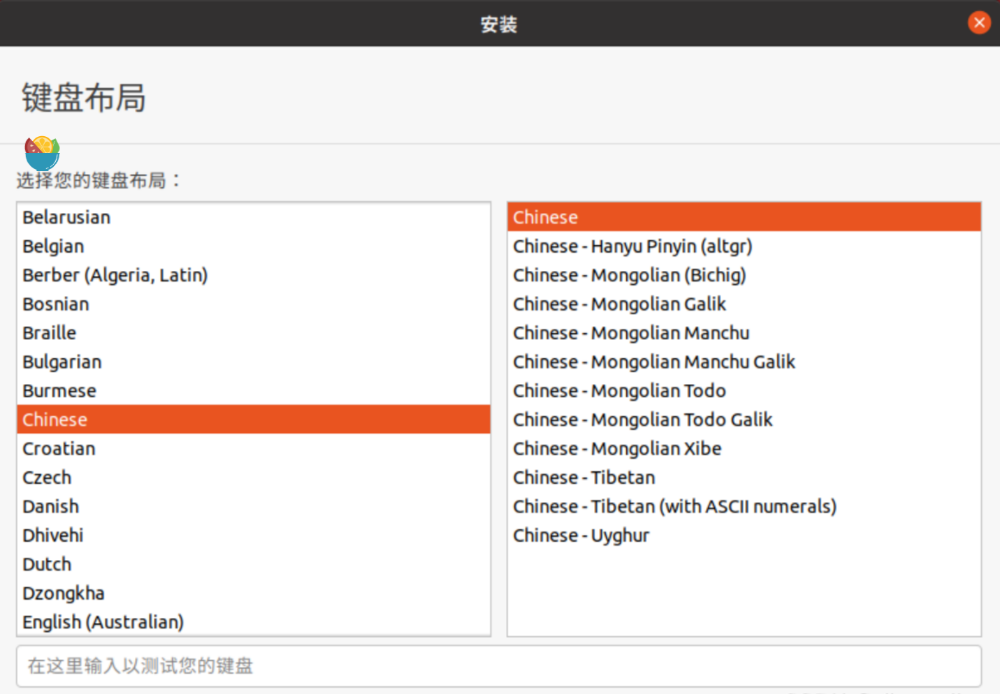
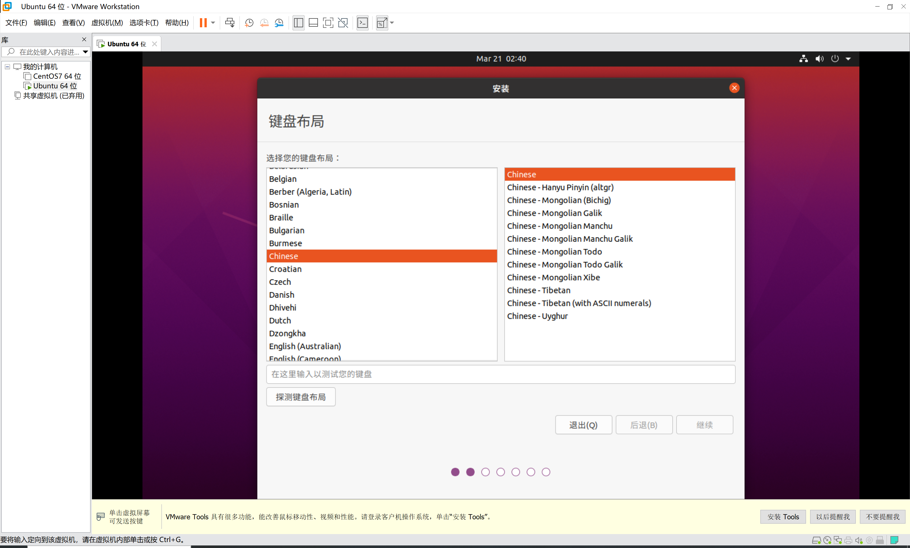

#  在虚拟机安装Ubuntu时出现窗口不全

## 一、问题

解决VMware安装Ubuntu20.04过程中窗口太小导致无法点击按钮的问题



默认屏幕分辨率为”**800x600**”，这就导致有些按钮点不到，直接用鼠标拖动窗口最高只能将窗口上边缘拖到屏幕上边缘的位置，这样窗口靠下部分的按钮还是点不到。

这是虚拟机分辨率的问题，窗口内容不全，找不到continue，就无法继续进行下去了。




在虚拟机桌面按`Ctrl+Alt+T`快捷键，出现终端窗口。

然后在终端窗口输入命令：

```bash
xrandr -s 1280x800
```

 然后按Enter，就可以暂时改变虚拟机的显示分辨率，这样你就可以继续安装Ubuntu了，安装成功后再去修改分辨率就可以了。鼠标右击桌面，点显示设置，就可以进行分辨率的修改了。
